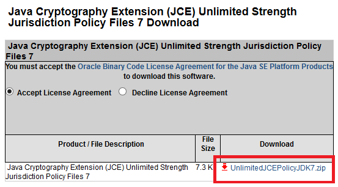
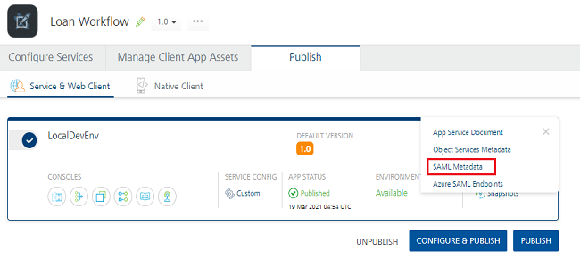
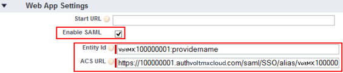

                              

User Guide: [Identity](Identity.md) > [Configure the Identity Service](ConfigureIdentiryService.md) > Security Assertion Markup Language (SAML)

SAML 2.0 Identity Service
-------------------------

Volt MX  Foundry identity supports **Security Assertion Markup Language** 2.0 (SAML). SAML is an XML-based open standard data format for exchanging authentication and authorization data between parties, such as an identity provider and a service provider. SAML defines three roles:

*   **Service provider** (resource server) – provides you the information.
*   **Client** (web browser/user) – interacts with the resource server, like a web app being served through a web browser.
*   **Identity provider** (IdP) (authorization server) – owns the user identities and credentials, and authenticates a user.

SAML allows single sign-on (SSO) with web browsers or other clients. With SSO, a user logs in once with a name and password, and can access multiple resources.

When a user logs into an application (either a mobile app or web app), the service provider issues an authentication request to a SAML identity provider through the user agent (usually a web browser.) After the user logs in (as part of SAML identity provider log-in), the IdP generates a SAML token that includes assertions about the user (such as user name, email, or other authorization information). The service provider verifies the SAML token (identity provider of the user information), and provides access to its services or resources. When the process completes, the user can interact with the application/web resources.

> **_Note:_**  NTLM authentication is not supported by SAML identity service.

### Prerequisites

To enable SAML ADFS login, follow these steps:

1.  From [http://www.oracle.com/technetwork/java/UnlimitedJCEPolicy](http://www.oracle.com/technetwork/java/javase/downloads/jce-7-download-432124.html), download the Java Cryptography Extension (JCE) files for the Java version you are using.
    
    
    
    The `UnlimitedJCEPolicyJDK7.zip` (unlimited strength) contains the following files:
    
    *   local\_policy.jar
        
    *   US\_export\_policy.jar
        
    *   README.txt
        
2.  In your Volt MX Foundry installation folder, go to the `USERINSTALLDIR/jre/lib/security`  folder. Replace the policy files with the unlimited strength policy files (local\_policy.jar and US\_export\_policy.jar) that you downloaded from the Oracle website.
3.  Restart Volt MX Foundry server.

The following sections describe how to configure and use a SAML service:

*   [Configuring a new SAML service](#configuring-a-new-saml-service)
*   [Using an existing SAML service](#how-to-use-an-existing-saml-service)

### Configuring a New SAML Service

To create a SAML service, follow these steps:

1.  Under the **[**Identity** service designer](ConfigureIdentiryService.md#IdentitySDpage)** page, type a name for the service in the **Enter Service Name** text box.
2.  From the **Type of Identity** list, select **SAML**.
3.  Download metadata from your identity provider. For more information, see [How to download metadata from Salesforce](https://help.salesforce.com/apex/HTViewHelpDoc?id=identity_provider_enable.md&amp;language=th)
4.  From the **Metadata Mode**, select an option to upload metadata.
    *   If you click **Metadata File**, the system displays **Metadata File** option. Click **Browse** to navigate to your identity provider metadata file that you downloaded, and  then click **Open**. The system uploads your metadata file. For example, `idpmetadata.xml`.
    *   If you click **Metadata URL**, the system displays **Metadata URL** text box. Enter the URL for the metadata.
5.  Under **Choose Assertion Consumer Service Binding**, select one of the following options:
    
    *   **Artifact Binding** – to transmit SAML request and response messages in a single protocol using two different bindings.
    *   **Post Binding** - to transmit SAML protocol messages within the encoded content of an HTML form control.
    
    > **_Note:_** By default, this field is set to Artifact Binding.
    
6.  In the **Mapping of IDP SAML attributes (Optional)**, provide the information if required. This information is used for fetching profile or other information and to retrieve user information from an identity provider while logging in through SAML protocol.
    *   For example, In the Mapping of LDAP attributes to outgoing claim types, you must map at least one attribute to the Name ID as SAML validates the Name ID attribute. If the Name ID is not mapped, the system throws an exception. The Name ID should not be empty - for example, User-Principal-Name to Name ID.
        
        Other mappings are optional - for example, Given-Name, Surname.
        
7.  Click the **Advanced** to provide additional configuration of your service definition:
    *   Now you can enable or disable the integrity check for an identity service at the provider level. If the integrity is disabled at the provider level, then the provider is meant for server-to-server communication only. To disable the integrity check, In **Advanced**, select the **Restrict to Foundry Server to Server Authentication** check box. This setting blocks a traditional client app from using an identity service. It will only allow the identity service to be used from a Volt MX Foundry Server to authenticate and invoke services.
    *   **Concurrent User Logins**: Select one of the following three options to configure concurrent user login sessions. For more information, refer to [Concurrent User Logins](ConcurrentUserLogins.md).
        *   **Allow concurrent user sessions (no restrictions)**: When this option is selected, an app user with unique credentials is allowed to have multiple apps from different instances.
        *   **Allow only one active user session per app**: Logging into simultaneous instances of **the same app** is not supported. When this option is selected, an app user can log in to only one instance of client apps linked to a specific Foundry app which has the identity service linked.  
            
        *   **Allow only one active user session across all apps**: Logging to simultaneous instances of **the same app or across apps** is not supported. When this option is selected, a unique app user can log in to only one instance of client apps linked to all Foundry apps using the identity service.  
            
            > **_Important:_** Apps enabled for SSO will not work if the option is selected, Allow only one active user session across all apps.
            
8.  Click **Save** to create your identity provider.
9.  Publish the app to an environment. The system generates the service provider's metadata for your identity provider.
10. To view the service provider's metadata, click the **Download app documentation** button in the **Published Environment** box.
11. Click **SAML Metadata** and then select the desired metadata from the list.  
    The system downloads the metadata file generated by your authentication service (service provider) into your local system. For example, spmetadata.xml.
    
    
    
12. Upload service provider's metadata to your identity provider (Salesforce). For more details, see the topic [How to Upload Service Provider's Metadata to Salesforce](#how-to-upload-a-service-provider-39-s-metadata-to-salesforce).
13. In the **Publish** tab, navigate to your published app, and use the [app key and app secret of your app to build the app](Publish_LifeCycle.md#code-results-of-a-published-app).
14. Build your app by using Volt MX Foundry SDKs, and deploy the app to a device.
15. From the device, log in to your app by using the SAML identity provider that you configured.
    
    Once you are authenticated successfully, the system retrieves the profile information from the identity provider. The profile information depends on mapped attributes. If no attributes are mapped, Volt MX service provider shows an empty profile.
    
    > **_Note:_** **Logout from a browser session not supported for Volt MX SAML Identity Provider:**  
    When a user logs out from the Volt MX SAML identity connector, only the identity session is cleared and does not log out from the browser session of the Identity Provider (IdP). Currently, support for the Volt MX SAML identity connector logout of browser session of IDP is not available. So, this results in the user's IDP session cookies that are created as part of login to SAML IDP are not cleared. After the user logs in again, the Login page is not displayed to the user until the IDP session cookies get expired due to timeout.
    
    > **_Note:_** You can view the service in the Data Panel feature of Volt MX Iris. By using the Data Panel, you can link back-end data services to your application UI elements seamlessly with low-code to no code. For more information on Data Panel, click [here](../../../Iris/iris_user_guide/Content/DataPanel.md#top).
    

#### How to Upload a Service Provider's Metadata to Salesforce

To upload your service provider's metadata to Salesforce, follow these steps:

1.  Log in to your Salesforce account and create a connected application. For more details about creating a connected app, refer to [https://help.salesforce.com/apex/HTViewHelpDoc?id=connected\_app\_create.html&language=en\_US](https://help.salesforce.com/apex/HTViewHelpDoc?id=connected_app_create.md&language=en_US).
2.  Once you create a connected application, in the **Web App Settings** section, select the **Enable SAML** check box to enable your connected app for SAML service provider.
3.  From your service provider metadata file you downloaded at [in the previous section > Configuring a New SAML Service](#DownloadIDPM) section, do the following:
    *   Copy the value of the `entityID`. For example, **voltmx:100000001:providername**
    *   Copy the value of the `AssertionConsumerService URL`. For example, **https://100000001.auth.voltmxcloud.com/saml/SSO/alias/voltmx:100000001:providername?provider=provide**ernam
        
4.  In the **Web App Settings** section, do the following:
    
    
    
    1.  In the **Entity Id** text box, paste the value that you copied for `entityID` in [Step 3](#Step3) in this section.
    2.  In the **ACS URL** text box, paste the value that you copied for `AssertionConsumerService URL` in [Step 3](#Step3) in this section.
5.  Click **Save** to save your settings for SAML.
    
    > **_Important:_** While logging on by using the SAML provider, ensure that you have required permission set to access the connected app.
    

### How to Use an Existing SAML Service

To use an existing service, follow these steps:

1.  On the **Identity** tab, click **Use Existing** to open the **Existing Services** page.
2.  Select the check box for the existing service of type SAML from the list.
3.  Click **ADD**.
    
    The service is added and is available in the **Identity** page of your app.
    
    > **_Note:_** The Existing Services page contains a list of services created within the same parent account.
