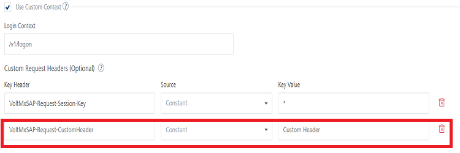
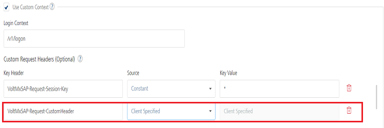
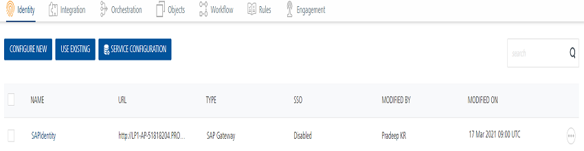
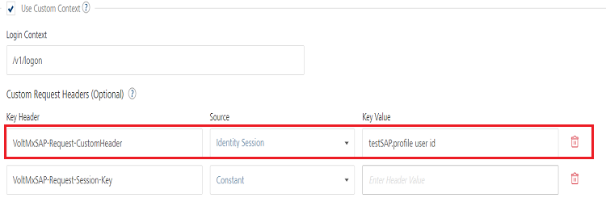

Only available if you have SAP Gateway services in your account.                              

User Guide: [Identity](Identity.md) > [Configure the Identity Service](ConfigureIdentiryService.md) > Volt MX SAP Gateway

Volt MX  SAP Gateway Identity Service
------------------------------------

You can enable Volt MX SAP Gateway authentication for your application so that only those users registered with external SAP services can access these services in the application.

The following sections describe how to configure and use a Volt MX SAP Gateway service:

*   [How to Configure a New Volt MX SAP Gateway](#how-to-configure-a-new-sap-gateway)

### How to Configure a New Volt MX SAP Gateway

To configure a Volt MX SAP Gateway, follow these steps:

1.  Under the **[**Identity** service designer](ConfigureIdentiryService.md#IdentitySDpage)** page, type a name for the service in the **Enter Service Name** text box.
2.  From the **Type of Identity** list, select **VoltMX SAP Gateway**.
3.  In the **Gateway address**, enter **connect.voltmx.com**_._
    
4.  In the **Port** text box, enter a valid port between 1 to 65535.
    
    Click **Test Connection** to validate the gateway and port details.
    
5.  You can also configure custom login context that is appended at the end of the gateway.  
    To configure custom login contexts. select the **Use Custom Context** check box, and do the following
    
    1.  **Login Context**: Enter the custom login context.
        
    2.  **Custom Request Headers (Optional)**
        *   VoltMXSAP-Request-Session-Key
        *   Volt MX Foundry supports multiple ways to configure dynamic headers in **SAP Identity Provider** configuration. There are three modes to configure dynamic headers for SAP provider in Volt MX Foundry.
            
            *   [Constant](#constant)
            *   [Client Specified](#ClientSpecf)
            *   [Identity Session](#IDSession)
        
        **Constant**: This mode allows you to configure the custom header key and its corresponding value to be sent as a part of the backend login request.
        
        
        
        The value set as a part of the configuration is sent directly to SAP as a request header in the login request.
        
        **Client Specified**: In **Client Specified** mode, Volt MX Foundry picks up the value of the custom header from the client request.
        
        
        
        *   The value field in the configuration will be disabled. When the client tries to login, the request must contain the header “VoltMXSAP-Request-CustomHeader”, else the header is not sent as a request header to SAP.
            
        *   When there is more than one instance of the configured header in the request headers of the login request, the first value sent will be picked up.
            
        
        Identity Session: In this mode, Volt MX Foundry picks up the value of the custom header from the identity session. The identity session contains the details of the identity providers logged into by the application. Identity session contains two different types of attributes for each provider: Profile and Security.
        
        For this mode to work, Volt MX Foundry should at least have two identity providers associated with it. The value in the provider configuration will be of the following pattern:<Provider Name>.<profile|security>.<Attribute Name>.
        
        
        
        
        
        Based on the above configuration, the login request to SAP will pick up the header value from the identity session. It will pick a profile attribute named userID associated with the provider of the name**testSAP**.
        
    3.  Enter additional headers that need to be present to log in to custom SAP services.  
        The entries for Header are automatically inserted into the login request. You can delete an entry by clicking the **Delete** button next to the entry.
        
    4.  **Response Session Key Header**: Enter the header name that contains the session key from SAP response.
6.  In the **Header parameter name prefix \*** text box, enter **VoltMXSAP**.
    
7.  In **Test SAP Login**, do the following:
    
    1.  In **User ID** and **Password**, provide valid credentials that you created while registering with Volt MX SAP services.
        
    2.  In the **Default Caller ID**, provide the ID that Volt MX SAP Gateway uses for logging and auditing.
    3.  In the **Default Caller Group**, provide the ID that Volt MX SAP Gateway uses for logging and auditing.
    
    > **_Note:_** This information is optional.
    
    Click **Test Login** to validate the SAP login details.
    
8.  Click the **Advanced** to provide additional configuration of your service definition:
    *   Now you can enable or disable the integrity check for an identity service at the provider level. If the integrity is disabled at the provider level, then the provider is meant for server-to-server communication only. To disable the integrity check, In **Advanced**, select the **Restrict to Foundry Server to Server Authentication** check box. This setting blocks a traditional client app from using an identity service. It will only allow the identity service to be used from a Volt MX Foundry Server to authenticate and invoke services.
    *   **Concurrent User Logins**: Select one of the following three options to configure concurrent user login sessions. For more information, refer to [Concurrent User Logins](ConcurrentUserLogins.md).
        *   **Allow concurrent user sessions (no restrictions)**: When this option is selected, an app user with unique credentials is allowed to have multiple apps from different instances.
        *   **Allow only one active user session per app**: Logging into simultaneous instances of **the same app** is not supported. When this option is selected, an app user can log in to only one instance of client apps linked to a specific Foundry app which has the identity service linked.  
            
        *   **Allow only one active user session across all apps**: Logging to simultaneous instances of **the same app or across apps** is not supported. When this option is selected, a unique app user can log in to only one instance of client apps linked to all Foundry apps using the identity service.  
            
            > **_Important:_** Apps enabled for SSO will not work if the option is selected, Allow only one active user session across all apps.
            
9.  Click **Save**. The identity provider is configured.
    
    > **_Note:_** You can view the service in the Data Panel feature of Volt MX Iris. By using the Data Panel, you can link back-end data services to your application UI elements seamlessly with low-code to no code. For more information on Data Panel, click [here](../../../Iris/iris_user_guide/Content/DataPanel.md#top).
