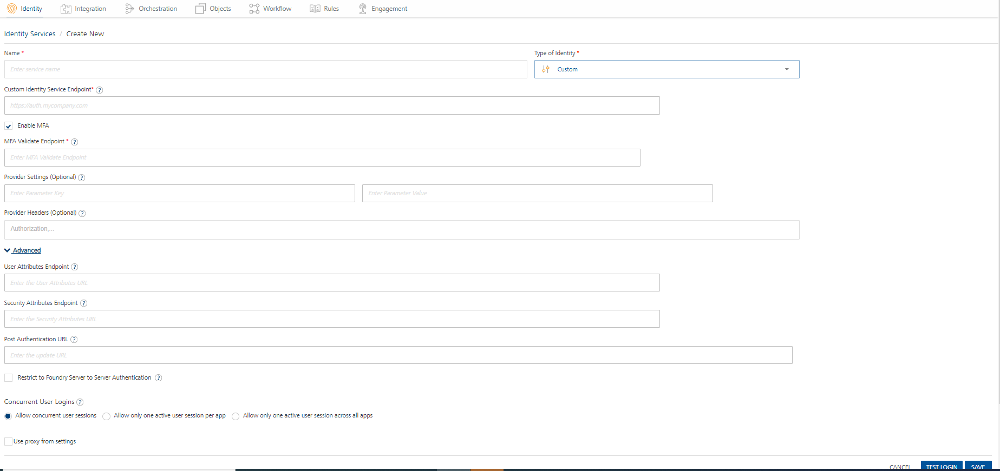
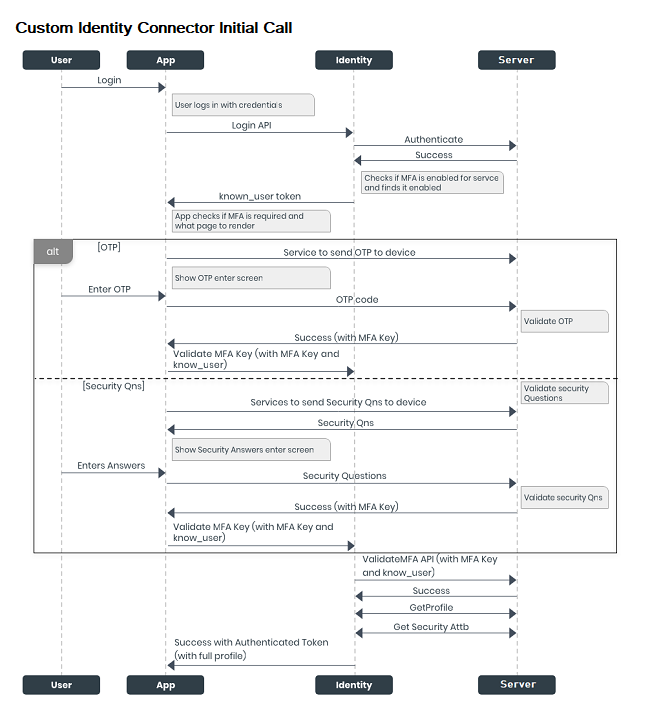
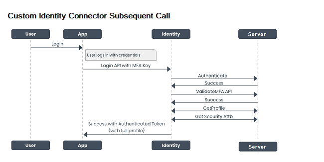

                               

User Guide: [Identity](Identity.md) > [Configure the Identity Service](ConfigureIdentiryService.md) > [VoltMX Custom Identity Service](#custom-identity-service) > Custom Identity Agreement

Volt MX  Custom Identity Service
-------------------------------

Volt MX  Foundry identity service supports federating authentication and authorization with external identity services over standard protocols.  

> **_Note:_** A **Federated Identity** is an electronic identity that maps attributes of a person across multiple identity services.

To authenticate users before accessing Volt MX Foundry services, Volt MX Foundry supports various types of identity services, such as Microsoft Active Directory, Salesforce, SAML, SAP, Volt MX SAP Gateway and User Repository. Each of these identity services agrees on a specific input and output format for authentication. The input and output formats differ based on back-end providers.

With Volt MX Foundry's custom authentication, a user can log in to any back-end provider's custom protocols by providing any parameters that the back-end provider supports, such as a userid and password, or a secret key.

> **_Important:_**  Custom identity service APIs should support application/ x-www-form-urlencoded.  
  
For example, when you send user input (username and password) to an auth service, the input is sent as JSON input, shown below:  
{ "userid" : "user@user.com",  
"password" : "password" }  
  
For a custom identity service, user inputs are sent as / x-www-form-urlencoded.

> **_Important:_**  SDK support for custom auth provider is available from Volt MX Foundry 6.0.4 onwards.  

You can configure a custom auth service by pointing to an end point that implements the custom identity protocol. A custom identity protocol can be implemented by using Volt MX Foundry integration service or by an external service.

> **_Note:_**  A custom identity protocol is implemented by a third-party back-end provider, or configured as an integration service by using the Volt MX Foundry Console.

*   **Custom identity protocol is implemented by an external service:**
    
    A third-party back-end provider directly authenticates Volt MX Foundry users configured for a custom identity service based on an agreement. Based on Volt MX Foundry's API contract, a back-end provider must agree to implement  `login` and `logout` APIs in a format compatible with Volt MX Foundry's auth service. The login and logout APIs accept parameters that a back-end provider supports, such as a userid and password, or a secret key for configuring a custom identity service.
    
*   ****Custom identity protocol is configured as an integration service:****
    
    If a back-end server **does not support** login and logout APIs, you can configure a custom auth service by pointing to an end-point.  
    _For example_, A Volt MX Foundry user creates an integration service that has a login and logout operations. Based on the input and output parameters configuration, Volt MX Foundry fetches a response for a user for login and logout operations. To get custom back-end server's error codes and error messages in the login/logout response, a developer must map error codes and messages with the parameters `backend_error_code` and `backend_error_message` in the Integration service **Response Output**. The following steps explain how to configure a custom auth service by pointing to an end-point.
    
*   **If the back end expects headers from an input request to be passed, follow these steps:**
    
    Currently, Volt MX Identity service cannot pass the headers from input request directly to the back end. Any headers apart from the appkey, appsecret, and other X-VoltMX headers will be dropped by the Volt MX Identity service. To solve the issue of dropped headers, follow these steps:
    
    1.  Configure integration service operation (for example, login) to talk to the back end and define the headers in the service definition.
    2.  In the custom identity creation, define the integration service URL as login endpoint.
    3.  Pass the same headers (that you defined in step 1) as body params instead of sending them as headers in the runtime app while making a call to the Volt MX Identity service.

### How to Configure Volt MX Custom Identity Provider

To configure Volt MX custom identity provider, follow these steps:

1.  Under the **[**Identity** service designer](ConfigureIdentiryService.md#IdentitySDpage)** page, type a name for the service in the **Enter Service Name** text box.
2.  From the **Type of Identity** list, select **Custom**.
    
    
    
    > **_Note:_**  Fields marked with an asterisk are required.
    
3.  In the **Custom Identity Service Endpoint** text box, choose one option:
    *   Enter a custom identity endpoint implemented by an external service. The endpoint should be in compliant with the custom identity provider API contract. The custom identity protocol implemented by an external service is the direct URL of a back-end provider. For more details, see the [Custom identity protocol by an external service](#IdentityProtocol)  
        topic.
    *   Enter a custom identity endpoint configured as an integration service.  A custom endpoint URL (VoltMX Foundry's custom identity protocol) is available in the `App Service Document` after you publish an app. The app should contain an integration service with login and logout operations. For more details, refer [Configuring a Custom Identity service by using an Integration service](CustomAuthwithEnd-Point.md#how-to-configure-a-custom-identity-service-by-using-an-integration-service).
        
        > **_Important:_**   A custom endpoint URL is available from a successfully published app. You must use a custom endpoint URL for a custom identity service within the same app.
        
4.  The **Enable MFA** check box enables you to configure MFA for the Custom Identity Service. However, when configured, whether MFA is used for a particular identity service call is determined at runtime based on the response for the login service.  
    This check box is selected by default. This helps you in the Test Login flow in design time environment to test the status of the short-lived known\_user token (whether it is issued or not).  
    You can uncheck it if MFA is not required.
5.  In **MFA Validate Endpoint**, type the URL to which the Identity Service should send the request to validate the MFA key and get the authenticated token. This feature is linked to the **Enable MFA** check box. If the **Enable MFA** check box is selected, this field is mandatory. If the **Enable MFA** check box is unchecked, this field is disabled.  
    If you give the MFA endpoint details, this adapter will act as a Multi Factor Authentication (MFA) adapter in design time environment. For more information, refer [Custom Identity MFA Flow](#custom-identity-mfa-flow).
6.  In the **Provider Settings (Optional)** section, click the **Add** button.
    
    > **_Note:_**  When you enter text in the **Enter Parameter Key** text box, a new row is automatically added below the first row.  
    You can also delete an entry by clicking the **Delete** button that appears next to each entry.
    
7.  In the **Enter Parameter Key** text box, enter the parameter you want to configure as an additional attribute. For example, <Backend-config-key>.
8.  To move the cursor to the next text box, press the **Tab** key or click in the text box. In the **Enter Parameter Value** text box, enter the value for the parameter. For example, <backend-config-key-value>.
    
    > **_Important:_**     You can add any key-value pairs. When an identity service makes a login call to a back-end provider, the identity service sends key-value pairs along with the call request. Confidential key-value pairs can be added under the **Provider Settings (Optional)** section instead of by adding these details in a client app.
    
9.  In the **Provider Headers (Optional)** section, enter the headers from the login request to be stamped on the requests made to the endpoint.
10.  In the **Advanced** section, you can do the following:
    *   In **User Attributes**, type the URL that you want to invoke after an identity session is created to get the custom user attributes created for the user who is trying to login to the client app. The custom user attributes can be any information related to the user like DoB, Gender, and more. This field is optional.  
        If you provide the URL, any additional user attributes that were configured will be appended to the respective section in the login response after a successful login
    *   In **Security Attributes**, type the URL that you want to invoke after an identity session is created to get the custom security attributes created for the user who Is trying to login to the client app. The security attributes are stored in Volt MX Foundry and not shared with the users. This field is optional.  
        Any secure info like credit card number, SSN which need not be sent to client app, but is required for backend processing, must be sent as security attribute.  
        
    *   In **Post Authentication URL**, enter the URL to be invoked after an identity session is created. After this URL is invoked, the Identity response is returned to the Client.
    *   Now you can enable or disable the integrity check for an identity service at the provider level. If the integrity is disabled at the provider level, then the provider is meant for server-to-server communication only. To disable the integrity check, In **Advanced**, select the **Restrict to Foundry Server to Server Authentication** check box. This setting blocks a traditional client app from using an identity service. It will only allow the identity service to be used from a Volt MX Foundry Server to authenticate and invoke services.
    *   **Concurrent User Logins**: Select one of the following three options to configure concurrent user login sessions. For more information, refer to [Concurrent User Logins](ConcurrentUserLogins.md).
        *   **Allow concurrent user sessions (no restrictions)**: When this option is selected, an app user with unique credentials is allowed to have multiple apps from different instances.
        *   **Allow only one active user session per app**: Logging into simultaneous instances of **the same app** is not supported. When this option is selected, an app user can log in to only one instance of client apps linked to a specific Foundry app which has the identity service linked.  
            
        *   **Allow only one active user session across all apps**: Logging to simultaneous instances of **the same app or across apps** is not supported. When this option is selected, a unique app user can log in to only one instance of client apps linked to all Foundry apps using the identity service.  
            
            > **_Important:_** Apps enabled for SSO will not work if the option is selected, Allow only one active user session across all apps.<br>
            For the Session Restrictions feature to work as expected with Custom Identity provider, the User ID credential parameter must be named `userid`. If the parameter name is `username`, `user`, or any other value, Identity will not be able to apply the session restrictions per app per user.
        
        *   **Login Failure Tracking**: Specifies whether Identity must count the number of login failures, which are defined by a 401 response from the server.  
            
            After the number of failed logins reaches (or exceeds) the specified threshold, Identity sends an `HTTP Status Code: 429` to the client. If the user signs-in with valid credentials, or if the Failure Count TTL elapses, the failure count is automatically reset to zero. 

            This feature can be used to add preventive measures and provide additional security against malicious traffic.
            
            To disable tracking of login failures, select No Tracking. To enable tracking of login failures, select either of the following options:  

               *  **Client IP Address**: The number of login failures are tracked based on the IP address of the client that generated the login requests.  

               *  **User ID**: The number of login failures are tracked based on the User ID for which the login requests are generated.                  
               
               *  **Both Client IP Address and User ID**: The number of login failures are tracked based on the IP address of the client that generated the login requests and the User ID for which the login requests are generated. The service tracks the login failures for the IP Address and the User ID separately. 

            If you enable tracking of login failures, the console displays the following parameters: 

               *  **Failure Threshold**: Specifies the threshold for the number of login failures. After the count of login failures reaches the threshold, Identity responds with HTTP Status Code: 429 until the login is successful, or the Failure Count TTL is elapsed.  

               * **Failure Count TTL**: Specifies the duration from the last login failure after which the failure count is automatically reset to zero. The default value is 30 minutes, and the maximum value is 168 hours.

11.  After entering the above details, click the **Test Login** button to verify the credentials. The **Test Login** dialog appears.
    
    1.  Enter the required details in headers and body for custom identity provider.
        
        The entries for Header and Body are auto-inserted into the login request. You can delete an entry by clicking the **Delete** button next to the entry.
        
    2.  Click **Sign In**.
        
        The test results are displayed in the **Identity Response** dialog.
        
12.  Click **SAVE** to save the service. The system displays the **Identity** page. The custom identity service is configured.
    
    > **_Note:_** You can view the service in the Data Panel feature of Volt MX Iris. By using the Data Panel, you can link back-end data services to your application UI elements seamlessly with low-code to no code. For more information on Data Panel, click [here](../../../Iris/iris_user_guide/Content/DataPanel.md#top).
    

### Custom Identity Agreement

The following APIs must be implemented by a custom identity hosting service as the `endpoint_url` configuration parameter:

*   [Login API](#LoginAPI)
*   [Logout API](#LogoutAPI)
*   [MFA](#MFA)
*   [User Attributes](#UserAttributes)
*   [Security Attributes](#SecurityAttributes)

Login API for a Custom Identity Service

The Login API authenticates user access to a custom identity provider. This API should comply with the [custom identity protocol](#IdentityProtocol) mentioned in this section.

Method

POST

Headers

X-VoltMX-RequestId: <Request Id>

Content-Type: application/formurl-encoded only

Accept: application/json or application/xml

**Sample Request Body**:

```
 {
    “<custom_key1>” : <custom_value1>,
   “<custom_key2>” : <custom_value2>,
    …
}

```

**Details**:

*   Custom key-values (optional) - Sometimes, back ends require additional parameters for authentication such as SAP-SKY requiring a callerID to be passed. Caller IDs will be passed via additional name-value pairs from the identity service to the custom identity

**Sample Success Response if MFA is enabled**

The response contains `is_mfa_enabled` and `mfa_meta` fields if the back-end supports MFA. The user and security attributes are displayed after MFA validation. Following is the sample success response:

HTTP 200 OK

```
{  
...  
"is_mfa_enabled":true,  
"mfa_meta":{"otp":2},  
...  
}
```

> **_Important:_** The "mfa\_meta" field varies depending on the type of MFA set in the backend server. The login service uses it to indicate to client app the type of MFA to be used like OTP, Security questions or even to invoke the security questions. This meta is available for client app to help the client app logic determine the actual mechanism of getting the MFA delivered.

**Sample Success Response if MFA not enabled:**

If an end user does not require MFA or has not enabled it, then the `is_mfa_enabled` field is set to false and the user profile information and claims token are available in the response. There will be no further MFA validation in the current service call instance. Following is the sample success response:

HTTP 200 OK

```
 
{  
"is_mfa_enabled":false,  
  
“security_attributes” : {
“session_token”: “<session_token>”,
“session_ttl”: <>, /* -1 : if ttl is not available.  
Else TTL in msecs */
“<optional key1>”: “<value1>”,  /* ex: refresh_token
“<optional key2>”: “<value2>”,
    },
   “user_attributes”:  
{
"user_id” : “<userID_number>", /* federation ID of the user from custom identity service
“<attr1>” : “<value1>”, /*ex: “first_name”: “<firstname>” */
“<attr2>” : “<value2>”, /*ex: “user_id”: “<user_id>” */
“<attr3>” : “<value3>”, /*ex: “role”: “<role>” */
   }
}

```

> **_Note:_** If "is\_mfa\_enabled" field is not there in the server response, then the backend server does not support MFA.

> **_Important:_** The user\_id is a mandatory field in the log-in response.

**Sample Success Response with httpStatusCode:**

HTTP 200 OK

```
 {
“security_attributes” :

{ “session_token”: “<session_token>”, “session_ttl”: <>, /* -1 : if ttl is not available. Else TTL in msecs */ “<optional key1>”: “<value1>”, /* ex: refresh_token “<optional key2>”: “<value2>”, }
,
“user_attributes”:

{ "user_id” : “<userID_number>", /* federation ID of the user from custom identity service “<attr1>” : “<value1>”, /*ex: “first_name”: “<firstname>” */ “<attr2>” : “<value2>”, /*ex: “user_id”: “<user_id>” */ “<attr3>” : “<value3>”, /*ex: “role”: “<role>” */ }
,
"httpStatusCode" : 200 /* please note this is an integer. if this is not 200 custom login will fail */
}

```

**Possible Failure Responses**

*   HTTP 401 : Invalid/incorrect credentials
*   HTTP 400 : Insufficient/wrong parameters
*   HTTP 500 : Internal Server Error

```
**Failure response when Custom identity protocol is configured as an integration service**  
{
    "details": {
        "message": "Middleware Service returned a HTTP Response Status [401], OpStatus [8009], Error Message [Request unsuccessful for service login, server responded with status code 401]",
        "errcode": 123,
        "errmsg": "backendErrorMessage"
    },
    "httpstatus": "Unauthorized",
    "requestid": "b5bb895b-7cc7-40db-8cfc-a2d69bfd31f9",
    "domain": "AUTH",
    "code": -14,
    "mfcode": "Auth-14",
    "message": "Configured IdP Service Unavailable"
} 
```

To map the backend\_error\_code and backend\_error\_message with the errcode and errmsg of the Identity Service, the two values should be mapped to the integration service response output.

After mapping, the Integration Service response for the failed authentications is displayed as below:

```
 {
    "backend_error_message": "backendErrorMessage",
    "opstatus": 8009,
    "errmsg": "Request unsuccessful for service login, server responded with status code 401",
    "backend_error_code": "123",
    "httpStatusCode": 401
} 
```

The Identity service extracts backend\_error\_code and backend\_error\_message from the integration response and maps them to the errcode and errmsg and sends the response.

```
 {
    "details": {
        "message": "Middleware Service returned a HTTP Response Status [401], OpStatus [8009], Error Message [Request unsuccessful for service login, server responded with status code 401]",
        "errcode": 123,
        "errmsg": "backendErrorMessage"
    }, 
```

Logout API for a Custom Identity Service

The Logout API clears the session of a logged-in user. The Logout API is optional for a custom identity service. You need to configure the logout API only if a logged-in user is associated with a session. You can configure the logout API in the Volt MX Foundry Console.

Method

POST

Headers

X-VoltMX-RequestId: <Request Id>

Content-Type: application/formurl-encoded only

Accept: application/json or application/xml

**Sample Body Request**:

```
 {
   “session_token” : “<Session Token>”
}

```

**Details**:

**session\_token (optional)**

Session Token of the user session in custom identity service

**Sample Success Response:**

*   HTTP 200 OK, No Body  
    

**Sample Failure Response:**

*   HTTP 401 : In case of invalid credentials
*   HTTP 500 : In case of internal server error

```
 {
 “domain” : “custom”,
 “code” : <error code>,
 “message” : <Error Message>,
 “details” : {
 “message” : <Detailed Error Message>,
    },
  “requestid” : <Request Id>,
}
```

**MFA API**

If MFA is enabled, the client app should have the necessary logic to validate the MFA with any configured endpoint(s) such as an integration service to generate and validate OTP, or validate security questions entered in client app. Post the validation, the integration service should return an MFA key (mfa\_key) to the client app, which should be passed using the Foundry SDK API to MFA validation endpoint along with known\_user token. The endpoint should be configured to confirm the authenticity of the mfa\_key and accordingly send a successful response or failure. This 2 step process is to ensure that the backend generating MFA is not implicitly trusted by identity, but validates the mfa\_key, before generating an authenticated session for the same. The MFA validation endpoint is invoked with the following parameters.

**Sample Request Body**

```
{
    “<mfa_key>” : <mfa key>,
    …
}

```

> **_Note:_** To know more about other parameters that are added by SDK, refer to the [SDK document](VoltMX_Customer_360_Adapter.md#validatemfa).

**Sample Success Response**

HTTP 200 OK

```
{
“security_attributes” : {},
“user_attributes”:  
{  
/* Fetched from Custom Identity Endpoint*/  
"user_id” : “<userID_number>", /* federation ID of the user from custom identity service
“<attr1>” : “<value1>”, /*ex: “first_name”: “<firstname>” */
“<attr2>” : “<value2>”, /*ex: “user_id”: “<user_id>” */
“<attr3>” : “<value3>”, /*ex: “role”: “<role>” */  
  
/*Fetched from User Attributes Endpoint*/
“<attr4>” : “<value4>”, /*ex: “mobile_number”: “<mobile_number>” */
“<attr5>” : “<value5>”, /*ex: “department”: “<department>” */
“<attr6>” : “<value6>”, /*ex: “job_title”: “<job_title>”  */

}
}

```

**User Attributes Endpoint API**

The User Attributes Endpoint API retrieves additional user profile data which will passthrough integration service.

**Method**

GET

**Headers**

X-VoltMX-RequestId: <Request Id>

X-VoltMX-Authorization: <claims \_token>

Content-Type: application/formurl-encoded only

Accept: application/json

**Sample Success Response:**

HTTP 200 OK

```
“user_attributes”:  
{
  
/* Fetched from Custom Identity Endpoint*/  
"content_type": "application/json",
"user_id” : “<userID_number>", /* federation ID of the user from custom identity service
“<attr1>” : “<value1>”, /*ex: “first_name”: “<firstname>” */
“<attr2>” : “<value2>”, /*ex: “user_id”: “<user_id>” */
“<attr3>” : “<value3>”, /*ex: “role”: “<role>” */ 
  
/*Fetched from User Attributes Endpoint*/  
“<attr4>” : “<value4>”, /*ex: “mobile_number”: “<mobile_number>” */
“<attr5>” : “<value5>”, /*ex: “department”: “<department>” */
“<attr6>” : “<value6>”, /*ex: “job_title”: “<job_title>”  */
…
  
}
```

**Sample for Failure Response**:

If invocation of optional User Attributes Endpoint fails and returns a successful response, then the response will have the following failure information:

HTTP 200 :

```
“user_attributes”:  
{
  
"content_type": "application/json",
"user_id” : “<userID_number>", /* federation ID of the user from custom identity service
“<attr1>” : “<value1>”, /*ex: “first_name”: “<firstname>” */
“<attr2>” : “<value2>”, /*ex: “user_id”: “<user_id>” */
“<attr3>” : “<value3>”, /*ex: “httpStatusCode”: “<200>” */
…
  
“<httpStatusCode >” : “<200>”, /*ex: “httpStatusCode”: “<200>” */
“<opstatus>” : “<value4>”, /*ex: “opstatus”: “<integer value>” */
“<errmsg>” : “<value5>”, /*ex: “errmsg”: “<error details>” */ 
  
}
```

**Security Attributes Endpoint API**

The Security Attributes Endpoint API retrieves additional security attributes data which will passthrough integration service. These are server only attributes and are accessible from the custom code in server (pre/post processors).

**Method**

GET

**Headers**

X-VoltMX-RequestId: <Request Id>

X-VoltMX-Authorization: <claims \_token>

Content-Type: application/formurl-encoded only

Accept: application/json

**Sample Success Response**:

HTTP 200 OK

```
“user_attributes”:  
{
"content_type": "application/json",
"user_id” : “<userID_number>", /* federation ID of the user from custom identity service
“<attr1>” : “<value1>”, /*ex: “session_token”: “<session_token>” */
“<attr2>” : “<value2>”, /*ex: “refresh_token”: “<refresh_token>” */
“<attr3>” : “<value3>”, /*ex: “_provider_token”: “<_provider_token>”
 */
…

“<attr4>” : “<value4>”, /*ex: “session_auto_extend”: “<session_auto_extend
>” */
“<attr5>” : “<value5>”, /*ex: “session_idle_timeout”: “<session_idle_timeout>” */ 
…
}

```

**Sample Failure Response**

If invocation of optional Security Attributes Endpoint fails and returns a successful response, then the response will have the following failure information:

HTTP 200:

```
“user_attributes”:  
{
“<attr1>” : “<value1>”, /*ex: “session_token”: “<session_token>” */
“<attr2>” : “<value2>”, /*ex: “refresh_token”: “<refresh_token>” */
“<attr3>” : “<value3>”, /*ex: “provider_token”:“<provider_token>”*/
…

“<opstatus>” : “<value4>”, /*ex: “opstatus”: “<integer value>” */
“<httpStatusCode >” : “<httpStatusCode >”, /*ex: “httpStatusCode”: “<200>” */
“<errmsg>” : “<value5>”, /*ex: “errmsg”: “<error details>” */ 

}

```

### Custom Identity MFA Flow

#### Initial Call Process

When a user signs in to the application for the first time, the following calls occur among the app, Identity service, and server:

*   The login request is sent to the Volt MX Foundry Identity service through the Login API.
    
*   The Identity service sends the login request to the server to be authenticated.
    
*   On successful authentication of the user from the server, the Identity service verifies the MFA status. By default, MFA is enabled. If MFA is not enabled, the Identity service returns the authenticated token.
    
*   If MFA is enabled, the Identity service sends a “**known\_user token**” to the application.
    
*   The app contains the custom logic internal to its implementation to fetch MFA. The configured MFA can be of any type, namely: OTP, and/or security questions, and/or any custom logic to obtain an MFA key.
    
*   **OTP flow**
    *   If the bank or user enables OTP as the type of MFA, the app displays the OTP screen. And the app invokes a service that sends an OTP to the user's registered device.
        
    *   After the user type the OTP, it is sent to the server to be validated.
        
    *   On successful validation, the server sends an MFA key to the application.
        
    *   The app sends the MFA key along with the Known User token to the Identity service.
        
*   **Security Questions Flow**
    *   If the bank or user enables Security Questions as the type of MFA, the app displays the Security Questions screen. And the app invokes a service that requests the server to send the security questions.
        
    *   After the user provides the answers to the questions, they are sent to the server to be validated.
        
    *   On successful validation, the server sends an MFA key to the application.
        
    *   The app sends the MFA key along with the Known User token to the Identity service.
        
*   The Identity service sends the MFA key and the Known User token to the server to validate the user who is trying to access the application.
    
*   On successful validation, the server sends the profile and security attributes of the user to the Identity service.
*   The Identity service sends the authenticated token with full profile details to the application.
    



#### Subsequent Call Process

On subsequent logins, the following calls occur among the app, Identity service, and server:

*   The application invokes the Login API along with the stored MFA key, and sends the details to the Identity service.
    
*   The Identity service sends the MFA key and the known\_user token to the server to validate the user who is trying to access the application.
    
*   On successful validation, the server sends the profile and security attributes of the user to the Identity service.
    
*   The Identity service sends the authenticated token with full profile details to the application.
    


