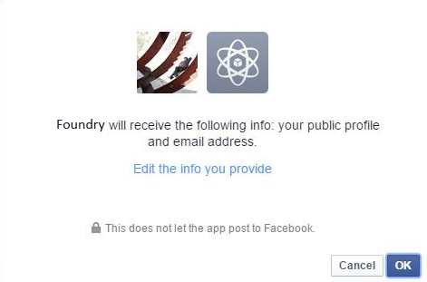

                              

User Guide: [Identity](Identity.md) > [Configure the Identity Service](ConfigureIdentiryService.md) > Facebook

Facebook Identity Service
-------------------------

With a Facebook identity service, a user can access Facebook resources through Volt MX Foundry applications. Volt MX Foundry supports OAuth2.0 authentication mode for Facebook identity service.

For example, when a user logs into a Volt MX Foundry application by using the Facebook identity provider, the Volt MX Foundry application redirects the user to log in to a Facebook account. After the user logs into Facebook, Facebook issues an authorization code to the user. The user sends the authorization code to the application. Volt MX exchanges the authorization code for the access token and issues Volt MX token. By using Volt MX token, the user can access the application or web resources.

### How to Configure a Volt MX Facebook Identity Service

To configure a Facebook identity service using OAuth 2.0 authentication mode, follow these steps:

1.  Under the **[**Identity** service designer](ConfigureIdentiryService.md#IdentitySDpage)** page, type a name for the service in the **Enter Service Name** text box.
2.  From the **Type of Identity** list, select **Facebook**.
    
    > **_Note:_** Fields marked with an asterisk are mandatory.
    
3.  In the **Client Id** text box, enter the app key of the app instance that you created on Facebook.
4.  To move the cursor to the next text box, press the **Tab** key or click in the text box. In the **Client Secret** text box, enter the app secret key of the app instance that you created on Facebook.
    *   In the **Login URL** text box, the default URL ([https://graph.facebook.com](https://graph.facebook.com/)) is displayed. You cannot modify these details.
    *   In the **Callback URL** text box, the default URL is displayed. You cannot modify these details.  
        `https://<accountID>.auth.voltmxcloud.com/OAuth2/Callback`.  
        
        > **_Important:_**  Configure your Facebook app to accept requests from authentication service by typing the `auth.voltmxcloud.com`  in the **App Domain** text field.
        
5.  In the **Scope** text box, enter the list of permissions that a user needs to provide while in the user Facebook log-in page. The list can contain more than one permission. The list must contain a comma-separated valid permission. The list of permissions accepted by Facebook does not contain spaces. For the full list of permissions, refer to [Permissions with Facebook Login](https://developers.facebook.com/docs/facebook-login/permissions/v2.2#reference).
    
    For example, if you configure the `email`   permission as scope, after you log in Facebook for the first time, Facebook displays the following **Log in with Facebook** dialog with the configured permissions. Click **OK** to share your permissions (public profile and email) with Volt MX Foundry:
    
    
    
6.  After entering the above details, click the **Test Login** button to verify the credentials. The test results are displayed in the **Identity Response** dialog.
    
7.  After entering the details in the **Scope** field, click **Save** to save the service. The system displays the **Identity** page.
    
    > **_Note:_** You can view the service in the Data Panel feature of Volt MX Iris. By using the Data Panel, you can link back-end data services to your application UI elements seamlessly with low-code to no code. For more information on Data Panel, click [here](../../../Iris/iris_user_guide/Content/DataPanel.md#top).
