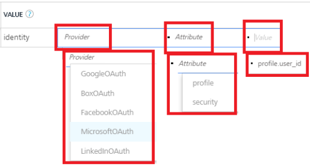
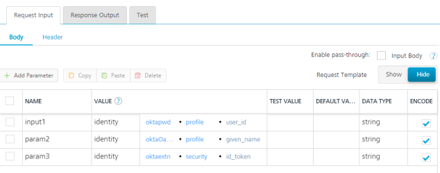

                               

User Guide: [Integration](Services.md#integration) \> [Advanced Configurations](Advanced_Configurations.md) > Enhanced Identity Filters - Integration Services

Enhanced Identity Filters
-------------------------

Identity filters are an enhanced data filtering mechanism that you can use to filter data for a mobile app based on dynamic fields returned from an identity provider.

A backend response returned from an identity service has two kinds of attributes **profile attributes** and **security attributes:**

*   **Profile attributes** refers to the attributes such as First Name, Email, Phone Number, which identify a user.

*   **Security attributes** are associated with a session such as tokens required to make API calls to a backend, for example, `access_token`.

Identity filters are supported for the following service types:

*   [Enhanced Identity Filters - Integration services](#enhanced-identity-filters)
*   [Enhanced Identity Filters in Objects > Storage Services  and  Service-Driven Objects](Objectservices.md#Enhanced_Identity_Filters)

### Enhanced Identity Filters - Integration Services

For identity filters to work, you must protect an integration service with an identity provider. For example, if an identity provider responds with a profile that has `userid` as one of its attributes after a successful login, use `profile.userid` as a value to pass it as request parameter to the backend. The response is filtered based on the value mentioned in `userid`.

When an integration service is protected with the identity provider, the operations of the integration service are enabled with an **identity** filter.

To configure identity filters to an integration service, follow these steps:

1.  Create an integration service.
    
2.  Create an operation for the integration service. For example, **IntIdt**
    
3.  In the operation's **Request Input** > **Body** tab, do the following:
    1.  In the **NAME** field, enter the name for the request input parameter - for example, **identityuserid**.
    2.  Click the drop-down menu in the **Value** column, and select **identity**.
        
        An identity value indicates that Volt MX Foundry will retrieve the value specified from the user's security profile in the identity service that is linked to the object service.
        
    3.  From the drop-down list next to the **identity** value, do the following:
        1.  Select the type of the identity provider from the drop-down list. For example, `GoogleOAuth` or `FacebookOAuth`.
            
            
            
        2.  Select the type of the attribute from the drop-down list. For example, `profile` or `security`,
        3.  Next to the attribute, enter the attribute key as obtained from a backend, for example, `profile.user.id`.  
            *   Add the following details.
                
                <table style="width: 100%;mc-table-style: url('Resources/TableStyles/Basic.css');" class="TableStyle-Basic" cellspacing="0"><colgroup><col class="TableStyle-Basic-Column-Column1" style="width: 150px;"><col class="TableStyle-Basic-Column-Column1"><col class="TableStyle-Basic-Column-Column1"></colgroup><tbody><tr class="TableStyle-Basic-Body-Body1"><td style="text-align: center;" class="TableStyle-Basic-BodyE-Column1-Body1"><b>NAME</b></td><td style="text-align: left;" class="TableStyle-Basic-BodyD-Column1-Body1" colspan="2"><b>VALUE</b></td><td>zzEmptyCellzz</td></tr><tr class="TableStyle-Basic-Body-Body1"><td class="TableStyle-Basic-BodyE-Column1-Body1">identityuserid</td><td class="TableStyle-Basic-BodyE-Column1-Body1">identity</td><td class="TableStyle-Basic-BodyD-Column1-Body1" style="font-weight: normal;">profile.user_id</td></tr><tr class="TableStyle-Basic-Body-Body1"><td class="TableStyle-Basic-BodyE-Column1-Body1">sessionparam</td><td class="TableStyle-Basic-BodyE-Column1-Body1">identity</td><td class="TableStyle-Basic-BodyD-Column1-Body1">security.access_token</td></tr><tr class="TableStyle-Basic-Body-Body1"><td class="TableStyle-Basic-BodyB-Column1-Body1">identityname</td><td class="TableStyle-Basic-BodyB-Column1-Body1">identity</td><td class="TableStyle-Basic-BodyA-Column1-Body1">profile.name</td></tr></tbody></table>
                
                
                
    4.  Click **SAVE** to save the operation.
4.  In the operation's **Request Input > Header** tab, do the following:
    1.  In the NAME field, enter the name for the request input parameter -for example, **identityuseridheader**.
    2.  Click the drop-down menu in the **Value** column, and select **identity**.
    3.  From the drop-down list next to the **identity** value, select **profile/security**, and then enter **profile.user.id**.  
        Add the following details.
        
        <table style="width: 100%;mc-table-style: url('Resources/TableStyles/Basic.css');" class="TableStyle-Basic" cellspacing="0"><colgroup><col class="TableStyle-Basic-Column-Column1" style="width: 150px;"><col class="TableStyle-Basic-Column-Column1"><col class="TableStyle-Basic-Column-Column1"></colgroup><tbody><tr class="TableStyle-Basic-Body-Body1"><td style="text-align: center;" class="TableStyle-Basic-BodyE-Column1-Body1"><b>NAME</b></td><td style="text-align: left;" class="TableStyle-Basic-BodyD-Column1-Body1" colspan="2"><b>VALUE</b></td><td>zzEmptyCellzz</td></tr><tr class="TableStyle-Basic-Body-Body1"><td class="TableStyle-Basic-BodyE-Column1-Body1">identityuseridheader</td><td class="TableStyle-Basic-BodyE-Column1-Body1">identity</td><td class="TableStyle-Basic-BodyD-Column1-Body1" style="font-weight: normal;">profile.user_id</td></tr><tr class="TableStyle-Basic-Body-Body1"><td class="TableStyle-Basic-BodyE-Column1-Body1">sessiontokenheader</td><td class="TableStyle-Basic-BodyE-Column1-Body1">identity</td><td class="TableStyle-Basic-BodyD-Column1-Body1">security.access_token</td></tr><tr class="TableStyle-Basic-Body-Body1"><td class="TableStyle-Basic-BodyB-Column1-Body1">profilenameheader</td><td class="TableStyle-Basic-BodyB-Column1-Body1">identity</td><td class="TableStyle-Basic-BodyA-Column1-Body1">profile.name</td></tr></tbody></table>
        
    4.  Click **SAVE** to save the operation.

> **_Note:_** In case you want to use identity filters with a custom code, you can define [JavaScript **preprocessor** and **postprocessor**](Java_Preprocessor_Postprocessor_.md).
