<map id="map1"><area shape="rectangle" coords="1,-1,200,32" dragdirection="0" title="Events App" alt="Events App" href="https://marketplace.voltmx.com/items/events" target="_blank"></map> 

# Integration Service Triggered Workflow Implementation - Async Response type

## Use-case

Let us create a simple Loan application Workflow that is invoked whenever an Integration Service mapped to this workflow is invoked from a client when a customer submits a Loan application.

In this example, the loan application process will have the following steps:

*   Start node – “Start" marks the beginning of the workflow once the execution from Integration service invokes the workflow. The request input from the integration service is copied and available to the workflow execution in the DEVICE_REQUEST namespace (data scope). Using the Start node’s properties, developers can map incoming request parameters from integration service to the Foundry_Workflow_Context. This can be used at a later point in the workflow as required. In addition, developers can also set Correlation ID fields for this workflow instance under the Start node’s properties. The Correlation ID fields are mandatory for a Async Response type workflow, in order to uniquely identify which workflow instance to pause and resume.

    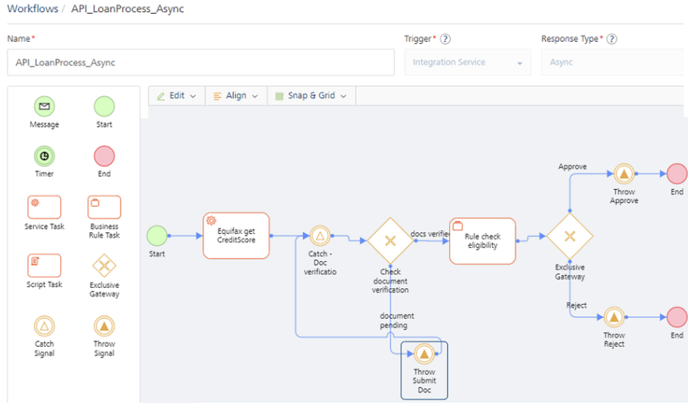

*   Using the mapping configuration in the Process Incoming parameters dialog of the Start node’s properties, map the Id and Name from incoming request payload that is already available as part of DEVICE_REQUEST scope.

*   Other request parameters like SSN, LoanAmount, Email could also be mapped to some keys within workflow_context using this mapping editor
*   A Correlation IdD is mandatory to uniquely identify the workflow instance to start or resume. You can map Correlation ID to any parameter from the Request payload that is available in the DEVICE_REQUEST namespace. In this case, the Id and Name are mapped as Correlation ID.

*   In the next service task – Equifax:getCreditScore, the credit score of the user is retrieved based on SSN from the integration service. In our example, a mock service has been used to calculate the credit score.

*   The next node in this example is a Catch Signal. Whenever a workflow needs to pause for another intervention/external event, the Workflow will pause at a Catch Signal and it will resume automatically after another configured event is raised to which the paused workflow is listening, and it resumes.
*   The workflow will arrive at the Catch-document verification node and remain in a paused state. Let’s say after the customer submits the loan application and you have run credit score for the loan application, the business process is now waiting to complete the document verification process of the customer. Hence to model this, you can have a Catch Signal node that is waiting for an event to be raised on topic – "CheckStatus/CheckDocStatus".

    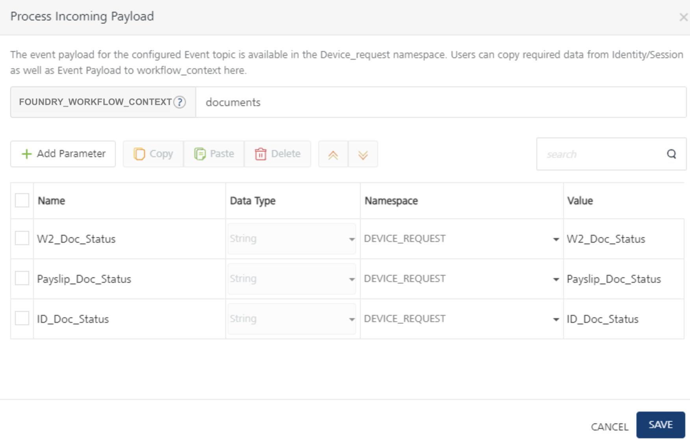

    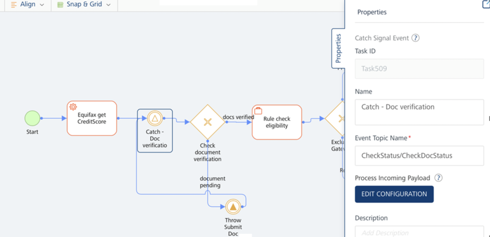

*   As we can see from the Process Incoming Payload pop-up of the Catch Signal properties, once an event “CheckStatus/CheckDocStatus” is raised by some other Foundry service, the workflow resumes execution. At this point, we can once again map the parameters from incoming Event payload into workflow_context like shown.

    The Correlation ID parameters already configured in the Start event will be used in the Catch Signal event to identify and resume the workflow instance, please ensure that the Event that resumes the workflow at Catch Signal contains the Correlation ID parameters with the same field names in Start node. In our example, we have to ensure to pass Id and Name in the Event payload when resuming execution on Catch signal.

*   The next task in our example is an Exclusive gateway that checks for Document verification status and based on that workflow takes different execution paths. This is determined from the doc_status parameters from the Event payload of "CheckStatus/CheckDocStatus” event that resumes workflow execution from the Catch Signal.

*   If document verification is pending, configure a “Throw Signal” node that would raise an event from workflow. In this case, you want to send a Web socket message to the client app, which started this workflow. Hence you choose the event type as “`Client Only`”. In order to receive this Web socket message, you must write client-side logic to subscribe to this event topic “`Notify`” .

*   Refer to attached Iris project for client-side logic in [VoltMX Iris SDK > Server Event APIs](VoltMXStudio/ServerEventAPIs.md).

*   You can use the Configure Event payload pop-up to construct the event payload from the workflow namespaces. In our example, we are sending Email, Name, DocumentStatus parameters mapped from Foundry workflow context.

*   **In case of Valid Documentation**:
    1.  After the documents are verified, the applicant’s loan application request is checked for loan eligibility, based on a rules service and it returns a decision of either Approved or Rejected.

    *   **If Approved**
        1.  A Throw Signal that fires an event “Notify” and event type is marked as ‘Client-Only” to send a web socket message.

        2.  Event payload is configured to send Email, Name and LoanRuleResult to the client over Web socket message.

            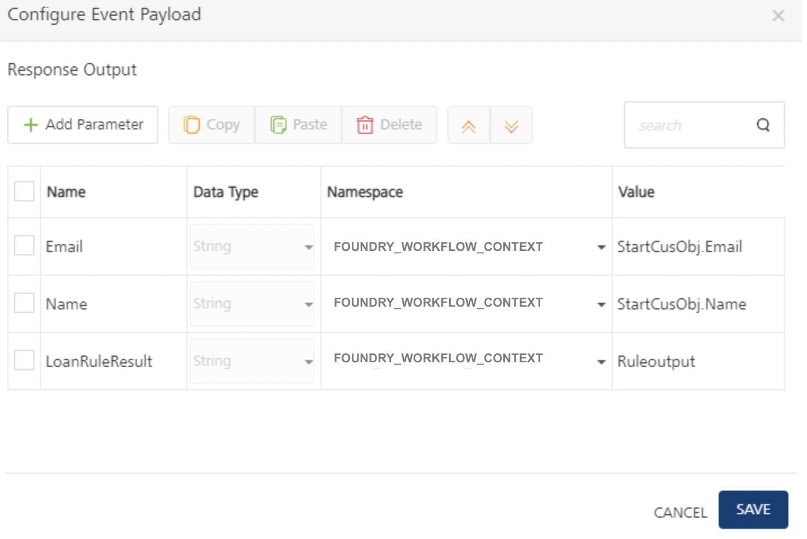

            The event workflow is completed for the request.

    *   **If Rejected**
        1.  A Throw Signal fires an event “Notify”, which is marked as “Client-Only” event type. This will send a Web socket message to client app with configured event payload parameters like Email, Name, and LoanRuleResult.
        2.  The event workflow is completed for the request.

## Loan Application - Integration Triggered Async Workflow

### Pre-requisites

To create a workflow for the steps that were discussed in this example, you must have the necessary Integration Services configured in your Foundry console.

<!-- Click here to download the [AsyncWF_Websocket_App Workflow](https://docs.voltmx.com/9_x_PDFs/voltmxfoundry/AsyncWF_Websocket_App_(v1.0).zip) sample app required to create the workflow and import the same into your Foundry console. -->

### Create an Async Workflow Service

To create the Loan Application workflow, do the following:

1.  From the dashboard in Foundry console, click the Foundry app where you have imported the Integration Services related to this use case, and click the Workflows tab. The Workflow’s landing page appears.
2.  Click **Configure New** from the landing page, the Configure New screen appears.
3.  In the **Name** field, type a unique name for the new Workflow service. For example, **API_LoanProcess_Async**.
4.  Select the **Integration Service** from the **Trigger** list.
5.  Select the **Async** from the **Response Type** list.
    1.  The Start node is placed in the canvas by default. Select the Start in the Workflow canvas area and click the Properties pane:  
        In the **Name** field, type the required name of the Start node. For example, **Start - submit loan application**.

    2.  In the **Process Incoming Payload**, click **EDIT CONFIGURATION** to map the request input parameters and Correlation ID from Event Payload to workflow_context here.
        *   Correlation ID is mandatory to uniquely identify the workflow instance to start or resume. Based on the Correlation ID, an event for the given topic name is raised. You can map Correlation ID to any parameter from the Event payload that is available in the DEVICE_REQUEST namespace.
        *   Select Id and Name from device request params as Correlation ID params.
        *   Type a key name “StartCusObj” in the text input next to FOUNDRY_WORKFLOW_CONTEXT. The parameters mapped in the table below will get stored in workflow_context using the “StartCusObj” key name.  

            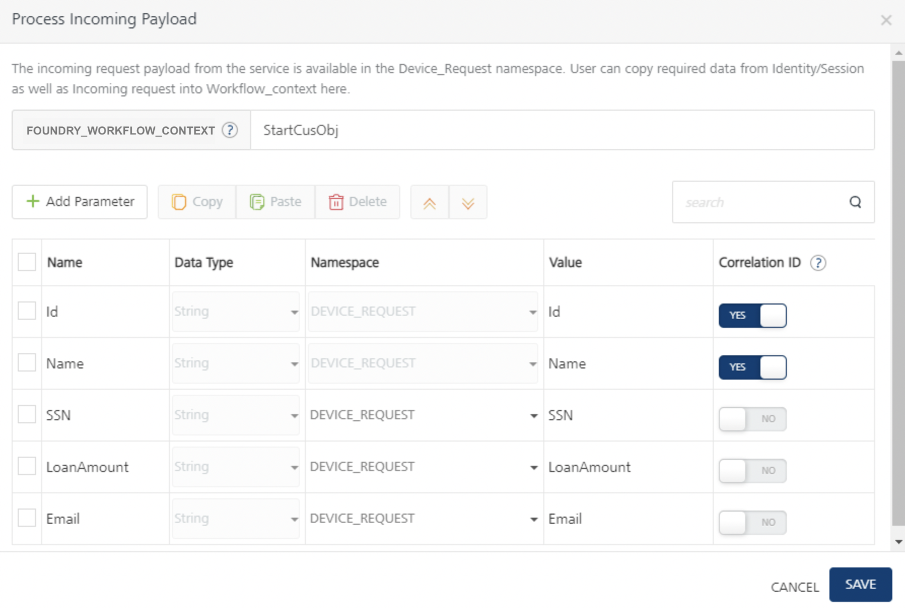

6.  The Start node is placed in the canvas by default. Select the Start in the Workflow canvas area and click the Properties pane:  
    In the **Name** field, type the required name of the Start node based on what it does. For example, **Start - submit loan application**

    *   In the **Process Incoming Payload**, click **EDIT CONFIGURATION** to map the request input parameters and Correlation ID from Event Payload to workflow_context here.

*   The Start node is placed in the canvas by default. Select the Start in the Workflow canvas area and click the Properties pane:  

    *   In the **Name** field, type the required name of the Start Signal based on the activity it handles. For example, **Start - submit loan application**.
    *   In the **Event Topic Name** field, type the topic name of the event - LoanProcess/startProcess.

    *   In the **Process Incoming Payload**, click **EDIT CONFIGURATION** to map the request input parameters and Correlation ID from Event Payload to workflow_context here.
        *   Correlation ID is mandatory to uniquely identify the workflow instance to start or resume. Based on the Correlation ID, an event for the given topic name is raised. You can map Correlation ID to any parameter from the Event payload that is available in the DEVICE_REQUEST namespace.
        *   Select SSN and application ID device request params as Correlation ID params
        *   Type a key name “startSignalParams” in the text input next to FOUNDRY_WORKFLOW_CONTEXT. The parameters mapped in the table below will get stored in workflow_context using the “startSignalParams” key name.

            

1.  Drag and drop a Service Task next to the Start and connect them. Click the Properties pane. You can do the following in the Properties pane:  

    *   In the **Name** field, type the required name of the service task based on the activity it handles. For example, **Equifax get CreditScore**.
    *   From the **Service Type** list, select **Integration Service**.
    *   From the **Integration Services Linked** list, select **EquifaxService**.
    *   From the **Operations** list, select **getCreditScore**.
    *   Click **Input Parameters > Configure** to manage the integration service’s request input parameters. In the **Namespace** column, select **DEVICE_REQUEST** for the input parameter displayed and type appropriate data for each parameter in the **Value** column (SSN and Id). Based on these values, the CreditScore service is invoked to calculate the user's credit score.

        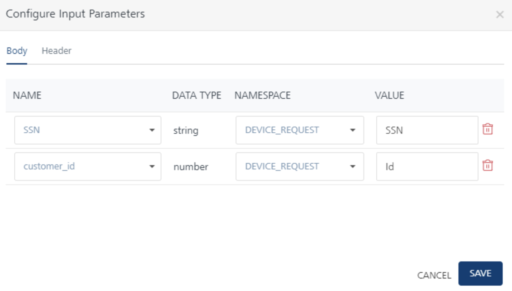  

    *   Click Output Parameters **Configure** to store the integration service’s output response. The response from each service task is saved in the FOUNDRY_WORKFLOW_CONTEXT namespace under the key name specified here. Type **creditScore** which acts as a key under workflow_context namespace (Foundry_Workflow_Context.creditScore).  

    

1.  Drag and drop a Catch Signal Event next to the **Equifax: getCreditScore** service task and connect them. Click the Properties pane. You can do the following in the Properties pane:
    *   In the **Name** field, type the required name of the exclusive gateway based on the activity it handles. For example, **Catch - document verification**.
    *   In the **Event Topic Name** field, type the topic name of the event. For example, CheckStatus/CheckDocStatus.

    *   In the **Process Incoming Payload**, click **EDIT CONFIGURATION** to copy the request input parameters from Event Payload to workflow_context here.

        The event payload for the configured Event topic is available in the DEVICE_REQUEST namespace. Users can copy required data from Identity/Session as well as Event Payload to workflow_context here.

        The Correlation ID parameters already configured in the Start node will be used in the Catch Signal event to identify and resume the workflow instance. Ensure that Event payload contains following Correlation ID parameters with same field names as mapped from DEVICE_REQUEST scope in Signal node: `Id` and `Name`.

        

2.  Drag and drop an Exclusive Gateway next to the Catch Signal and connect them. Click the Properties pane. You can do the following in the Properties pane:
    *   In the **Name** field, type the required name of the exclusive gateway based on the activity it handles. For example, **document verification status**.

    *   As **document verification status** is an exclusive gateway, two flows emerge from here. One flow determines the path of the workflow if the documents are in verified status. Name the flow as **Documents verified**. The other flow determines the path of the workflow if the documents are invalid. Name the flow as **Documents pending.**

1.  Click the **Documents verified** flow, and do the following:  

    *   In the Properties pane, click **Edit** under **Entry Validation criteria**.
    *   Click **Add Condition**. Select **FOUNDRY_WORKFLOW_CONTEXT** from the **Namespace** list, and in the **Value** field type documents.ID_doc_status.
    *   Click **Add Condition**. Select **FOUNDRY_WORKFLOW_CONTEXT** from the **Namespace** list, and in the **Value** field type documents.payslip_doc_status.
    *   Click **Add Condition**. Select **FOUNDRY_WORKFLOW_CONTEXT** from the **Namespace** list, and in the **Value** field type documents.w2tax_doc_status.
    *   From the operators list select `== and choose ‘none’for namespace and type verified` and click **Save**, for all the conditions.
    

2.  Click the **Documents pending** flow, and do the following:  

    *   In the Name, type documents pending.

1.  Connect the **Documents pending** flow with a Throw Signal Event and click the Properties pane. You can do the following in the Properties pane:
    *   In the **Name** field, type the required name of the message task based on the activity it handles. For example, **Throw Submit Doc**.
    *   In the **Event Topic Name** field, type the required name of the event's topic. For example, **Notify.**
    *   Under **Event Type**, select one of the following
        *   Client-only event type allows you to raise a private event on configured Topic Name over a web socket channel associated with a specific client.

            Only clients subscribed to the Topic Name over a web socket channel will receive private responses to the workflow execution.  
            For more details, refer to [Server Event APIs SDKs - VoltMX Iris](VoltMXStudio/ServerEventAPIs.md).

    *   Under **Configure Event Payload**, click **EDIT CONFIGURATION**, and do the following:

        *   Click **Add Parameter**. Type ‘Email’ under Name column, select **FOUNDRY_WORKFLOW_CONTEXT** from the **Namespace** list and in the **Value** field type StartCusObj.Email.
        *   Click **Add Parameter**. Type ‘Name’ under Name column, select **FOUNDRY_WORKFLOW_CONTEXT** from the **Namespace** list and in the **Value** field type StartCusObj.Name.
        *   Click **Add Parameter**. Type ‘DocumentStatus’ under Name column, select **FOUNDRY_WORKFLOW_CONTEXT** from the **Namespace** list and in the **Value** field type documents.
        *   Click **Save**.

            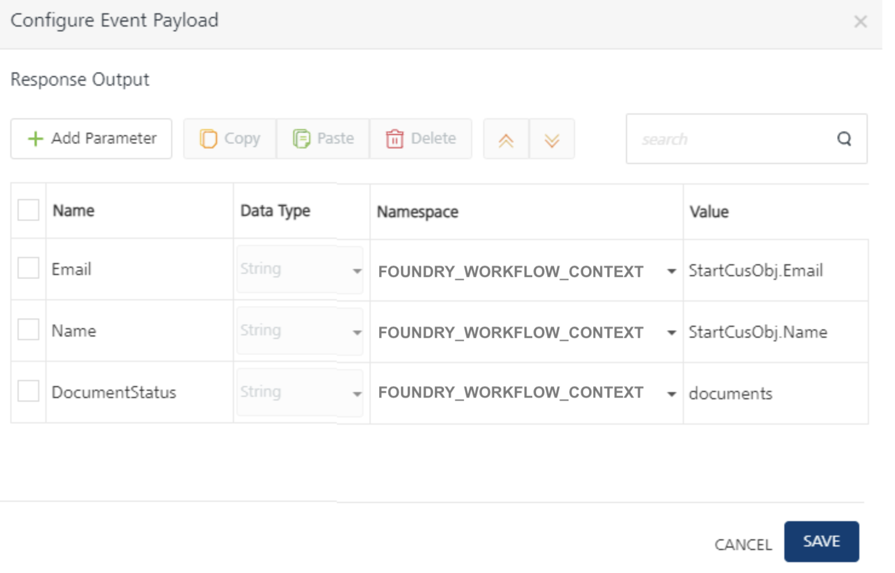

2.  Connect the **Throw Signal** node with the **Catch - document verification**.
3.  Connect the **Docs verified** flow with a Business Rules Task and click the Properties pane. You can do the following in the Properties pane:
    *   In the **Name** field, type the required name of the service task based on the activity it handles. For example, **Rule Task - check eligibility**.
    *   Link this task to a Rules service and select **LoandRule** for Rule Set and **CheckEligibility** for Rule in the respective drop-downs as you have done in the previous service task.
    *   Click Input Parameters **Configure** to manage the integration service’s request input parameters.
        *   In the **Namespace** column, select FOUNDRY_WORKFLOW_CONTEXT and type creditScore.creditScore in the **Value** column on RHS to map to creditRating input parameter on the LHS.

            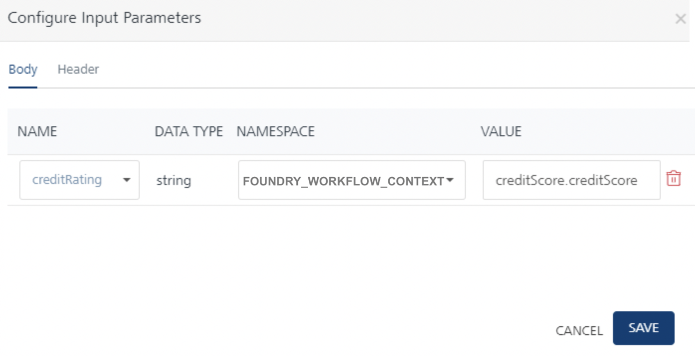

    *   Click Output Parameters **Configure** to manage the Rule service’s output response. The response from each service task is saved in the FOUNDRY_WORKFLOW_CONTEXT namespace. Type **Ruleoutput** as a key name to store the Rule output into workflow_context as (Foundry_Workflow_Context.Ruleoutput).

    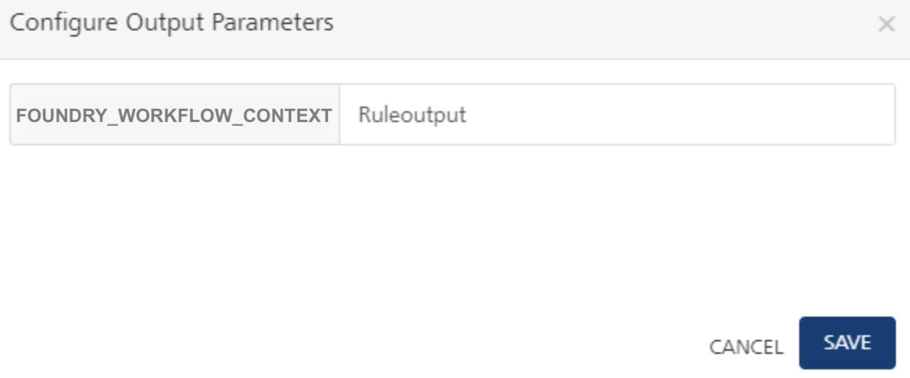

4.  Connect the **Docs verified** flow with a Business Rules Task and click the Properties pane. You can do the following in the Properties pane:
5.  Drag and drop an Exclusive Gateway next to the **Rule Task - check eligibility** task click the Properties pane. You can do the following in the Properties pane:
    *   In the **Name** field, type the required name of the exclusive gateway based on the activity it handles. For example, **Check Eligibility**.

    As **Check Eligibility** is an exclusive gateway, two flows emerge from here. One flow determines the path of the workflow if the loan is **Approve**, and the other flow determines the path of the workflow if the loan is **Reject**.

6.  Click the **Approve** flow, and do the following:
    *   In the Properties pane, click **Edit** under **Entry Validation criteria**.
    *   Click **Add Condition**. Select **FOUNDRY_WORKFLOW_CONTEXT** from the **Namespace** list and type “Ruleoutput.status” on the LHS.
    *   From the operators list select `== and choose ‘none’ namespace from drop-down and type ‘Approve’ on RHS` and click **Save**.
7.  Connect the **Approve** flow with a Throw Signal Event and click the Properties pane. You can do the following in the Properties pane:
    *   In the **Name** field, type the required name of the message task based on the activity it handles. For example, **Throw Approve**.
    *   In the **Event Topic Name** field, type the required name of the event's topic. For example, **Notify.**
    *   Under **Event Type**, select one of the following
        *   Client-only event type allows you to raise a private event on configured Topic Name over a web socket channel associated with a specific client.
    *   Under **Configure Event Payload**, click **EDIT CONFIGURATION**, and do the following:

        *   Click **Add Parameter**. Type ‘Email’ under Name column, select **FOUNDRY_WORKFLOW_CONTEXT** from the **Namespace** list and in the **Value** field type StartCusObj.Email.
        *   Click **Add Parameter**. Type ‘Name’ under Name column, select **FOUNDRY_WORKFLOW_CONTEXT** from the **Namespace** list and in the **Value** field type StartCusObj.Name.
        *   Click **Add Parameter**. Type ‘LoanRuleResult’ under Name column, select **FOUNDRY_WORKFLOW_CONTEXT** from the **Namespace** list and in the **Value** field type Ruleoutput.
        *   Click **Save**.

            

8.  Place an **End** node after the **Throw Approve** Throw Signal Event task to finish the loan application flow path.

9.  Click the **Reject** flow, and do the following:
    *   In the Properties pane, click **Edit** under **Entry Validation criteria**.
    *   Click **Add Condition**. Select **FOUNDRY_WORKFLOW_CONTEXT** from the **Namespace** list and type “Ruleoutput.status” on the LHS.
    *   From the operators list select `== and choose ‘none’ namespace from drop-down and type ‘Reject’ on RHS` and click **Save**.
10.  Connect the **Reject** flow with a Throw Signal Event and click the Properties pane. You can do the following in the Properties pane:
    *   In the **Name** field, type the required name of the message task based on the activity it handles. For example, **Throw Reject**.
    *   In the **Event Topic Name** field, type the required name of the event's topic. For example, **Notify.**
    *   Under **Event Type**, select one of the following
        *   Client-only event type allows you to raise a private event on configured Topic Name over a web socket channel associated with a specific client.
    *   Under **Configure Event Payload**, click **EDIT CONFIGURATION**, and do the following:

        *   Click **Add Parameter**. Type ‘Email’ under Name column, select **FOUNDRY_WORKFLOW_CONTEXT** from the **Namespace** list and in the **Value** field type StartCusObj.Email.
        *   Click **Add Parameter**. Type ‘Name’ under Name column, select **FOUNDRY_WORKFLOW_CONTEXT** from the **Namespace** list and in the **Value** field type StartCusObj.Name.
        *   Click **Add Parameter**. Type ‘LoanRuleResult’ under Name column, select **FOUNDRY_WORKFLOW_CONTEXT** from the **Namespace** list and in the **Value** field type Ruleoutput.
        *   Click **Save**.

            

11.  Place an **End** node after the **Throw Reject** Throw Signal Event to finish the **Ineligible** flow path.

### Create an Integration Service for Async Workflow

1.  Go to the Integration services tab in Foundry console and click Configure New.
2.  From the Service Type list, select Foundry Workflow.
3.  Click SAVE & ADD OPERATION.

    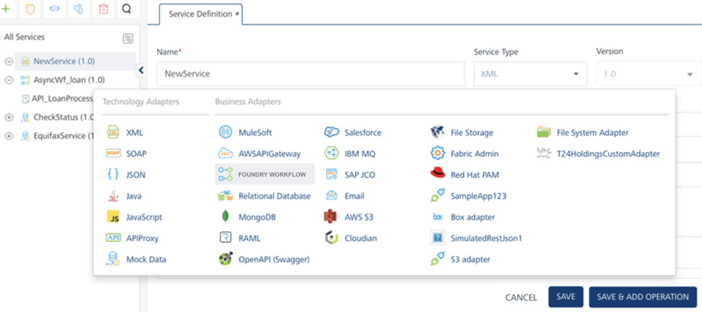

4.  In the Add Operations, select the Workflow that was created from the list "API_LoanProcess_Async” and click Add Operation, as shown:

    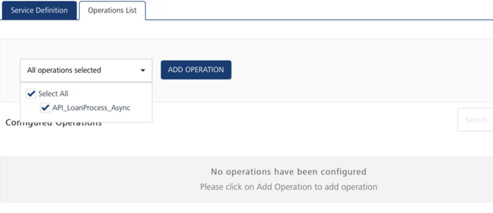

5.  Once added, go to the operation and configure Request Input parameters.

    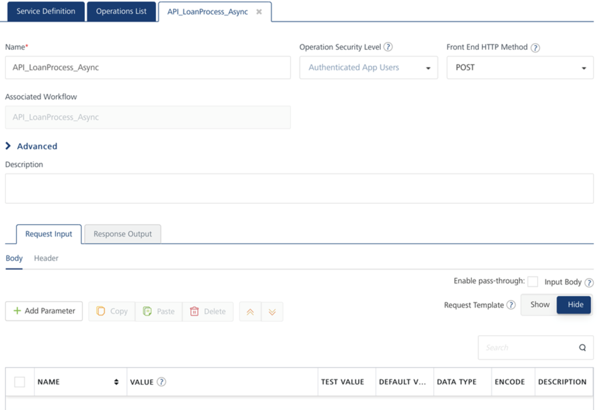

    1.  Configure Request Input:  
        Add parameters Id, Name, SSN, LoanAmount, Email that will be coming from the client as part of the Loan Application service request.

        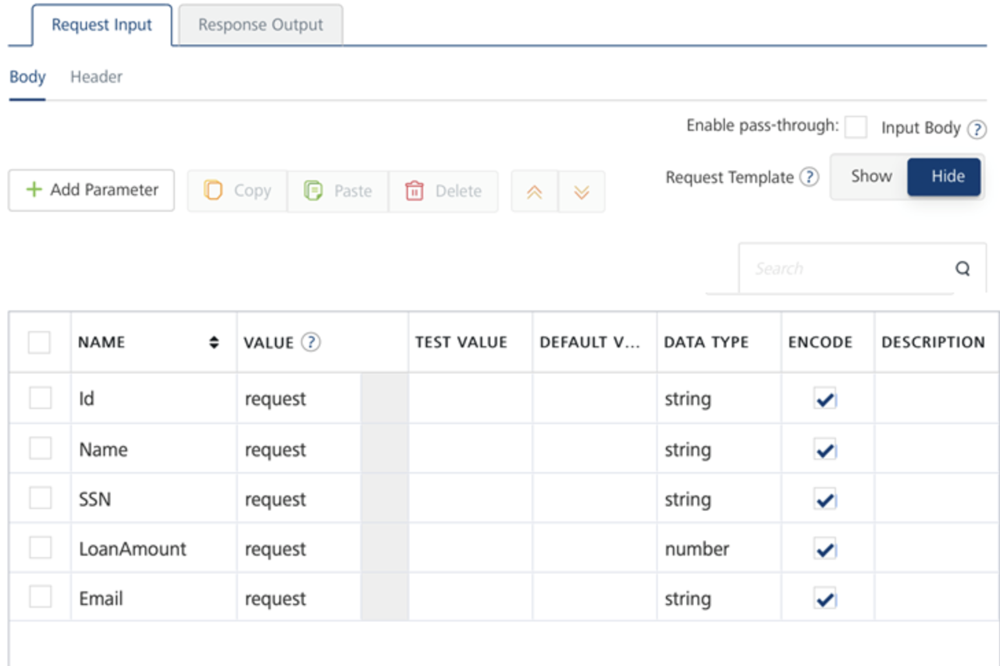

    2.  Configure Response Output:  
        For all Integration services that are mapped to workflow, by default the Response output contains “workflowInstanceId” that gets returned in the integration service response as an Acknowledgement to client that the workflow was invoked.

        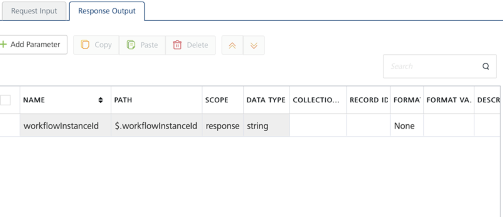

        *   Integration service operation should be Anonymous or Authenticated security level, only then clients invoking Async Workflows can receive Web socket messages.
        *   Ensure the Web sockets are enabled in Foundry Cloud environment to which you are publishing the app. Else contact Cloud support to turn VOLTMX_SERVER_CLIENT_EVENTS_ENABLED flag on.

### Create a Iris Client App for Async Workflow

<!-- 1.  Download and import attached Iris project into 9.3 version of Iris.  
    Click here to download the [AsyncWorkflow_WebSocket_Sample.zip](https://docs.voltmx.com/9_x_PDFs/voltmxfoundry/AsyncWorkflow_WebSocket_Sample.zip) sample app required to create the client workflow app and import the same into your Iris. -->  

2.  To create the app, in a new project, create a new Form in Responsive Web/ Desktop channel.
3.  Link the Foundry app to the Iris project, you will see all the Foundry services listed in Data Panel.

    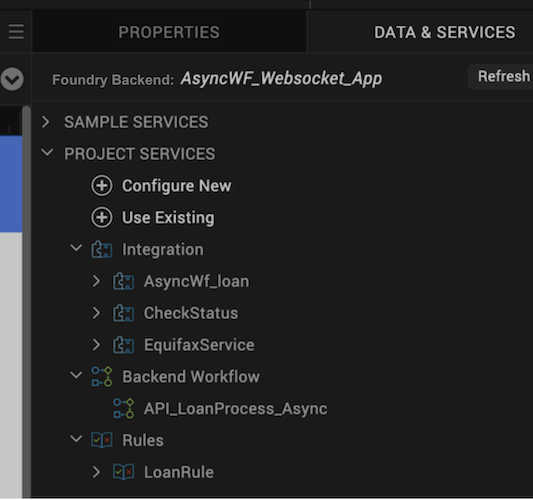

4.  From the Data Panel, expand the “AsyncWf_Loan” integration service and drag and drop the Request object on to Form canvas.

    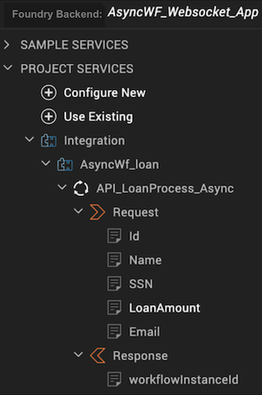

5.  Add buttons on the Form canvas for the following:
    *   Call Async Workflow – to invoke the integration service on button click.
    *   WSSetCallback – to set up Web socket callback functions at the beginning.
    *   Subscribe – to invoke Subscribe API.
    *   CloseWS – to close Web socket connection on button click.

1.  As part of Form controller, write Web socket callback functions, a subscribe function and a function to invoke integration service, as per the attached Form Controller file.

*   Setup Web socket Callback functions:  

    <pre><code>
      setservereventscallbacks : function()
      {
        var setupOptions = {
          onEventCallback: this.eventcallbacksan,
          onFailureCallback: this.failureCallback, 
          onCloseCallback: this.closeCallback
      };
      VMXMobileFoundry.setServerEventsCallbacks(setupOptions);
      }
      eventcallbacksan : function(obj) 
      {
        alert ("Event success callback" + JSON.stringify(obj));  
      },
      failureCallback : function(obj) 
      {
        alert ("Failure callback" + JSON.stringify(obj));  
      },
      closeCallback : function(obj) 
      {
        alert ("Close callback" + JSON.stringify(obj));  
      },
    </code></pre>

*   Subscribe Function:  

    <pre><code>
        subscribeEvents : function() 
        {
        var topicsToSubscribe = this.view.txtTopics.text;
        subscribeCallback = function(obj) 
        {
          alert ("subscribe callback" + JSON.stringify(obj));  
        };
        var subscribeOptions = {
          onSubscribeCallback: subscribeCallback,
          //onFailureCallback: failureCallback
        };
        VMXMobileFoundry.subscribeServerEvents(topicsToSubscribe, subscribeOptions);
      }
    </code></pre>

*   Close Web socket function:  

    <pre><code>
    {
        var unSubscribeOptions = {
          "closeConnection" : true
        };
        VMXMobileFoundry.unSubscribeServerEvents("dummy", unSubscribeOptions);
    }
    </code></pre>

    Only clients subscribed to the Topic Name over a web socket channel will receive private responses to the workflow execution.  
    For more details, refer to [Server Event APIs SDKs - VoltMX Iris](VoltMXStudio/ServerEventAPIs.md).

