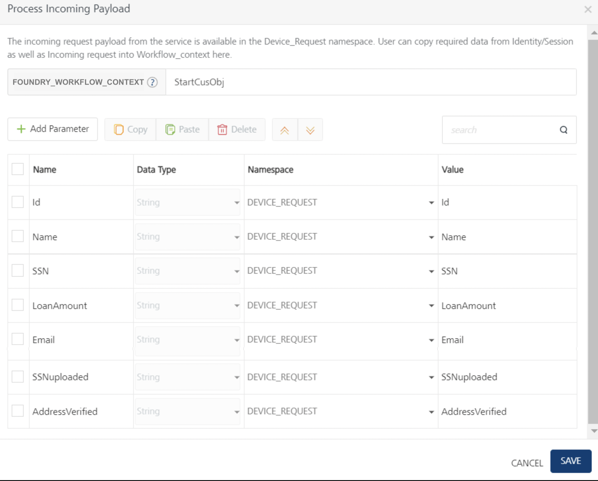
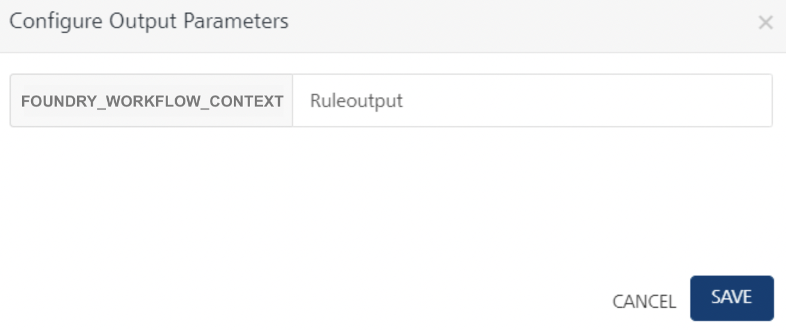

<map id="map1"><area shape="rectangle" coords="1,-1,200,32" dragdirection="0" title="Events App" alt="Events App" href="https://marketplace.voltmx.com/items/events" target="_blank"></map> 

# Integration Service Triggered Workflow Implementation - Sync Response type

## Use-case

Let us create a simple Loan application Workflow that is invoked whenever an Integration Service mapped to this workflow is invoked from a client when a customer submits a Loan application.

In this example, the loan application process will have the following steps:

*   Start node – “Start" marks the beginning of the workflow once the execution from Integration service invokes the workflow. The request input from the integration service is copied and available to the workflow execution in the DEVICE_REQUEST namespace (data scope). In order to populate data available in request scope to Foundry_Workflow_Context, use the Start node’s properties. This can be used at a later point in the workflow as required.

    

*   Using the mapping configuration in the Process Incoming parameters dialog of the Start node’s properties, map the request parameters such as Id, Name, SSN, LoanAmount, Email, SSNuploaded, and AddressVerified.

*   In the next parallel gateway node, you are required to split the business process into three paths and perform them in parallel. The parallel process includes forking into many outgoing paths of execution and joining the incoming paths of execution.

    *   For Docs verification forking, the user docs will be verified for the SSNuploaded param in the DEVICE_REQUEST scope based on the CheckDocs rules service. The status of the rules service will be stored in the FOUNDRY_WORKFLOW_CONTEXT namespaces.
    *   For Address verification forking, the user address will be verified for the AddressVerified parm in the DEVICE_REQUEST scope based on the CheckAddress rules service. The status of the rules service will be stored in the FOUNDRY_WORKFLOW_CONTEXT namespaces.
    *   For Credit Score Rank Validation forking - in the next service task – Equifax:getCreditScore, the credit score of the user is retrieved based on SSN, ID, and LoandAmount from the integration service. In our example, a mock service has been used to calculate the credit score. Here the credit score of the user will be stored in the FOUNDRY_WORKFLOW_CONTEXT as `creditScoreResp` output value.
    *   For credit rank score verification, the `creditScoreResp` output value is used along with the previous two rules outputs such as Docs Verification as true and Address verification as true.
*   For the User data verified parallel joining, the **Rule check eligibility** rule service is executed based on the multiple parallel incoming outputs stored in FOUNDRY_WORKFLOW_CONTEXT namespaces. For example:  

    |Parallel incoming outputs|Namespace|
    |-|-|
    |DocCheckRuleOuput.DocStatus|FOUNDRY_WORKFLOW_CONTEXT|
    |AddressCheckRuleOuput.AddressStatus|FOUNDRY_WORKFLOW_CONTEXT|
    |AddressCheckRuleOuput.AddressStatus|FOUNDRY_WORKFLOW_CONTEXT|

*   **In case of Documentation verified, address verified, and credit rank approved**, the applicant’s loan application request is checked for loan eligibility based on a rules service, and it returns a decision of Approved.
    1.  The final decision will be served through the END Event node to the integration service.
    2.  The workflow is completed for the request.
*   **In case of Documentation not verified, or address not verified, or credit rank not approved**, the applicant’s loan application request is checked for loan eligibility based on a rules service, and it returns a decision of Rejected.
    1.  The final decision will be served through the END Event node to the integration service.
    2.  The workflow is completed for the request.

## Loan Application - Integration Triggered Sync Workflow

### Pre-requisites

To create a workflow for the steps that were discussed in this example, you must have the necessary Integration Services and Rules Services configured in your Foundry console.

<!-- Click here to download the [Integration_Sync_LoanEligibility_WF_App](https://docs.voltmx.com/9_x_PDFs/voltmxfoundry/Integration_Sync_LoanEligibility_WF_App(v1.0).zip) sample app required to create the workflow and import the same into your Foundry console. -->

The sample app contains required services such as integration services, rules services, and workflow service. The following steps help you how to create the loan eligibility workflow service.

### Create a Sync Workflow Service

<!-- You must have created the Mock Data integration services and rules services linked in the workflow service.  
For more information, refer to the sample [Integration_Sync_LoanEligibility_WF_App](https://docs.voltmx.com/9_x_PDFs/voltmxfoundry/Integration_Sync_LoanEligibility_WF_App(v1.0).zip). -->

To create the Loan Application workflow, do the following:

1.  From the dashboard in Foundry console, click the Foundry app where you have imported the Integration Services related to this use case, and click the Workflows tab. The Workflow’s landing page appears.
2.  Click **Configure New** from the landing page, the Configure New screen appears.
3.  In the **Name** field, type a unique name for the new Workflow service. For example, **LoanEligibilityWF_Sync**.
4.  Select the **Integration Service** from the **Trigger** list.
5.  Select the **Sync** from the **Response Type** list.
    1.  The Start node is placed in the canvas by default. Select the Start in the Workflow canvas area and click the Properties pane:  
        In the **Name** field, type the required name of the Start node. For example, **Start - submit loan application**.

    2.  In the **Process Incoming Payload**, click **EDIT CONFIGURATION** to map the request input parameters.
        *   Map the request input parameters such as Id, Name, SSN, LoanAmount, Email, SSNuploaded, and AddressVerified.
        *   Type a key name “StartCusObj” in the text input next to FOUNDRY_WORKFLOW_CONTEXT. The parameters mapped in the table below will get stored in workflow_context using the “StartCusObj” key name.  

            

6.  Drag and drop a Parallel Gateway node and connect them. You can do the following in the Properties pane:
    *   In the **Name** field, type the required name of the parallel gateway node based on the activity it handles.
    *   Enter the specific description.
    *   For forking parallel paths, you are required to split the business process into three paths and perform them in parallel. The parallel process includes forking into many outgoing paths of execution and joining the many incoming paths of execution.

    1.  Connect the **Docs verification** flow with a Business Rules Task and click the Properties pane. You can do the following in the Properties pane:
        *   In the **Name** field, type the required name of the service task based on the activity it handles. For example, **Doc Check**.
        *   Link this task to a Rules service and select **DocRule** for Rule Set and **CheckDocs** for Rule in the respective drop-downs as you have done in the previous service task.
        *   Click Input Parameters **Configure** to manage the integration service’s request input parameters.

            In the **Namespace** column, select FOUNDRY_WORKFLOW_CONTEXT and type StartCusObj.SSNuploaded in the **Value** column on RHS to map to SSNuploaded input parameter on the LHS.

            

        *   Click Output Parameters **Configure** to manage the Rule service’s output response. The response from each service task is saved in the FOUNDRY_WORKFLOW_CONTEXT namespace. Type **DocCheckRuleOuput** as a key name to store the Rule output into workflow_context as (Foundry_Workflow_Context.DocCheckRuleOuput).

            

        *   Join the **Docs verified** Business Rules Task flow to parallel gateway node.
    2.  Connect the **Address verification** flow with a Business Rules Task and click the Properties pane. You can do the following in the Properties pane:
        *   In the **Name** field, type the required name of the service task based on the activity it handles. For example, **Address verify**.
        *   Link this task to a Rules service and select **DocRule** for Rule Set and **CheckAddress** for Rule in the respective drop-downs as you have done in the previous service task.
        *   Click Input Parameters **Configure** to manage the integration service’s request input parameters.

            In the **Namespace** column, select FOUNDRY_WORKFLOW_CONTEXT and type StartCusObj.AddressVerified in the **Value** column on RHS to map to AddressVerified input parameter on the LHS.

            

        *   Click Output Parameters **Configure** to manage the Rule service’s output response. The response from each service task is saved in the FOUNDRY_WORKFLOW_CONTEXT namespace. Type **AddressCheckRuleOuput** as a key name to store the Rule output into workflow_context as (Foundry_Workflow_Context.AddressCheckRuleOuput).

            

        *   Join the **Address verified** Business Rules Task flow to parallel gateway node.
    3.  Connect the **Credit Score Rank Validation** parallel path flow with a Service Task and click the Properties pane. You can do the following in the Properties pane:
        *   In the **Name** field, type the required name of the service task based on the activity it handles. For example, **Equifax get CreditScore**.
        *   From the **Service Type** list, select **Integration Service**.
        *   From the **Integration Services Linked** list, select **EquifaxService**.
        *   From the **Operations** list, select **getCreditScore**.
        *   Click **Input Parameters > Configure Input Parameters** to manage the integration service’s request input parameters.

            In the **Namespace** column, select **DEVICE_REQUEST** for the input parameter displayed and type appropriate data for each parameter in the **Value** column (SSN and Id). Based on these values, the CreditScore service is invoked to calculate the user's credit score.

            

        *   Click Output Parameters > **Configure Output Parameters** to store the integration service’s output response. The response from each service task is saved in the FOUNDRY_WORKFLOW_CONTEXT namespace under the key name specified here. Type **creditScoreResp** which acts as a key under workflow_context namespace (Foundry_Workflow_Context.creditScoreRankResp).  

        

        *   Connect this **Equifax get CreditScore** service flow with a Business Rules Task and click the Properties pane. You can do the following in the Properties pane:
            1.  In the **Name** field, type the required name of the service task based on the activity it handles. For example, **Credit Score verified ranks**.
            2.  Link this task to a Rules service and select **DocRule** for Rule Set and **CreditScroeRank** for Rule in the respective drop-downs as you have done in the previous service task.

            3.  Click Input Parameters **Configure** to manage the Rule service’s output response. In the **Namespace** column, select FOUNDRY_WORKFLOW_CONTEXT and type creditScoreResp.creditScore in the **Value** column on RHS to map to creditScoreRank input parameter on the LHS.

                

            4.  Click Output Parameters **Configure** to manage the Rule service’s output response. The response from each service task is saved in the FOUNDRY_WORKFLOW_CONTEXT namespace. Type **creditScoreRankResp** as a key name to store the Rule output into workflow_context as (Foundry_Workflow_Context.creditScoreRankResp).

                

        *   Join the ****Credit Score Rank Validation**flow** Business Rules Task flow to parallel gateway node.

7.  Connect the Parallel Gateway join flow to a Business Rule task and click the Properties pane. You can do the following in the Properties pane:
    *   In the **Name** field, type the required name of the service task based on the activity it handles. For example, **Loan check eligibility**.

    *   Link this task to a Rules service and select **LoanRule** for Rule Set and **CheckEligibility** for Rule in the respective drop-downs as you have done in the previous service task.
    *   Click Input Parameters **Configure**and do the following:
        *   In the **Namespace** column, select FOUNDRY_WORKFLOW_CONTEXT and type DocCheckRuleOuput.DocStatus in the **Value** column on RHS to map to DocStatus input parameter on the LHS
        *   In the **Namespace** column, select FOUNDRY_WORKFLOW_CONTEXT and type AddressCheckRuleOuput.AddressStatus in the **Value** column on RHS to map to AddressStatus input parameter on the LHS
        *   In the **Namespace** column, select FOUNDRY_WORKFLOW_CONTEXT and type creditScoreRankResp.CreditRankstatus in the **Value** column on RHS to map to CreditRankStatus input parameter on the LHS
        *   Click **SAVE**.

            

    *   Click Output Parameters **Configure** and do the following to manage the Rule service’s output response.

        

    *   Click **SAVE**.

1.  Create the integration service type Workflow to link the workflow service. Refer to the following section for more details.

### Create Integration Services for Sync Workflow

1.  Create the integration service type Workflow.
2.  Create request and response parameters.
3.  Save the service.
4.  Publish the Foundry app.

<!-- For more information, refer to the sample [Integration_Sync_LoanEligibility_WF_App](https://docs.voltmx.com/9_x_PDFs/voltmxfoundry/Integration_Sync_LoanEligibility_WF_App(v1.0).zip). -->

## Test the Workflow

After the app is successfully published, you can check the workflow functionality through the following means:

*   Runtime server (App Services/Admin Console)
*   Postman

### Testing the app using Quantum Runtime Server (App Services/Admin Console)

Click the Workflow icon in the Consoles section of the environment where the Foundry app is published. The Workflow Services screen from Admin Console appears in a new tab.

The Workflow Services screen lists all the workflows that were created and published in the current environment. To test the workflow which you have created (LoanEligibilityProcess), do the following:

1.  Log in App Services Console where you have published the Integration_Sync_LoanEligibility_WF_App Workflow app.
2.  From the left-side menu, click Integration Services.
3.  Locate the SyncWf_loan service. From the Operations column select the operation, LoanEligibilityWF_Sync.
4.  From the Operations list, select create (POST). The Request Input screen of the selected operation appears.
5.  Provide the input request body here. The request input will contain fields like the following:

    

    Based on the SSN and Loan amount, the loan eligibility status will be calculated and the same is displayed as Reject, Review, or Approve.

6.  Click **Get Response**. The response will have the following parameters:

    <pre><code>{
    "LoanEligibilityStatus":"Approve",
    "opstatus":0,"workflowInstanceId":"025c5e85-00bb-0cc0-0000-060294000003",
    "httpStatusCode":0
    }</code></pre>

8.  Go to Workflow Services tab, and check the status of the LoanEligibilityWF_Sync Workflow Service. The Workflow status will be Completed.

In this testing process, it is assumed that all the service tasks, parallel gateways, and rules services used were executed successfully.

To view the execution status of a workflow service by using App Services Console, refer to [App Services Console > Workflow Services](../../vmf_integrationservice_admin_console_userguide/Content/Workflow.md) section.

