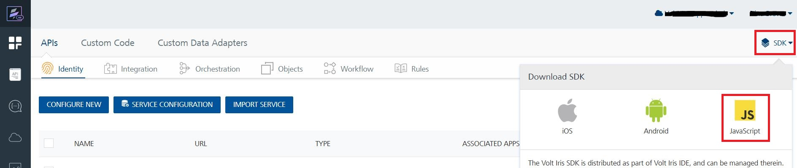
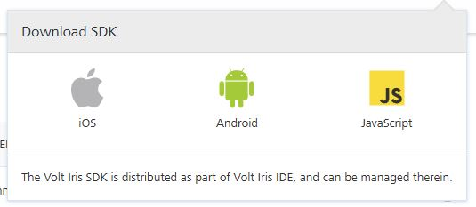

User Guide: [SDKs](../Foundry_SDKs.md) > [JavaScript SDK](Installing_JS_SDK.md) > Downloading Volt MX Plain JS SDK

# Downloading Volt MX Plain JS SDK Files

To download Plain JS SDK, follow these steps:

1.  In the Volt MX Foundry console, navigate to **Apps** > **SDKs**, and click **JavaScript**. The system prompts you to save the zip file in your local system.

    

    

2.  Save the `voltmx-plainJS-sdk.zip` file in your local system.
3.  Extract `voltmx-plainJS-sdk.zip` file that you just downloaded.  
    The `voltmx-plainJS-sdk` folder contains the following files:
    - voltmx-sdk.js
    - voltmx-sdk.doc
    - config.js
    - LICENSE.txt
    - version.txt

>**Important :** In your app, the JS files must be loaded in the following sequence: config.js → voltmx-sdk.js.

The `config.`js file contains the following keys. Make sure that you replace the placeholders with values that are related to your app.

* appId: Specifies the project name of your client JS app. For example: <b>NewsAndWeather</b>
* appName: Specifies the name of your client app. For example: <b>News and Weather app</b>
* appVersion: Specifies the version number of the client app. For example: <b>1.0.0</b>