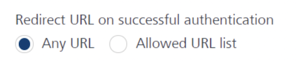

 

Invoking an Identity Service
============================

You can use the following methods for an identity service.

*   [Login with provider type as Basic](#login-with-provider-type-as-basic)
*   [Login with provider type as OAuth/SAML](#login-with-provider-type-as-oauth_saml)
*   [Login with provider type as OAuth 2.0 with Deep link URL](#login-with-provider-type-as-oauth-2_0-with-deep-link-url)
*   [Login with provider type as OAuth 2.0 in the same browser window](#singlewindowlogin)
*   [Get Backend Token](#get-backend-token)
*   [User Profile](#userprofile)
*   [Get Provider Name](#providername)
*   [Get Provider Type](#providertype)
*   [Logout](#logout)

Login with provider type as Basic
---------------------------------

```
 // Sample code to authenticate to  Foundry Client

var authClient = null;
var providerName = < your - provider - name > ;
var username = < uername - for -your - provider > ;
var password = < password - for -your - provider > ;
try {
    authClient = client.getIdentityService(providerName);
} catch (exception) {
    console.log("Exception" + exception.message);
}
authClient.login({
    "userid": username,
    "password": password
}, function(response) {
    console.log("Login success" + JSON.stringify(response));
}, function(error) {
    console.log("Login failure" + JSON.stringify(error));
});
```

The client is the voltmx.sdk(); object.

When you select Volt MX User Repository as the identity type, the system does not allow you to provide an identity name.  
  
To use Volt MX User Repository as authentication service, ensure that the value for `providerName` is set as `userstore`. If you set it with any other value (for example, User Repository, User Store or Cloud Repository), the system throws an error.

Login with provider type as OAuth/SAML
--------------------------------------

For Foundry version V9 ServicePack 3 (or later), the JS SDK supports [rfc7636](https://www.rfc-editor.org/rfc/rfc7636) for OAuth providers that use PKCE in the Authorization Code grant flow. For more information, refer to [PKCE Support in Foundry](../Identity10_VoltMX_OAuth2.md#PKCE).

```
 // Sample code to authenticate to  Foundry Client
var authClient = null;
var providerName = < your - provider - name > ;
try {
    authClient = client.getIdentityService(providerName);
} catch (exception) {
    console.log("Exception" + exception.message);
}
authClient.login({},
    function(response) {
        console.log("Login success" + JSON.stringify(response));
    }, function(error) {
        console.log("Login failure" + JSON.stringify(error));
    }
);
```

The client is the voltmx.sdk(); object.

Login with provider type as OAuth 2.0 with Deep link URL
--------------------------------------------------------

```
// Sample code to authenticate to  Foundry Client

var authClient = null;
var providerName = <your-provider-name>;
var username = <username-for-your-provider>;
var password = <password-for-your-provider>;
var options = {};
options["noPopup"] = true; // This parameter in options will open the login url in the same window. It will not open any pop up.
options["success_url"] = http: //mynativeapplication; // This is a deeplink url, where the control will be redirected after login.

try {
    //The client is the voltmx.sdk();
    authClient = client.getIdentityService(providerName);
} catch (exception) {
    console.log("Exception" + exception.message);
}
authClient.login(options,
    function(response) {
        console.log("Login success" + JSON.stringify(response));
    }, function(error) {
        console.log("Login failure" + JSON.stringify(error));
    }
);
```

The sample above shows various parameters similar to the parameters of the [Login with provider type as OAuth/SAML](#Loginoauth). The following two optional parameters are added further.

*   **noPopup**: This parameter opens the login URL in the same window. It will not open any pop up.
*   **success_url**: After the log in is successful, control is redirected to the URL (deep link URL).

Deep link URL is the URL that is registered to the application. After redirection, the client calls the method **handleDeeplinkCallback**. (A global function)

**Method signature**: `function handleDeeplinkCallback(params, successcallback, failurecallback)`

```
 // windown.onload gets called upon page reload, client can choose which method should be called after the deeplink redirection. In this sample onload gets called after redirection.

window.onload = function() {
    // Getting the current url to retrieve the query params.
    var url = window.location.href;
    var hashes = url.split("?")[1];
    var queryParams = {};

    if (hashes) {
        var hash = hashes.split('&');

        for (var i = 0; i < hash.length; i++) {
            var params = hash[i].split("=");
            queryParams[params[0]] = params[1];
        }

        handleDeeplinkCallback(queryParams, function success(resp) {
            alert("Client login success");
        }, function failure(resp) {
            alert("Client login failure");
        });
    }
};
```

For more information on deep links, click [here](http://opensource.voltmxtechsw.com/volt-mx-docs/voltmxlibrary/iris/iris_user_guide/Default.html).

Login with provider type as OAuth 2.0 in the same browser window
----------------------------------------------------------------

*   For Foundry version V9 ServicePack 3 ](or later), the JS SDK supports [rfc7636](https://www.rfc-editor.org/rfc/rfc7636) for OAuth providers that use PKCE in the Authorization Code grant flow. For more information, refer to [PKCE Support in Foundry](../Identity10_VoltMX_OAuth2.md#PKCE).
    
*   Login in the same browser window is supported for Foundry versions V9 ServicePack 3 or later.
    

In the earlier section (Login with provider type as OAuth/SAML), the login page of an OAuth Identity provider opens in a new window (or a new tab) on the browser. However, login in the same browser window can be enabled by using the `noPopup` option in the `loginOptions`.

The Foundry SDK object and the client app state are reinitialized when the browser redirects to the web app from the OAuth Login page in the same window. To avoid losing the app state and data, make sure that you store the client app data (if any) in a secure storage before invoking the Login API.

You can store the data before invoking the Login API, or by using the `customDataSaveHandle` option in the `loginOptions`. For more information, refer to the following code example.

In the following code snippet:

*   Passing the `success_url` parameter is optional. If the value is empty, `success_url` is set to the domain and path of the current window.
*   The `customDataSaveHandle` function is invoked before redirecting to the login page in the same window. By using the function, you can store necessary data to a local storage, and then make any required network calls.  
    After the specified tasks are completed, invoke the `continueLogin` function to continue the login process. If any errors occur, invoke the `abortLogin` function to abort the login process.

```
// Sample code to enable login in the same browser window

var sdkObject = voltmx.sdk.getDefaultInstance();
var identityServiceObject = sdkObject.getIdentityService("<providerName>");
var options = {};
options["loginOptions"] = {}; 

options["loginOptions"]["noPopup"] = true; 

options["loginOptions"]["customQueryParamsForOAuth"] = {"success_url": "<app-url>"};
/\* For example -> "https://example.com/apps/appName/" \*/

options["loginOptions "]["customDataSaveHandle"] = function(continueLogin, abortLogin)
{
var data = getData();
storeDataInLocalStorage(data);
setLoginStateInServer(data, networkResponse);

function networkResponse(response)
{
	if(response.isSuccess)
	{
	continueLogin();
	}
	else
	{
	abortLogin();
	}
}
}

function successCallback(res)
{
   alert("Login Successful");
};

function failureCallback(err)
{
   alert("Login failed due to: " + JSON.stringify(err));
}

identityServiceObject.login(options, successCallback, failureCallback);
```

Use the JavaScript `onload` event (or a similar event based on your web app) to complete the login process. Provide the appropriate success and failure callbacks to the `voltmx.sdk.performNoPopUpLogin` API. The callbacks can be the same callbacks that are provided in the login API. For more information, refer to the following code example.

```
window.onload=function ()
{
function loginSuccessCallback(response)
{
	alert("Login successful.");
	//retrieve data stored in localstore. 
}

function loginFailureCallback(response)
{
	alert("Login failed due to : " + JSON.stringify(response));
}

voltmx.sdk.performNoPopUpLogin(loginSuccessCallback, loginFailureCallback);
}
```

*   In the login options, you can pass the Success URL parameter (which is the web app URL) as part of the "customQueryParamsForOAuth" key.
*   In the Identity console, under **Advanced** → **Redirect URL on successful authentication**
    *   If you have selected **Allowed URL list**, make sure that the specified Success URL is whitelisted.
    *   If you have selected **Any URL**, you do not need to whitelist any URLs.  
        

#### Error Codes and Error Messages

<table style="mc-table-style: url('../../../../Release_Docs/DocTemplate/Content/Resources/TableStyles/Basic.css');" class="TableStyle-Basic" cellspacing="0" madcap:conditions="Default.V9SP4GA"><colgroup><col class="TableStyle-Basic-Column-Column1" style="width: 15%;"> <col class="TableStyle-Basic-Column-Column1" style="width: 45%;"></colgroup><tbody><tr class="TableStyle-Basic-Body-Body1"><td class="TableStyle-Basic-BodyE-Column1-Body1" style="text-align: center;font-size: 12pt;">Error Code</td><td class="TableStyle-Basic-BodyD-Column1-Body1" style="text-align: center;font-size: 12pt;">Error Message</td></tr><tr class="TableStyle-Basic-Body-Body1"><td class="TableStyle-Basic-BodyE-Column1-Body1" style="text-align: center;">109</td><td class="TableStyle-Basic-BodyD-Column1-Body1" style="text-align: center;">Unable to store app verifier at middleware server.</td></tr><tr class="TableStyle-Basic-Body-Body1"><td class="TableStyle-Basic-BodyE-Column1-Body1" style="text-align: center;">110</td><td class="TableStyle-Basic-BodyD-Column1-Body1" style="text-align: center;">Unable to retrieve app verifier from middleware server.</td></tr><tr class="TableStyle-Basic-Body-Body1"><td class="TableStyle-Basic-BodyE-Column1-Body1" style="text-align: center;">111</td><td class="TableStyle-Basic-BodyD-Column1-Body1" style="text-align: center;">CustomDataSaveHandle should be function and should accept successCallback and failureCallback.</td></tr><tr class="TableStyle-Basic-Body-Body1"><td class="TableStyle-Basic-BodyE-Column1-Body1" style="text-align: center;">112</td><td class="TableStyle-Basic-BodyD-Column1-Body1" style="text-align: center;">CustomDataSaveHandle failed by user.</td></tr><tr class="TableStyle-Basic-Body-Body1"><td class="TableStyle-Basic-BodyE-Column1-Body1" style="text-align: center;">113</td><td class="TableStyle-Basic-BodyD-Column1-Body1" style="text-align: center;">The application was launched with code query param but is not a continued login process.</td></tr><tr class="TableStyle-Basic-Body-Body1"><td class="TableStyle-Basic-BodyE-Column1-Body1" style="text-align: center;">114</td><td class="TableStyle-Basic-BodyD-Column1-Body1" style="text-align: center;">Login Failed. PKCE parameters are missing, please check if CORS setting is properly configured in Foundry Identity.</td></tr><tr class="TableStyle-Basic-Body-Body1"><td class="TableStyle-Basic-BodyE-Column1-Body1" style="text-align: center;">116</td><td class="TableStyle-Basic-BodyD-Column1-Body1" style="text-align: center;">Appconfig is null or undefined.</td></tr><tr class="TableStyle-Basic-Body-Body1"><td class="TableStyle-Basic-BodyE-Column1-Body1" style="text-align: center;">117</td><td class="TableStyle-Basic-BodyD-Column1-Body1" style="text-align: center;">No metadata was found to continue with single window login.</td></tr><tr class="TableStyle-Basic-Body-Body1"><td class="TableStyle-Basic-BodyB-Column1-Body1" style="text-align: center;">118</td><td class="TableStyle-Basic-BodyA-Column1-Body1" style="text-align: center;">No Auth Code found in the Url.</td></tr></tbody></table>

Get Backend Token
-----------------

```
// Sample code to get backend token for provider
var userid = < username\_for\_logged\_in\_provider > ;
var password = < password\_for\_logged\_in\_provider > ;
var forceFromServer = true / false;
authClient.getBackendToken(forceFromServer, {
    "userid": userid,
    "password": password  
}, function(response) {
    console.log("Backend token is  :" + JSON.stringify(response));  
}, function(error) {    
    console.log("Failed to get backend token : " + JSON.stringify(error));
});
```

If forceFromServer is true, then the SDK fetches the token from the server. If forceFromServer is false, then the SDK gives you the token present in localStorage. Please note that only few backend providers such as Salesforce support refresh. If a backend provider does not support refresh, passing `forceRefreshFromServer=true` would result in empty response from this API.

The authClient is the IdentityService object.

User Profile
------------

```
 // Sample code to get user profile details
var forceFromServer = true / false;
authClient.getProfile(forceFromServer,
    function(response) {
        console.log("User profile is  :" + JSON.stringify(response));
    }, function(error) {
        console.log("Failed to fetch profile : " + JSON.stringify(error));
    }
);
```

If forceFromServer is true, then the SDK fetches the token from the server. If forceFromServer is false, then the SDK gives you the token present in localStorage.

The authClient is the IdentityService object.

Get Provider Name
-----------------

```
 // Sample code to get provider name
Var providerName = authClient.getProviderName();
```

The authClient is the IdentityService object.

Get Provider Type
-----------------

```
 // Sample code to get provider type
Var providerType = authClient.getProviderType();
```

The authClient is the IdentityService object.

Logout
------

```
//Sample code to logout from auth service

var serviceName = "identity\_service\_name";

//Get an instance of the SDK
var client = voltmx.sdk.getCurrentInstance();
var identitySvc = client.getIdentityService(serviceName);
var options = {};

//Configure logout options
options["logoutOptions"]["customOAuthParams"] =
{
	"key2":"value2",
	"key3":"value3"
};

//Invoke the logout API
identitySvc.logout(function(response)
{
	voltmx.print("Logout success: " + JSON.stringify(response));
}, function(error)
{
	voltmx.print("Logout failure: " + JSON.stringify(error));
}, options);
```

The authClient is the IdentityService object for the loggedIn provider.