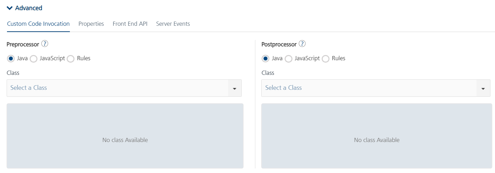
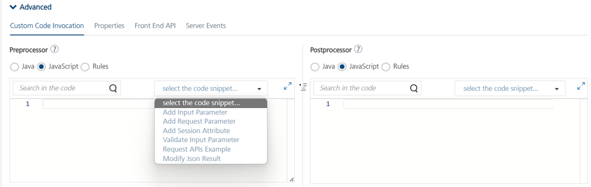
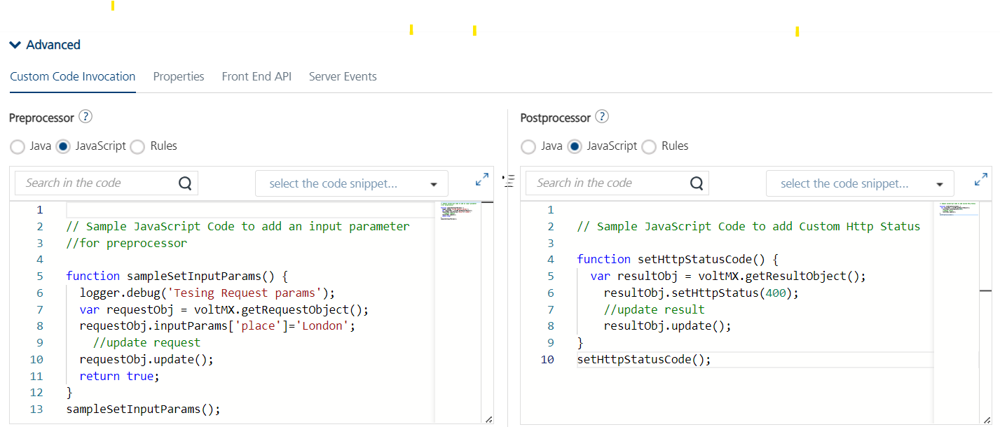

                             

User Guide: [Integration](Services.md#integration) \> [Advanced Configurations](Advanced_Configurations.md) > [Java Sample Code for Preprocessor and Postprocessor](Java_Pre-Post_Samples.md) > JavaScript Sample Code for Preprocessor and Postprocessor

Developers can also customize the sample prepost processor code displayed on Foundry javascript pre/post processor code editor.  
Navigate to service console : 





Opt javascript pre/post processor :



 
 
Sample code :



 

JavaScript Sample Code for Preprocessor and Postprocessor
=========================================================

PreProcessor
------------

*   **To add an input parameter:**
```
 // Sample JavaScript Code to add an input parameter for preprocessor  
      
    function sampleSetInputParams() {
        logger.debug('Tesing Request params');
        var requestObj = voltMX.getRequestObject();
        requestObj.inputParams['place']='London';
	    //update request
        requestObj.update();
        return true;
    }
    sampleSetInputParams();
```

*   **To add a new request parameter:**
```
 // Sample JavaScript Code to add a request parameter for preprocessor   
      
    function sampleSetRequestParams() {
        logger.debug('Testing addRequestParam_ method of DataControllerRequest');
        var requestObj = voltMX.getRequestObject();
        requestObj.reqParams['eventId']='QueMessage';
	    //update request
        requestObj.update();
        return true;
    }
    sampleSetRequestParams();
```
*   **To add an attribute to the session:**
```
 // Sample JavaScript Code to add an attribute to the session for preprocessor   
      
    function sampleSetSessionAttribute() {
        var requestObj = voltMX.getRequestObject();
	    var session = requestObj.getSession();

	    session.attributes['AppUserPreferredName'] =  'Cosmo';
	    //update request
	    requestObj.update();
	    return true;
    }
    sampleSetSessionAttribute();
```
*   **To validate the input parameter before Service call:**
```
 // Sample JavaScript Code to validate the input before service call for preprocessor   
      
    function sampleValidateInputParams() {
        var requestObj = voltMX.getRequestObject();
	    var userName = '';
        if (requestObj.inputParams.containsKey('username'))
        userName = requestObj.inputParams['username'];
	    var password = '';
        if (requestObj.inputParams.containsKey('password'))
        password = requestObj.inputParams['password'];

	    if( userName == 'masterUser' && password == 'password'){
		    return true;
	    }
	    return false;
    }
    sampleValidateInputParams();
```
*   **A function which uses most of the request APIs:**
```
 // Sample JavaScript Code for preprocessor   
      
    function fun5() {
        logger.debug('Testing addRequestParam_ method of DataControllerRequest');
        request.addRequestParam_('newParam', 'newParamValue');
          
        var varParam = request.getParameter('newParam');
        logger.debug('The Param Value is :' + varParam);
        logger.debug('Tesing containsKeyInRequest method of DataControllerRequest');
          
        var varContainsKey = request.containsKeyInRequest('newParam');
        logger.debug('Does it contain newParam :' + varContainsKey);
        logger.debug('Tesing containsKeyInRequest method of DataControllerRequest');
        request.setAttribute('newAtt', 'newAttValue');
          
        var varContainsAttribute = request.containsKeyInRequestContext('newAt');
        logger.debug('Does it contain newAtt :' + varContainsAttribute);
        logger.debug('Tesing getAttribute method of DataControllerRequest');
          
        var varGetAttribute = request.getAttribute('newAtt');
        logger.debug('The value of attribute newAtt is :' + varGetAttribute);
        logger.debug('Tesing getHeader method of DataControllerRequest');
          
        var varHeader = request.getHeader('Host');
        logger.debug('The value of Host header is :' + varHeader);
        logger.debug('Tesing GetParameterValues method of DataControllerRequest');
          
        var varGetParameterValues = request.getParameterValues('newParam');
        for (var i in varGetParameterValues) {
            logger.debug('The Array Values are :' + varGetParameterValues[i]);
        }
        logger.debug('Tesing getRemoteAddr method of DataControllerRequest');
          
        var varGetRemoteAddr = request.getRemoteAddr();
        logger.debug('The Remote Address is :' + varGetRemoteAddr);
        logger.debug('Tesing put method of HashMap');
        serviceInputParams.put('place', 'London');
        serviceInputParams.put('city', 'Madras');
        serviceInputParams.put('country', 'india');
        logger.debug('Tesing getSession method of DataControllerRequest');
          
        var varSession = request.getSession();
        varSession.setAttribute('sessionAttributeName', 'sessionAttributeValue');
    }
    fun5();
```
*   **For jsonToResult API**
```
// Sample JavaScript Code For jsonToResult API

    function sampleModifyResultJson() {
        var resultObj = voltMX.getResultObject();
        var resultJson = resultObj.toJson();
        resultJson.record = {
          "message" : "Returned from Pre-processor",
          "status" : "rejected"
        };
         
        resultObj.appendJson(resultJson);
	    //update result
        resultObj.update();
        return false;
    }
    sampleModifyResultJson();
    
```

PostProcessor
-------------

*   **To add parameter to result:**
```
 // Sample JavaScript Code to add parameter to result for postprocessor   
      
    function AddParamToResult() {
        logger.debug('Tesing Result params');
        var resultObj = voltMX.getResultObject();
        resultObj.params['Location']='RTP';
	    //update result
        resultObj.update();
    }
    AddParamToResult();
```

*   **To add a new output parameter:**
```
 // Sample JavaScript Code to add a new output parameter for postprocessor   
      
    function fun5() {
        logger.debug('Tesing Adding a new Output Parameter');
        var newOutputParam = new com.hcl.voltmx.middleware.dataobject.Param();
        newOutputParam.setName('outputParamName');
        newOutputParam.setValue('outputParamValue');
        result.setParam(newOutputParam);
    }
    fun5();
```

*   **To get Session attribute for postprocessor:**
```
 // Sample JavaScript Code to get Session attribute for postprocessor   
      
    function sampleGetSessionAttribute() {
        var requestObj = voltMX.getRequestObject();
	    var session = requestObj.getSession();
	    var attrValue = session.attributes['AttributeName'];
    }
    sampleGetSessionAttribute();
```

*   **To add a custom device header:**
```
 // Sample JavaScript Code to add a custom device header for postprocessor   
      
    function AddDeviceHeaderToResponse() {
        var responseObj = voltMX.getResponseObject();
	    responseObj.deviceHeaders['GEO']='NA';
	    //update response
	    responseObj.update();
    }
    AddDeviceHeaderToResponse();
```

*   **To add Datasets to result:**
```
 // Sample JavaScript Code to add a dataset to result for postprocessor   
      
    function sampleAddResultDataset() {
        var resultObj = voltMX.getResultObject();
        resultObj.addNewDataset('id1');
	    resultObj.datasets['id1'].addNewRecord('r00');
	    resultObj.datasets['id1'].records['r00'].params['color']='red';
        resultObj.datasets['id1'].records['r00'].params['value']='#f00';
	    resultObj.addNewDataset('id2');
	    resultObj.datasets['id2'].addNewRecord('r10');
	    resultObj.datasets['id2'].records['r10'].params['color']='green';
        resultObj.datasets['id2'].records['r10'].params['value']='#0f0';
	    //update result
	    resultObj.update();
    }
    sampleAddResultDataset();
```

*   **A function which uses most of the response APIs:**
```
 // Sample JavaScript Code for postprocessor   
      
    function fun8() {
        var newOutputParam = new com.hcl.voltmx.middleware.dataobject.Param();
        newOutputParam.setName('outputParamName');
        newOutputParam.setValue('outputParamValue');
        result.setParam(newOutputParam);
        logger.debug('Tesing getAttribute method of DataControllerResponse');
        response.setAttribute('responseAttribute', 'responseAttributeValue');
          
        var varResponseAttribute = response.getAttribute('responseAttribute');
        logger.debug('The value of Response Attribute is :' + varResponseAttribute);
        logger.debug('Tesing getCharsetEncoding method of DataControllerResponse');
          
        var varCharsetEncoding = response.getCharsetEncoding();
        logger.debug('The value of getCharsetEncoding is :' + varCharsetEncoding);
        logger.debug('Tesing setDeviceHeaders method of DataControllerResponse');
          
        var varHashMap = new java.util.HashMap();
          
        varHashMap.put('newHeader', 'newHeaderValue');
        response.setDeviceHeaders(varHashMap);
        logger.debug('Tesing setStatusCode method of DataControllerResponse');
          
        varStatusCode = response.getStatusCode();
        logger.debug('The Current Status Code is :' + varStatusCode);
        response.setStatusCode(302);
          
        varStatusCode1 = response.getStatusCode();
        logger.debug('The Current Status Code is :' + varStatusCode1);
          
        var varSessionPost = request.getSession();
        var varRequestSessionAttribute = varSessionPost.getAttribute('sessionAttributeName');
        logger.debug('The Session Attribute Value is :' + varRequestSessionAttribute);
    }
    fun8();
```
    
*   **To set custom httpStatusCode params through JavaScript postprocessor in result:**
```
// Sample JavaScript Code to add Custom Http Status

    function setHttpStatusCode() {
        var resultObj = voltMX.getResultObject();
	    resultObj.setHttpStatus(400);
	    //update result
	    resultObj.update();
    }
    setHttpStatusCode();    
```
    
*   **To set custom opstatus params through JavaScript postprocessor in result:**
```
// Sample JavaScript Code to add Custom Op Status

    function setOpStatusCode() {
        var resultObj = voltMX.getResultObject();
	    resultObj.setOpStatus(300);
	    //update result
	    resultObj.update();
    }
    setOpStatusCode();
```
    

*   **For resultToJSON API**
```
// Sample JavaScript Code for resultToJSON API

    function getCertificate_Postprocessor(){
        var resultObj = voltMX.getResultObject();
		var jsonObject = resultObj.toJson();
    
        if(resultObj.records && resultObj.records.length > 0){
            var cert = jsonObject.records[0];
    
            jsonObject.certificate = [{                           
                "online_course": true,
                "doctor": {
                    "id": cert.doctor.doctor_id,
                    "email": cert.doctor.doctor_email,
                },
                "entity": {
                    "id": cert.entity.entity_id,
                    "email": cert.entity.entity_email,
                    "doc_num": cert.entity.entity_doc_num,
                }
            }];
             
            return jsonObject;
        }
    }

    getCertificate_Postprocessor();
    
```
