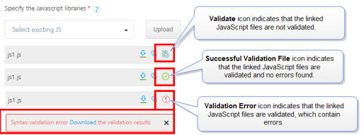
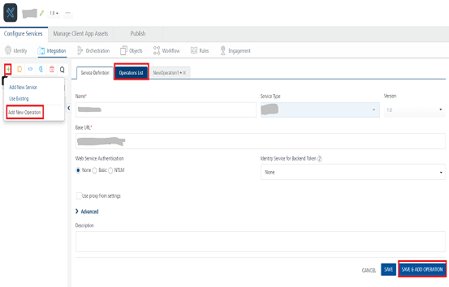

JavaScript Adapter
------------------

With the JavaScript Adapter, you can integrate plain JavaScript services to applications in Volt MX Foundry.

You can upload custom JavaScript files to Volt MX Foundry. Using JavaScript adapters, you can easily create server-side code and make it available as operations. The JavaScript file must contain functions that a user wants to be made available as operations, along with other supporting functions. You can also add preprocessor and postprocessor to the operations defined. For more details on the structure for JavaScript function definitions, refer to the [Limitations](#limitations-for-javascript-engine-javascript-adapter) section.

For more details about the sample JavaScript code, refer to [JavaScript Sample Code for Preprocessor and Postprocessor](JS_Pre-Post_Samples.md).

Based on the JDK version supported by Volt MX Foundry Installer, the JavaScript adapter uses the following JavaScript engines:

*   If the Java version is 1.7 or 1.8, then the adapter uses Nashorn JavaScript engine
*   If the Java version is below 1.7 , then the adapter uses Rhino JavaScript engine

### Configure JavaScript Endpoint Adapter

To configure JavaScript service in the **[Integration Service Definition](ConfigureIntegrationService.md#IntSD)** tab, follow these steps:

1.  In the **Name** field, provide a unique name for your service.
2.  From the **Service Type** list, select **JavaScript**.  
    
3.  Provide the following details in the JavaScript service definition:  
    

  
      | Field | Description |
| --- | --- |
| Specify JavaScript libraries | From the **Specify the Javascript libraries** section, select a .JS file, or click **Upload** to select the .JS file from your local machine. The console adds your JS file to the console. The system displays the added JS file's name under the **Specify the Javascript libraries** section.<br><br>The system allows you to upload more than one JS file at **Specify the Javascript libraries**.<br><br>Once uploaded, JavaScript files are available across Volt MX Foundry console. They cannot be deleted, only unlinked. You can unlink uploaded .JS files by clicking the **Unlink** icon.<br><br>**JavaScript file Validation for the JavaScript service:**<br><br> You can validate the associated JavaScript files for the JavaScript service before saving the integration service. To validate the JavaScript file, click the Validate icon available for that file.<br><br>While uploading a JavaScript file, and if the JavaScript file **has no errors**, the **Validation** icon turns into the **Successful Validation File** icon for that file. And the JavaScript file is uploaded to the Workspace.<br> **_Note:_** When you link the validated JavaScript file to another JavaScript service, the **Successful Validation File** icon is displayed for that file in the new JavaScript Service.<br><br>While uploading a JavaScript file, and if the JavaScript file **has errors**, the Console validates the file and displays the **Error** message dialog with a **Download** link to the validation results. When you click **Download**, a .txt file with the validation results will be downloaded to your local system. In this case you must upload a valid JavaScript file and ensure that the upload is successful.<br><br> **_Important:_** While uploading the JavaScript file, and if found errors, the Console does not allow you to upload the file to the Workspace.<br><br>For the existing linked JavaScript files, the validation statuses icons are treated as follows:<br><br>**Validate** icon indicates that the linked JavaScript files are not validated<br><br>**Successful Validation File** icon indicates that the linked JavaScript files are validated, and no errors found.<br><br>**Validation Error** icon indicates that the linked JavaScript files are validated, which contain errors.<br><br>For example:<br><br>For the linked JavaScript files, the following icons If you click **Validate** for the **linked** JavaScript file, and if the JavaScript file **has no errors**, the **Validation** icon turns into the **Successful Validation File** icon for that file.<br><br> If you click **Validate** for the **linked** JavaScript file, and if the JavaScript file **has errors**, the **Error** message dialog is displayed with a **Download** link to the validation results. When you click **Download**, a .txt file with the validation results will be downloaded to your local system. In this case you must provide a valid JavaScript file, validate the updated file, and only then you can save the service.<br><br> **_Important:_** If you have validated the existing JavaScript file and found errors, the Workspace does not allow you to save the service.<br><br>If you have **not validated** the existing linked JavaScript file, the **Validate** icon for that file is displayed. If you do not want to validate the JavaScript file, and want to save the service, do not click **Validate**. |

  
4. **For additional configuration of your service definition, provide the following details in the Advanced section:** 
    
      | Field | Description |
| --- | --- |
| Throttling | API throttling enables you to limit the number of request calls within a minute. If an API exceeds the throttling limit, it will not return the service response. <br><br>**To specify throttling in Volt MX Foundry Console, follow these steps:<br><br>** In the **Total Rate Limit** text box, enter a required value. With this value, you can limit the number of requests configured in your Volt MX Foundry console in terms of Total Rate Limit. <br><br>In the **Rate Limit Per IP** text box, enter a required value. With this value, you can limit the number of IP address requests configured in your Volt MX Foundry console in terms of Per IP Rate Limit. <br><br>**To override throttling in App Services Console, refer to** [Override API Throttling Configuration](API_Throttling_Override.md#override-api-throttling-configuration). <br><br>**_Note:_** In case of On-premises, the number of nodes in a clustered environment is set by configuring the `VOLTMX_SERVER_NUMBER_OF_NODES` property in the Admin Console. This property indicates the number of nodes configured in the cluster.<br> The default value is 1. Refer to [The Runtime Configuration tab on the Settings screen of App Services](../../../Foundry/vmf_integrationservice_admin_console_userguide/Content/Runtime_Configuration.md).<br><br> The total limit set in the Volt MX Foundry Console will be divided by the number of configured nodes. For example, a throttling limit of 600 requests/minute with three nodes will be calculated to be 200 requests/minute per node. This is applicable for Cloud and On-premises. |

      > **_Note:_** All the fields in the Advanced tab are optional.

5.  In the **Description** field, provide a suitable description for the service.
    
6.  Click **Save** to save your service definition.

### Create Operations for JavaScript

The **Operation List** tab appears when you click **Add Operation** in the **Service Definition** page.

> **_Note:_** Click **Operations List** tab > **Configure Operation**. The **Configured Operations** list appears.

1.  Click **SAVE & ADD OPERATION** in your service definition page to save your service definition and display the **NewOperation** tab for adding operations.  
    OR  
    Click **Add Operation** to add a new operation or from the tree in the left pane, click **Add > Add New Operation**.
    
    
    <details close markdown="block"><summary>Click to View image</summary>
    
    
      
    > **_Note:_** To use an existing integration service, refer to [How to Use an Existing Integration Service](Manage_Existing_Integration_Services_1.md#how-to-use-an-existing-integration-service).
    </details>

1.  Under **Operations List** tab, in the **JS Library** drop-down list, select the required .JS file. For example, Sample.js. This will populate the Function drop-down list.
2.  From the **Function** drop-down list, select the required functions. Each function equates to an operation.
3.  Click **ADD OPERATION** to create operations with the selected functions.  
        The new operations are created and listed under the **Configured Operations**.
        Operation names are auto-generated in the format : <Name-of-the-JS-file>\_<function-name>. For example, `sample_addTwoNumbers`
        
2.  To edit an operation, either click on the operation name or click **Edit** from the **Settings**.
3.  In the **Operation Modal** tab, provide the following details to configure an operation:  
    
    **Select one of the following security operations in the Operation Security Level field.**  

      | Field | Description |
      | --- | --- |
      | Name | It is prepopulated with the operation name. You can change the name if required. |
      | Operation Security Level | It specifies how a client must authenticate to invoke this operation.<br><br>**Authenticated App User** – It restricts the access to clients who have successfully authenticated using an Identity Service associated with the app.<br><br>**Anonymous App User** – It allows the access from trusted clients that have the required App Key and App Secret. Authentication through an Identity Service is not required.<br><br>**Public** – It allows any client to invoke this operation without any authentication. This setting does not provide any security to invoke this operation and you should avoid this authentication type if possible.<br><br>**Private** - It blocks the access to this operation from any external client. It allows invocation either from an Orchestration/Object Service, or from the custom code in the same run-time environment. |
      | Description | Provide a suitable description of your operation. |

4. **For additional configurations of request (or) response operations, provide the following details in the Advanced section:**

      | Field | Description |
      | --- | --- |
      | Custom Code Invocation | You can add pre and post processing logic to services to modify the request inputs. When you test, the services details of various stages in the service execution are presented to you for better debugging. All options in the Advanced section are optional. For more details, refer to [Preprocessor and Postprocessor](Java_Preprocessor_Postprocessor_.md). |
      | Properties | [Properties](Java_Preprocessor_Postprocessor_.md#timeout_cachable) allows you to configure service call time out cache response.<br><br> **Cache Response** - the duration in seconds within which the service response is fetched from the cache. <br>Select the **Cache Response** check box, and provide the details in the text box. |
      | Front End API | It allows you map your endpoint/back-end URL of an operation to a [front-end URL](FrontEndAPI.md). |
      | Server Events | Using Server Events you can configure this service to trigger or process server side events. For detailed information, refer [Server Events](ServerEvents.md). |

      > **_Note:_** All options in the Advanced section are optional.
    
### Configure Request Operation for JavaScript

Integration services accept only `form-url-encoded` inputs for all the input parameters provided in the service input parameters (request input).

You can perform the following actions in Request Input tab:

1.  Click **Add Parameter** to add an entry (if the entries for input and the output tabs does not exist).
2.  To make duplicate entries, select the check box for the entry, click **Copy** and **Paste**.
3.  To delete an entry, select the check box for an entry and click **Delete** .
4.  To configure the request input tab, provide the following details:  
    

      | Field | Description |
      | --- | --- |
      | Name | It Contains a Unique Identifier. Change the name if required. |
      | Test Value | Enter a value. A test value is used for testing the service. |
      | Default Value | Enter the value, if required. The default value will be used if the test value is empty. |
      | Value | Select one of the following options. It is set to **Request** by default. **Request** indicates that the value must be retrieved from the HTTP request received from the mobile device. **Session** indicates that the value must be retrieved from the HTTP session stored on Volt MX Foundry. **Identity**:Selecting this option allows you to send values from identity session as request inputs. Use `<Identity Provider><”Profile”/”Security”><Name of the Parameter>` notation to send identity session values.**<Identity Provider>** - Name of the identity provider from which the value must be extracted.**<Parameter>** is the key whose value must be passed along with the service request. **_Note:_** For more information on Externalizing Identity Services, refer to [Replace the Identity Service references in a Foundry app](Replacing_Identity_Services.md). |
      | Data Type | **String** - A combination of alpha-numeric and special characters. Supports all formats including UTF-8 and UTF-16 with no maximum size limit. <br><br>**Boolean** - A value that can be true or false.<br><br> **Number** - An integer or a floating number.<br><br>**Collection** - A group of data, also referred as data set. |
      | Encode | Select the check box to enable encoding of an input parameter. For example, the name New York Times would be encoded as _New_York_Times_ when the encoding is set to True. The encoding must also adhere to the HTML URL encoding standards. |
      | Description | Provide a suitable description. |

5.  To validate the operation details, click **Save and Test**. For more details, refer to [Test a Service Operation](Test_a_Service_Operation.md).
    

### Configure Response Operation for JavaScript

1.  Click the **Response Output** tab, and enter the values for required fields such as name, scope, data type, collection ID, record ID, format and format value.
    
    > **_Note:_** If you define parameters inside a record as the session, the session scope will not get reflected for the parameters.
    
    In JavaScript service, the response (output) from a back end is not parsed based on the response values. The complete response from the back end is sent to the client device.
    
    > **_Note:_** By default, the `opStatus` and `httpStatusCode` values for Java and JavaScript services are added as 0 and 200.
    
2.  To validate the operation details, click **Save and Test**. For more details, refer to [Test a Service Operation](Test_a_Service_Operation.md).
    
3.  Click **SAVE OPERATION** to save the operation. The system updates the operation definition.
    
    If you click **Cancel**, the **Operation Modal** tab closes without saving any information.
    
    > **_Note:_** To add more operations for your JavaScript service, repeat [Step 3 through Step 4.](#JSC_STEP3)
    
    > **_Note:_** You can view the service in the Data Panel feature of Volt MX Iris. By using the Data Panel, you can link back-end data services to your application UI elements seamlessly with low-code to no code. For more information on Data Panel, click [here](../../../Iris/iris_user_guide/Content/DataPanel.md#top).
    

### Limitations for JavaScript Engine - JavaScript Adapter

*   The JavaScript Engine does not support some common JavaScript libraries and global JavaScript functions such as jQuery, setTimeout, setInterval or XMLHttpRequest. However, it provides an alternate mechanism to perform the same operation. You can invoke the required functionality using Java for such cases. For example, consider the XMLHttpRequest API. Since Nashorn does not support this API, you will need to use Java to perform the required operations. You can use URLConnection java class or HttpClient API to achieve the same goal.
    
*   The JavaScript Engine only supports ECMAScript-262 Edition 5.1. It does not support any features of Edition 6 or any nonstandard features provided by other JavaScript implementations.
*   The JavaScript Engine does not include a browser plug-in API.
*   The JavaScript Engine does not include support for DOM/CSS or any related libraries (such as jQuery, Prototype, or Dojo)
*   The JavaScript Engine does not include direct debugging support.
*   The JavaScript Engine does not support event loop or a task queue.

### Limitations for Supported Function Formats - JavaScript Adapter

*   Supported formats of the JavaScript function definition as follows:
```
 function abc() { … }
```
