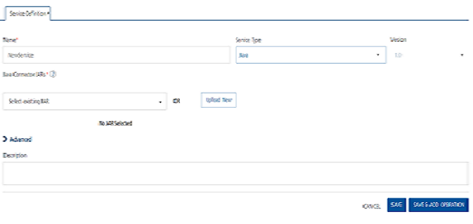

                                

User Guide: [Integration](Services.md#integration) \> [Configure the Integration Service](ConfigureIntegrationService.md) > Java Adapter

Java Adapter
------------

With Java service, you can interact with your software application that does not support restful APIs. A service that uses a custom Java adapter is a Java service. The Java adapter is a custom Java class and you can create a Java adapter either by implementing `com.hcl.voltmx.middleware.common.JavaService` interface or `com.hcl.voltmx.middleware.common.JavaService2` interface. Volt MX recommends to use JavaService2 as you can get an access to `DataControllerRequest` and `DataControllerResponse` objects.

You must load the required JAR files to define a Java service. The JAR files contain the Java classes. The Java classes contain the Java methods. These methods have the logic defined that is required for a service. Java services are mostly used with Webconnector Services.

> **_Note:_** The `middleware-system.jar` helps you to develop a Java adapter. You can download the `middleware-system.jar` from Admin Console's download page.  

> **_Note:_** You should not modify JVM timezone through custom code as modifying it can result in app server outage.

### Data Conversion of a Java Adapter


<details close markdown="block"><summary>Click here for more details</summary>

The data structure of the Volt MX Result object `(com.hcl.voltmx.middleware.datamapping.Result)` shows that all the data is converted, but the complete data in the Volt MX Result object in not exposed as expected. You get a part of the data in Volt MX Foundry because only a few unnamed records are converted into an object instead of an array.

The use of JSON Arrays is particularly important for the mapping of data in user interface segments that require arrays as data input.

The following code details sample original JSON data, data converted to Volt MX Object, and in the result - data converted only limited unnamed records into an object in Volt MX Foundry (loss of data).

<pre><code>
 //Sample: Original JSON Data:
{"booking":[
{"amount":-254.6,"description":"Paiement carte BIM STORES PALMIER  le 21/02/2016 à 18:54","doc_id":17150820,"value_date":"2016-02-19","temporary":false,"date":"2016-02-21"},{"amount":-44.26,"description":"Paiement internet LYDEC ECOM  le 19/02/2016 à 13:04","doc_id":17146660,"value_date":"2016-02-18","temporary":false,"date":"2016-02-19"},{"amount":-37.26,"description":"Paiement internet LYDEC ECOM  le 19/02/2016 à 13:19","doc_id":17146835,"value_date":"2016-02-18","temporary":false,"date":"2016-02-19"},{"amount":-14.34,"description":"Paiement internet LYDEC ECOM  le 19/02/2016 à 13:11","doc_id":17146744,"value_date":"2016-02-18","temporary":false,"date":"2016-02-19"}
]}
Sample: Data converted to VOLTMX Object:Dataset [id=booking, index=-1, 
	records=[
		Record [index=-1, order=0, id=, 
			params=[
				Param [name=amount, value=-254.6], 
				Param [name=description, value=Paiement carte BIM STORES PALMIER  le 21/02/2016 à 18:54], 
				Param [name=doc_id, value=17150820], 
				Param [name=value_date, value=2016-02-19], 
				Param [name=temporary, value=false], 
				Param [name=date, value=2016-02-21]
			], datasets=[], records=[]
			], Record [index=-1, order=0, id=, 
			params=[
				Param [name=amount, value=-44.26], 
				Param [name=description, value=Paiement internet LYDEC ECOM  le 19/02/2016 à 13:04], 
				Param [name=doc_id, value=17146660], 
				Param [name=value_date, value=2016-02-18], 
				Param [name=temporary, value=false], 
				Param [name=date, value=2016-02-19]
			], datasets=[], records=[]
			], 
//Sample: Data converted only limited unnamed records into an object in VoltMX Foundry:
"booking": {
            "": {
                "date": "2016-02-21",
                "temporary": "false",
                "amount": "-254.6",
                "description": "Paiement carte BIM STORES PALMIER  le 21/02/2016 à 18:54",
                "doc_id": "17150820",
                "value_date": "2016-02-19"
            }
		}
</code></pre>
</details>

### Writing a Java Class

**To write a Java class for a Java adapter, follow these steps:**

1.  Create a Java adapter either by implementing the `com.hcl.voltmx.middleware.common.JavaService` interface or `com.hcl.voltmx.middleware.common.JavaService2` interface.
2.  When you implement `com.hcl.voltmx.middleware.common.JavaService`, you have to implement the following `invoke()` method with the signature:
    ```
    public Object invoke(String paramString, Object[] paramArrayOfObject) throws Exception; 
    ```
3.  When you implement `com.hcl.voltmx.middleware.common.JavaService2`, you have to implement the following `invoke()` method with the signature:
```
 public Object invoke(String methodID, Object[] objectArray, DataControllerRequest request, DataControllerResponse response) throws Exception;
```

### Middleware API to get Output parameters in a Java Service

A middleware API is provided to get the output params/records/datasets configured as part of a service definition of a Java service.

The following is a sample code:

```

    ServiceOutputWrapper serviceOutputWrapper =  request.getServicesManager().getOperationData()
    .getServiceOutputWrapper();
```

> **_Note:_** Request is an instance of data controller request.

### Configure Java Endpoint Adapter

To configure Java service in the **[Integration Service Definition](ConfigureIntegrationService.md)** tab, follow these steps:



1.  In the **Name** field, provide a unique name for your service.
2.  From the **Service Type** list, select **Java**.
3.  From the **Java Connector JARs** list, select the required JAR file that contains the classes that implement the JavaService interface for this Integration Service from existing JARs in the account or click **UploadNew** to select the JARs from your local machine.  
    

    > **_Note:_** You can select multiple JAR files from the **Java Connector JARs** list if required.

    > **_Important:_** To upload an updated JAR file, upload the new file, which must have the same name as the old JAR file. The new JAR file overrides the existing file.dsd  

7. <details close markdown="block"><summary>For additional configuration of your service definition, provide the following details in the Advanced section:</summary>

    | Field | Description |
    | --- | --- |
    | Custom Code | Custom Code enables you to specify dependent JAR. To specify dependent JAR, select the JAR containing preprocessor or postprocessor libraries from the drop-down list, or click **Upload New** to browse the JAR file from your local system. This step allows you to further filter the data sent to the back end. You can select multiple JAR files if required. <br><br> **_Important:_** Make sure that you upload a custom JAR file that is built on the same JDK version used for installing Volt MX Foundry Integration.For example, if the JDK version on the machine where Volt MX Foundry Integration is installed is 1.6, you must use the same JDK version to build your custom jar files. If the JDK version is different, an unsupported class version error will appear when a service is used from a device. You can download the uploaded jars to your local system. |
    | Throttling | API throttling enables you to limit the number of request calls within a minute. If an API exceeds the throttling limit, it will not return the service response.<br><br>**To specify throttling in Volt MX Foundry Console, follow these steps:**<br><br> In the **Total Rate Limit** text box, enter a required value. With this value, you can limit the number of requests configured in your Volt MX Foundry console in terms of Total Rate Limit. <br><br>In the **Rate Limit Per IP** text box, enter a required value. With this value, you can limit the number of IP address requests configured in your Volt MX Foundry console in terms of Per IP Rate Limit.<br><br>**To override throttling in App Services Console, refer to** [Override API Throttling Configuration](API_Throttling_Override.md#override-api-throttling-configuration). |  

     > **_Note:_** All options in the Advanced section are optional.  

    </details> 

8.  In the **Description** field, provide a suitable description for the service.
    
9.  Click **Save** to save your service definition.

### Create Operations for Java

The **Operation List** tab appears when you click **Add Operation** in the **Service Definition** page.

> **_Note:_** Click **Operations List** tab > **Configure Operation**. The **Configured Operations** list appears.

**To create an operation, follow these steps:**

1.  Click **SAVE & ADD OPERATION** in your service definition page to save your service definition and display the **NewOperation** tab for adding operations.  
                        OR  
    Click **Add Operation** to add a new operation or from the tree in the left pane, click **Add > Add New Operation**.

    <details close markdown="block"><summary>Click to View image</summary>
     
    
     > **_Note:_** To use an existing integration service, refer to [How to Use an Existing Integration Service](Manage_Existing_Integration_Services_1.md#how-to-use-an-existing-integration-service). 
     </details>

2.  In the **Operation Modal** tab, follow these steps:
    
    This tab contains the request input, response output, and advanced sections. The input values are data types, scope, and format types. By default, the system will display the **Request Input** tab.  
    
    > **_Note:_** You can add an entry by clicking the **Add** button if entries for the input and the output tabs do not exist.  
      
    You can also delete an entry. Select the check box for an entry, and then click **Delete** .
    
3.  To configure an operation, provide the following details:  
    
    | Field | Description |
    | --- | --- |
    | Name | It is prepopulated with the operation name. You can change the name if required. |
    | Operation Security Level | It specifies how a client must authenticate to invoke this operation.**Select one of the following security operations in the Operation Security Level field**<br><br> **Authenticated App User** – It restricts the access to clients who have successfully authenticated using an Identity Service associated with the app.<br><br> **Anonymous App User** – It allows the access from trusted clients that have the required App Key and App Secret. Authentication through an Identity Service is not required.<br><br>**Public** – It allows any client to invoke this operation without any authentication. This setting does not provide any security to invoke this operation and you should avoid this authentication type if possible.<br><br>**Private** - It blocks the access to this operation from any external client. It allows invocation either from an Orchestration/Object Service, or from the custom code in the same run-time environment. |

6.  <details close markdown="block"><summary>For additional configurations of request (or) response operations, provide the following details in the Advanced section:</summary>
    
    | Field | Description |
    | --- | --- |
    | Custom Code Invocation - Preprocessor and Postprocessor (for Java and JavaScript) | You can add pre and post processing logic to services to modify the request inputs. When you test, the services details of various stages in the service execution are presented to you for better debugging. All options in the Advanced section are optional. For more details, refer to [Preprocessor and Postprocessor](Java_Preprocessor_Postprocessor_.md). |
    | Properties | Additional Configuration Properties allows you to configure service call time out cache response. For information on different types of configuration properties, refer [Properties](Java_Preprocessor_Postprocessor_.md#timeout_cachable). |
    | Front End API | Front-end API allows you map your endpoint (or) backend URL of an operation to a front-end URL. For detailed information, refer Custom [Front-end URL](FrontEndAPI.md). |
    | Server Events | Using Server Events you can configure this service to trigger or process server side events. For detailed information, refer [Server Events](ServerEvents.md). |

    > **_Note:_** All options in the Advanced section are optional.

</details>

### Configure Request Operation for Java

Integration services accept only `form-url-encoded` inputs for all the input parameters provided in the service input parameters (request input).

To forward the body of the client's request to backend as it is, select the **Enable pass-through input body** check box. For more details on API Proxy service, refer to [](#APIProxyCheckBox)[How to Enable Pass-through Proxy for Operations](API_Proxy_Adapter.md#how-to-enable-pass-through-proxy-for-operations).

You can perform the following actions in Request Input tab:

1.  Click **Add Parameter** to add an entry (if the entries for input and the output tabs does not exist).
2.  To make duplicate entries, select the check box for the entry, click **Copy** and **Paste**.
3.  To delete an entry, select the check box for an entry and click **Delete** .
4.  To configure the request input tab, provide the following details:  
    
    | Field | Description |
    | --- | --- |
    | Name | It Contains a Unique Identifier. Change the name if required. |
    | Test Value | Enter a value. A test value is used for testing the service. |
    | Default Value | Enter the value, if required. The default value will be used if the test value is empty. |
    | Scope | Select Request or Session. It is set to **Request** by default. **Request** indicates that the value must be retrieved from the HTTP request received from the mobile device. **Session** indicates that the value must be retrieved from the HTTP session stored on Volt MX Foundry. **Identity**: If this is selected, you can filter the request parameters based on the response from the identity provider. For more details to configure identity filters, refer to [Enhanced Identity Filters - Integration Services](Identity_Filters_Integration.md). |
    | Data Type | **Select one of the following data types**<br><br>**String** - A combination of alpha-numeric and special characters. Supports all formats including UTF-8 and UTF-16 with no maximum size limit. <br><br>**Boolean** - A value that can be true or false.<br><br>**Number** - An integer or a floating number.<br><br>**Collection** - A group of data, also referred as data set. |
    | Encode | Select the check box to enable encoding of an input parameter. For example, the name New York Times would be encoded as _New_York_Times_ when the encoding is set to True. The encoding must also adhere to the HTML URL encoding standards. |
    | Description | Provide a suitable description. |

6.  To validate the operation details, click **Save and Test**. For more details, refer to [Test a Service Operation](Test_a_Service_Operation.md).
    

### Configure Response Operation for Java

1.  Click the **Response Output** tab, and enter the values for required fields such as name, scope, data type, collection ID, record ID, format and format value.
    
    > **_Note:_** If you define parameters inside a record as the session, the session scope will not get reflected for the parameters.
    
    In Java service, the response (output) from a backend is not parsed based on the response values. The complete response from the backend is sent to the client device.
    
    > **_Note:_** By default, the `opStatus` and `httpStatusCode` values for Java and JavaScript services are added as 0 and 200.
    
2.  To validate the operation details, click **Save and Test**. For more details, refer to [Test a Service Operation](Test_a_Service_Operation.md).
    
3.  Click **SAVE OPERATION** to save the operation. The system updates the operation definition.
    
    If you click **Cancel**, the **Edit Service Parameters** window will close without saving any information.
    
    > **_Note:_** To add more operations for your Java service, repeat [Step 3 through Step 4.](#sTEP3)
    
    > **_Note:_** You can view the service in the Data Panel feature of Volt MX Iris. By using the Data Panel, you can link back-end data services to your application UI elements seamlessly with low-code to no code. For more information on Data Panel, click [here](../../../Iris/iris_user_guide/Content/DataPanel.md#top).
    

### How to Edit an Existing Java Adapter

If you want to edit an existing Java service, you can edit details such as service name, JAR files, operation modal details. While editing a Java service, you can change the Java service type. A Java service must be available in the Integration home screen. To add an existing Integration service, refer to **[Use an Existing Service](Manage_Existing_Integration_Services_1.md#how-to-use-an-existing-integration-service)**.

To edit an existing Java service, follow these steps:

1.  In the **Integration** page, click one of your Java services.
2.  Under **Operations** > **Configured** **Operations**, hover your cursor over the required service, click the **Settings** button, and then click **Edit**.
    
    The operation details are displayed in the **Edit Service Parameters** dialog.
    
3.  Make the necessary changes in the **Service Definition** section, and click **Update**.  
    For more details, refer to [How to Configure Service Definition for Java Service](js_connector.md#JC_ServiceDefinition).
4.  Under the **Operation** section, hover your cursor over the required service, click the **Settings** button, and then click **Edit** to display the **Operation Modal** tab.  
    To modify Java operations, refer to **[How to Configure and Edit Operation Modal](js_connector.md#JC_OperationModal)**.
5.  Click **Done** to update your Java service. The Integration page is displayed.
