                               

User Guide: Sync Configuration file

  

**Legacy Sync**
===============

> **_Important:_** Legacy Sync has been [deprecated from Volt MX Foundry V8 SP4](https://support.hcltechsw.com/csm?id=kb_article&sysparm_article=KB0083443). From Volt MX Iris V9 onwards, you cannot create a legacy sync based client application. However, the existing legacy sync based apps will continue to work. The new applications that need offline and sync capabilities must use the [Offline Objects](https://support.hcltechsw.com/csm?id=kb_article&sysparm_article=KB0083859) feature.

VoltMX **Legacy Sync** is a comprehensive data synchronization platform that enables developers to add synchronization capabilities to mobile applications. Fundamental to Sync Framework is the ability to support offline access for applications, services, and collaboration of data between devices and the backend systems.

To enable synchronization capability for an app, you need to define a Sync Configuration file.

Sync Configuration file
-----------------------

A Sync Configuration captures details of the data synchronization characteristics of an application. These details are captured in the file typically referred to SyncConfig.xml that adheres to the SyncConfig.xsd schema. A SyncConfig.xml represents the below structure.

The two most important elements of the schema are:

*   [Sync Scope](#sync-scope)
*   [Sync Object](#sync-object)

### Sync Scope

A Sync Scope groups the Sync Objects that share a common synchronization characteristic like Sync Strategy and synchronization characteristics.

A Sync Configuration can have multiple Sync Scopes. It is not possible to define relationships between Sync Objects that belong to belonging to different Sync Scopes.

### Sync Object

You can consider a Sync Object as a business object that has some public attributes and some methods. The public attributes correspond to the fields visible to client devices, and they are used for synchronization. The methods correspond to the CRUD operations that map to the backend services exposed to the object. The parameter values methods /operations based on both public attribute values.

**A Sync Object is meta-data:**

*   Defining the business object model of an application.
*   Defining the way data is exchanged between mobile devices and backend.

A Sync Object is data:

Sync Object data is a business object instance exchanged between client and server.

Adding a New Synchronization Scope
----------------------------------

> **_Note:_** The following section explains setting up a Sync scope for a Salesforce account. The Sync scope defines the rules for how data is managed by the sync process. All objects under this Sync scope are bound to these rules.

To add a new Synchronization scope, follow these steps:

1.  After you [create an application](Adding_Applications.md), in the **Configure Services** tab, click the **Offline sync** service tab. The ****Offline sync**** page appears.
2.  Click **CONFIGURE NEW**.
3.  Provide a name for the new Sync scope, such as _FSSync._
4.  Under **Sync Scope Definition**, provide the following details:
    
    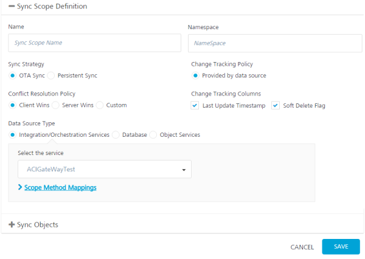
    
    1.  Specify a **Namespace** for the Sync scope. The Namespace should follow a prescribed format such as _com.voltmx_. It is not mandatory that you give a namespace for a Sync Scope.
        
    2.  Select a **Sync Strategy**. The available options are **OTA Sync** and **Persistent Sync**.
        
        A persistent sync strategy is not supported for a Sync scope that uses an object service as the data source type. You must use an OTA Sync strategy for a Sync scope that maps to an object service. Use Integration/Orchestration Services or Database as the data source type for a persistent sync strategy.
        
        > **_Note:_** To understand which strategy to use for your sync scope, refer section [Appendix - Sync Strategy](Appendix_-_Sync_Strategy.md).
        
    3.  Select a Change Tracking Policy (CTP) if you want to track the changes happening in the server database. Select Provided by data source if you have a provision to track changes in the data source. For example, a timestamp column in a database updates with any changes a row. Set CTP as Volt MX Sync Server if you want Sync Server to track the changes. The option is available only if you select Persistent Sync as the sync strategy.
        
    4.  In case of conflicts between the data at the client and server end, specify any of the following under **Conflict Resolution Policy**:
        
        *   **Client Wins**: The changes on the client-side take precedent over the changes on the server side.
            
        *   **Server Wins**: The changes on the server-side take precedent over the changes on the client side.
            
        *   **Custom**: Enables you to upload an Interceptor class, which comprises the logic or policy for conflict resolution.
            
    5.  In the **Change Tracking Columns**:
        1.  Select the **Last Updated Timestamp** when you have a column that represents the latest edited values. The column must belong to the timestamp data type.
            
        2.  Select the **Soft Delete Flag** check box when the database has the column that represents soft deletes. The soft delete field in a record represents that a particular record is deleted by changing the status to deleted. This record will exist in the database. Volt MX Foundry Sync does not sync records with the statuses set as deleted. Enterprise systems typically do not permanently delete data; an enterprise system will soft delete data by setting a Boolean field, such as isDeleted, to indicate that the record is deleted.
            
            > **_Note:_** At run-time, a default filter is added to achieve delta sync when Last Update Time Stamp is selected in the Change Tracking column. The server appends the custom filter provided by the client to the default filter with an AND operator.  
              
            In order of precedence, the custom filter must include brackets.  
            For example: If a customer provides the custom filter as `$filter =(reviewerid eq a or revieweeid eq b)`.  
              
            At run-time, the custom filter is appended to the default filter as `$filter =LastUpdateTime gt 2018-09-21` `and (reviewerid eq a or revieweeid eq b)`.
            
5.  Under **Data Source Type**, select one of the following:
    
    *   **Integration/Orchestration Services**: If you select a service that does not have an identity service, set the scope method mappings for the Sync Scope. If you select a service that has an Identity service, specify the user ID and password.
        
        To use an Integration service or Orchestration service as the data source, follow these steps:
        
        *   Click in the Select the service field. A drop-down menu appears. Select the service from the menu.
    *   **Database**: Use this option if you want the Synchronization service to connect directly with the data source without going through an Integration service. This option is typically used for a persistent sync strategy.
        
        Sync Supports different databases as backend datasource such as Mysql, Oracle, Microsoft Server, and PostgreSQL.
        
        To use a database as the data source, specify the following connection details of the backend database:
        
        *   Database Type
        *   Database Connection URL
        *   User ID
        *   Password
        
        Click **Test Connection** to verify the connection to the database.
        
    *   **Object Services**: This is a Sync scope mapped to an object service. An object service has all the information to auto-generate the Sync scope, including objects, relationships, change tracking, and life-cycle methods. You need only provide the scope-specific data, such as sync strategy and filters; the rest of the Sync scope is inferred. If the object service changes, the scope is refactored to incorporate those changes.
        
        Note that a persistent sync strategy is not supported for a Sync scope that uses an object service as the data source type.
        
        To use an object service as the data source:
        
        *   Click in the Select the service field. A drop-down menu appears. Select the object service from the menu.
        
        > **_Note:_** You can now select the storage object service as a data source type from the drop-down menu in the Select the service field. The storage object service must be created in **Object Services** tab. For more information on creating a new storage object service, refer to [How to Create a Storage Object Service](ObjectsServices/Objectservices_Stage1.md#How).
        

### Authentication for the Datasource

For a Persistent sync, Volt MX Foundry Sync synchronizes the client device with the back end in a two-phase, asynchronous process. Sync first synchronizes the client device with the Volt MX Sync Server, and then synchronizes the Volt MX Sync Server with the back-end data source for a mobile app. Because the call to the back-end is not a device call, the Volt MX Sync Server must log in to the back-end data source.

For a Persistent sync, you must provide the log-in operation details for the back-end database in the Sync Scope definition. The persistent sync service starts immediately after you publish the sync configuration to the persistent database of the Sync Server. Then, when the client device connects to the Sync Server, the data from persistent database is downloaded to the client.

### Scope Method Mapping

Use method mapping to map authentication operations for the Sync Scope. Mapping operations at the Sync Scope level are used primarily for Persistent Sync, but you can also map operations for OTA Sync.

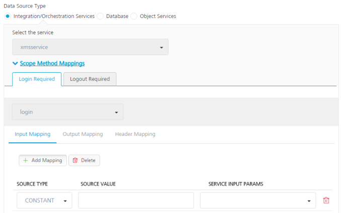

To map methods for the Sync Scope, follow these steps:

1.  In the sync scope Definition window, click **Scope Method Mapping**s. The Login Required and Logout Required tabs appear in the Scope Method Mappings area.
2.  Click in the field labeled None. A drop-down menu appears. Select an operation from the menu.
    
    The operations that are available are based on the Integration service that you specify.
    
3.  Click **Input Mapping**, **Output Mapping**, or **Header Mapping**.
    
    Input Mapping captures how the input parameters of the log-in operation are populated. Output Mapping defines the response to the log-in method. Header Mapping defines how headers are stamped when the log-in method is invoked.
    
4.  Click **Add Mapping**.
    
    The **Source Type**, **Source Value**, and **Service Input Params** fields appear. For output mapping, the service Output Params field appears. For header mapping, the service Header Params field appears.
    
5.  Click in the **Source Type** field. A drop-down menu appears. Select the type of source from the menu to map to the Service Input Parameter, Service Output Parameter, or Service Header Parameter. The following types of source are available to map to the Service Input Parameter, Service Output Parameter, or Service Header Parameter.
    
    *   **Constant**: Maps a constant value to the service parameter that you specify.
    *   **Context**: Maps context from the device call to the service parameter that you specify. Context is content that you are tracking on the device side, and you use attributes from that context as service parameters.
    *   **Template**: Maps a template to the service parameter that you specify. For example, a Velocity template that populates the service parameter.
6.  Under **Source Value**, enter the value of the source to map.
7.  Under **Service Input Params**, **Service Output Params**, or **Service Header Params**, select the parameter.

Defining Sync Objects
---------------------

1.  Click **Sync Objects**.
    
    The Sync Objects area appears.
    
2.  Click in the blank text box, and then enter a name for your Sync object.
3.  Click the **Plus** button.
    
4.  On the **Definition** tab of the new Sync object, click in the Select Operation field. A drop-down menu appears. Select an operation from the menu. Select the operation that will generate the maximum attributes for the object.
5.  Click **Generate attributes**.
    
    > **_Note:_** The list of operations available for a new Sync object depends on the Integration Service selected in the Sync Scope.
    
    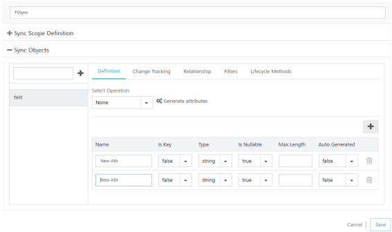
    
    Set one of the generated attributes as primary key. For the primary key attribute, select true under **IS KEY**. If the attribute you set as primary key is an automatically generated column, select **true** under **Auto Generated**.
    
6.  Under **Sync Objects**, provide the following details:
    1.  On the left pane, provide a name for your Sync object, and then click the **Plus** button.
    2.  On the **Definition** tab of the new Sync object, select an operation from the **Select Operation** list, and click **Generate attributes**. Select the operation that will generate the maximum attributes for the object.
7.  Click the **Change Tracking** tab. The Change Tracking fields appear. Do the following:
    1.  Click the **TimeStamp Attribute for Change Tracking** list, select an attribute that denotes a particular record is modified.
    2.  If required, change the **Time Format of Update Tracking**, if required. By default, Salesforce time format is yyyy-MM-dd HH:mm:ss.SSS
    3.  Click the **Attribute for Identifying a soft deleted** list, select an attribute that denotes a soft delete.
        
        > **_Note:_** You need to select **TimeStamp Attribute for Change Tracking**, only if you have selected **Last Update Timestamp** check box under the **Change Tracking Columns** respectively.
        
        > **_Note:_** You need to select **Attribute for Identifying a soft delete** only if you have selected **Soft Delete Flag** check box under the **Change Tracking Columns**.
        
        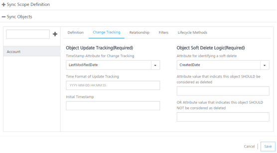
        
        For non-Boolean attributes, enter additional values that will be considered for soft deleting. For example, from the list if you select **BillingCity**, the system displays the following fields.
        
        *   **Attribute value that indicates this object SHOULD be considered as deleted**: if this value matches with the main attribute, the system considers this row as a deleted row.
        *   **OR Attribute value that indicates this object SHOULD NOT be considered as deleted**: if this value matches with the main attribute, the system does not delete this attribute.
            
            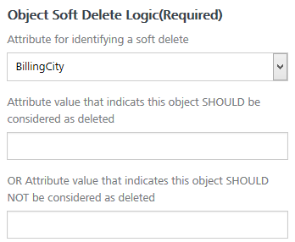
            
    4.  In **Initial Timestamp** box, enter the date from which the records are to fetched.
    5.  Click **Save**.
8.  Click the **Relationship** tab, and then click the **Plus** button to open **Relationship** dialog.
    
    The relationship that you define between two sync objects can consist of multiple columns. A foreign key that is composed of a collection of columns is called a composite foreign key.
    
    In a One to Many relationships, the target object attributes that you select constitute the foreign key in the table that is identified as the target object. The source object attributes that you select constitute the primary key in the table that is identified as the source object. The foreign key in the target object uniquely defines a row in the source object.
    
    In a Many to One relationship, the source object attributes that you select constitute the foreign key in the table that is identified as the source object. The target object attributes that you select constitute the primary key in the table that is identified as the target object. The foreign key in the source object uniquely defines a row in the target object.
    
    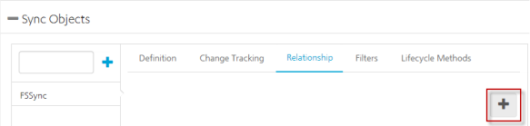
    
    1.  Provide the following details:
        
        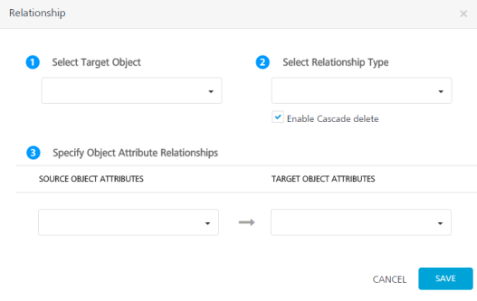
        
        1.  Select the required object from the **Select Target Object** list.
        2.  Select the required attribute from the **Target Object Attributes** list.
        3.  Select the required attribute from the **Source Object Attributes** list.
        4.  Select the type of relation between Source attribute and target attribute from the **Select Relationship Type** list.
        5.  Select **Enable Cascade delete** if you want to delete a record in the parent table and its child tables.
        
        When the relationship that you define between two sync objects uses a composite foreign key, an XML tag named "RelationshipAttribute" is added to the sync configuration file. For example:
        
```
 
        <Relationships>
           <OneToMany TargetObject="Order" Cascade="false">
              <RelationshipAttribute TargetObjectAttribute="CategoryID">
        			<SourceObjectAttribute="CategoryID"/>				
              <RelationshipAttribute TargetObjectAttribute="OrderID">
        			<SourceObjectAttribute="OrderID"/>				
           </OneToMany>
        </Relationships>
```
9.  On the **Filters** tab, provide the following details:
    
    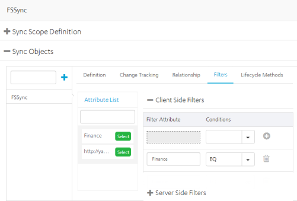
    
    > **_Note:_**   [OAuth 2.0](Identity10_VoltMX_OAuth2.md) provides ability to retrieve and save user attributes in VoltMX Foundry  Identity Sessions after a successful login response and uses them as client filters during Legacy Sync calls. For example, User Role (one of the attributes of the user profile) received as part of User Profile after a successful [OAuth 2.0](Identity10_VoltMX_OAuth2.md) login can be used as client-side filter for Legacy Sync. For more details, refer to [Synchronization > client-side filters](#filters).
    
    <p id="filters"></p>

    1.  In the **Client Side Filters**, from the **Attribute List**, select an attribute.
    2.  Select a scope for the client-side filter:
        
        a.   **Request**: Filters data for the attribute by using the condition that you specify. Client Filter values can be set from the client app when the type is Request.
            
        b.   **Constant**: Filters data for the attribute based on the constant value and the condition that you specify.
            
        c.   **Context**: Filters the attribute based on the context value and the condition that you specify. Context is content that you are tracking on the device side. You filter the attribute by the context that you specify.
            
        d.   **Identity**: Filters profile data for the attribute based on the value and the condition that you specify. When you create a user profile for an Identity service, you get some additional data as part of the profile information, which you can use to filter additional attributes. The device owner cannot modify these attributes.
            
    3.  For the selected attribute, provide a condition.
    4.  To save the current filter and add another filter, click the **Plus** button.
    5.  In the **Server Side Filters**, from the **Attribute List**, select an attribute.
    6.  Under **Conditions**, apply a condition for the selected attribute.
        
    7.  For the selected attribute, provide a condition.
    8.  To save the current filter and add another filter, click the **Plus** button.
    
    If you apply the Expression condition on client-side filters or server-side filters, it does not matter on which attribute the expression is applied. The Expression condition alerts Volt MX Foundry that the value must be evaluated before returning the data to the mobile application.
    
10.  On the **Lifecycle Methods** tab, provide the following details:
    
    > **_Note:_**  The Lifecycle Methods are available only if the data source for the Sync service is an Integration service or an Orchestration service.
    
    1.  From the **Action** list, select an action.
    2.  From the **Select Operation** list, select an operation.
    3.  Click **Generate Mappings**.
        
        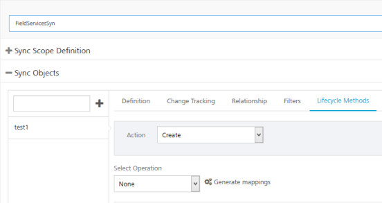
        
        To enable sync capabilities to an app, a developer must map sync actions with proper integration service operations.
        
        Synchronization of data happens from a client to a server when the Sync Object calls the `startsession()`method. For example, `sync.syncstartsession()` if sync is returned by invoking `getSyncService()`. For more details, refer to [SDKs](Foundry_SDKs.md).
        
        *   To synchronize data only from the server to the client, defining the `getUpdated` operation alone is sufficient.
        *   To enable bi-directional sync, a developer must define the `create`, `update`, `delete`, and  `getUpdated` operations. Also, define the getoperation.
        
        | Sync Purpose | Sync actions | Integration service operations |
        | --- | --- | --- |
        | To create a new account from a device (client) to a server.> **_Note:_**     As an example, for Salesforce apps, the **Account** object is used as a Sync Object for configuring the sync service. | Create | createAccount |
        | To modify data from a device (client) to a server | Update | updateAccount |
        | To delete a record from a device (client) to a server | Delete | deleteAccount |
        | To get sync data from a server to a device (client)> **_Note:_**  This is specifically used for clearing the conflict policies. | Get | getAccount |
        | For Salesforce apps, to send a query request from a device (client), add the **Sync Service Input parameter**  as  **LAST\_SYNC\_TIMESTAMP**  to getUpdated sync action.It is not mandatory to add the input parameter LAST\_SYNC\_TIMESTAMP. Sync Service creates a CONTEXT object to hold certain data about that sync session. You can use the CONTEXT attribute LAST\_SYNC\_TIMESTAMP in your input mapping query.For example, add a query to get any changed records since the last time the device did a sync. Create an input that maps to the **select** input parameter, of source type **Template**, and with a **Source Value** of:Select Id, AccountNumber, Name, Type, Rating, Phone, Fax, IsDeleted, LastModifiedDate from Account Where $CONTEXT.LAST\_SYNC\_TIMESTAMP and Id = '$FILTER.get('Account.Id')'If the sync scope type is **OTA** or **Persistent** and change tracking policy is provided by data source, **getUpdated** is called.If the sync scope type is **Persistent** and change tracking policy is **VoltMX Server**, **getAll** is called. | getUpdated | queryAllAccount |
        | To get the deleted records from the enterprise to the application if the getUpdated doesn't return the deleted records. You can add the queryAll operation and modify the name of the operation to avoid conflict, and modify the input and output to match the getDeleted functionality. | getDeleted | queryAll |
        | To download any new or changed records in batches from the backend to the local device. | getBatch | queryMoreAccount |
        | Similar to getUpdated, getAllPKs sync action is called to get the primary keys from server. This life cycle method is used to support Data Reconciliation feature on Offline Sync (Legacy Sync). | getAllPKs | queryAllAccount |
        | To download any new or changed primary keys in batches from the backend to the local device. This life cycle method is used to support Data Reconciliation feature on Offline Sync (Legacy Sync). | getBatchPKs | queryMoreAccount |
        
        > **_Note:_** Input mapping is generated only for _Create_, _Update_ and _Delete_ operations.
        
        > **_Note:_** Output mapping is generated for all the operations: _Create_, _Update_, _Delete_, _get, getUpdated_, _getDeleted_ and _getBatch_.
        
        > **_Note:_** Header Mapping needs to be added manually.  
        
    4.  Add Input parameters from the **Input Mapping** by clicking the **Plus** button. Provide the following details:
        1.  From the **Source Type** list, select the type of the source.
        2.  From the **Source Value** list, select a value.
        3.  From the **Service Input Param** list, select an input parameter.
        4.  Click **Save**.
    5.  Add Input parameters from the **Output Mapping** by clicking the **Plus** button. Provide the following details:
        1.  From the **Source Type** list, select the type of the source.
        2.  From the **Source Value** list, select a value.
        3.  From the **Service Output Param** list, select an input parameter.
        4.  Click **Save**.
    6.  Add Input parameters from the **Header Mapping** by clicking the **Plus** button. Provide the following details:
        1.  From the **Source Type** list, select the type of the source.
        2.  From the **Source Value** list, select a value.
        3.  From the **Service Header Param** list, select an input parameter.
        4.  Click **Save**.

Validate Sync Configuration
---------------------------

You can use Volt MX Foundry to validate a Sync configuration. Validate a sync configuration before use the scope in your application.

To validate your Sync configuration, on the ****Offline sync**** page, click the **Settings** button and then click **Validate all**.

You receive the following message if your scope is valid:

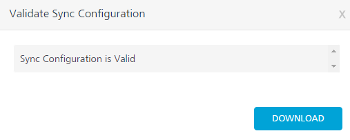

To download the file, click **Download**. This file is useful when the Sync Scope is invalid, and you want to know the details of the errors encountered while validating the Sync Scope.

Use Parent-Child Upload
-----------------------

Parent-Child Upload is a feature of the Synchronization SDK that allows you to include all changes to parents and children to be transmitted to the backend in a single complex data structure. This increases system efficiency by permitting all information to be transmitted at once, minimizing network calls and processing. Parent-Child Upload also enables communication with a Sky/SAP backend, which requires such structured data.

### Creating a Sync Configuration with Parent-Child Upload support

The current version of Volt MX Foundry allows configuration of the parent-child upload in the input mapping of the Sync Configuration under the Synchronization tab using template parameters. This is done through the Volt MX Foundry console and by modifying the request template.

1.  Using the Console, nest the parameters, making the child parameters of datatype **[Collection](Collection.md)**.
    
    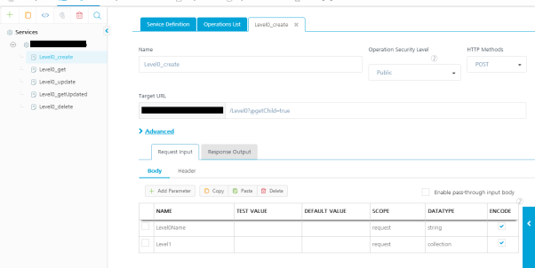
    
    To access the child object in the parent object's input mapping, use source type collection. That is, if the backend service expects the parent-child data in a Create request to be formatted as a nested object, then the child must be mapped as a collection under the parent's input mapping.
    

1.  Configure the sync objects and mapping the parent-child relationships.
    
    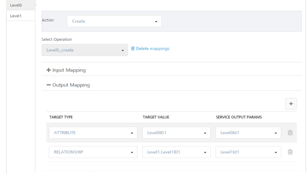
    
    To access the child object in the parent object's output mapping, use target type relationship. That is, if the back-end service responds even with child data for a service at parent level then the child attributes can be mapped using the target type relationship.
    
    While building a sync app with SAP back-end through Volt MX Foundry Console, the above two points need not be followed as the above flow is taken care of internally.
    

Note that the upload batch size used by the client SDK takes a value closer to that mentioned in the app for parent-child feature. For example, if the developer specifies the upload batch size as 1 in the app and then updates N child records on the device side, the upload batch size will be taken as 2 to include both the child and the parent .If the developer now performs a sync, the data will go in N batches, each batch containing parent and child.

### Feature Limitations and Behavior - Parent-Child

*   Error message mapping is not supported at the child level from User interface. User has to manually edit the app and add error message mapping at object level.
*   To support propagation of parent-child with different actions, currently only the first action of each child is propagated along with a parent and successive actions of a child will be applied as individual operations of child. In this propagation note that delete actions on child are not propagated along with parent. They are applied individually on child. So if delete is the first action on child then that delete and successive actions are applied individually on child but not propagated.
    
*   If Cascade is set to true and the developer configures a Delete operation to send a parent and child in same batch, both the parent and child will be sent. This is unnecessary; deleting the Parent will automatically delete the Child when Cascade is set to true. (If the backend has Cascade set to true, child data such as the primary key is not required for Delete.) This may decrease performance of the backend when a parent with many children is deleted, because a separate delete will be attempted for every child, despite the children having already been deleted.
    
    **Workaround**: When deleting a parent with children and Cascade is set to true, send only the Parent.
    

Download the Sync Configuration
-------------------------------

To download the `Syncconfig.xml` Sync configuration file on your computer, click the **Synchronization** page, click the Settings button, and then click **Export all**.


Volt MX  Foundry Sync Console
-----------------------------

> **_Note:_** The details of your sync scope will be available in Sync Services after you _publish_ the app.

Volt MX  Foundry Sync Management Console provides a single point of control for monitoring and configuring the Volt MX Foundry Sync console creation process.

To view your Sync Console, click **Sync Services** from your cloud account Environments.

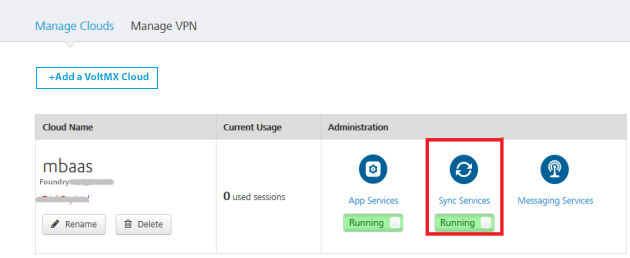

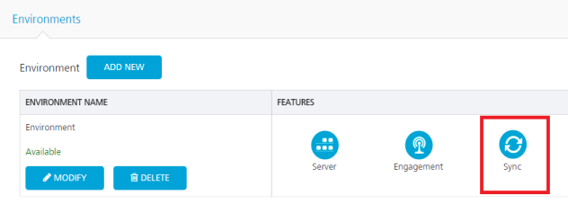

