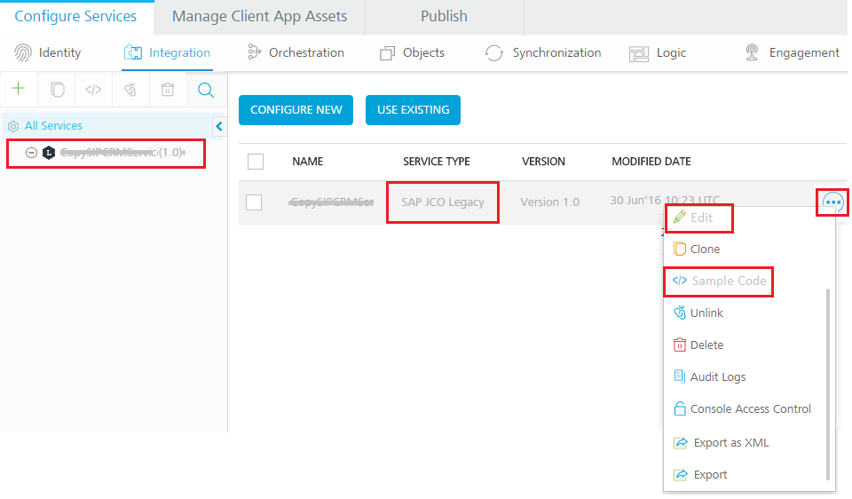
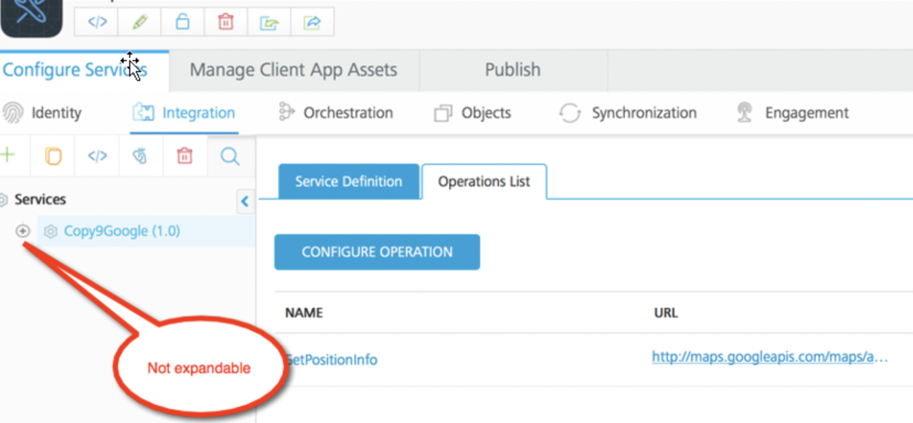
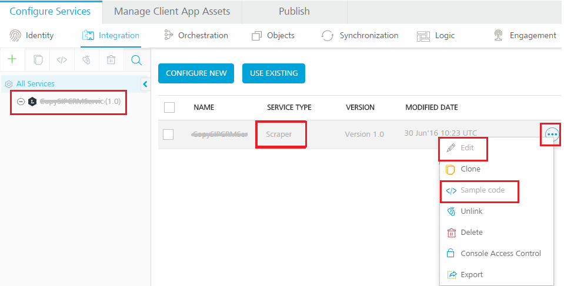

# Limitations - Legacy Services (SAP JCo Connector and Scraper Connector)

After migrating an app that contains legacy services through Visualizer, you can log in to Foundry and view the migrated apps and services.

## Limitations for SAP JCo Connector

*   For SAP JCo services, the file name mentioned as value for `sapserverfile` config-param must be copied to `files` folder, refer to [Folder Structure](CSD-LegacySerivce.md#CSD).

*   When an app that contains an SAP JCo service is migrated, the **Service Type** field in the [integration](Services.md) tab of Foundry Console is filled as **SAP JCO Legacy**, shown below:

    

*   In <madcap:variable name="MyVariables.VoltMX">Foundry Console, you can publish SAP JCo services like the other services supported in the <madcap:variable name="MyVariables.VoltMX">ecosystem.</madcap:variable></madcap:variable>
*   You cannot edit SAP JCo services in the <madcap:variable name="MyVariables.VoltMX">Foundry Console. If a user clicks the **Edit** button for the service, the following app menu appears.</madcap:variable>

    

    Note the following supported actions:

    *   **Edit** and **Sample code** are not supported.
    *   **Clone**, **Unlink**, **Delete**, **Console Access Control**, **Export and Import** are supported. For details, refer to [How to Use Actions on an Existing Integration Service](Services.md#ActioninIntegration)
*   You cannot view operations of an SAP JCo service in <madcap:variable name="MyVariables.VoltMX">Foundry Console.</madcap:variable>
*   An SAP JCo service is not clickable in the <madcap:variable name="MyVariables.VoltMX">Foundry console. You can only access operations for a SAP JCo service via the service definition XML directly. The **Configure Operation** button support is not available in the Console.</madcap:variable>
*   You cannot create SAP JCo services in <madcap:variable name="MyVariables.VoltMX">Foundry Console.</madcap:variable>
*   For SAP JCo Services, in the integration service designer, the tree view on the left pane when expanded, it will not show any operations even if operations exist within the service definition XML of an SAP JCo service. The operations can only be accessed from within the XML file.

    

*   While creating an orchestration, object or synchronization service in MobileFoundry 7.x and later, legacy services will not be available for linking.

*   When an app that contains a Synchronization service referenced by legacy services as data source is migrated, sync scopes can only be viewed in <madcap:variable name="MyVariables.VoltMX">Foundry. You cannot edit such sync scopes.</madcap:variable>

*   When an app that contains an Orchestration service referenced by legacy services is migrated, you can only view operations of the Orchestration service in <madcap:variable name="MyVariables.VoltMX">Foundry. You cannot edit the Orchestration service.</madcap:variable>

## Limitations for Scraper Connector

*   For each scraper service, there should be a corresponding dsl file.

*   If your application is built in <madcap:variable name="MyVariables.VoltMX">Studio versions prior to 6.0, upgrade your project to current version format by using <madcap:variable name="MyVariables.VoltMX">Studio 6.5, and then migrate the app. For more details, refer to [Migrate a Project from an Earlier Version of Studio or Iris](../../../Iris/iris_user_guide/Content/MigrateProjectFromVoltMXStudioOrPrevVerIris.md)

*   When an app that contains a Scraper service is migrated, then the **Service Type** field in the [integration](Services.htm#Services.htm) tab of Foundry Console is filled as **Scraper**, shown below:

    

*   In <madcap:variable name="MyVariables.VoltMX">Foundry Console, you can publish Scraper services like the other services supported in the <madcap:variable name="MyVariables.VoltMX">ecosystem.</madcap:variable></madcap:variable>
*   You cannot edit Scraper services in <madcap:variable name="MyVariables.VoltMX">Foundry Console. If a user clicks the **Edit** button for the service, the following app menu appears.</madcap:variable>

    

    Note the following supported actions:

    *   **Edit** and **Sample code** are not supported.
*   **Clone**, **Unlink**, **Delete**, **Console Access Control**, **Export and Import** are supported. For details, refer to [How to Use Actions on an Existing Integration Service](Services.md#ActioninIntegration)
*   You cannot view operations of a Scraper service in <madcap:variable name="MyVariables.VoltMX">Foundry Console.</madcap:variable>
*   Scraper service is not clickable in the <madcap:variable name="MyVariables.VoltMX">Foundry console. You can only access operations for a Scraper service via the service definition XML directly. The **Configure Operation** button support is not available in the Console.</madcap:variable>
*   You cannot create Scraper services in Foundry Console. To create Scraper Services, use older version of Studio 6.5 or below.
*   For Scraper services, in the integration service designer, the tree view on the left pane when expanded, it will not show any operations. The operations can only be accessed from within the XML file.

    

*   Ensure that DSL files and the corresponding services have the same name otherwise the migration fails.

*   While creating an orchestration, object or synchronization service in MobileFoundry 7.x and later, legacy services will not be available for linking.

*   When an app that contains a Synchronization service referenced by legacy services as data source is migrated, sync scopes can only be viewed in <madcap:variable name="MyVariables.VoltMX">Foundry. You cannot edit such sync scopes.</madcap:variable>

*   When an app that contains an Orchestration service referenced by legacy services is migrated, you can only view operations of the Orchestration service in <madcap:variable name="MyVariables.VoltMX">Foundry. You cannot edit the Orchestration service.</madcap:variable>

    > **_Note:_** Only one property file is allowed.

