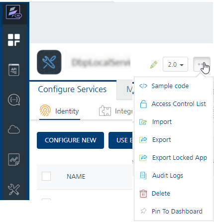

  

Locking of a Foundry App
-----------------------

From V9SP2 FP2, VoltMX Foundry supports Locking of Foundry Apps, which makes the services in the applications read-only with an ability to extend certain features like pre/post processors and request/response parameters of a service. Locking enables partners deliver pre-build solutions, which can be extended by their customers, while still providing the partners the ability to upgrade the pre-build solutions to latest versions.

The Locking of an app helps to improve the Foundry app development aspects as follows:

*   **Extensibility**:
    
    **Use case:** When partners build vertical-based solutions like Infinity, currently the Client and Foundry applications are shared with customers. Customers make changes to the application to meet their business requirements. When Infinity releases a new version, customers are expected to redo all the changes again on the new version, which is time-consuming and is error-prone.
    
    By using the locking functionality, you can clearly demarcate the base functionality from the extensions done by the customers. With a locked base app, customers can extend the base product functionality as per their business requirements, without changing the base app functionality. When a new base app version is released, customers can import the updated base application, which only upgrades the locked portion of the app keeping the extensions intact.
    

The following sections detail you with more information on Lock App functionality:

*   [How to Lock a Foundry App](#how-to-lock-a-foundry-app)
*   [Extending Locked Base Foundry Apps](#extending-locked-base-foundry-apps)
    
    *   [How to Extend an Integration Service of a Locked Foundry App](#how-to-extend-an-integration-service-of-a-locked-foundry-app)
    
    *   [How to Extend an Object Service of a Locked Foundry App](#how-to-extend-an-object-service-of-a-locked-foundry-app)
*   [Upgrading Locked Base Foundry Apps](#upgrading-locked-base-foundry-apps)
    *   [How to Upgrade a custom Foundry App version by using Locked Base Foundry App version](#how-to-upgrade-a-custom-locked-foundry-app-version-with-a-higher-locked-base-foundry-app-version)
*   [How to Lock a Foundry App using MFCLI](#how-to-lock-a-foundry-app-using-mfcli)

### How to Lock a Foundry App

Only a user with an Owner role can lock Foundry apps. When a Foundry app is locked, the base app configurations are set to read-only, including some that are replaceable.

To lock an app, follow these steps:

1.  Log in to the Foundry Console with user credentials that have an Owner role.
2.  In the **Apps** page, hover your cursor over the App menu button of the app.
    
    
    
3.  Click **Export Locked App**. The base app configurations are locked and the app from the current workspace gets exported to your local system. The app is downloaded with a new name, for example `<SampleAppName>_locked`.
    
    > **Note:** You can access the Export Locked App option within the app when the app is selected.  
    >
    > 
    
    If you have imported a locked app with the Owner role, the Export Locked App feature is disabled for that app.
    
    The following service types are marked read-only when an application is locked:
    
    *   Integration Services
    *   Object Services

### 

### Extending Locked Base Foundry Apps

The services that locked can be extended. When an app is locked, the app contains read-only fields and some are replaceable.

For example,

*   Pre-Post processors and Request and Response fields are extensible.
*   Base URL can be replaced.
*   The rest of the parameters are read-only.
    

#### How to Extend an Integration Service of a Locked Foundry App

1.  Log into your Foundry account and Import the Locked Foundry App into it.
2.  Navigate to the **Integration** tab.
3.  Select the service.
4.  In **Service Definition** section, you can configure the following:
    
    *   **Base URL**: This is replaceable. Specify a back-end URL, if required, and save the service.
    *   **Identity Service for Backend Token:** Select an identity service based on available identity services linked to the app.
    *   **Configurability of custom JARs:  
        In Advanced > Custom Code:** Select existing JARs or click **Upload New** to add new JARs.
        
        > **Note:** Locked apps do not support these Advanced Configurations: Throttling and URL Provider Class.
        
        > **Note:** From V9SP4, you can add new operations to the locked apps.  
		>
        > 
        
    In **Operations** list, you cannot add new operations.
   
6.  Click an operation to add an extended configuration as follows:
    *   **Operation Security Level**: Select the security level, if required.
        
    *   **Target URL**: This is replaceable. Specify a back-end URL and save the service, if required.
        
    *   **Configurability of Java pre-processors and post-processors**:  
        In **Advanced > Custom Code Invocation:** The locked Java pre-processors and post-processors are enabled by default. You can choose to enable/disable them for your app.
        
        *   To extend the locked base custom Java code, select new Java pre-processors and post-processors from the list. You can arrange for the selected pre and post-processors to be executed in the desired order during the operation call.
        
        
        
    *   In **Request Input and Response Output:** The locked base app fields are read-only.
        
        You can add new parameters. To add new parameters, click **Add Parameter** and configure details.
        
        
        
7.  Click **SAVE** to save the configuration.

> For more information on Integration Services, refer to [Integration Services](Services.md).

#### How to Extend an Object Service of a Locked Foundry App

1.  Import the Locked Foundry App into a Foundry account.
2.  Navigate to the **Objects** tab.
3.  Select the service.
4.  In the Service Definition, you can configure the following fields:
    *   **MetaData Security Level, Offline Enabled, Identity Service for Backend Token, and custom code JARs**
5.  In the **Data Model** tab, you can configure the following:
    
    *   To add new fields to the locked objects, click **Add**. The new fields in the locked objects are categorized as CUSTOM FIELDS.
    *   You can delete locked base objects, if required.
    
    > **Note:** For Locked Base objects, you cannot do the following in the Data Model tab:
    >
    > *   Modify the locked object name.
    > *   Add new objects.
    > *   Modify or delete locked base object fields. The locked base fields of objects are categorized as BASE FIELDS.
    
6.  In the **Mapping** tab, you can configure the following:
    
    > **Note:** From V9SP4, you can add verbs to the locked apps.  
	> 
    > 
    
    *   **Configurability of Java pre-processors and post-processors:**  
        In **Advanced > Custom Code Invocation > Preprocessor and Postprocessor:** The locked Java pre-processors and post-processors are enabled by default. You can choose to enable/disable them.
        
        *   To extend the locked base custom Java code, select new Java pre-processors and post-processors from the list. You can arrange the selected pre and post-processors to be executed in the desired order during the operation call.
        
        
        
        Locked apps do not support these Advanced Configurations: Stub Backend Response, Front End API, Pass-through Cookies, and Server Events.
        
7.  **Extensibility of Object data mappings**:

    In **Visual/XML mapper** section, you can configure the following:
    
    *   All locked Visual/XML mapper/s are disabled for editing and deleting. By default, locked mappers are selected with the **Enabled** option to be included in the custom app by default. You can choose to enable/disable them.
        
    *   You can add new mappings to the locked object verbs.
        
        **To extend the base lock mapper, do the following:**
        
        1.  Click **Add.**
        2.  Specify the mapper name and click **SAVE**. A new mapper placeholder is created.
        3.  Click **EDIT** to configure mappers.
    
    <!-- -->
    
8.  Click **SAVE** to save the mapper configuration and the changes.

> **Note:** For more information on Object Services, refer to [Object Services](Objectservices.md).

### Upgrading Locked Base Foundry Apps

From V9SP2 FP2, VoltMX Foundry supports Locking of Foundry Apps, which makes the services in the applications read-only with an ability to extend certain features like pre/post processors and request/response parameters of a service.

The Locking of an app helps to improve the Foundry app development aspects as follows:

**Upgradability**:

**Use case**: When partners build vertical-based solutions like Infinity, currently the Client and Foundry applications are shared with customers. Customers make changes to the application to meet their business requirements. When Infinity releases a new version, customers are expected to redo all the changes again on the new version, which is time-consuming and is error-prone.

By using the locking functionality, you can clearly demarcate the base functionality from the extensions done by the customers. With a locked base app, customers can extend the base product functionality as per their business requirements, without changing the base app functionality. When a new base app version is released, customers can import the updated base application, which only upgrades the locked portion of the app keeping the extensions intact.

*   **Use Case:** As a process of product enhancements, a base app can have multiple versions of continuous development cycles and releases, including enhanced functionality and bug fixes. When a new base app version is built and released to customers, customers want to upgrade/replace their custom app with the next high version of the base app. To upgrade, users must take backup of their custom logic, import the new base app version on their infrastructure, and add their backed-up custom logic again from the beginning. Then verify app functionality to resolve any merging conflicts that arise from taking the next version of the base app, and then retest the complete product to certify that no issues exist.

By using the Lock App functionality, you can achieve the above scenario.

While upgrading locked custom apps with the higher versions of locked base apps, the custom locked app gets updated for the following:

*   Merges all the new changes in the higher version of the locked base app version into the custom app.
*   Retains all the extended configurations in the custom lock app version intact.

#### How to Upgrade a custom locked Foundry App version with a Higher Locked Base Foundry App version

1.  Log into your Foundry account, in which you have created a custom app version based on a locked base app version.
2.  From the VoltMX Foundry Console, click Apps to display the **Applications** page > **Import**.
    
3.  The **Import App** dialog that appears, Drag and drop an app zip file (locked base app.zip) into the dialog box or click Browse to select the app you want to import, and click **IMPORT**. You can import an app as a new app or overwrite an existing app across various VoltMX Foundry Consoles.
    
    Your custom locked app version has been upgraded with a higher locked base app version.
    
    For more information on importing apps, refer to [Importing a Foundry Application](Export-Import_Apps.md).
    

### How to Lock a Foundry App using MFCLI

The lock-app command locks the app from the current environment and returns a locked app zip in the specified location:

*   for Cloud environment:

    ```
    java -jar mfcli.jar lock-app -u <user> -p <password> -t <account id> -clurl <cloud url> [-f <file name> | -r <directory name>\] -a <app name> [ -v <app version> \]
    ```
    
    For example,
    
    ```
    java -jar mfcli.jar lock-app -u abc@voltmx.com -p password -t 100054321 -clurl https://manage.hcl-cloud.com -f "C:\\\\tmp\\\\Sample.zip" -a MyApp -v 2.0
    ```
    
*   for on-premise installation:
    
    ```
    java -jar mfcli.jar lock-app -u <user> -p <password> -au <Identity URL> -cu <Console URL> [-f <file name> | -r <directory name>] -a <app name> [ -v <app version> ]
    ```
    
    For example,
    
    ```
    java -jar mfcli.jar lock-app -u abc@voltmx.com -p password -au http://10.10.24.79:8080 -cu http://10.10.24.78:8081 -f "C:\\tmp\\Sample.zip" -a MyApp -v 2.0
    ```
    
    For more information on MFCLI commands, refer to [Continuous Integration with VoltMX Foundry](CI_Foundry.md).
