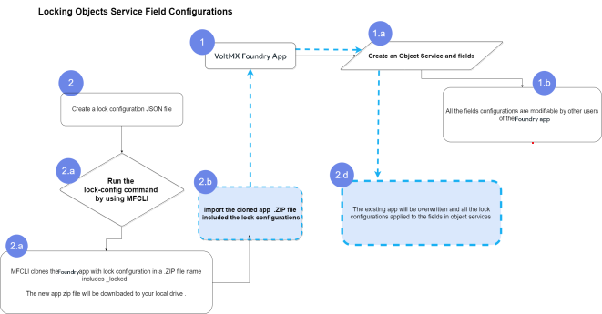

                               

User Guide: [Volt MX Foundry Command Line Utility - Continuous Integration](CI_Foundry.md) > Use Case

Configuring Read-only Fields for Object Services through MFCLI
==============================================================

You can configure the fields in a data model of Object Services as read-only fields. MFCLI is enhanced to support locking of fields in an object service attached to an app. So that, the locked fields (base fields) cannot be modified by the other Foundry Cloud users. In this case, other Cloud users can modify only the custom fields.

The MFCLI provides two new commands `lock-config` (to lock fields) and `unlock-config` (to unlock fields). The `lock-config` command must always be attached with a supportive JSON configuration file, which includes configurations/rules/conditions to lock fields of Objects services.

**Use Case**
------------

When pre-packaged solutions are built by using Volt MX, it is important to design the solution such that customers can upgrade to a new version of the solution without any difficulty.

For example: When an app is released for Retail Banking, it typically has a pre defined object called Accounts. The fields in the Accounts object can be extended by the customers. In reality, the fields that are part of the properties of the Account object are also modified. When a new version of the app is released, it is difficult to upgrade because the properties of the Account object are modified. It is optimal that we have these fields locked to ensure that the customers extend the object model instead of modifying it.

The feature of locking fields/objects allows the capability to lock fields in the Account object so that the customers cannot modify the existing fields that are shipped with the app.

How Locking Fields Works
------------------------

After you create your data model for an object service in an app in Foundry Console, the fields of the service can be modified when the app is accessed by other Foundry users. If you want to make any of these fields read-only, you can lock these fields by using the `lock-config` command of MFCLI. This command must include a valid `lockconfig.json` file. A lockconfig.json file must be defined with the required fields of an object that need to be locked. After you run the `lock-config` command successfully, the Foundry Console downloads a zip file to your original app file location. The name of the locked app file name is `<OriginalFoundryAppName>_locked.zip`. The new zip file contains the locked fields of objects.

Use the locked zip file to import the locked fields into your existing app. When you import the locked zip file, the existing app is overwritten. The locked fields of your objects are categorized as the **BASE FIELDS** and the rest of the fields in the objects are categorized as **CUSTOM FIELDS**.

Refer to the following diagram that explains how to lock fields of object services as read-only **`(2.d)`** fields:



Prerequisites
-------------  

* Volt MX Foundry Console Version V9 GA
* Foundry App with Objects Services
* MFCLI version &lt;version number&gt; onwards
* LockConfigTemplate.json file 


<details close markdown="block"><summary>Structure of Lock Configuration JSON file</summary>

<pre><code>
LoockConfigTemplate.json 
{
    "serviceLockConfigs": {
        "objectServices": {
            "<object_service_name>": {
                "version": "<version>",
                "paths": [
                    "objects/<object_name>/fields/<field_name>",
                    "objects/<object_name>/fields/*",
                    "objects/<object_name>/fields",
                    {
                        "path": "objects/<object_name>/fields",
                        "values": [
                            "<field1_name>",
                            "<field2_name>"
                        ]
                    }
                ]
            },
            "<object_service2_name>": {},
            "<object_service3_name>": {}
        }
    }
}
</code></pre>

* `"objects/<object_name>/fields"` = The path marks all the existing fields as read-only and no new fields can be created.

* `objects/<object_name>/fields/*` = This path with an `asterisk (*)` marks all the existing fields in an object as read-only but new fields can be created.

* `objects/<object_name>/fields/<field_name>` = The path marks only the specified field as read-only.
You can also provide a path and array of specific values to mark as read-only, as follows:
    <pre><code>
        {
            "path": "objects/objName/fields",
            "values": [
                "fieldName1",
                "fieldName2",
                "fieldName3",
                "fieldName4",
                "fieldName5"
            ]
        }
    </code></pre>
</details>  


Lock Fields Operation
---------------------

The `lock-config` command locks the fields of objects defined in the configuration JSON file (for example SampleLockConfig.json)

You can export configurable parameters from the following environments:

*   [Locking fields of objects from Foundry Cloud Environment](#ReportsExport_1)
*   [Locking fields of objects from Foundry On-Premise Environment](#ReportsExport_2)

### Locking Fields of Objects from Foundry Cloud Environment

To Lock fields of objects from Foundry Cloud environment, run the following command.

```
java -jar mfcli.jar lock-config -u <user> -p <password> -t <account id> -f <lock config file path> -a <app path> -la <locked app name>
```

Example

```
java -jar mfcli.jar lock-config -u abc@voltmx.com -p password -t 100054321 -f ~/../lockConfig.json -a ~/../App.zip -la my_locked_app
```

In this scenario, `lockCofing.JSON` is the lock configuration file and `App.z``ip` is the Foundry app. This command locks the fields of objects services in the App.zip based on the JSON file, and creates a clone of the provided Foundry app with lock configuration applied. For example, `C:\\tmp\\App_locked.zip` file created in the same Foundry app path.

> **_Note:_** If you want to export the locked fields with a different app name, use the `[-la "NewAppName.zip]` parameter in the command. This is an optional.

### Locking Fields of Objects from Foundry On-Premise Environment

To Lock fields of Objects from Foundry On-Premise environment, run the following command.

```
 java -jar mfcli.jar lock-config -u <user> -p <password> -au <Identity URL> -cu <Console URL> -f <lock config file path> -a <app path> -la <locked app name>
```

> **_Note:_** If you want to export the locked fields with a different app name, use the `[-la NameAppName.zip]` parameter in the command. This is an optional.  

Example

```
java -jar mfcli.jar lock-config -u abc@voltmx.com -p password -au http://10.10.24.79:8080 -cu http://10.10.24.78:8081 -f ~/../lockConfig.json -a ~/../App.zip -la my_locked_app
```

In this scenario, `lockCofing.JSON` is the lock configuration file and `App.zip` is the Foundry app. This command locks the fields of objects services in the App.zip based on the JSON file, and creates a clone of the provided Foundry app with lock configuration applied. For example, `C:\\tmp\\App_locked.zip` file created in the same Foundry app path.

> **_Note:_** The locked fields are exported in a .zip file to the original app file location in your system. The new zip file will be a concatenation of the application name and the `_locked` extension.

Removing all Locked Fields of Object Services
---------------------------------------------

Command to remove all lock configurations from the provided App zip creates a clone of the provided app with locks removed.

The `unlock-config` command removes the write-protection from the fields and objects based on the locked zip file.

You can unlock fields and objects from the following environments:

*   [Unlock Fields and Objects from Foundry Cloud Environment](#ImportReports_1)
*   [Unlock Fields and Objects from Foundry On-Premise Environment](#ImportReports_2)

### Remove locked configurations of Objects Services from Foundry Cloud Environment

To remove the locked configurations of object services from Foundry Cloud environment, run the following command.

```
java -jar mfcli.jar unlock-config -u <user> -p <password> -t <account id> -a <app name> -ua <unlocked app name>
```

Example

```

java -jar mfcli.jar unlock-config -u abc@voltmx.com -p password -t 100054321 -a ~/../App.zip -ua my_unlocked_app
```

In this scenario, the following are the mandatory steps:

*   The  **`-a`** is the path of the Foundry app with lock configurations. This is a mandatory parameter.

This command removes all locked configurations for the fields of objects services in the App.zip, and creates a clone of the provided Foundry app with lock configuration applied. For example, `C:\\tmp\\App_locked.zip` file created in the same Foundry app path.

> **_Note:_** The `-ua (--unlocked-app)`, is the name of the new app zip with lock config removed. for example, AppName\_unlocked. This is an optional.

### Remove locked configurations of Objects Services from Foundry On-Premise Environment

To remove the locked configurations of object services from Foundry On-Premise environment, run the following command.

```
java -jar mfcli.jar unlock-config -u <user> -p <password> -au <Identity URL> -cu <Console URL> -a <app name> -ua <unlocked app name>
```

Example

```
java -jar mfcli.jar unlock-config -u abc@voltmx.com -p password -au http://10.10.24.79:8080 -cu http://10.10.24.78:8081 -a ~/../App.zip -ua my_unlocked_app
```

In this scenario, the following parameters are mandatory:

*   The **`-a`** is the path of the Foundry app with lock configurations.

This command removes all locked configurations for the fields of objects services in the App.zip, and creates a clone of the provided Foundry app with lock configuration applied. For example, `C:\\tmp\\App_locked.zip` file is created in the same Foundry app path.
