                              

User Guide: [Appendix - App Services](Appendix_-_App_Services.md) > Log Services

Log Services
------------

A new feature log services is added under Cloud environments in Features section along with the existing features. This feature displays the log data of different servers.

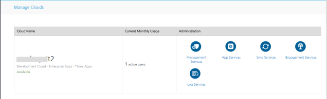

Click **Log Services** icon to view the logged data in Volt MX Logs interface. This data is filtered depending on a particular environment. In this interface, a user can view the log data of different servers:

*   Integration
*   Sync
*   Application crash logs

> **_Note:_** The log levels of the applications are set up from the corresponding consoles (such as Admin, Sync, engagement services and so on).

The Volt MX Logs interface is built with three different tabs.

*   [Discover](#discover)
*   [Visualize](#visualize)
*   [Dashboard](#dashboard)

### Discover

This tab is displayed by default with the list of log data at service level. The log data is displayed at a service level. Different filters are provided in this screen for the users to refine the data displayed.

> **_Note:_** Clicking on **Log Services** option displays the log data under **Discover** tab.

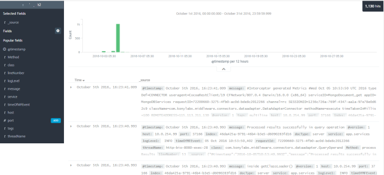

> **_Note:_** Some values useful for debugging, such as the **Service name** and the **Operation name** are displayed in the log message.

#### Search

You can search the particular logs from the displayed list of logs by providing a keyword in the Search field. Following actions can be performed in the Search pane.

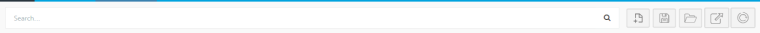

New Search: Click the icon to perform a new search.  This refreshes the existing results and performs a new search by displaying the updated results.

Save Search: You can save the search performed for future use by clicking on Save Search. Saving the search is more efficient way to access the results more quickly instead of retyping the search keywords every time.

Load Saved Search: Click on Load Saved Search icon to load the previously saved searches. Select the saved search from the list of searches displayed.

#### Filters

You can refine the results displayed by using the pre-defined filters from the left pane of the screen. Select the required fields and provide the valid inputs to display the proper required log data.

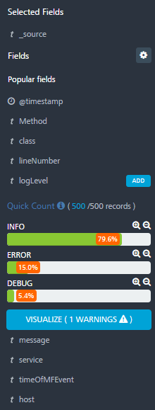

#### Time Filter

The time filter displayed on the top right corner of the screen shows the refresh time of the log data displayed.

You can modify the time filter to refine the log data using different options provided.

*   Quick

*   Relative and
*   Absolute

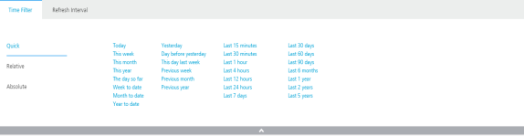

Quick: Quick time filter displays different periods of time, typically day, week, month, year etc.

Results are displayed based on the selection of the filters.

Relative: Relative filter is dependent on the Quick filter. Based on the selected period, user can set the time bound from to the current date and time. The time bound selected can be

*   Seconds ago
*   Minutes ago
*   Hours ago
*   Days ago
*   Weeks ago and
*   Months ago

Select the checkbox Round the day to filter the log data continuing the entire 24 hours of the selected day.

Absolute: Absolute displays the calendar to filter the data from a selected date and time to the selected date and time. Click Set to Now button in the To field to set the time period to the current date and current time.

**Refresh Interval**: The maximum refresh time interval can be set by the user in **Refresh Interval** tab. The Logging Service automatically check for the updates by providing the refresh interval time. Customize the refresh time of the application by selecting the refresh time interval you wish to use.

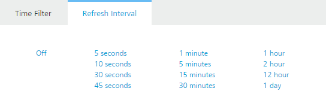

> **_Note:_** You can manually check for the updates by setting the refresh interval as **Off**.

### Visualize

Visualization provides options to design different types of charts for the log data displayed.  You can create a new visualization charts such as:

*   Area chart
*   Data table
*   Line chart
*   Markdown widget
*   Metric
*   Pie chart
*   Tile map
*   Vertical bar chart

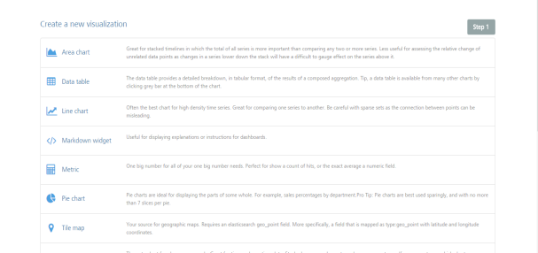

You can also view the saved visualizations at the bottom, if any.

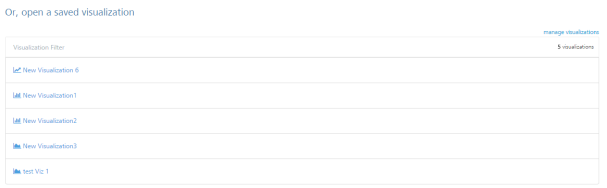

#### Create a new visualization

To create a new visualization, follow these steps:

1.  Click a type of chart to create, a new page **Select a search source** is displayed.
2.  Charts can be prepared only on saved searches. Select the source to create a new chart.
    
    *   From a new search
    *   From a saved search
    
    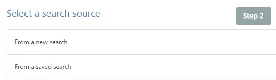
    

##### From a New Search

Follow these steps to create a chart from a new search:

*   Select **From a new search** option to display a filter to provide the search options.
*   Provide the required access filters and the visualization will be displayed.
*   Save the visualization.

##### From a Saved Search

Follow these steps to create a visualization from a saved search

1.  Click from a saved search option to create a visualization from a saved search. For more information on Saved search, refer [Save search](../../../Logging as a Service.docx).
    
    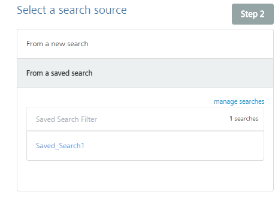
    
2.  Based on the search parameters, Visualization is displayed.
    
    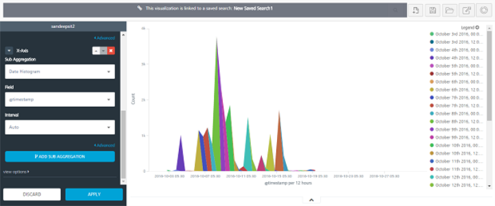
    
3.  Make the required changes by using the filters provided in the left pane.
4.  Click Save Visualization to save it.
5.  New Visualization: You can create a new visualisation by clicking on the **New Visualisation** icon. This option provides different graphical representations allowing you to create a new visualisation.
6.  Save Visualization: Click **Save Visualisation** to save the created visualization.
7.  **Load Saved Visualization**: click this option to load the previously saved visualization.
8.  Share Visualization: Selecting this option will provide you two links where one link can be embedded to HTML source and the other link can be shared.

> **_Note:_** The client embedding the link to their source code should have access to Kibana.

10.  Refresh: Refreshes the existing data

### Dashboard

You can create dashboards for saved visualizations. To create a dashboard, follow these steps:

1.  Click the **Dashboard** tab. The Dashboard home page is displayed.
    
    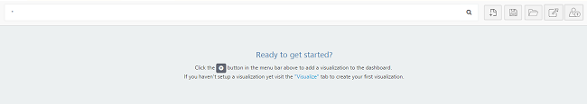
    
2.  Click the ‘+’ button to add a visualization to the dashboard.
3.  The dashboard page displays 2 tabs
    
    *   Visualizations
    *   Searches
    
    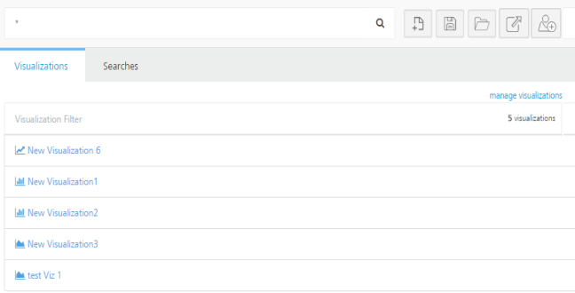
    
4.  Visualizations: This tab displayed the list of saved visualizations. Select the visualizations to add them to the dashboard.
5.  Searches: This tab displays the list of saved searches. Select the saved search to add them to the dashboard page.
    
    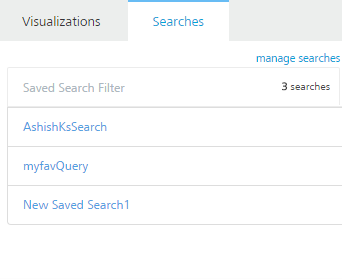
    
6.  Manage Searches : This option displays the list of saved searches, visualizations and dashboards.
7.  You can edit, delete and view the saved items by selecting each item.
8.  Once the dashboard is created, click Save to save the dashboard.

#### Search

You can search for the dashboards by providing a keyword in the Search field. Following actions can be performed in the Search pane.

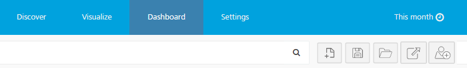

*   New Dashboard: Click the icon to create a new dashboard.
*   Save Dashboard: Click the icon to save the created dashboard.
*   Load Dashboard: Click the icon to load the saved dashboards.
*   Share: Selecting this option will provide you two links where one link can be embedded to HTML source and the other link can be shared.

> **_Note:_** The client embedding the link to their source code should have access to Kibana.

*   Add Visualization: Click **Add Visualization** to add a saved visualization to the new dashboard.
