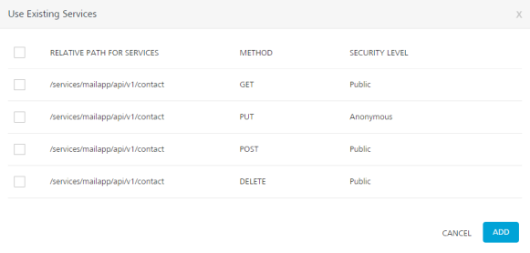
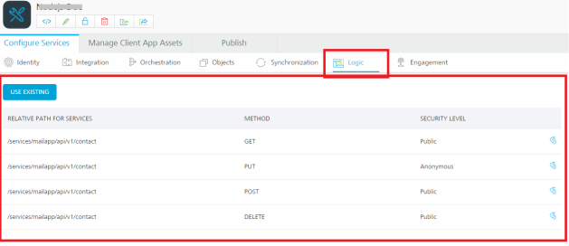
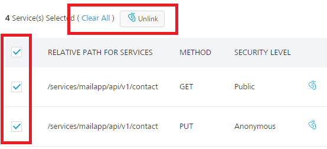
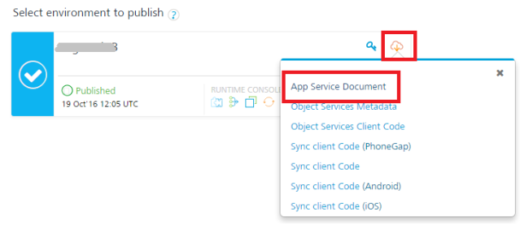
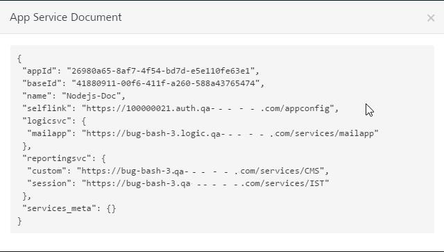

### How to Integrate Node.js Services into Foundry Apps

After you import a Node.js package into Volt MX Foundry and publish the package to the Node.js Runtime Server in the **API Management > Logic** tab, you can now integrate the Node.js services to Foundry apps.

To integrate Node.js services into Foundry app, follow these steps:

1.  After you [create an application](Adding_Applications.md), in the **Configure Services** tab, click the **Logic** services tab.
2.  Click **Use Existing**.

    The **Use Existing Services** screen appears with the list of services that you imported from the Node.js package.  
    The following fields are displayed for the imported services.

    *   **RELATIVE PATH FOR SERVICES**:
    *   **METHOD:**
    *   **SECURITY LEVEL**: Displays the security level set for this service. You can change the security level in **API Management** > **Logic** tab, if required.

        

3.  Select check box for required services and then click **ADD**. After the services are added into Volt MX Foundry app successfully, the services are listed in the **Logic** page of your app.

    > ***Note:*** If a service is part of a published app, you can delete that service only after you unlink the service from all the published apps.

    

    **Unlink**: Allows you remove the service from the **Logic** list page of an app. When a service is unlinked, it is disassociated from a particular app.

    > ***Note:*** You can also unlink multiple services from the **Logic** list page. To unlink multiple services, select the required check boxes. The quick access bar for the selected services appears with actions (such as Clear All and Unlink). Click **Unlink**.  

    **-  Clear All**: : Allows you to clear the one or more check boxes for the services.  

    **-  Unlink**:  Allows you remove the service from the **Logic** list of an app. When a service is unlinked, it is disassociated from a particular app.  

      

4.  Publish the app. For information about publishing a Volt MX Foundry app, refer to [Publish](Publish.md).

    Once the app is published, you can view the app publish details by clicking the **Download** button > **App Service Document** link.

    

    The **App Service Document** dialog appears with logic services.

    