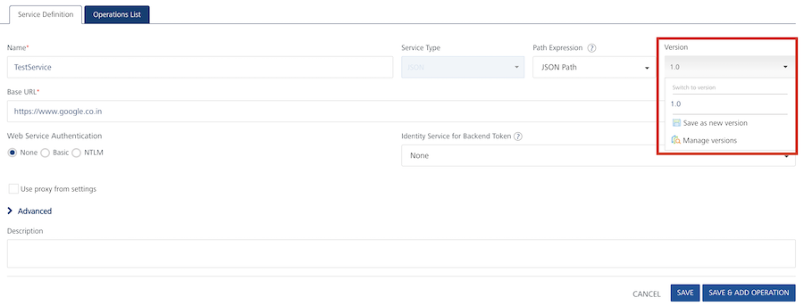
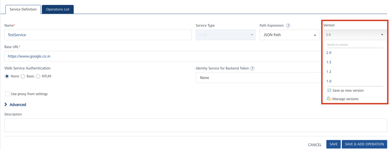
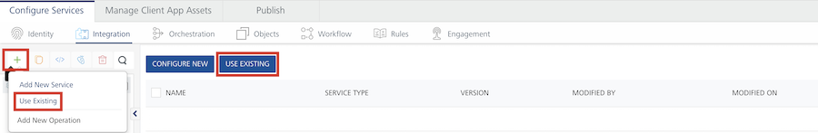
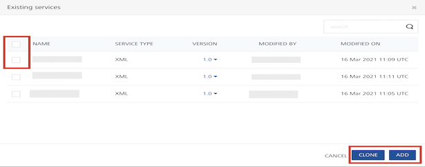
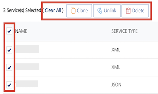
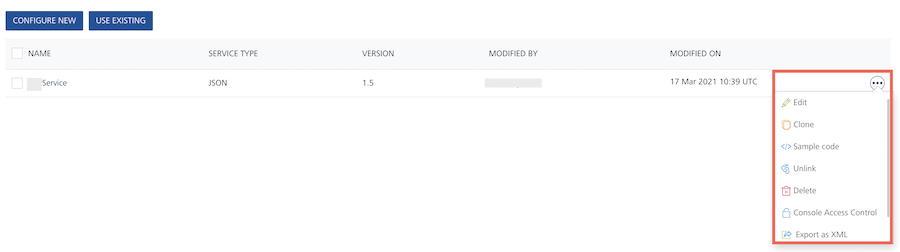
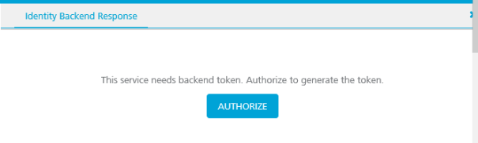

                             

User Guide: [Integration](Services.md#integration) \> [Manage Existing Integration Services](Manage_Existing_Integration_Services.md) > Test the Login for an OAuth 2.0 Identity Service

How to Save or Use a Version of a Service
-----------------------------------------

You can save an integration service to a new version. Saving a new version of an integration service unlinks the current version of the service from the Volt MX Foundry application, and links the new version. A Volt MX Foundry app can be associated with only one version of an integration service.

> **_Note:_** For more details on API Versioning Use Cases, refer to [VoltMX Foundry API Versioning](API_Versioning.md#API_Versioning.md)

To create a new version of an Integration service, follow these steps:

1.  On the **Integration** tab, click the name of a service in the list of existing services. You can also select Edit from the Operations menu for a service.
    
    The **Service Definition** tab appears.
    
2.  Click the **Version** menu.
    
    
    
3.  Select **Save as new version**.
    
    The **Save as** dialog appears.
    
4.  Type the version number of the new version of the service.
    
    You can use _major.minor_ numbering for versions. Volt MX Foundry supports major versions from 1 through 999, and minor versions from 0 through 99. Volt MX Foundry supports version numbers from 1.0 to 999.99. Note that the dot '.' is a separator for version numbers and does not function as a decimal.
    
5.  Add a description of the new version.
6.  Click **OK**.
    
    Volt MX Foundry links the new version of the service to the Volt MX Foundry app, and unlinks the previous version.
    

To use a different version of an integration service, follow these steps:

1.  On the **Integration** tab, click the name of a service in the list of existing services. You can also select Edit from the Operations menu for a service.
    
    The **Service Definition** tab appears.
    
2.  Click the **Version** menu.
    
    
    
3.  Select a version of the service.
    
4.  The **Alert** dialog appears. The Alert warns you that you are unlinking the current associated version of the service from the application.
    
5.  Click **OK**.
    
    Volt MX Foundry links the version that you selected to the Volt MX Foundry application.
    

How to Use an Existing Integration Service
------------------------------------------

VoltMX Foundry allows you to use an existing integration service. You can add or clone more than one service at a time from existing services.

To use an existing integration service, follow these steps:

1.  Go to the **Integration** tab. The page lists the existing services (if any).
2.  In the **Integration**, click ****USE EXISTING**** from the tree in the left-pane or right pane.
    
    
    
    The Existing services dialog appears with a list of existing services.
    
    
    
3.  To use a different version of an integration service, click the **Version** menu of the required service and  select a version of the service.
4.  Select the check box for the desired services. If you want add or clone more than one service, select the required check boxes from the existing services.
5.   Click **CLONE** or **ADD** button.
    *   Click **ADD** to reuse (link) an existing service. If any changes made to this service, the changes will affect in all the apps using this service.
        
        > **_Note:_** If a service is a part of a published app, you can rename that service only after the app is unpublished.
        
    *   Click **CLONE** to duplicate an existing service. If any changes made to this service will have no impact on the original service.
6.  After a service is added or cloned successfully, click **CLOSE** to close the process dialog.

How to Clone, Unlink, or Delete Multiple Existing Integration Services
----------------------------------------------------------------------

VoltMX Foundry allows you to clone, unlink, or delete one or more existing integration services from the **Integration** list page. You can add or clone one or more services at a time from existing services.

To clone, unlink, or delete multiple existing integration services, follow these steps:

1.  Go to the **Integration** tab. The page lists the existing services (if any).
    
    By default, the check box is cleared for each service in the services list page.
    
2.  Select one or more the check boxes for services. The quick access bar for the selected services appears with actions such as **Clear All, Clone**, **Unlink**, **Delete**.
    
    
    
    *   **Clear All**: Allows you to clear the one or more check boxes for the services.
    *   **Clone**: Allows you to duplicate an existing service. Changes made to a cloned service will not impact the original service.
    *   **Unlink**: Allows you remove the service from the **Integration** tab of an app. When a service is unlinked, it is disassociated from a particular app.
        
        > **_Note:_** If you want to use an unlinked service, select the service from the [Use Existing Integration Service](#how-to-use-an-existing-integration-service) dialog.
        
    *   **Delete**: Allows you to delete a service.
        
        > **_Note:_** If a service is a part of a published app, you can delete that service only after you unlink the service from all the published app.
        
3.  Click the desired (**Clone**, **Unlink**, **Delete**) button.

Context Based Options
---------------------

To perform various actions on an existing service, click the contextual menu of the required service.

The contextual menu contains the following options:

*   **Edit**: Allows you to edit a service. After you edit a service, you have to republish all the apps that are using the service to apply the changes.
    
    > **_Note:_** To know more about publishing an app, refer to [Publish an app](Publish.md).  
    
    > **_Note:_** If a service is part of a published app, you can rename that service only after the app is unpublished.
    
*   **Clone**: Allows you to duplicate an existing service. Changes made to a cloned service will not impact the original service.
*   **Sample Code**: A dynamic code is generated based on the configuration of a service. You can use this code in your SDK.
*   **Unlink**: Allows you remove the service from the **Integration** tab of an app. When a service is unlinked, it is disassociated from a particular app.
    
    > **_Note:_** If you want to use an unlinked service, select the service from the [Use Existing Integration Service](#Use) dialog.
    
*   **Delete**: Allows you to delete a service.
    
    > **_Note:_** If a service is a part of a published app, you can delete that service only after you unlink the service from all the published app.
    
*   **Audit Logs** helps you to capture all the user activities performed in a service. **Object Name**, **Object Type** and **Modified On** fields are prepopulated with the **Service Name**, **Services**, and **Last 7 Days** respectively.
    
    For more information on Audit Logs, refer to [Audit Logs](Settings_Cloud.md#audit-logs-cloud) documentation.
    
*   **Console Access Control**: Controls the access to the applications and services of apps.
    
*   **Export as XML**: Exports an existing version of a service to an XML file.
*   **Export**: Allows you to export the integration service into your local system. The exported file is an .xml file.

Test the Login for an OAuth 2.0 Identity Service
------------------------------------------------

When you are defining an operation for an integration service, you can request that Volt MX Foundry fetch the response to the operation. If the integration service uses an OAuth 2.0 identity service for authorization, you must log in to the identity service before Volt MX Foundry can fetch the response from the back end.

When you first request that Volt MX Foundry fetch the response, the service does not yet have the required token. You can then authorize Volt MX Foundry to generate the token. Volt MX Foundry then pops up the sign in for the OAuth 2.0 identity provider. After you successfully sign in to the identity service, Volt MX Foundry sends the request with the identity to the OAuth 2.0 back end. Volt MX Foundry gets the token and stores it in a cookie for Volt MX Foundry on the browser. Volt MX Foundry sends the token to the back end, and because the back end has the valid OAuth 2.0 token, the back end sends its response. The back end populates the identity backend response, the backend response, and the output result.

For the lifetime of the session, you can test an operation and you are not required to sign in again. In the identity backend response, you can view the token and clear the token if you want to test the login again.

To test the log in for an identity service, do the following:

1.  Click **Fetch Response**.

The **Identity Backend Response** tab appears. Volt MX Foundry identifies that the integration service is linked to an OAuth identity service. A message informs you that the service needs a backend token. If the message does not appear, the integration service has the backend token.

4.  Click **Authorize**.

The sign in screen for the identity service appears.

6.  Enter your credentials and click **Sign In**.

The backend response is populated in the response pane.

8.  To clear the cached token, in the Identity Backend Response tab, click **Clear Token**.

In the Identity Backend Response tab, you can click **Copy** to copy the results of the response to the clipboard. Click **Expand** to open the Identity Backend Response in its own window.

> **_Important:_** If a custom integration service (for example, MongoDB or RAML) is linked to an OAuth2 identity service, while testing an operation of the integration service from VoltMX Foundry Console, you must pass the `x-volt-mx-oauth2-access-token` as header and `access_token` as header value.  
  
Also, If a custom integration service (for example, MongoDB or RAML) is linked to an OAuth2 identity service, while testing an operation of the integration service from Admin Console, you must pass the `x-volt-mx-oauth2-access-token`  as header and `access_token` as header value.  
  
For example:  
  

