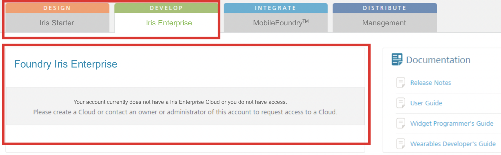
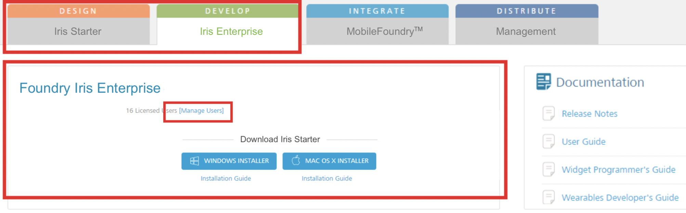
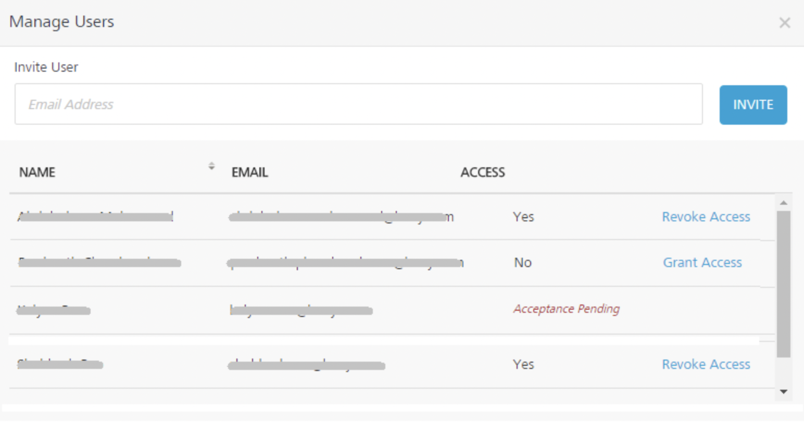

# Manage Console Users

An owner/admin role user of <madcap:variable name="MyVariables.VoltMX">Cloud can now manage the access of other users of the owner's account to the Iris Starter Cloud or Iris Enterprise Cloud.</madcap:variable>

The manage users module deals with providing users of the account access to download Iris installers within <madcap:variable name="MyVariables.VoltMX">Foundry Console.</madcap:variable>

<madcap:variable name="MyVariables.VoltMX">Foundry users who get permissions to <madcap:variable name="MyVariables.VoltMX">Cloud account can download Iris (Starter or Enterprise) installer from <madcap:variable name="MyVariables.VoltMX">Cloud account, install Iris on a local machine, and then design apps using Iris. Then the user can also log into <madcap:variable name="MyVariables.VoltMX">Foundry Console and publish apps to <madcap:variable name="MyVariables.VoltMX">Cloud. <madcap:variable name="MyVariables.VoltMX">Foundry users who have permissions to access an account can invite and manage other users in the account.</madcap:variable></madcap:variable></madcap:variable></madcap:variable></madcap:variable></madcap:variable>

 For iris install documentation and system requirements, refer [here](https://support.hcltechsw.com/csm?id=kb_article&sysparm_article=KB0094403).

When an user has access to Iris Starter or Iris Enterprise Clouds, only then the respective tabs (DESIGN or DEVELOP) display details such number of licensed users along with the **Manage Users** button and download links to <u style="font-weight: normal; text-decoration: none;">Iris installer</u>. From the **<madcap:variable name="MyVariables.VoltMX">Cloud account</madcap:variable>** > **Dashboard** tab, click **Manage Users**. The **Manage Users** screen appears with the list of users. The list view displays a list of all the users along with other details. You can search the users based on each column and sort on each column.

To manage access to Iris Starter Cloud, follow these steps:

1.  Log into **<madcap:variable name="MyVariables.VoltMX">Foundry Console</madcap:variable>**/** <madcap:variable name="MyVariables.VoltMX">Cloud account</madcap:variable>**. By default, the **Dashboard**> **Iris Starter** tab appears.

    When a user is not provided access to <madcap:variable name="MyVariables.VoltMX">Cloud, the **Iris Starter** tab displays the following message.</madcap:variable>

    

    If an user has access to Iris Starter or Iris Enterprise Clouds, only then the respective tabs (DESIGN or DEVELOP) display details such number of licensed users along with the **Manage Users** button and download links to <u style="font-weight: normal; text-decoration: none;">Iris installer.</u>

    

2.  Click **Manage Users**. The **Manage Users** dialog appears with the list of invited users and their Console Access status, for example, Iris Starter Cloud or Iris Enterprise Cloud.

    

3.  To invite users to the account, follow these steps:
    1.  Enter the email address of the user you're inviting.
    2.  Click **INVITE**. The user receives an email invitation to <madcap:variable name="MyVariables.VoltMX">Cloud from <madcap:variable name="MyVariables.VoltMX">Accounts. The user need to accept the invitation to use <madcap:variable name="MyVariables.VoltMX">Cloud.</madcap:variable></madcap:variable></madcap:variable>
    3.  In the invitation mail, click the **Accept Invitation** link to accept this invitation. You are redirected to **<madcap:variable name="MyVariables.VoltMX">Cloud Accept Invitation</madcap:variable>** page.
    4.  Click **Cloud Console**. You are redirected to **<madcap:variable name="MyVariables.VoltMX">Cloud</madcap:variable>** > **Sign in to your <madcap:variable name="MyVariables.VoltMX">Account</madcap:variable>** page.
    5.  Enter your credential land click **Sign in**. You are redirected to <madcap:variable name="MyVariables.VoltMX">Foundry Console. By default, the **Dashboard** tab appears.</madcap:variable>
    6.  Click the required links under **Download Iris Starter** section to start download Iris installer.
        After the users are added to the account, an owner can provide the following accesses:

        |Access|Action|Description|
        |--|--|--|     
        |Yes|Revoke Access|A user has access to the account. You can click to Revoke Access to revoke the access.|
        |No|Grant Access|A user is not given access to the Cloud. You can click Grant Access to give Cloud access to the user.|     
        |Accepting Pending||A user needs to accept the invitation.|
        