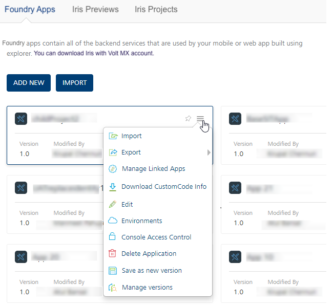
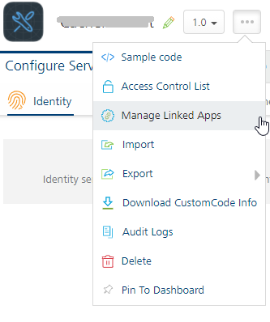
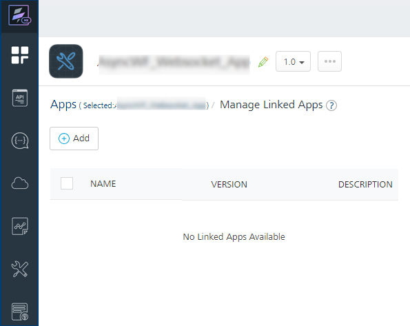
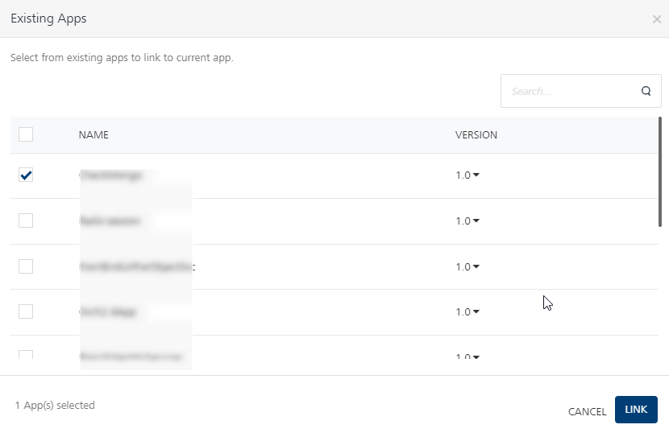
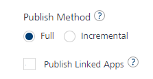
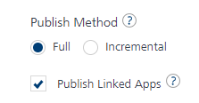
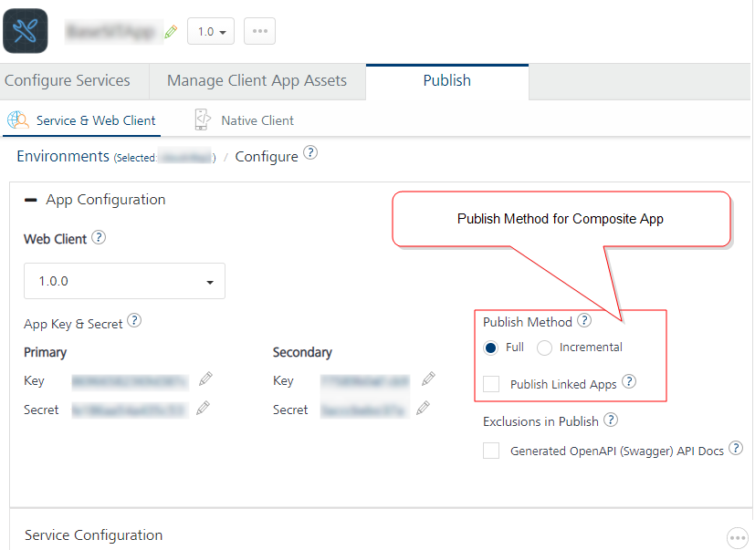
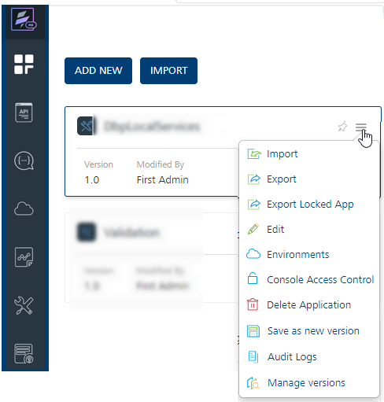
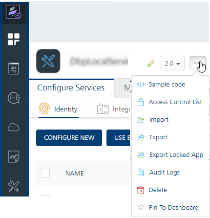

Managing Linked Apps in a Composite Foundry App
================================================

VoltMX Foundry supports Manage Linked Apps (app modularity) feature that allows linking one ore more Foundry apps into another Foundry apps - composite apps. The services of the linked apps will be accessible to the client applications mapped to the composite app.  

Micro-apps and Composite apps are all Foundry apps with certain conditions as follows:

*   Micro-App (linked app): A micro-app is a regular Foundry app fulfilling a single module of a feature. A micro-app should be able to work as an independent app, for example, a Iris application can link to the micro-app. Each micro-app is capable of serving a specified business domain or functionality.  

*   Composite App (parent app): A composite app is a regular Foundry app, with additional information about a list of other Foundry apps that are linked to it. It allows multiple micro-apps to be added and removed from them.

    > __**Note:**__ Currently only 1 level of app linkage is allowed. This implies that micro-apps can be linked into composite apps, but a composite app (containing a linked micro-app) cannot be linked into another composite app.

The Manage Linked Apps feature helps to improve the Foundry app development aspects as follows:

### **App Modularity**

**Use case**: When partners build vertical-based solutions like Infinity, the Client and Foundry applications are currently shared with customers. Customers can make changes to the application to meet their business requirements. When Infinity releases a new version, customers are expected to upgrade to the new version. For example, Accounts, Loans, Credit cards, and Wealth Management. The app can contain updated services, which are useful for customers, and the non-impacted services may not be relevant. This results in time-consuming because users have to take updates even if they do not use the feature.

Using the Managing Linked Apps functionality (modularity) allows you to link Foundry apps.

You need to break down the Infinity project into small Foundry apps. You can group each functionally as a Foundry app (called micro-app). You can then link the required apps to form a functional custom composite app. The service doc of a Composite app reflects the services of composite app + dependent micro-apps. For example, services of linked micro-apps can now be invoked via the App key/secret of a composite app. Customers can choose to upgrade to a certain module if they want to do so.

## How Authentication Works in a Composite App

Identity providers of a composite app and its linked apps can be used by the composite app to log in and to access protected services belonging to both the composite app and linked apps.

For example,

*   A composite app has Salesforce log in details
*   Linked app_1 has configured with Google identity provider
*   Linked app_2 has configured with Facebook identity provider

In this case, the Composite Foundry app can use any of its own providers (Salesforce) or its linked app providers (Google and Facebook) for logging and accessing its own protected services or the protected services of its linked apps.

## How to Create Composite Apps in Foundry Console

The following sections will help you on how to link apps to a Foundry app and publish the app using Foundry Console:

*   [Linking and Unlinking Apps to a Composite Foundry App](#LinkMicroApps)
*   [Publishing a Foundry Composite App](#Publish1Compositeapp)

### Linking and Unlinking Apps to a Composite Foundry App

Multiple micro apps can be linked or unlinked from a composite app using the **Manage Linked Apps** page. Composite Foundry apps allow the services from the linked apps as well accessible to the client applications using the app key and secret of the composite app.

To link a Foundry app to another Foundry app, follow these steps:

1.  Log in to the Foundry Console.
2.  In the **Apps** page, hover your cursor over the App menu button of the app and then click **Manage Linked Apps**.

    

    > __**Note:**__ You can access the Manage Linked Apps option within the app when the app is selected.   

    

3.  In the **Manage Linked Apps** page that appears.

    

    > __**Note:**__ You can link new apps to the selected composite Foundry app by clicking the **Add** button on the **Manage Linked Apps** page.    
    > You can navigate to the composite app by clicking the `Selected:<CurrentParentAppName>` in the **Manage Linked Apps** page.

4.  In the **Manage Linked Apps** page, do the following:
    *   To link apps, click **Add** button. The **Existing Apps** dialog appears with a list of existing apps.

        

        1.  Select the check box for the required app/s and the version.
        2.  Click **LINK**.
        3.  In the **Linked Apps** dialog that appears with the apps linked status, click **CLOSE**.  
            All the linked apps are displayed on the **Manage Linked Apps** page

    > __**Note:**__ After apps are linked to a Foundry app, you can unlink the linked apps or navigate to the linked apps using the **Manage Linked Apps** page.

    *   To unlink the linked apps:
        1.  Select the check box for the required app/s and version.
        2.  Click **Unlink**.
        3.  In the **Unlink Linked Apps** dialog that appears with the apps linked status, click **CLOSE**.
    *   To navigate to the linked apps, click on any of the linked apps from the list. The selected app will be opened.

    The following sections detail how to publish a composite app and linked apps.

### Publishing a Foundry Composite App

*   [Case 1: First publish of a composite app or the first publish after unpublish the app](#Direct)
*   [Case 2: Publish Linked Apps is not selected](#Publish2Compositeapp)
*   [Case 3: Publish Linked Apps is selected](#Publish3Compositeapp)
*   [Full or Incremental Publish behavior for Composite App and Linked Apps](#Full)

#### Case 1: First publish of a composite app or the first publish after unpublish the app.

By default, all linked apps will be published while publishing the composite app.

1.  Navigate to your composite app in Foundry Console.
2.  Click **Publish** tab.
3.  Select an environment.
4.  Click **PUBLISH.**

The following table details a sample composite app and linked apps, and the results of the direct publishing of the composite app:

<table>
<tr>
<th>Sample Composite Foundry App has linked apps with versions</th>
<th>Results of direct publish a composite app and linked apps for the first time</th>
</tr>
<tr>
<td>

CompositeApp V1.0

<ul>
<li>micro1 V1.0</li>
<li>micro2 V1.0</li>
<li>micro3 V1.0</li>
</ul>
</td>
<td>

The entire composite app and linked apps are published for full app publish whenever direct publish is performed for the composite app.

For example: <code>CompositeApp V1.0 ->(micro1 V1.0, micro2 V1.0, micro3 V1.0)</code>

</td>
</tr>
</table>

> __**Important:**__ Unpublish of a composite app does not result in the unpublish of linked apps. If you want to unpublish linked apps, you need to unpublish each of them independently.  

#### Case 2: Publish Linked Apps is not selected

After the first publish, the publish checks if each linked app has already been published, and if not, those specific linked apps will be included for publish along with composite app. The linked apps which are missing publish can be due to new app linkage or existing linked app independently is unpublished.

1.  Navigate to your composite app in Foundry Console.
2.  Click **Publish** tab.
3.  Select an environment.
4.  Click **CONFIGURE & PUBLISH.**
5.  Clear the **Publish Linked Apps** check box to not to include linked apps for publishing.

    

6.  Click **SAVE & PUBLISH**.

The following table details a sample composite and linked apps, and the results of the publishing composite app without linked apps:

<table>
<tr>
<th>Sample Composite Foundry App has been modified as follows:</th>
<th>Results when Publish Linked Apps is not selected</th>
</tr>
<tr>
<td>

CompositeApp V1.0 (previously published)

<ul>
<li>micro1 V1.0 (already published)</li>
<li>micro2 V1.0 (modified after previous publish)</li>
<li>micro3 V1.0 (unpublished)</li>
<li>micro4 V1.0 (new app)</li>
</ul>
</td>
<td>

<code>CompositeApp V1.0</code> ->(micro1 V1.0, micro2 V1.0, micro3 V1.0, <code>micro4 V1.0</code>)

<ul>
<li><b>Composite app</b> will be republished.</li>
<li><b>Newly linked apps</b> that are not published will also be published.
For example: micro4 V1.0</li>
<li><b>Unpublished linked apps:</b> Linked apps which are in unpublished state will also be published by default.For example: micro3 V1.0</li>
<li><b>Linked apps</b> that are already published will not be republished.For example: The following linked apps are never published.
    <ul><li>micro1 V1.0 and micro2 V1.0</li></ul>
</li>
</ul>
</td>
</tr>
</table>

#### Case 3: Publish Linked Apps is selected

In this case, publish operation publishes the composite app along with all linked apps. This helps include any changes to the linked apps post the initial publish.

1.  Navigate to your composite app in Foundry Console.
2.  Click **Publish** tab.
3.  Select an environment.
4.  Click **PUBLISH.**
5.  In the **App Configuration > Publish Method** select **Full** or **Incremental** for the composite app.
6.  Select the **Publish Linked Apps** check box to include linked apps for publishing.

    

7.  Click **SAVE & PUBLISH**.

The following table details a sample composite and linked apps, and the results of the composite app publishing with linked apps:

<table>
<tr>
<th>Sample Composite Foundry App has been modified as follows:</th>
<th>Results when Publish Linked Apps is selected</th>
</tr>
<tr>
<td>

CompositeApp V1.0 (previously published)

<ul>
<li>micro1 V1.0 (already published)</li>
<li>micro2 V1.0 (modified after previous publish)</li>
<li>micro3 V1.0 (unpublished)</li>
<li>micro4 V1.0 (new app)</li>
</ul>
</td>
<td>

<code>CompositeApp V1.0 ->(micro1 V1.0, micro2 V1.0, micro3 V1.0, micro4 V1.0)</code>)

<ul>
<li><b>Composite app</b> will be republished.</li>
<li><b>Published linked apps</b> hat are already published and have been modified will be republished. 
<blockquote><em><b>Important: </b></em> The Publish Method option set for each of the linked app determines if a linked app publish is Full or Delta publish.</blockquote>
For example: The following all linked apps are republished:
    <ul><li>micro1 V1.0</li><li>micro2 V1.0</li><li>micro3 V1.0</li></ul>
</li>
<li><b>Newly linked apps</b> and <b>unpublished linked apps</b> that are not published will also be published.For example: micro4 V1.0</li>
</ul>
</td>
</tr>
</table>

#### Full or Incremental Publish behavior for Composite App and Linked Apps  

During app publishing, Volt MX Foundry allows you to reconfigure certain default values of app prior to publishing.

> __**Important:**__ [Publish Method > Incremental Publish (Delta Publish)](Publish.md). The option selected by the respective app is only applied when publishing a particular composite or linked app. A Composite app’s option does not impact a linked app’s delta publish behavior.  

 

> __**Important:**__ Only when the **Publish Method** is set to **Incremental** in the linked app (micro1), the micro1 app is published for delta publish while publishing the composite app.  

### MFCLI Commands for Publishing Composite Apps

###  --publishMicroApps parameter for MFCLI Publish Composite Apps

From V9SP3, Publish command will now accept an additional parameter called ‘publishMicroApps’. If you specify the parameter in the Publish command, it will publish all dependent micro apps as well.

####  _MFCLI Command to publish a composite app along with dependent linked apps_

`--publishMicroApps:`  

*   to publish dependent linked apps as well, specify the additional parameter in the MFCLI Publish command:
    `java -jar mfcli.jar publish -a <appName> -e <envName> --publishMicroApps`  

*   to publish only the composite app without dependent linked apps, do not specify the parameter in the MFCLI Publish command:
    `java -jar mfcli.jar publish -a <appName> -e <envName>`

###  -mfConsoleVersion Parameter for MFCLI Publish Foundry Console Version

From V9SP3GA, the MFCLI Publish command accepts an additional parameter called ‘mfConsoleVersion’. This console version needs to be specified for older Foundry versions. This param has bee added to support the backward compatibility.

#### _MFCLI Command to Publish Foundry Console version from V9SP3 GA_

`mfConsoleVersion`  

*   To publish apps to Foundry Cloud V9.3.0.0. or higher:
    `java -jar mfcli.jar publish -a <appName> -e <envName> --mfConsoleVersion 9.3.0.0`  
       _**Note:**_ This is an optional parameter in case you are using the same Foundry version with matching mfcli.jar version. In this case, if the parameter is not specified, the publish command considers your current mfcli jar release version for publishing.

*   if the Foundry version and the mfcli.jar version are not the same, you need to specify this parameter indicating which Foundry version the publish is being done to for the publish to be successful. Otherwise, the publish fails.
For example, if you are using Foundry V9.2 or lower and mfcli.jar V9.3 or higher, you need to specify as shown below:
    `java -jar mfcli.jar publish -a <appName> -e <envName> --mfConsoleVersion 9.2.0.0`  

###  --IncludChildApps Parameter for MFCLI object-services-meta command

From V9SP3, the Object services meta command will now accept an additional parameter called ‘includeChildApps’. If you specify the parameter in object-services-meta command, it will list the object services of the composite app and the linked apps.

#### _MFCLI Command to get object service meta for acomposite app with linked apps_ 

`--includeChildApps:`  

*   To get an object service meta for a composite app with linked apps, specify the flag as below:
    `java -jar mfcli.jar object-services-meta -a <app name> [-v <app version>] -e <environment name> --includeChildApps`  
    

*   to get an object service meta data of a composite app without dependent linked apps, do not specify the parameter in the MFCLI Publish command:
    `java -jar mfcli.jar object-services-meta -a <app name> [-v <app version>] -e <environment name>`  

*   For more information on MFCLI commands, refer to [Continuous Integration with Volt MX Foundry](CI_Foundry.md).

*   For more information on how to import and link a composite app in a Volt MX Iris project, refer to [Micro Applications in Volt MX Iris](../../../Iris/iris_microapps/Content/MicroApp.md).

<!-- ### App Modularity  

**Use case**: When partners build vertical-based solutions like Infinity, currently the Client and Foundry applications are shared with customers. Customers make changes to the application to meet their business requirements. When Infinity releases a new version, customers are expected to upgrade the entire new version, which is time-consuming and is error-prone.

By using the Managing Linked Apps functionality, you can clearly demarcate the base functionality of Infinity project into smaller components and by linking of them into to a Foundry app. Then, based on the customer’s requirement, the required modules can be combined together to form a functional app.

The modularity angle of Infinity projects requires us to think of breaking up a VoltMX project into multiple smaller components, each around a particular feature. Then, based on the customer’s requirement, the required modules can be combined together to form a functional app.

The customer would also be able to then upgrade only a certain modules, if they wish to do so

The app modularity of Foundry apps involves the following three aspects in it.

1.  Dividing a Foundry app into smaller apps.
    *   These are called Micro apps (modules/child apps).
    *   A Micro App - An application fulfilling a single module of a feature. A micro app should be able to work as an independent app, for example, a Iris application can link to the micro app.
    *   Each micro app is capable of serving a specified business domain or functionality.
2.  Linking the child Foundry apps to another Foundry app (composite/parent app).
    *   Composite App - A collection of micro apps, where each app is allowed to be accessed using the composite apps app key, secret.
    *   Functionally, a composite app is a regular Foundry app, with the additional information about a list of other Foundry apps that are linked to it.
    *   Composite apps allow multiple micro apps to be added and removed from them.
    *   Currently only 1 level of app linkage. This implies that micro apps can be linked into composite apps, but a composite app (containing a linked micro app) cannot be linked into another composite app.
        
        The apps linked to a Foundry app can be controlled from a new **Manage Linked Apps** page that lists the apps presently linked to the app, and also allows you to link in more apps, or unlink existing apps.
        
3.  Publish Composite apps: During Composite app publish, you can publish only the composite app or composite app + all dependent micro apps separately,

#4 Service doc of Composite app shall reflect the services of composite app + dependent micro apps - i.e. services of micro apps can now be invoked via App key/ secret of composite app

The Locking of an app helps to improve the Foundry app development aspects as follows:

Extensibility:

\-----

*   Micro apps, composite apps are all foundry apps, with certain conditions.

The following sections detail you with more information on Lock App functionality:

*   Linking and Unlinking Child Apps to a Composite Foundry App
*   Publishing Foundry Composite Apps
    *   Direct Publishing Foundry Composite Apps
    *   Publishing Parent App and the Linked Child Apps Independently a Composite Foundry App
    *   Publishing Only Parent App of a Composite Foundry App

### Linking and Unlinking Child Apps to a Composite Foundry App

Only a user with an Owner role can lock Foundry apps. When a Foundry app is locked, the base app configurations are set to read-only, including some that are replaceable.

To lock an app, follow these steps:

1.  Log in to the Foundry Console with user credentials that have an Owner role.
2.  In the **Apps** page, hover your cursor over the App menu button of the app and then click **Manage Linked Apps**.
    
    
    
    You can access the Export Locked App option within the app when the app is selected.  
    
    
3.  In the **Manage Linked Apps** page that appears, click **Add** button.
    
    
    
4.  Click **Add**. The **Existing Apps** dialog appears with the list of existing apps.
    
    
    
    1.  Select the check box for required app/s and the version.
    2.  Click **LINK**.
    3.  In the **Linked Apps** dialog that appears with the apps linked status, click **CLOSE**.
    
    All the linked apps are displayed in the **Manage Linked Apps** page. The following sections detail how to publish a composite app and linked child apps.
    
    To unlink the linked apps, select the check box for the app in the **Manage Linked Apps** page and click the **Unlink**.
    

### 

Publishing a Foundry Composite Apps
----------------------------------

### Direct Publishing Foundry Composite Apps

The composite app and the linked apps are not published. In this case, you may want to publish the parent app as well as linked apps for the first time.

1.  Navigate to your composite app in Foundry Console.
2.  Click **Publish** tab.
3.  Select an environment.
4.  Click **PUBLISH.**

The follow table details a sample parent and the linked apps, and the result of the direct publish:

<table style="margin-left: 0;margin-right: auto;mc-table-style: url('Resources/TableStyles/Basic.css');width: 1000px;" class="TableStyle-Basic" cellspacing="0"><colgroup><col class="TableStyle-Basic-Column-Column1" style="width: 283px;"> <col class="TableStyle-Basic-Column-Column1" style="width: 242px;"> <col class="TableStyle-Basic-Column-Column1" style="width: 475px;"></colgroup><tbody><tr class="TableStyle-Basic-Body-Body1"><td style="background-color: #add8e6;text-align: center;" class="TableStyle-Basic-BodyE-Column1-Body1">
Sample Parent/Composite Foundry App has child apps with versions
</td><td class="TableStyle-Basic-BodyE-Column1-Body1" style="background-color: #add8e6;text-align: center;">Direct App Publishing</td><td class="TableStyle-Basic-BodyD-Column1-Body1" style="background-color: #add8e6;text-align: center;">Result of direct publish</td></tr><tr class="TableStyle-Basic-Body-Body1"><td class="TableStyle-Basic-BodyB-Column1-Body1" style="font-weight: normal;">
CompositeApp V1.0
<ul style="font-weight: bold;"><li style="font-weight: normal;">micro1 V1.0</li><li style="font-weight: normal;">micro2 V1.0</li><li style="font-weight: normal;">micro3 V1.0</li></ul></td><td class="TableStyle-Basic-BodyB-Column1-Body1">&nbsp;</td><td class="TableStyle-Basic-BodyA-Column1-Body1"><ul><li>The entire composite app and child apps are published for full app publish whenever direct publish is performed for the parent app.
For example: <code class="codefirst">CompositeApp V1.0 -&gt;(micro1 V1.0, micro2 V1.0, micro3 V1.0)</code>
</li></ul></td></tr></tbody></table>

### Publishing Parent App and the Linked Child Apps Independently of a Composite Foundry App

The composite has modifications to the parent app as well as child apps. In this case, you may want to publish parent app changes and already published linked apps.

1.  Navigate to your composite app in Foundry Console.
2.  Click **Publish** tab.
3.  Select an environment.
4.  Click **PUBLISH.**
5.  In the **App Configuration > Publish Method** select **Full** or **Incremental**.
6.  Select the **Publish Linked Apps** check box to include linked child apps for publishing, based on the each linked app Publish Method configuration.
    
    For example, the **Publish Method** is set to **Incremental** in the linked child app (micro1). So when the **Publish Linked Apps** check box is selected, the micro1 app is published for delta publish.
    
    
    
7.  Click **SAVE & PUBLISH**.

The follow table details a sample parent and the linked apps, and the result of the publish with linked apps:

<table style="margin-left: 0;margin-right: auto;mc-table-style: url('Resources/TableStyles/Basic.css');width: 1000px;" class="TableStyle-Basic" cellspacing="0"><colgroup><col class="TableStyle-Basic-Column-Column1" style="width: 283px;"> <col class="TableStyle-Basic-Column-Column1" style="width: 242px;"> <col class="TableStyle-Basic-Column-Column1" style="width: 475px;"></colgroup><tbody><tr class="TableStyle-Basic-Body-Body1"><td style="background-color: #add8e6;text-align: center;" class="TableStyle-Basic-BodyE-Column1-Body1">
Sample Composite Foundry App has <b>modified</b> child apps with versions and <b>newly added</b> child apps.
</td><td class="TableStyle-Basic-BodyE-Column1-Body1" style="background-color: #add8e6;text-align: center;">Publish with Linked Apps</td><td class="TableStyle-Basic-BodyD-Column1-Body1" style="background-color: #add8e6;text-align: center;">Result of publish with linked apps</td></tr><tr class="TableStyle-Basic-Body-Body1"><td class="TableStyle-Basic-BodyB-Column1-Body1">
CompositeApp V1.0
<ul><li style="font-weight: normal;">micro1 V1.0 (Incremental)</li><li>
micro2 V1.0 (Incremental)
</li><li>micro3 V1.0 (Full)</li><li>
micro4 V1.0 (new app)

&nbsp;
</li></ul></td><td class="TableStyle-Basic-BodyB-Column1-Body1"><ul><li>Publish &amp; Reconfigure &gt; Publish Method and</li><li>Publish Linked Apps option is selected to include micro apps publish method options for publishing.</li></ul></td><td class="TableStyle-Basic-BodyA-Column1-Body1">
<code class="codefirst">CompositeApp V1.0 -&gt;(micro1 V1.0, micro2 V1.0, micro3 V1.0, micro4 V1.0)</code>
<ul><li><b>Parent app</b> will be published based on the option selected in the Publish Method specific to the parent app.
For example:
<ul><li>CompositeApp V1.0 The parent app is published for Full Publish.</li></ul></li><li><b>Published linked child apps</b> which are already published and have been modified will be published.
<i>Important: </i></b>">The Publish Method option set for each of the linked apps is considered for publishing.

For example: The following childs apps <b>are published</b> either for Full or Delta publish:
<ul><li>micro1 V1.0 (app is published for Delta publish)</li><li>micro2 V1.0 (app is published for Delta publish)</li><li>micro3 V1.0 (app is published for Full publish)</li></ul></li><li><b>Newly linked child apps</b> which are not published will also be published for Full app publish by default.
For example: micro4 V1.0
</li></ul></td></tr></tbody></table>

### Publishing Only Parent App of a Composite Foundry App

The composite has modifications to the parent app as well as child apps. In this case, you may want to publish parent app changes and not already published linked apps.

1.  Navigate to your composite app in Foundry Console.
2.  Click **Publish** tab.
3.  Select an environment.
4.  Click **CONFIGURE & PUBLISH.**
5.  In the **App Configuration > Publish Method** select **Full** or **Incremental**.
6.  Clear the **Publish Linked Apps** check box.
    
    
    
7.  Click **SAVE & PUBLISH**.

*   Publish & Reconfigure > Publish Method
*   Publish Linked Apps option is not selected to exclude micro apps publish method options for publishing.

The follow table details a sample parent and the linked apps, and the result of the publish without linked apps:

<table style="margin-left: 0;margin-right: auto;mc-table-style: url('Resources/TableStyles/Basic.css');width: 1000px;" class="TableStyle-Basic" cellspacing="0"><colgroup><col class="TableStyle-Basic-Column-Column1" style="width: 244px;"> <col class="TableStyle-Basic-Column-Column1" style="width: 281px;"> <col class="TableStyle-Basic-Column-Column1" style="width: 475px;"></colgroup><tbody><tr class="TableStyle-Basic-Body-Body1"><td style="background-color: #add8e6;text-align: center;" class="TableStyle-Basic-BodyE-Column1-Body1">
Sample Composite Foundry App has <b>modified</b> child apps with versions and <b>newly added</b> child apps.
</td><td class="TableStyle-Basic-BodyE-Column1-Body1" style="background-color: #add8e6;text-align: center;">Publish without linked apps</td><td class="TableStyle-Basic-BodyD-Column1-Body1" style="background-color: #add8e6;text-align: center;">Result of publish without linked apps</td></tr><tr class="TableStyle-Basic-Body-Body1"><td class="TableStyle-Basic-BodyB-Column1-Body1">
CompositeApp V1.0
<ul><li style="font-weight: normal;">micro1 V1.0</li><li>
micro2 V1.0 (Incremental)
</li><li>micro3 V1.0 (Full)</li><li>
micro4 V1.0 (new app)
</li></ul></td><td class="TableStyle-Basic-BodyB-Column1-Body1">
&nbsp;
</td><td class="TableStyle-Basic-BodyA-Column1-Body1">
<code class="codefirst">CompositeApp V1.0 </code>-&gt;(micro1 V1.0, micro2 V1.0, micro3 V1.0, <code class="codefirst">micro4 V1.0</code>)
<ul><li><b>Parent app</b> will be published based on the option selected in the Publish Method specific to the parent app.
For example: CompositeApp V1.0 (Full publish). The parent app is published for Full Publish.
</li><li><b>Newly linked child apps</b> which are not published will also be published for Full app publish by default.
For example: micro4 V1.0

<i>Important: </i></b>">The new linked apps, which are not published, will always be published by default. 
</li><li>
<b>Linked child apps</b> which are already published and have been modified will <b>not</b> be published. 

<i>Important: </i></b>">The Publish Method option set for each of the linked apps are not considered for publishing.

For example: The following childs are <b>never published</b> either for Full or Delta publish in this case.
<ul><li>micro1 V1.0, micro2 V1.0, micro3 V1.0</li></ul></li></ul></td></tr></tbody></table>

### -->
