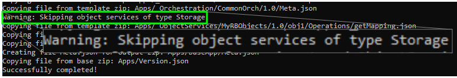
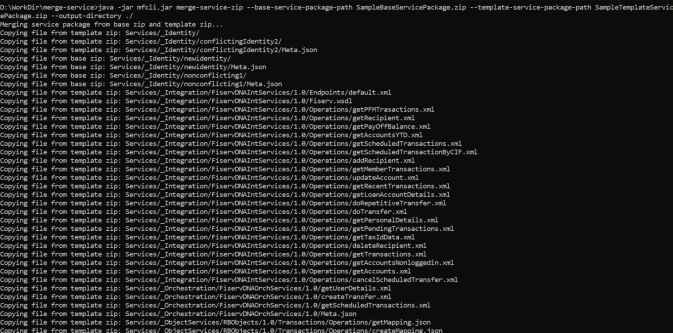
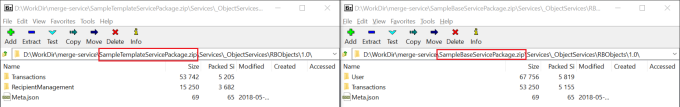
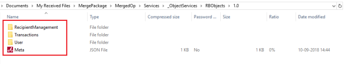
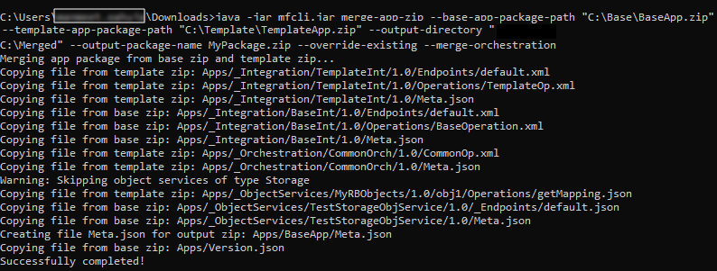

                                

User Guide: [VoltMX Foundry Command Line Utility - Continuous Integration](CI_Foundry.md) > [Merge Templates using MFCLI](#) > Merging Services

MFCLI command to Merge Exported Definitions
===========================================

The MFCLI tool is enhanced to enable importing and merging application templates into the base application functionality. MFCLI supports commands for merging base service packages with template service packages and base app packages with template app packages.


<details close markdown="block"><summary>**Merging a Template Foundry Service package into a Base Foundry Service package**</summary>

The `merge-service-zip` command merges a Template Foundry service zip package into a Base Foundry service zip package.

> **_Important:_** The merge-service-zip command does not support merging of Storage Services/Legacy Services (Logic Services/Offline Sync Services/IDE Services). If any these services exist in the base or template zip, the merge process skips them.  
  
  
\- Checking of service types (such as XML, JSON) within the same class (such as Integration) is not supported. In this case the merge happens, but the output can contain unexpected results.

Use the following command to merge the service packages. An output zip file (merged package from the base service package and the template service package) is created.

```
 java -jar mfcli.jar merge-service-zip --base-service-package-path <file path> --template-service-package-path <file path> --output-directory <directory path> [ --output-package-name <package name> ]  [ --override-existing ] [ --mergeOrchestration]
```

*   `baseServicePackagePath` - Path of the zip file that points to the base service zip.
*   `templateServicePackagePath`\- Path of the zip file that points to the template service zip.
*   `outputServicePackagePath` - Path where the output zip is created if the merge is successful.
*   `output-package-name` - Used to name the merged zip file.

> **_Note:_** A random name is generated if the name is not provided.

*   `override-existing` - If the parameter is provided in the command structure, the output file with the specified file name overwrites the existing file name (if the file exists). Else, it displays an error.
*   `mergeOrchestration` - If the parameter is provided, the command merges the operations of the Orchestration services, instead of overwriting it.  
    This can be seen in the Operation Mapping.  
    

During execution of the merge process, you can view the list of conflicts and set of specific services from both the packages. In case of a conflict due to service being available in both the base and template, the version from the template package overwrites the base version.



After the merge is successful, an output service package is created with services from both the base and template packages.

**Base and Template package files before merging**



**Output package created after merging is successful**



</details>
<details close markdown="block"><summary>**Merging a Template Foundry app package into a Base Foundry app package**</summary>

The `merge-app-zip` command merges a Template Foundry app zip package into a Base Foundry app zip package.

**Use Case**: You have developed several independent features as different services in a single app. In this case, a base app is developed and implemented with mock services. You want to replace them with a live implementation of services created in the template app. You can achieve this scenario by using the merge-app-zip command.

For example, the following tables details a sample base app and a Transaction (T24) template app with services and verbs in each, and the result of the merged based app version.

  
| Input | Base App V1.0 Base app has Object Services (RBObjects and TransactionObjects) with certain Verbs. | Transaction (T24) Template App Template app has Objects Services (RBObjects and TransactionObjects) along with the respective Verbs. |
| --- | --- | --- |
|   | RBObjects - Object - 10 Verbs TransactionObjects - Object - 5 Verbs | RBObjects - Object - 6 Verbs ( 5 from Base + 1 New) TransactionObjects - Object - 3 Verbs (2 from Base + 1 New) |
| Output | The output package after merging Base app V1.0 and Transaction (T24) Template app ||
| RBObjects - Object - 11 Verbs (10 from Base + 1 New) TransactionObjects - Object - 6 Verbs (5 from Base + 1 New) |||

> **_Important:_** The merge-app-zip command does not support merging of Storage Services/Legacy Services (Logic Services/Offline Sync Services/IDE Services). If any these services exist in the base or template zip, the merge process skips them.  
  
  
\- Checking of service types (such as XML, JSON) within the same class (such as Integration) is not supported. In this case the merge happens, but the output can contain unexpected results.

Use the following command to merge the app packages. An output zip file (merged package from the base app package and the template app package) is created.

```
 java -jar mfcli.jar merge-app-zip --base-app-package-path <file path> --template-app-package-path <file path> --output-directory <directory path> [ --output-package-name <package name> ]  [ --override-existing ] [ --mergeOrchestration]
```

*   `baseAppPackagePath` - Path of the zip file that points to the base app zip.
*   `templateAppPackagePath`\- Path of the zip file that points to the template app zip.
*   `outputPackagePath` - Path where the output zip is created if the merge is successful.
*   `output-package-name` - Used to name the merged zip file.

> **_Note:_** A random name is generated if the name is not provided.

*   `override-existing` - If the parameter is provided in the command structure, the output file with the specified file name overwrites the existing file name (if the file exists). Else, it displays an error.
*   `mergeOrchestration` - If the parameter is provided, the command merges the operations of the Orchestration services, instead of overwriting it.  
    This can be seen in the Operation Mapping.  
    

After the merge is successful, an output app package is created with services from both the base and template packages.


