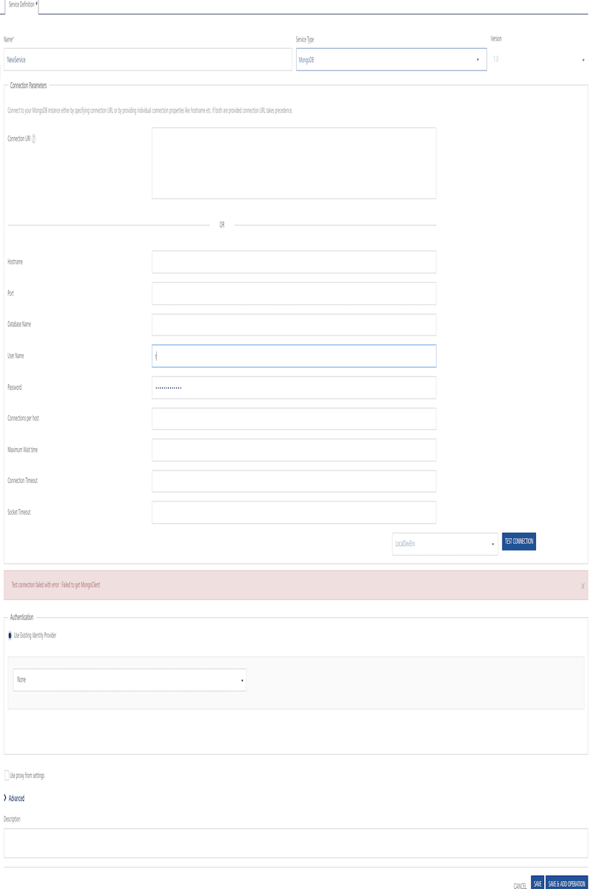
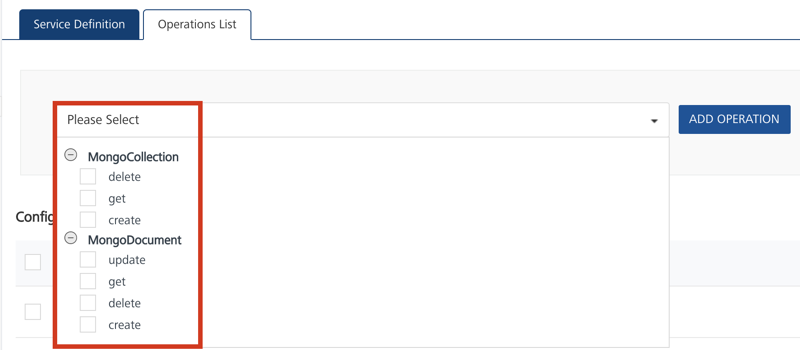
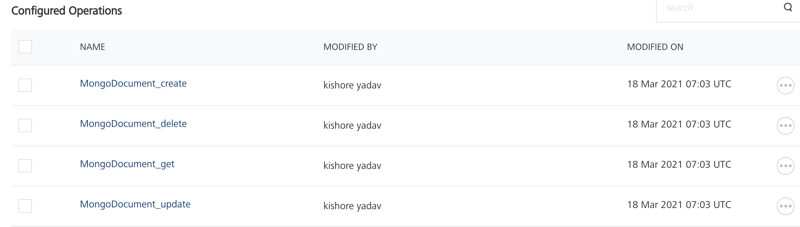

                                

User Guide: [Integration](Services.md#integration) \> [Configure the Integration Service](ConfigureIntegrationService.md) > MongoDB Adapter

MongoDB Data Adapter
--------------------

MongoDB is an open-source document database that provides high performance, high availability, and automatic scaling.

With VoltMX Foundry MongoDB database adapter, you can connect to your own MongoDB database as an endpoint. For example, you can use MongoDB data adapter to implement a data store that provides high performance, high availability, and automatic scaling such as e-commerce product catalog, blogs and content management, and mobile and social networking sites.

After you configure the MongoDB document database adapter in VoltMX Foundry Console, you can create, read, update and delete (CRUD operations) on MongoDB collections and documents.

Perform the following steps to configure the MongoDB database adapter with Volt MX Foundry:

*   [Configure a Service Definition for the MongoDB Adapter](#configure-mongodb-end-point-adapter)
*   [Create and Configure Operations for the MongoDB Adapter](#create-and-configure-operations-for-mongodb-adapter)

### Configure MongoDB End-point Adapter

To configure the MongoDB Adapter in the **[Integration service definition](ConfigureIntegrationService.md)** tab, follow these steps:

1.  In the **Name** field, provide a unique name for your service.
2.  From the **Service Type** list, select _MongoDB_. The following sections are displayed:
    
    *   Connection Parameters
    *   Authentication
    
    *   Advanced
    
    
    
3.  In **Connection Parameters**, you can either provide **Connection URI** or provide **Connection Properties**.
    *   **Connection URI**: If you want to provide Connection URI, you must construct the URI and create a MongoDB client instance to connect to the database server.  
        **Connection URI format:**  
        
        mongodb://\[username:password@\]host1\[:port1\]\[,host2\[:port2\],...\[,hostN\[:portN\]\]\]\[/\[database\]\[?options\]\].
        
          
        The elements required to construct a Connection URI are as follows:
        
        | Element | Description |
        | --- | --- |
        | mongodb:// | This is a mandatory prefix required to identify that this string is in standard connection format. Use a connection string prefix of mongodb+srv: rather than the standard mongodb: to leverage the DNS seedlist. The +srv is added as an indicator to the client that the hostname that follows it corresponds to a DNS SRV record. The driver or mongo shell will query the DNS for the record to determine the hosts that are running the MongoDB instances. |
        | username:password@ | This field is optional. Use this to add authentication to access the MongoDB database. |
        | **host\[:port\]** | Hostname, and port number. The port number is optional |
        | /database | Name of the database. This is optional. |
        | ?<options> | String that specifies the connection specific options as <name>=<value> pairs. |
        
    *   **Connection Properties**: If you want to provide Connection Properties, provide the following details:
        
        | Parameter | Description |
        | --- | --- |
        | Hostname | Database connection URL. |
        | Port | The port number of the MongoDb server to which you want to connect. |
        | Database Name | Name of the database name. |
        | User Name | User ID for the connection URL |
        | Password | User Password |
        | Connections per host | Maximum number of connections allowed per host. |
        | Maximum Wait time | Number in milliseconds that a thread may wait for a connection to become available. |
        | Connection Timeout | Number of milliseconds the driver will wait before a new connection attempt is aborted. |
        | Socket Timeout | Number of milliseconds a send or receive on a socket can take before timeout. |
        
4.  To test the database connection, click **Test Connection**.
    
    If the entered details are correct, the system displays the message: Valid Database connection details.
    
    > **_Important:_** If your database is configured with a proxy server, you must select an **environment** and then click **Test Connection** to test the database connectivity. The environment should be `=> V8.3`.  
      
    For example, you have the Volt MX Foundry Console installed on one machine, and the Runtime and Database servers installed on another machine. When you create an integration service of type MongoDB Database, the Console must be established with a VPN connection to the MongoDB Database server. So that, when you test the Database connection, the test case will be successful. You can do this by selecting the correct environment for your Runtime Server which will ensure a VPN connection between the Console and the Runtime Server and test the database. If the entered details are correct, the system displays the message: Valid Database connection details.
    
5.  In the **Authentication** section, you can select an identity provider from **Use Existing Identity Provider**. This drop-down lists the identity providers created for MongoDB data adapter in the Identity page. If you select any identity provider, you have to enter valid login credentials to access the database. Click **Test Login** and enter the credentials to verify the authentication service.

> **_Note:_** The Authentication section is optional.

6.  

For additional configuration of your service definition, provide the following details in the **Advanced** section.

    
      
    | Field | Description |
    | --- | --- |
    | Custom Code | To specify a JAR associated to the service, select one from the **Select Existing JAR** drop-down menu or click **Upload New** to add a new JAR file. Make sure that you upload a custom JAR file that is built on the same JDK version used for installing Volt MX Foundry Integration. |
    | API Throttling | If you want to use **API throttling** in Volt MX Foundry Console, to limit the number of request calls within a minute. do the following:
    In the **Total Rate Limit** text box, enter a required value. This will limit the total number of requests processed by this API.In the **Rate Limit Per IP** field, enter a required value. With this value, you can limit the number of IP address requests configured in your Volt MX Foundry console in terms of Per IP Rate Limit.
    
    To override throttling from Volt MX Foundry App Services Console, refer to [Override API Throttling Configuration](API_Throttling_Override.md#override-api-throttling-configuration). |

    > **_Note:_** The Advanced section is optional.

7.  Enter the **Description** for the service.
8.  Click **SAVE** or **SAVE & ADD OPERATION** to save your service definition.

### Create and Configure Operations for MongoDB Adapter

The **Operations List** tab appears only after you save the service definition. Alternatively, you can also click **Add > Add New Operation** to create or configure operations.

#### Create

**To create an operation, follow these steps:**

1.  Select the check boxes for operations available for the **MongoCollection** and **MongoDocument** entities.
2.  Click **Add Operation**. The selected operation is added to the **Configured Operations** list. The default name format of a database operation is  
    `<MongoCollection/MongoDocument>_<operation_name> and these names are auto-generated.`  
    For example, `MongoCollection_create`  and  `MongoDocument_create`.

Click to View image

#### Configure

After you create operations, they are configured with request and response parameters by default.

The following table details pre-configured parameters for request and response operations :

  
| MongoDB Operations | Request Parameters | Response Parameters |
| --- | --- | --- |
| MongoCollection\_Create | CollectionName | Collection name |
| MongoCollection\_Read | NA | Collection names |
| MongoCollection\_Delete | NA | NA |
| MongoDocument\_Create | Record CollectionName | MongoDocument DocumentID Record Collection name |
| MongoDocument\_Update | DocumentID Record Collection name | MongoDocument DocumentID Record Collection name |
| MongoDocument\_Get | OData Query | MongoDocument DocumentID Record Collection name |
| MongoDocument\_Delete | DocumentID Collection name | NA |

### Key Terminology and Concepts of MongoDB

MongoDB stores BSON documents, for example, data records in collections; the collections in databases.

Refer the following table for key terminology.

  
| Terminology | Concept |
| --- | --- |
| Database | In MongoDB, a database holds collections of documents. |
| Collection | A collection is analogous to a **table** of an RDBMS. A collection may store any number of documents. |
| Document/Object | A document in MongoDB is analogous to a record in RDBMS and it is a data structure composed of field and value pairs have the following structure: { field1: value1, field2: value2, ... fieldN: valueN } MongoDB documents are similar to JSON objects. The values of fields may include other documents, arrays, and arrays of documents. |
| Field | A name-value pair in a document. A document has zero or more fields. Fields are analogous to **columns** in relational databases. |

### Advantages of MongoDB Data adapter

**Following are the advantages of using MongoDB Adapter:**

*   Admins can connect to the given database.
*   Admins can manage the databases using CRUD operations.
*   Data types: All major data types are supported.
*   Volt MX supports three ODATA parameters for the read operation on MongoDB documents such as `$filter, $top,` and `$skip`.

### Limitations

**Following are the limitations to use the Volt MX Foundry MongoDB Adapter:**

*   Any CRUD operation which involves bulk activity using multiple Document IDs cannot be performed through this adapter.
