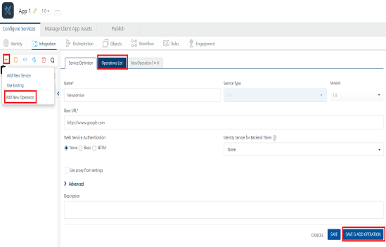
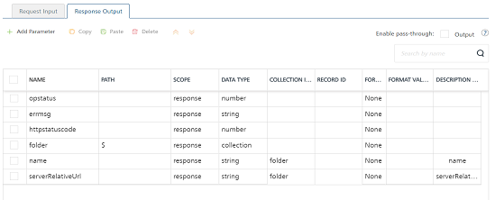

                                

User Guide: [Integration](Services.md#integration) \> [Configure the Integration Service](ConfigureIntegrationService.md) > MuleSoft Adapter

Mulesoft Adapter
----------------

MuleSoft (Anypoint Platform™) is a platform that helps app developers to design custom APIs and deploy to a Mule Enterprise Service Bus runtime (ESB). With MuleSoft integration service in Volt MX Foundry, developers can interact with more than 50 types of adapters.

To integrate a MuleSoft service in Volt MX Foundry, developers need to create a project in MuleSoft Studio, export the project to a local system, and then deploy it to Cloud Hub. On top of the project deployment, a RESTful API modeling language (RAML) file needs to be built, which defines all the API definitions in the project. A RAML file also contains the defined schemas with properties. When a user creates a project from AnyPoint API Studio with any adapter and builds a RAML file over the project, all the APIs can be used in Volt MX Foundry integration service. When a Volt MX Foundry user selects a MuleSoft adapter from Volt MX Foundry Console, based on the cloud hub portal credentials of the MuleSoft adapter, the system retrieves metadata from a RAML file and displays all APIs of a RAML file. Developers can add these APIs as operations in MuleSoft integration service in Volt MX Foundry Console.

Volt MX Foundry discovers the MuleSoft endpoints through a RAML file. Volt MX Foundry parses a RAML file and exposes all the MuleSoft endpoints through the integration service. Mobile app developers can use the configured MuleSoft integration service and access the backend systems supported by MuleSoft’s adapters.

> **_Note:_** In Volt MX Foundry Console, you can provide login credentials of MuleSoft or upload a RAML file to configure an integration service.

### Advantages

*   Developers can design custom APIs
*   Developers can use more than 50 types of connectors.

### Limitations

*   When an APIGroup is created, only one RAML file needs to be created. Multiple files are not supported.
*   Reconfiguration of apps during publish is not supported for MuleSoft.
*   The schema defined must always be in JSON format. XML schema is not supported.
*   API Gateway (On-premises / Cloud) and Mule ESB (On-premises) are not supported.

### Prerequisites

*   Log in to MuleSoft with your credentials at [https://anypoint.mulesoft.com/#/signin](https://anypoint.mulesoft.com/#/signin).
*   Download IDE of AnyPoint Studio (MuleSoft) from [https://www.mulesoft.com/platform/studio](https://www.mulesoft.com/platform/studio).
*   Create a project and deploy the project.
*   Build a RAML file. For more details, refer to MuleSoft Documentation at [https://developer.mulesoft.com/anypoint-platform](https://developer.mulesoft.com/anypoint-platform).

Adding a MuleSoft service involves the following steps:

*   [How to Configure Service Definition for MuleSoft Service](#configure-mulesoft-end-point-adapter)
*   [How To Create Operations for MuleSoft Service](#create-operations-for-mulesoft)
*   [How to Configure Operations for MuleSoft Service](#configure-request-operation-for-mulesoft)

### Configure MuleSoft End-point Adapter

To configure a Mulesoft adapter in [Integration Service Definition](ConfigureIntegrationService.md) tab, follow these steps:

1.  In the **Name** field, provide a unique name for your service. When you enter the name, the name is updated for the active service under the **Services** section in the left pane.
2.  From the **Service Type** list, select _Mulesoft_.
    
    > **_Note:_** XML is selected, by default.
    
3.  Provide the following details to create a SOAP service.
    
    | Fields | Description |
    | --- | --- |
    | Version | Select the version for the service. |
    | Choose API Discovery Type | 
    
    

Click one of the following modes

        
    *   **RAML File** - Select the option and upload RAML file from your local machine.
                        The system adds your RAML file to the console. The system displays the added RAML file's name under the **Choose API Discovery Type** section.
    *   **AnyPoint Platform URL** - Select this option and the system displays the MuleSoft URL in the text box.Under the 
    User ID and Password, provide valid log-in credentials that you created while registering with `MuleSoft AnyPoint` Platform. 

    > **_Note:_** You cannot modify the details in AnyPoint Platform URL.

    Click Test Login to test the Mulesoft connection details.

    

4. 

For additional configuration of your service definition, provide the following details in the **Advanced** section.
 
    
    | Field | Description |
    | --- | --- |
    | Custom code | To specify a JAR associated to the service, select one from the **Select Existing JAR** drop-down menu or click **Upload New** to add a new JAR file. Make sure that you upload a custom JAR file that is built on the same JDK version used for installing Volt MX Foundry Integration. > **_Important:_** Make sure that you upload a custom JAR file that is built on the same JDK version used for installing Volt MX Foundry Integration.For example, if the JDK version on the machine where Volt MX Foundry Integration is installed is 1.6, you must use the same JDK version to build your custom jar files. If the JDK version is different, an unsupported class version error will appear when a service is used from a device. |
    | API Throttling | If you want to use **API throttling** in Volt MX Foundry Console, to limit the number of request calls within a minute. do the following: In the **Total Rate Limit** text box, enter a required value. This will limit the total number of requests processed by this API.In the **Rate Limit Per IP** field, enter a required value. With this value, you can limit the number of IP address requests configured in your Volt MX Foundry console in terms of Per IP Rate Limit. *   To override throttling from Volt MX Foundry App Services Console, refer to [Override API Throttling Configuration](API_Throttling_Override.md#override-api-throttling-configuration). > **_Note:_** In case of On-premises, the number of nodes in a clustered environment is set by configuring the `VOLTMX_SERVER_NUMBER_OF_NODES` property in the Admin Console. This property indicates the number of nodes configured in the cluster. The default value is 1. Refer to [The Runtime Configuration tab on the Settings screen of App Services](../../../Foundry/vmf_integrationservice_admin_console_userguide/Content/Runtime_Configuration.md). The total limit set in the Volt MX Foundry Console will be divided by the number of configured nodes. For example, a throttling limit of 600 requests/minute with three nodes will be calculated to be 200 requests/minute per node. This is applicable for Cloud and On-premises. |
    | Use proxy from settings | To enable the proxy, select the check box. The **Use proxy from settings** check box dims when no proxy is configured under the **[Settings > Proxy](Settings.md#proxy)**. |

    

> **_Note:_** All options in the Advanced section are optional.
    
5.  Enter the **Description** for the service.
6.  Click **SAVE** to save your service definition.

### Create Operations for MuleSoft

The **Operations List** tab appears only after the service definition is saved.

> **_Note:_** Click **Operations List** tab > **Configure Operation**. The **Configured Operations** list appears.

**To create an operation, follow these steps:**

1.  Click **SAVE & ADD OPERATION** in your service definition page to save your service definition and display the **NewOperation** tab for adding operations.  
                        OR  
    Click **Add Operation** to add a new operation or from the tree in the left pane, click **Add > Add New Operation**.  

    

Click to View image

    
    
    
    > **_Note:_** To use an existing integration service, refer to [How to Use an Existing Integration Service](Manage_Existing_Integration_Services_1.md#how-to-use-an-existing-integration-service).

    

    
1.  In **Operations List** tab, click **Operation Name** list and select **Operations**.
2.  Click **Add Operation**. The **Operation List** tab appears.
3.  Provide the following details to configure operations.
    
    | Field | Description |
    | --- | --- |
    | Groups | Select the title of the RAML file that is uploaded at AnyPoint CloudHub. Based on the selected groups, the **Versions** drop-down list is loaded with the versions of the RAML file. |
    | Versions | Select the required version. You can select only one version of the RAML file. |
    | Resources | Select the required resource. |
    | Operation (HTTP Methods) | Select the required check boxes for the defined methods in the RAML file. You can click **Select all** check box to select all the operations. |
    
4.  Click **Add Operation**. The added operation appears under the **Configured Operations** section.
    
    The system creates a JSON service for the MuleSoft service. Operation names are auto-generated in the format. The default name format of a MuleSoft operation is `<operation_name><resource_name>`. You can change the operation name if required.  
    For example, `postfolder`.
    
5.  Once you create [operations](#create-operations-for-mulesoft) for MuleSoft service, you can configure the operations such as adding parameters, adding test values, and fetching the response. Under **Configured Operations**, hover your cursor over the create operation, click the **Settings>> Edit**.
    
    > **_Note:_** To edit an operation, you can also click the operation from the service tree pane.
    
    
    
    The system displays the selected operation in the edit mode. Provide the following details to configure the operation.
    
    | Fields | Description |
    | --- | --- |
    | Name | The **Name** field is pre-populated with fields names of the selected database. You can edit this field. |
    | Operation Security Level | It specifies how a client must authenticate to invoke this operation. |

Select one of the following security operations in the Operation Security Level field.

    
**Authenticated App User** – It restricts the access to clients who have successfully authenticated using an Identity Service associated with the app.**Anonymous App User** – It allows the access from trusted clients that have the required App Key and App Secret. Authentication through an Identity Service is not required.**Public** – It allows any client to invoke this operation without any authentication. This setting does not provide any security to invoke this operation and you should avoid this authentication type if possible.**Private** - It blocks the access to this operation from any external client. It allows invocation either from an Orchestration/Object Service, or from the custom code in the same run-time environment.

> **_Note:_** The field is set to Authenticated App User, by default.The **Operation Path** field is prepopulated with MuleSoft URL. You can edit this field if required. 

6.  

 response operations, provide the following details in the Advanced section.

    
    <table style="width: 100%;margin-left: 0;margin-right: auto;mc-table-style: url]('../Resources/TableStyles/Basic.css');" class="TableStyle-Basic" cellspacing="0"><colgroup><col class="TableStyle-Basic-Column-Column1" style="width: 174px;"> <col class="TableStyle-Basic-Column-Column1"></colgroup><tbody><tr class="TableStyle-Basic-Body-Body1"><td class="TableStyle-Basic-BodyE-Column1-Body1">Custom Code Invocation</td><td class="TableStyle-Basic-BodyD-Column1-Body1">You can add pre and post processing logic to services to modify the request inputs. When you test, the services details of various stages in the service execution are presented to you for better debugging. All options in the Advanced section are optional. For more details, refer to <a href="Java_Preprocessor_Postprocessor_.html" target="_blank">Preprocessor and Postprocessor</a>.</td></tr><tr class="TableStyle-Basic-Body-Body1"><td class="TableStyle-Basic-BodyE-Column1-Body1">Additional Configuration Properties</td><td class="TableStyle-Basic-BodyD-Column1-Body1">Additional Configuration Properties allows you to configure service call time out cache response. For information on different types of configuration properties, refer <a href="Java_Preprocessor_Postprocessor_.html#timeout_cachable" target="_blank">Properties</a>.</td></tr><tr class="TableStyle-Basic-Body-Body1"><td class="TableStyle-Basic-BodyB-Column1-Body1">Front-end API</td><td class="TableStyle-Basic-BodyA-Column1-Body1">Front-end API allows you map your endpoint ](or) backend URL of an operation to a front-end URL. For detailed information, refer Custom <a href="FrontEndAPI.html" target="_blank">Front-end URL</a>.</td></tr><tr class="TableStyle-Basic-Body-Body1"><td class="TableStyle-Basic-BodyB-Column1-Body1">Server Events</td><td class="TableStyle-Basic-BodyA-Column1-Body1">Using Server Events you can configure this service to trigger or process server side events. For detailed information, refer <a href="ServerEvents.html">Server Events</a>.</td></tr></tbody></table>
    
    

    > **_Note:_** All options in the **Advanced** section for operations are optional.
    
7.  Enter the **Description** for the operation.

### Configure Request Operation for MuleSoft

Integration services accept only `form-url-encoded` inputs for all input parameters provided in service input parameters (request input).

You can perform the following actions in **Request Input** tab:

1.  Click **Add Parameter**  to add an entry (if the entries for input and the output tabs does not exist).
2.  To make duplicate entries, select the check box for the entry, click **Copy** and **Paste**.
3.  To delete an entry, select the check box for an entry and click **Delete** .
4.  Under the **Body** tab, perform the following actions:
    1.  To forward the body of the client's request to backend as it is, select the **Enable pass-through input body** check box. For more details on API Proxy service, refer to [How to Enable Pass-through Proxy for Operations](API_Proxy_Adapter.md#how-to-enable-pass-through-proxy-for-operations).
        
        
        
    2.  To configure parameters in the clients body, do the following:
        
        | Field | Description |
        | --- | --- |
        | Name | Enter the name for the request input parameter.> **_Note:_**  In the **Body** tab > **NAME** field, the input parameters are prepopulated based on the properties of the input schema of a RAML file. |
        | Value | Three different options are available in Volt MX Foundry under **VALUE** during configuration of any operation. When you start editing this field, dependent identity services are auto populated. These options primarily determine the source of the value of the header. > **_Note:_** The field is set to **Request**, by default. |
        | TEST VALUE | Enter a value. A test value is used for testing the service. |
        | DEFAULT VALUE | Enter the value, if required. The default value will be used if the test value is empty. |
        | Scope | Select request or session. This field is set to **Request**, by default.The default datatype for the selected column is loaded under **DATATYPE** field. |
        | Encode | Select the checkbox to enable an input parameter to be encoded. For example, the name New York Times would be encoded as _New_York_Times_  when the encoding is set to True. The encoding must also adhere the HTML URL encoding standards. |

        

Select request or session or Identity.

        *  **Request**: If this option is selected, the Integration Server picks the value pairs from the client's request during run time and forwards the same to the back-end.User has the option to configure the default value. This default value is taken if the request does not have the header.
        *  **Session**: If this option is selected, the value of header is picked from session context based on the user configuration.
        *  **Identity**: If this option is selected, you can filter the request parameters based on the response from the identity provider. For more details to configure identity filters, refer to [Enhanced Identity Filters - Integration Services](Identity_Filters_Integration.md). 
        

        
5.  Click the **Header** tab to provide the following customer headers, perform the following actions:
    
    
    
    You must provide the custom HTTP headers based on the operation. For example, post or get.
    
    1.  To configure parameters in the client's header, do the following:
        
        | Field | Description |
        | --- | --- |
        | Name | Provide custom HTTP headers required by the external source. |
        | Value | Three different options are available in Volt MX Foundry under **VALUE** during configuration of any operation. When you start editing this field, dependent identity services are auto populated. These options primarily determine the source of the value of the header. > **_Note:_** The field is set to **Request**, by default.> **_Note:_** If the header value is scoped as a **Request** (or) **Session** and the same header is accessed under the **Expression** header value, then the expression must be represented as $request.header (or) $session.header.**Example**: If a header 1 value is a request and header 2 value is an expression, then the value of the expression must be $Request.header1. |
        | TEST VALUE | Enter a value. A test value is used for testing the service. |
        | DEFAULT VALUE | Change the syntax, if required. The default value will be used if the test value is empty. |
        | SCOPE | Select request or session. The field is set to **Request**, by default. |
        | Description | Enter the **Description** for the request input. |

        

Select request or session or Identity.

        *  **Request**: If this option is selected, the Integration Server picks the value pairs from the client's request during run time and forwards the same to the back-end.User has the option to configure the default value. This default value is taken if the request does not have the header.
        *  **Session**: If this option is selected, the value of header is picked from session context based on the user configuration.
        *  **Identity**: If this option is selected, you can filter the request parameters based on the response from the identity provider. For more details to configure identity filters, refer to [Enhanced Identity Filters - Integration Services](Identity_Filters_Integration.md). 
        

        
6. To validate the details, click **Fetch Response**. You can refer to [Test a Service Operation](Test_a_Service_Operation.md) for the steps to test a service.The result of the operation appears.
    

### Configure Response Operation for MuleSoft

Click the **Response Output** tab to configure the fields of the table for displaying the data.

> **_Note:_** If you define parameters inside a record as the session, the session scope will not get reflected for the parameters.

In the **Response Output** tab, configure the fields of the table for displaying the data:

1.  The **Name** field in the Response Output tab is prepopulated with the properties of output schema of a RAML file.
    
    Enter the values for required fields such as name, path, scope, data type, collection ID, record ID, format and format value
    
    > **_Note:_** If you define parameters inside a record as the session, the session scope will not get reflected for the parameters.
    
2.  To validate the details, click **Test**. You can refer to [Test a Service Operation](Test_a_Service_Operation.md) for the steps to test a service. The result of the operation appears.
3.  Click **SAVE OPERATION**.
    
    > **_Note:_** You can view the service in the Data Panel feature of Volt MX Iris. By using the Data Panel, you can link back-end data services to your application UI elements seamlessly with low-code to no code. For more information on Data Panel, click [here](../../../Iris/iris_user_guide/Content/DataPanel.md#top).
