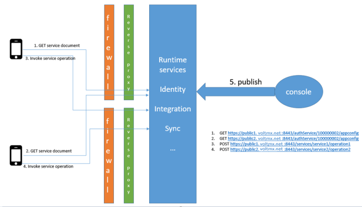

                               

User Guide: [Identity](Identity.md) > Support to MAP Public URLs - Reverse Proxy (on-premises)

Support to MAP Public URLs - Reverse Proxy (on-premises)
--------------------------------------------------------

In case of on-premises, if your Volt MX Foundry is installed behind a reverse proxy and registered using a private URL or IP, you will need to expose identity and services end-points as public URLs. A reverse proxy is configured for exposing public URLs and then routing them to private Volt MX Foundry URLs. When you create an Identity or Integration service, which is installed behind a reverse proxy, on Console, the service endpoints are exposed via intranet or private URLs during design time. You can access the service, however, via public URLs at runtime.

In some cases, there can be multiple reverse proxies depending on the region. For example, apps in **Region1** may access Volt MX Foundry via a reverse proxy in **Region1**, while the apps running in **Region2** may access Volt MX Foundry via a reverse proxy in **Region2**. In addition, the service endpoint URLs can be different when accessed from **Region1** vs **Region2**.

To get the desired results from private and public URLs, you must modify the mapping selection from public URLs to private URLs in the identity server.

### Sample Deployment Topology of Multiple Tenant URL Support in Identity Server



**API Commands to map Public URLs**

The following is a sample code to map Identity public URLs (`CUSTOM_TENANT_URLS`).

```
 POST https://mfprivate.hcl.net:8443/authService/api/v1/setup/tenants/100000002/properties 
With headers
X-VoltMX-Authorization: <auth token of admin>
Content-Type: application/json
Request payload:
{
    "name": "CUSTOM_TENANT_URLS",
    "value": "{\"https://public1.hcl.net:8443/authService/100000002\": \"https://public1.hcl.net:8443/authService/100000002\", \"https://public2.hcl.net:8443/authService/100000002\": \"https://public2.hcl.net:8443/authService/100000002\"}"
}

```

<!-- The following is a sample code to map service URLs (`CUSTOM_TENANT_SVC_URLS`).

```
 {
"name": "CUSTOM_TENANT_SVC_URLS",
"value": "{\"https://public1.hcl.net:8443/authService/100000002\":

{\"https://mfprivate.hcl.net:8443/services\": \"https://public1.hcl.net:8443/services\", \"https://mfprivate.hcl.net:8443/vpns\": \"https://public1.hcl.net:8443/vpns\", \"https://mfprivate.hcl.net:8443/syncservice\": \"https://public1.hcl.net:8443/ syncservice\" }
, \"https://public2.hcl.net:8443/authService/100000002\":

{\"https://mfprivate.hcl.net:8443/services\": \"https://public2.hcl.net:8443/services\", \"https://mfprivate.hcl.net:8443/vpns\": \"https://public2.hcl.net:8443/vpns\", \"https://mfprivate.hcl.net:8443/syncservice\": \"https://public2.hcl.net:8443/ syncservice\" }
}}"
}
``` -->

The following table details sample private and public URLs.

  
| URL | Type of URL |
| --- | --- |
|  https://mfprivate.hcl.net:8443 | Private URL |
|  https://public1.hcl.net:8443 | Public URL1 |
|  https://public2.hcl.net:8443 | Public URL 2 |

> **_Important:_** You must restart the Identity server after this configuration change.
