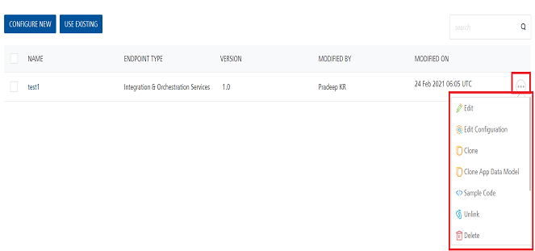

                              

User Guide: [Object Services](../Objectservices.md) > Context Based Options

Context Based Options
---------------------

To perform various actions on an existing service, click the contextual menu of the required service.

The contextual menu contains the following options:

*   **Edit**: Allows you to configure parameters of an object service.
*   **Edit Configuration**: Allows you to configure the Data Model and Mapping of an object service. After you edit a service, you have to republish all the apps that are using the service to apply the changes.
    
    > **_Note:_** To know more about publishing an app, refer to [Publish an app](../Publish.md).  
    
    > **_Note:_** If a service is part of a published app, you can rename that service only after the app is unpublished.
    
*   **Clone**: Allows you to duplicate an existing service. Changes made to a cloned service do not impact the original service.
*   **Clone App Data Model**: Allows you to duplicate only the data model of an existing object service. This option does not duplicate the verbs. Changes made to a cloned app data model service do not impact the original service.
*   **Sample Code**: A dynamic code is generated based on the configuration of a service. You can use this code in your SDK.
    
*   **Unlink**: Allows you remove the service from the **Objects** tab of an app. When a service is unlinked, it is disassociated from a particular app.
    
    > **_Note:_** If you want to use an unlinked service, select the service from the **Use Existing Objects Service** dialog box.
    
*   **Delete**: Allows you to delete a service.
    
    > **_Note:_** If a service is a part of a published app, you can delete that service only after you unlink the service from all the published apps.
    
*   **Console Access Control**: Controls the access to the applications and services of apps.
    
*   **Export as XML**: Allows you to export the Object Service to your local system. The exported file is of .xml format.
    
*   **Export**: Allows you to export the Object Service to your local system. The exported file is of .ZIP format.
*   **Audit Logs** helps you to capture all the user activities performed in a service. **Object Name**, **Object Type** and **Modified On** fields are prepopulated with the **Service Name**, **Services**, and **Last 7 Days** respectively.
    
    For more information on Audit Logs, refer to [Audit Logs](../Settings_Cloud.md#audit-logs-cloud) documentation.
    
*   **Validate**: Allows you to validate the Object Service.
