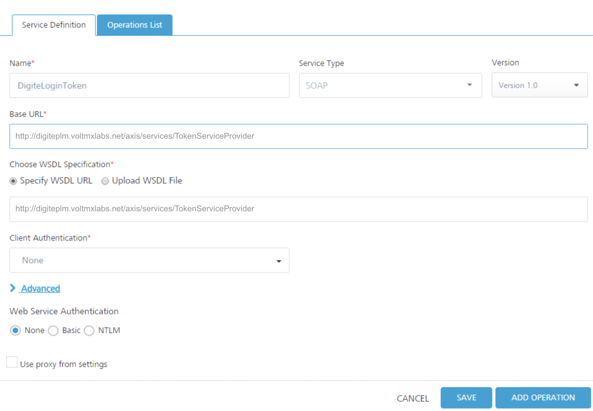
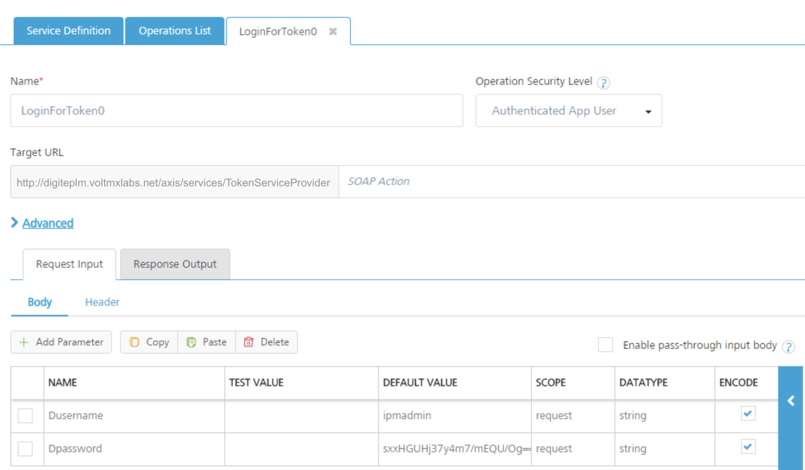
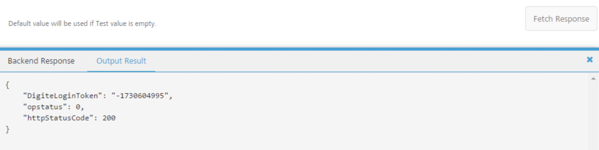
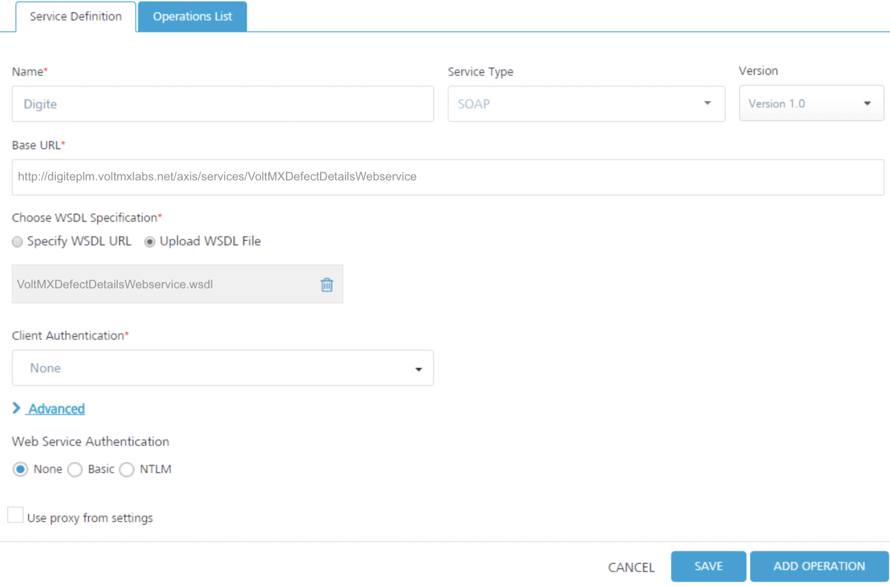
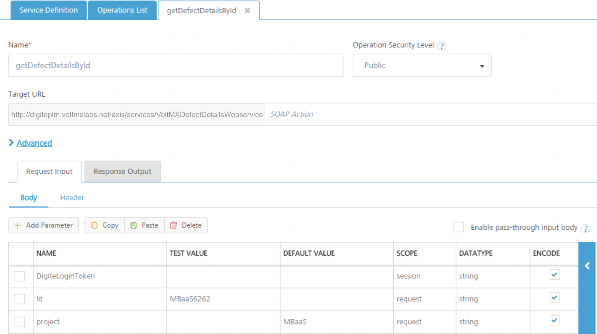
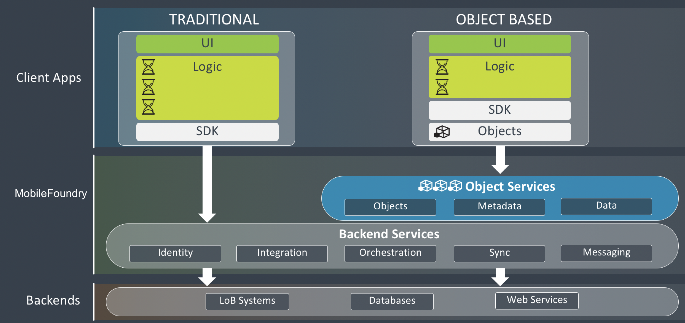
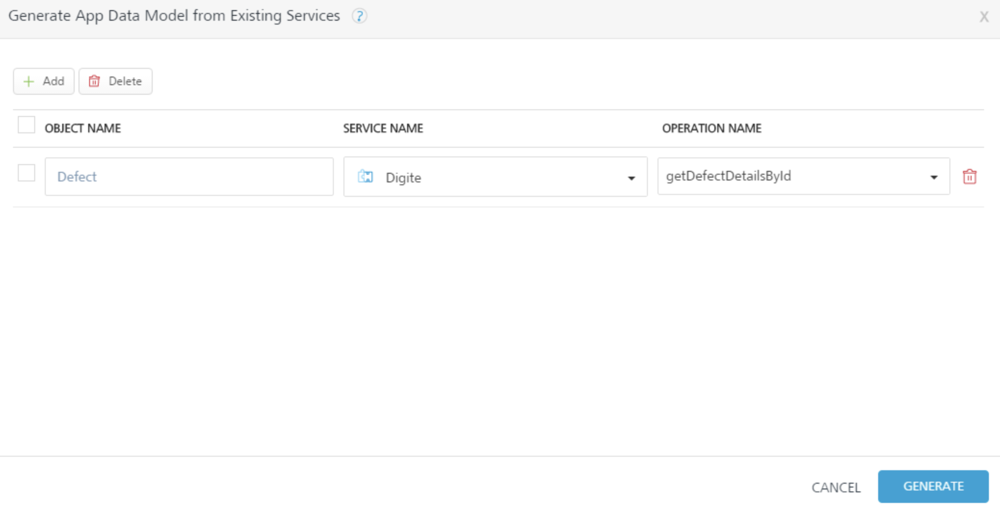
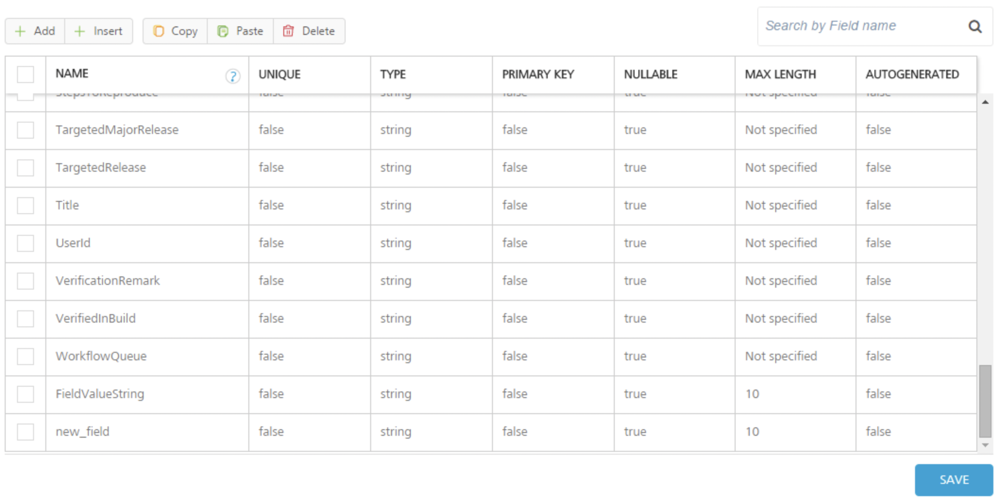
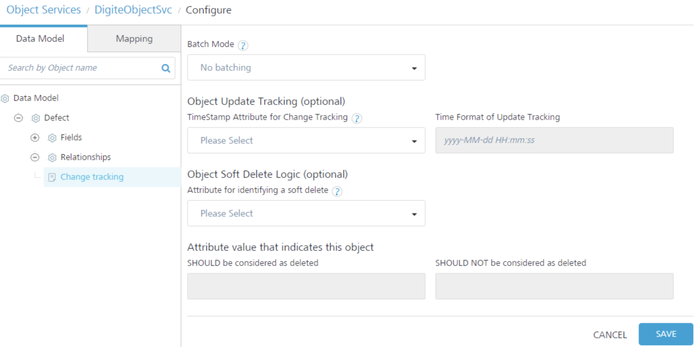
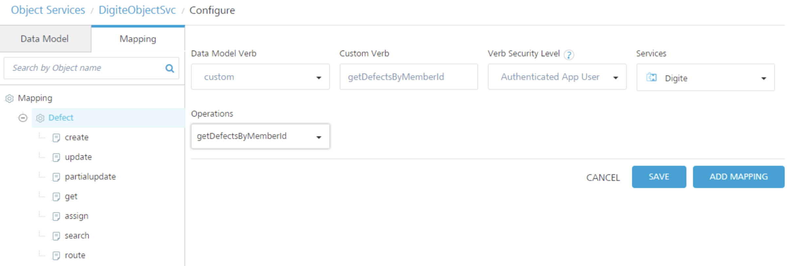

## Create a <madcap:keyword term="service-driven object;Object Services:service-driven">Service-Driven Object Service</madcap:keyword>

You create a service-driven object from existing VoltMX Foundry Integration services or VoltMX Foundry Orchestration services. If you have built Integration or Orchestration services in VoltMX Foundry, you can use Object Services to build objects out of those services. A service-driven object service abstracts some of the API complexity by creating a layer in between the app data model mapped to Integration services on the back end.

Create a service-driven object by using an existing VoltMX Foundry Integration service or Orchestration service to connect to a back end. These are objects that you can define from existing API's; for example, REST, SOAP, and XML. You use one API to create the object in the back end, and one API to get the object from the back end.

For example, instead of the client developer having to call _get accounts_ or _modify accounts_ APIs, you generate client code to give the client developer who has an account object that has all that knowledge built into it. The client developer programs against the object and does not have to call APIs.

In VoltMX Foundry you see all the attributes the API returns, and then you generate or enter the fields of the objects that you map to the attributes from the API. If your application needs data that does not exist on any back end, the service-driven object can also be the storage provider for a mobile app.

### Example: Create a Service-Driven Object

The section uses an example to show and explain how a service-driven object works. In the example, a service-driven object is created for a defect tracking system. For example, you can work with an existing defect object or create a new defect object.

The first step in creating a service-driven object for the defect management system is to create the integration services. An integration service definition comprises the metadata or the configurations required to exchange data with the external data source. The defect management system is a SOAP service, so you upload the WSDL to create an integration service from that WSDL, and then choose the methods that you want to use.

With the integration services, you can develop a mobile app traditionally. You now have the REST APIs that you can use to build the mobile app by using the VoltMX Foundry SDK. To take it further, you can use Object Services to construct your data model, get the methods, and map those methods to the API. The object services layer is built on top of the integration services and gives you the generated object code, which reduces the amount of logic you have to write in your mobile app.

Scenario 1:  For the Salesforce back end while hitting the **Test**  tab in **Object Services**, which are created on top of the integration services by the identity provider, the following are the headers that are to be passed from the admin console:  
   `x-voltmx-sfdc-access-token`  
   `x-voltmx-sfdc-instance-url`  

And for `x-voltmx-sfdc-access-token`: The token, which is generated from the integration service that has `Bearer` in the beginning should be removed and then sent the request.  

Scenario 2:  For Salesforce back end while hitting the **Test** tab in **Object services**, which are created on top of the integration services with specify endpoint, use  `Authorization` in the headers that you can get from using log-in service. To hit the both the above scenarios from the RestClient or PostMan, only `X-voltmx-Authorization` should be sent as a header.

### Create the Integration Service

The app for the defect tracking system requires two integration services. The first integration service gets a token from the back end. This token is needed to access the data in the defect management system. The second integration service is for performing operations on the defect management system.

DigiteLoginToken Service

The first integration service is named DigiteLoginToken. The type of integration service is SOAP. The given base URL is specified, and the given WSDL URL is specified.

The DigiteLoginToken service has one operation, LoginForToken0\. The operation provides the parameters for the username and password for the defect management system.

If you click **Fetch Response**, the defect management system back end returns a token in the output result. The token that must be sent along with every request to access data in the back end.

Digite Service

The second integration service is named Digite. The type of integration service is SOAP. The given base URL is specified, and the given WSDL file to upload to the VoltMX Foundry app is specified.

The Digite integration service has operations for accessing and performing actions on the defect management system.

The **getDefectDetailsById** operation includes the DigiteLoginToken parameter for passing the token that the back end expects with every request. The scope of the DigiteLoginToken parameter is **session**. This means that VoltMX Foundry picks up the parameter up from the session that is created for the app.

If you click **Fetch Response**, the service sends to the defect management system back end the **DigiteLoginToken** that was retrieved earlier. The service also sends the defect ID and project parameters. The back end will respond by sending all the details related to the specified defect ID, MBaaS6262, in the specified project, MBaaS.

Traditional App Development and <madcap:keyword term="object-based app development">Object-Based App Development</madcap:keyword>

With the integration services complete, you have imported the WSDL from the defect tracking system and turned it into a REST API. You can stop at this point and proceed to develop the client app in the traditional way by simply calling those new REST APIs from the client app. Or you can go to the Objects tab and perform a few extra steps to turn the WSDL into a service-driven object, and reduce the amount of logic that you must write in the client app.

The following diagram shows the Object Services layer that is built on top of these other VoltMX Foundry services. When using VoltMX Foundry object services, the client developer is given an SDK and the generated client object code. This reduces the amount of logic that the client developer must write, and significantly reduces the effort required to develop the mobile app.

### Create a Service-Driven Object

Now we will go to the Objects and create a service-driven object from the integration services. The first step is to create an object service.

To create the object service, follow these steps:

1.  Click the **Objects** service tab.
2.  Click **Configure New**.
3.  Click in the **Name** field, and enter the name **DigiteObjectSvc**.
4.  Click in the Endpoint Type field. A drop-down menu appears. Select **Integration & Orchestration Services**.
5.  Click **Save & Continue**.
6.  Click **Generate**.

The **Generate App Data Model from Existing Services** screen appears.

8.  Click the **Add** button.
9.  Click in the **Object Name** field, and enter **Defect**.
10.  Click in the **Service Name** field. A drop-down menu appears. Select the **Digite** integration service.
11.  Click in the **Operation Name** field. A drop-down menu appears. Select **getDefectDetailsById**.

13.  Click **Generate**.

VoltMX Foundry generates the objects and the data model based on the getAccount and getContact operations in the Salesforce integration service. All the fields for the objects are populated from the union of what is sent to the specified operation and what is returned from the operation.

Now add three additional fields to the Defect object for this defect management system.

To add fields to the Defect object, follow these steps:

1.  In the Data Model navigation pane, click the plus button next to **Defect**, and click **Fields**.
2.  Click the **Add** button.
3.  In the new field that is added to bottom of the list, enter **FieldValueString** for the name of the new field.
4.  Click the **Add** button.

6.  In the new field that is added to bottom of the list, enter **Action** for the name of the new field.
7.  Click the **Add** button.
8.  In the new field that is added to bottom of the list, enter **Comment** for the name of the new field.
9.  Scroll up to the **ID** field.
10.  For the ID field, click Primary Key. Select **true**.
11.  Click **Save**.

Now configure <madcap:keyword term="change tracking;Object Services:change tracking">change tracking for the Defect object. Change tracking tracks the changes in the server database.</madcap:keyword>

To configure the change tracking, follow these steps:

1.  In the Data Model navigation pane, click **Change tracking** for the **Defect** object.
2.  Click in **Batch Mode**. A drop-down menu appears. Select **No batching** to indicate that the back end does not support batching.
3.  Click **Save.**

Now map the verbs for the Defect object. To perform operations beyond the basic create, read, update, and delete operations, you can create custom verbs.

To <madcap:keyword term="mapping:verbs;verbs:mapping">map the verbs for the Defect object, follow these steps:</madcap:keyword>

In addition to the built-in verb options, you can also create custom verbs for an object. For example, you can create the custom verb **assign**, and map it to the **assignDefect** operation on the back end. [Click here for more details.](Objectservices Stage3.htm#MappingVerbs)

To create and map the custom verbs for the Defect object, follow these steps:

1.  In the navigation pane, on the Mapping tab, click the **Defect** object.
2.  Click the **Add** button.
3.  Click in the **Data Model Verb** field. A drop-down menu appears. Click **custom**.
4.  Click in the **Custom Verb Field** and enter **assign**.
5.  Under **Verb Security Level**, use the default security level that is selected, Authenticated App User.
6.  Click in the **Services** field. A drop-down menu appears. Select the **Digite** integration service.
7.  Click in the **Operations** field. A drop-down menu appears. Select **assignDefect**.
8.  Click **Save**.

The mapping for the verbs is automatically generated by default. The mapping tabs show the automatically generated mapping of the object applied to this verb.

10.  Repeat steps 2 through 8\. Create the custom verb **search**, and map it to the **searchDefect** operation.
11.  Repeat steps 2 through 8\. Create the custom verb **route**, and map it to the **routeDefect** operation.
12.  Repeat steps 2 through 8\. Create the custom verb **getDefectsByMemberId**, and map it to the **getDefectsByMemberId** operation.

14.  Click **Save**.

To validate the object service, follow these steps:

1.  In the **Configure Services** tab, click the **Objects** service tab.
2.  Hover your cursor over the object service, click the **Settings** button to display the context menu, and then click **Validate**.

**To enable synchronization for the application, follow these steps:**

1.  Select the service-driven object service, DigiteObjectSvc.
2.  In the **Configure Services** > **Synchronization** service tab.
3.  Click the **Settings** button and click **Validate all**.

The objects that you defined in the object service for application are now enabled for offline synchronization.

5.  Publish the app. For information about publishing a VoltMX Foundry app, see [Publish](Publish.htm).

After you publish the app, you download the client-side object code for the sync-enabled app that VoltMX Foundry generates, and provide it to the mobile app developer. The mobile app developer integrates the code with platform SDKs, adds additional logic and creates the presentation layer. The mobile app developer builds the client binary and publishes it to the enterprise app store.

At run time, VoltMX Foundry is the middleware that talks to the back end; manages the integration; and filters, transforms, and synchronizes the data it sends to the front-end clients.