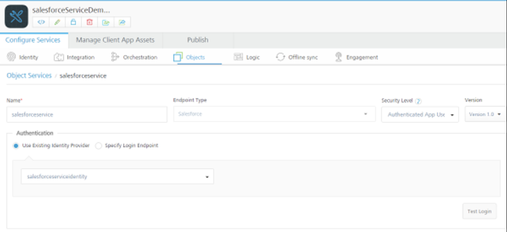
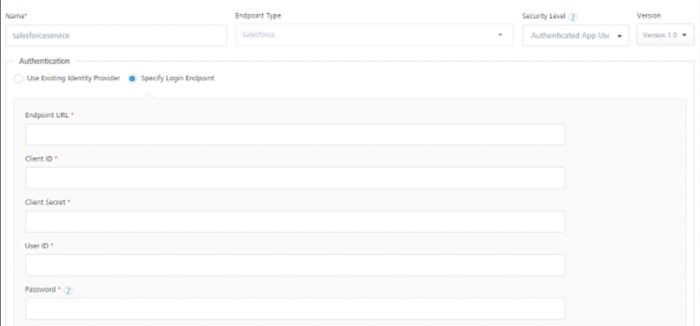

## Create a Salesforce Object Service

VoltMX Foundry supports Salesforce as an endpoint in object services. The VoltMX Foundry developer creates a Salesforce object service and defines the data model with the fields required by the mobile app. Upon publishing the VoltMX Foundry app, a data schema is created in the back end based on the data model and a new self-contained database is instantiated.

A user needs to have a valid Salesforce login to perform any operation. Users can perform the following after the login is authenticated.

*   Generate the app data model from the backend Salesforce objects.
*   Map the data model to the app model once it is defined.
*   Invoke standard CRUD operations on the objects.
*   Explore objects from the Salesforce database.
*   Add Salesforce objects to Sync Scope.
*   Test Salesforce methods from the console.

### How to Create a Salesforce Object Service

To create a Salesforce object service, do the following:

1.  Click on the **Endpoint Type** field. A drop-down menu appears. Click **Salesforce**.
2.  Under **Security Level**, use **Authenticated App User**.
3.  In the **Authentication** field, you can select the identity provider by selecting the option **Use Existing Identity Provider** or select **specify a Login Endpoint**option.

    **Use Existing Identity Provider**

    This links the Identity provider to the object service.

    

    **Specify a Login Endpoint**

    

6.  Click the **Description** field, and enter a description for the object service.
7.  Click **Save and Configure**.