## Create a Storage Object Service

With Object Services, you can create an object on VoltMX Foundry for storing data for mobile apps. You can use VoltMX Foundry as a <madcap:keyword term="storage objects;storage service">storage provider if your application needs limited data that is not available on an enterprise backend and does not exist anywhere else.</madcap:keyword>

For example, a VoltMX Foundry storage object is ideal for a restaurant survey mobile app. In the restaurant, the service staff request that a customer fill out the survey on a device provided by the restaurant. The survey data that the customer enters is stored in a database on the VoltMX Foundry back end. The service staff and customer cannot access the survey results. The restaurant manager can then retrieve the survey data and use it for analysis and reporting.

The VoltMX Foundry developer creates a storage object service and defines the data model with the fields that the mobile app requires. Upon publishing the VoltMX Foundry app, VoltMX Foundry creates a data schema in the back end based on the data model and instantiates a new self-contained database. The operations that the mobile app performs are performed on the database.

### Use Cases

The following describes use cases for a VoltMX Foundry application with storage object services.

#### Home Owner’s Association App

A home owners association that maintains rules to ensure the neighborhood always looks nice. For example, members of the association are required to cut their grass, maintain the landscaping, and keep up the appearance of their house. The association can fine a member any time for a significant violation, but what they typically do is conduct a house-by-house assessment every two years. A representative of the association walks around each house and inspects it. The inspector documents issues with pictures and provides the homeowner a report on what they have to fix.

To streamline this process, the association wants to create an iPhone and iPad app to help with the assessments. The inspector will go to the next house and create a new assessment record that contains:

*   Address of the house
*   Date/Time of the assessment
*   Id of the user who created the assessment
*   Picture of the house

The association representative then inspects the house and writes up any violations. Each record of violation contains:

*   An auto-generated violation number
*   Pictures that document the issue
*   A description of the issue
*   A description of acceptable resolutions

To build this VoltMX Foundry app, the VoltMX Foundry developer first defines the data model that the mobile app requires. The following describes the definition of the data model.

The Assessments object has the following fields:

*   AssessmentId
*   Address
*   Timestamp
*   User Id
*   Image

The Violations object has the following fields:

*   Violation Id
*   Violation Number
*   Timestamp
*   Issue Description
*   Resolution Description

The ViolationImages object has the following fields:

*   Violation Id
*   Image
*   Timestamp

The ViolationTypes object has the following fields:

*   Violation Id
*   Violation Description

The ViolationTypes object is used to populate a dropdown menu in the violation entry screen.

The following relationships are established between the objects:

*   Assessments one-to-many to Violations
*   Violations one-to-many to Violation Images

#### Restaurant Customer Survey App

A food service company that has several restaurants needs a way to get responses from customers to evaluate the performance of their products and services and benchmark the indices. A mobile survey app is an effective tool to get feedback from customers.

The responses generated from the survey app can help the company to target the right set of customer segments, and appropriately position their products for the target segments. These are key inputs for the go-to-market strategy for the company.

The following describes how the survey app is used by a restaurant:

1.  A member of the service team at the restaurant asks a customer to participate in the survey. The service team member explains that the objective of the survey is to improve the products and services that the restaurant offers. The restaurant may offer a coupon as an incentive to the customer.
2.  The customer begins the survey by entering her personal data, such as name, email address, and phone number.
3.  The customer selects one of the categories of the survey. The categories are Food, Restaurant, and Service.
4.  The customer responds to the survey questions for the chosen category.
5.  When the customer clicks Done, the customer's response are recorded in the VoltMX Foundry storage object on the back end. The data model for app defines the storage objects that store the customer data.
6.  The customer completes the questions for the remaining categories of the survey.
7.  The restaurant manager retrieves the results of the customer survey for his restaurant. Only users who have the role of manager can access the results of the customer survey.

There are two personas that use the survey app:

*   The customer who fills out the survey.
*   The manager who retrieves the survey data.

Survey App Data Model

The following relationships are established between the objects:

*   SurveyTable one-to-many to QuestionTable
*   QuestionTable one-to-one to AnswerTable
*   AnswerTable one-to-one to CustomerTable

To build this VoltMX Foundry app, the VoltMX Foundry developer first defines the data model that the mobile app requires. The following describes the definition of the data model.

SurveyTable object:

*   Fields: SurveyTypeId, CreatedDate, CreatedTime, ActiveTillDate
*   One entry per survey

SurveyTypeTable object:

*   Fields: SurveyTypeId, SurveyType, SurveyTypeDescription
*   SurveyType values: "Food", "Service", "Restaurant"
*   SurveyTypeDescription values: Description associated with Survey Type

QuestionTable object:

*   Fields: QuestionId, Question, QuestionsChoice

QuestionsChoiceTable object:

*   Fields: QuestionChoiceId, QuestionsChoiceOptions
*   Examples of a QuestionChoiceId values are Overall Experience, Food, Staff, and Ambiance.
*   Examples of QuestionsChoiceOptions are Unsatifactory, Moderately Unsatisfactory, Acceptable, Satisfied, Very Satisfied.

SubmissionTable object:

*   Fields: SubmissionId, CustomerId, SurveyId, Date, Time

AnswerTable object:

*   Fields: AnswerId, SubmissionId, QuestionId, Answer
*   This table maintains all answers to the survey questions. SubmissionId ties it to a specific customer and date of survey.

CustomerTable object:

*   Fields: CustomerId, Name, Gender, Email, MobileNumber, City, State
*   This table maintains only customer profile information.

Building the Survey App

John is assigned the task of creating back-end services for the Survey app.

1.  John signs in to VoltMX Foundry, creates a new VoltMX Foundry app, and then clicks **Objects**.
2.  John enters the name of the object service to create, selects the Endpoint type **Storage**, and configures the security level.
3.  John creates the data model. John proceeds by creating the required tables and fields, and defining the primary keys for the tables. John then defines the relationship between tables.
4.  Once John has created the data model, he clicks the Mapping tab. He clicks on the Get method to create mapping for the Get method. John can add ODATA filters. The request and response mapping are primarily a one-to-one mapping between the app data model and the VoltMX Foundry database. All the other methods have only Request and Response mapping.
5.  John then configures an OAuth2 identity service for the mobile app.
6.  John publishes the VoltMX Foundry app to a runtime environment.
7.  John then uses VoltMX Iris to create a new mobile app that uses the storage object services. The user experience of the mobile app is designed to collect survey information from restaurant customers.

Restaurant service staff can now use their Google credentials to sign in to the survey app and the storage object service honors the authentication levels. Any object service that is configured as Authenticated allows access to only Authenticated users. Note that all the tables for the app are created when the VoltMX Foundry app is published.

Reuse the Storage Object Service

<madcap:keyword term="reuse storage object">John is then asked to build a mobile app for the restaurant managers. The manager app is capable of pulling out all the data from the VoltMX Foundry storage object database and showing the results.</madcap:keyword>

1.  John signs in to VoltMX Foundry and creates a new VoltMX Foundry app.
2.  John clicks **Objects**, and then clicks **Use Existing**.
3.  John selects the Storage object service that he created for the restaurant survey app.

The Use Existing option copies the app data model to the new VoltMX Foundry app and gives access to the same back end (instance) of the storage object database. All the object services created here for the restaurant manager app will point to the same object and data that was created by the restaurant survey app.

Clone the Storage Object Service

<madcap:keyword term="clone storage service">If John is asked to create another survey app for another restaurant location, John would clone the storage object service that he created for the first restaurant. Only the app data model is copied for the new app and the back-end data is not shared between the two survey apps.</madcap:keyword>

You can also clone an app data model of an existing object service. Refer to [Actions in objects services](#actions).

### How to Create a Storage Object Service

<madcap:keyword term="create storage service">You can create a Storage object service for a VoltMX Foundry app if you want to create an object on the VoltMX Foundry back end for storing data for mobile apps. You can use VoltMX Foundry as a storage provider if your mobile app needs limited data and an enterprise back end is not available to store the data.</madcap:keyword>

The following is an exercise that shows you how to create a storage object service for a VoltMX Foundry app. This VoltMX Foundry app is used by a mobile app for administering students, teachers, and the subjects that the students study.

Create a VoltMX Foundry App

1.  On the **Applications** page, click **Add New**.

    The Configure Services Identity tab appears.

3.  Click in **Edit App Name** button to enter a unique name for the app. For example, SampleStorageObject.
4.  On the Identity tab, configure a new identity service or use an existing service. To learn how create an identity service, see [Identity](../Identity.md). To learn how to use an existing identity service, see [How to Use an Existing Identity Service](../Identity.md#UseExistingIdentity).

    The following identity providers are not supported for Storage Services: Microsoft Active Directory, Open LDAP, Active Directory Federation Services (ADFS) over SAML, and Azure SAML.

6.  Click the **Objects** service tab.
7.  Click **Configure New**.
8.  Click in the **Name** field, and enter a name for the object service. For example, SampleStudentStorage.
9.  Click in the **Endpoint Type** fieldand then click Storage in the drop-down menu.
10.  Under **Security Level**, use **Authenticated App User**.
11.  Click in the **Authentication** field, and then select the identity provider that you want to use.

     This links the Identity provider to the object service.

13.  Click in the **Description** field, and enter a description for the object service.

     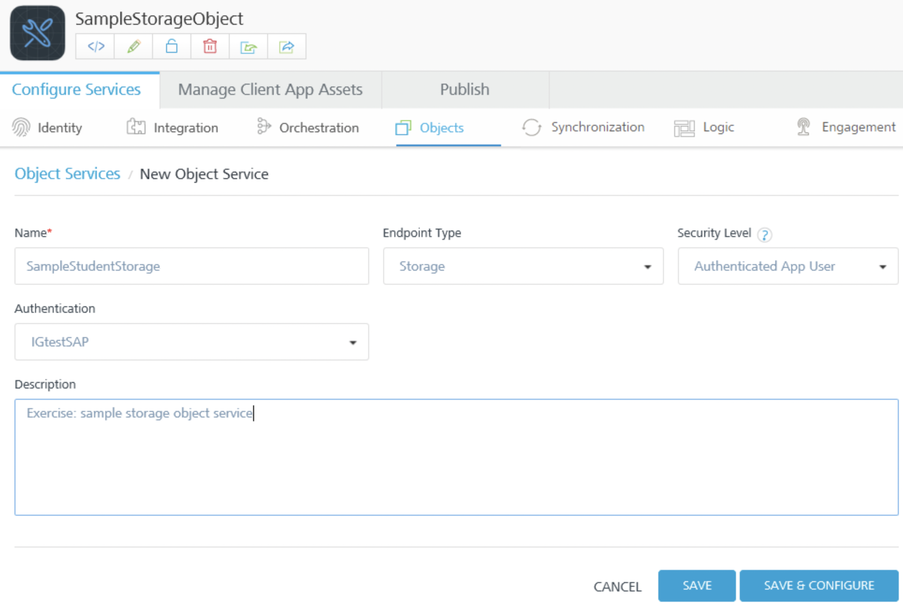

15.  Click **Save & Configure**.

The Configure page for the object service appears.

Create a Data Model for the Storage Service

1.  Click **Configure New**.
2.  In the **Name** text box, enter **Student**, and then click **Save**.

    In the Configure screen, the Student object appears in the list of objects.

4.  In the **Data Model** tab of the navigation pane, under the Student object, click **Fields**.

    The fields that VoltMX Foundry generates by default appear. The fields are populated in the database when you save the object service.

6.  Click the **Add** button.
7.  In the **Name** column, click in the field and enter **Id**.

    The name of a field can be a maximum of 25 characters.

9.  In the **Primary Key** column, click in the field, and select **true** from the menu.

    When you set the Primary Key attribute to _true_ for a field, the Unique attribute is automatically set to _true_.

11.  In the **<madcap:keyword term="Autogenerated column;storage object:Autogenerated column">Autogenerated</madcap:keyword>** column, click in the field, and select **true** from the menu.

     When you set the Autogenerated attribute to _true_ for a field, the Type attribute is automatically set to _number_.

13.  Click the **Add** button.

     A new row appears in the fields list.

15.  In the **Name** column, click in the new row and enter **Name.**
16.  Click **Save**.

     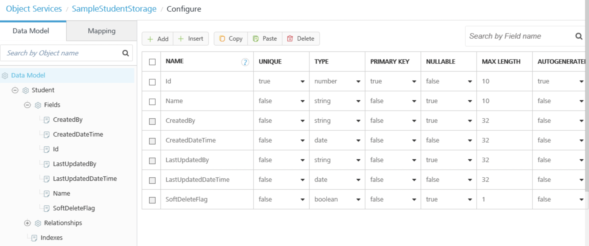

18.  Click **Mapping**.

     The list of corresponding verbs created for this object appears.

     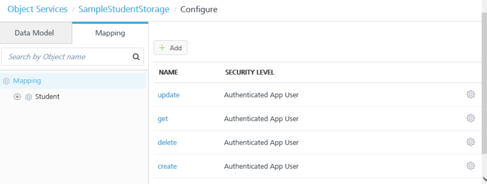

View the SQL Scripts

<madcap:keyword term="SQL:storage service">If you export the VoltMX Foundry app, you can see the SQL scripts that are generated for the data model. In the exported app, in the ObjectService folder, there is a _Flyway folder. Inside the _Flyway folder are SQL scripts that correspond to different database types. Currently, Storage Services supports only MYSQL. Flyway is a tool that VoltMX Foundry uses to run the SQL scripts on the server. In the MYSQL folder, you can find the corresponding schema file that VoltMX Foundry generated for the data model. In an editor, you can see the Student table and fields that VoltMX Foundry created and the primary key, and the constraints that have been added to that table.</madcap:keyword>

Test the Runtime Service

<madcap:keyword term="storage service:test run-time;storage object:index">After you publish the app, you can use App Services to test the run-time of the storage service. This represents how the mobile app on the device will interact with the runtime of the service.</madcap:keyword>

For example, in App Services, for Object Services, select the Student@create operation for the sample student app, and then click the service URL below the operation. In the Service Details, for Input Parameters, enter `{name: "S1"}` and click Get Response. In the Response Body, the return code indicates that the student record was created. To update a record, select the Student@update operation and enter `{name: "S2". Id:1}` in Input Parameters. To retrieve the student records, select the Student@get operation, and without specifying any filters, click Get Response. In the Response Body, the student records are returned. Note that the fields that VoltMX Foundry generates by default, CreatedDateTime and LastUpdatedDateTime, recorded when the student record was created and when the record was updated.

Add a Subject Object to the Data Model

1.  Click the **Data Model** tab, and then click **Data Model**.
2.  Click **Add**.
3.  In the **Name** text box, enter **Subject**, and then click **Save**.
    In the Configure screen, the Subject object appears in the list of objects.
5.  In the **Data Model** tab of the navigation pane, click the plus button next to the Student object.
    Fields and Relationships appear under the Student object.
7.  Click **Fields**.
    The fields that VoltMX Foundry generates by default appear. The fields are populated in the database when you save the object service.
9.  Click the **Add** button.
10.  In the **Name** column, click in the field and enter **Id**.
11.  In the **Primary Key** column, click in the field, and select **true** from the menu.
12.  In the **Autogenerated** column, click in the field, and select **true** from the menu.
13.  Click the **Add** button.
     A new row appears in the fields list.
15.  In the **Name** column, click in the new row and enter **name.**
16.  Click **Save**.
17.  Click **Data Model**, and then click **Add**.
     Now add an object that records the student to subject mapping; that is, which subjects a student is studying.
     Add a Student/Subject Object to the Data Model
1.  In the **Name** text box, enter **Student_Subject**, and then click **Save**.
    In the Configure screen, the Student_Subject object appears in the list of objects.
3.  In the **Data Model** tab of the navigation pane, click the plus button next to the Student_Subject object.
    Fields and Relationships appear under the Student_Subject object.
5.  Click **Fields**., and then click the **Add** button.
6.  In the **Name** column, click in the field and enter **Id**.
7.  In the **Primary Key** column, click in the field, and select **true** from the menu.
8.  In the **Autogenerated** column, click in the field, and select **true** from the menu.
9.  Click the **Add** button.
    A new row appears in the fields list.
11.  In the **Name** column, click in the new row and enter **Student_id.**
12.  In the **Type** column, click in the field, and select **Number** from the menu.
13.  Click the **Add** button.
14.  In the **Name** column, click in the new row and enter **Subject_id.**
15.  In the **Type** column, click in the field, and select **Number** from the menu.
16.  Click **Save**.

     

Create an Index

You can performance tune the object service by creating indexes on the objects.

1.  In the **Data Model** tab of the navigation pane, click the plus button next to the **Student** object.
2.  Click **Indexes**, and then click **Add**.
    The index configuration screen appears.
4.  In the **Name** column, enter a name for the index.
5.  In the **Description** column, enter a description.
6.  Click in the **Fields** column. A drop-down menu of fields in the object appears. Select Id, Name, and LastUpdatedDateTime.
    The collection of records in the object are indexed by the fields that you select.
    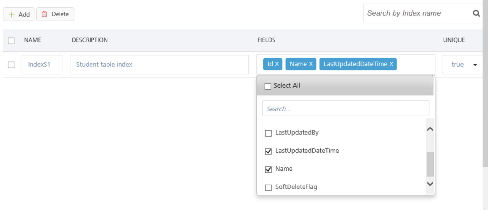
9.  In the **Unique** column, select **true** to indicate that a field that you selected has a unique key.
    An index that has multiple fields is called a clustered index. A clustered index should have a unique key as the first field. For example, Id is a unique key.
11.  Click **Save**.

Configure the Relationship Between Objects

Now you can define the relationships between the objects in the data model.

1.  In the **Data Model** tab of the navigation pane, under the Student object, click **Relationships**.
    The Relationships screen appears.

3.  Click the **Add** button.
    The screen for configuring the relationship appears.

5.  Click in the **Select Target Objects** field. A drop-down menu appears. Select the **Student**_**Subject** object.
6.  In the **Select Relationship Type** field, a storage service currently supports only a **One to Many** relationship**.**
7.  Under **Specify Object Attribute Relationships**, click in the **Source Object Attributes** field. A drop-down menu appears. Select **Id.**
8.  Click in the **Target Object Attributes** field. A drop-down menu appears. Select **Student_Id**, and then click **Save.**
9.  Under the Subject object, click **Relationships**.
10.  Click the **Add** button.
11.  Click in the **Select Target Objects** field. A drop-down menu appears. Select the **Student**_**Subject** object.
12.  Under **Specify Object Attribute Relationships**, click in the **Source Object Attributes** field. A drop-down menu appears. Select **Id.**
13.  Click in the **Target Object Attributes** field. A drop-down menu appears. Select **Subject_Id**.

     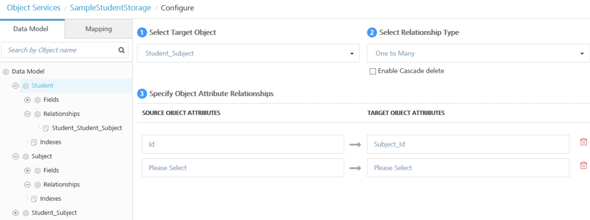

15.  Click **Save**.

If you export the VoltMX Foundry app at this point, you will see the SQL scripts that correspond to the objects that you added and the relationships that you defined.

After you publish the app, you can use App Services to create a subject. For example, select the Subject@create operation and enter `{name: "Physics"}` in Input Parameters. Then you can select the Student_Subject@create operation and enter `{name: "Student_id:1, Subject_id:1"}` to add a record to the Student_Subject table. You can use the Student_Subject@get operation to query the Student_Subject table and verify that the record was created.

Add a Teacher Object to the Data Model

1.  In the navigation pane, click the **Data Model** tab of the navigation pane, and then click ****Add****.
2.  In the **Name** text box, enter **Teacher**, and then click **Save**.
3.  In the navigation pane, click the plus button next to the Teacher object

Fields and Relationships appear under the Teacher object.

5.  Click **Fields**., and then click the **Add** button.
6.  In the **Name** column, click in the field and enter **Id**.
7.  In the **Primary Key** column, click in the field, and select **true** from the menu.
8.  In the **Autogenerated** column, click in the field, and select **true** from the menu.
9.  Click the **Add** button.

    A new row appears in the fields list.

11.  In the **Name** column, click in the new row and enter **name.**
12.  Click the **Add** button.
13.  In the **Name** column, click in the new row and enter **Subject.**
14.  Click **Save**.
15.  In the **Mapping** tab of the navigation pane, click the plus button next to the Teacher object.
16.  Click the **get** verb, and then click the **OData Query Options** tab.

     The OData Query Options that object services supports for the read operation appear in the Configure screen. For example, you can use the $skip option to return all records in the table except the top five, or you can use the $top option to return only the top five records.

     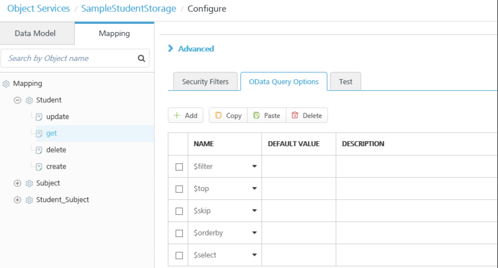

Add Security Attributes Profiles to the Request Input Parameters

<madcap:keyword term="security attributes">When a user logs in to a mobile app, the logon can invoke a custom VoltMX Foundry identity service. The response to the back-end logon contains security attributes for the signed in user. For example, the response contains the _user_id_ attribute of the logged on user.</madcap:keyword>

When you link an object service to an identity service, the identity session parameter can be consumed in an object service. In Object Services, you can dynamically pick up the fields received in the user attributes of the logon response from the backend, and use those fields as input parameters for operations, such as create and update.

<madcap:keyword term="user profile">Using attributes from user profiles in request input parameters from VoltMX Foundry can also help to preserve sensitive data from the back end on VoltMX Foundry rather than sending it to the mobile app. This reduces the vulnerability of hacking of sensitive data on the mobile device.</madcap:keyword>

For example, you can add an input parameter for the create operation that uses the CreatedBy field in the data model. You specify that the value of the input parameter is an Identity type. This indicates that the input parameter uses an attribute of the user security profile from the identity service that is linked to the object service. When a user of the mobile app creates a Teacher record in the storage object, VoltMX Foundry picks up the user's _user_id_ from the security profile in the identity service and adds it to the new record. Along with the Name, Id, and Subject for the Teacher, the record indicates who created the record.

To add an <madcap:keyword term="identity profile">identity profile to an input parameter, do the following:</madcap:keyword>

1.  In the navigation pane, click the **Mapping** tab, and then click the plus button next to the Teacher object.
2.  Click the **create** verb.
    The Request Input Parameters tab appears in the Configure screen. You define how to use the user profile data by selecting a verb and the data model field that you want to map to the user profile data.
4.  Click **Add**.
5.  In the **Data_Model_Field** column, click the drop-down menu, and select the **CreatedBy** attribute.
6.  Click the drop-down menu in the **Value** column, and select **identity**.

    An identity value indicates that VoltMX Foundry will retrieve the value specified from the user's security profile in the identity service that is linked to the object service.

8.  In the text box next to the **identity** value, enter **profile.user.id**.

    This specifies that VoltMX Foundry will populate the value of the input parameter from the user's security profile.

10.  Click **Add**.
11.  In the **Data_Model_Field** column, click the drop-down menu and select the **LastUpdatedBy** attribute.
12.  Click the drop-down menu in the **Value** column, and select **identity**.
13.  In the text box next to the **identity** value, enter **profile.user.id**.

     

15.  Click **Save**, and then in the navigation pane, click the **update** operation.
16.  Click **Add**.
17.  In the **Data_Model_Field** column, click the drop-down menu in the **Data_Model_Field** column, and select the **LastUpdatedBy** attribute.
18.  Click the drop-down menu in the **Value** column, and select **identity**.
19.  In the text box next to the **identity** value, enter **profile.user.id.**
20.  Click **Save**.
21.  In the navigation pane, under the Teacher object, click the **update** operation.
22.  Click **Add**.
23.  In the **Data_Model_Field** column, click the drop-down menu, and select the **LastUpdatedBy** attribute.
24.  Click the drop-down menu in the **Value** column, and select **identity**.
25.  In the text box next to the **identity** value, enter **profile.user.id**.
26.  Click **Save**.

After you publish the app, you can use an API testing program, such as Postman, and create a Teacher record to test the run-time of the storage service. You can then use the Teacher@get operation to query the Teacher table and verify that the record was created. The Response Body returns the Teacher record that you created. Note that VoltMX Foundry added the fields that you specified in the input parameters, CreatedBy an LastUpdatedBy, to the record with the identity of the user who created the record.

### Storage Service Usage Notes and Data Constraints

The following describes usage notes, guidelines, limitations, and workarounds for Storage Services.

#### Supported Identity Provider Types

The following identity <madcap:keyword term="storage service:identity provider types">providers are not supported for Storage Services:</madcap:keyword>

*   Microsoft Active Directory
*   Open LDAP
*   Active Directory Federation Services (ADFS) over SAML
*   Azure SAML.

#### Data Constraints

*   In this version of VoltMX Foundry, Storage Services does not support the creation or storage of blobs or media.
*   Field names can have a maximum of 25 alphanumeric characters.
*   An object service shares tables across users. You can limit access to the tables by using identity attributes from a user profile in request input parameters.

You use the fields that are received in the identity attributes of the logon response from the back end and use those security attributes as input parameters during any subsequent integration requests.

#### Testing Storage Objects from VoltMX Foundry

After you have published a storage service, you can test the service from VoltMX Foundry. Only the published state of the storage service is tested. Changes that you make in the service designer that you have not published cannot be tested.

To test a published storage service, do the following:

1.  In the Mapping tab for a storage service, click a verb (for example, get).
2.  In the Configure screen, click the **Test** tab.
3.  Click **Test**.

#### Storage Service SQL Scripts

<madcap:keyword term="SQL scripts;storage service:SQL scripts">When you define objects in a storage service and save the service, VoltMX Foundry creates a SQL script file that contains all the data definition statements that you generated since you last saved the service. For example, the first time that you save the service, the data definition statements are saved in the SQL file named V1_MYSQL. The next time that you save the service, the data definition language (DDL) statements are saved in the SQL file named V2_MYSQL. Each SQL file can contain multiple DDL statements. For example, a SQL script that contains statement that creates the table and a statement that defines constraints, such as a unique key or a relationship with another table.</madcap:keyword>

When you publish the VoltMX Foundry app, a SQL script file is created for each DDL statement. Each script file contains one statement. For example, before publishing, when you save the VoltMX Foundry app, VoltMX Foundry creates a SQL script file named V1_MYSQL. This SQL script file contains four statements. When you publish the app, VoltMX Foundry creates a SQL script file for each statement in V1_MYSQL. For example, V1.1_MYSQL, V1.2_MYSQL, V1.3_MYSQL, and V1.4_MYSQL.

VoltMX Foundry creates an individual script file for each statement because rollback support is not available. If a SQL script file fails, there is only one statement to troubleshoot and fix.

When you export a VoltMX Foundry app, you can see the SQL scripts that the storage service generated for the data model. In the exported app, in the ObjectService folder there is a _Flyway folder. Inside the _Flyway folder are SQL scripts that correspond to different database types. Currently, Storage Services supports only MYSQL. Flyway is a tool that VoltMX Foundry uses to run the SQL scripts on the server. In the MYSQL folder, you can find the corresponding schema file that VoltMX Foundry generated for the data model.

#### Data Model Changes and Republishing Errors

The following describes scenarios in which republishing a storage service will fail after making certain changes to the data model.

*   Change nullable to false for a field after there is already data with null values in that field.
*   Change a field to be a primary key after the field already contains duplicate values.
*   Change unique to true for a field after the field already has duplicate values.
*   Change the data type of a field. For example, changing a string field to a boolean field.
*   Reduce the size of a string field if the table already has data in the field that exceeds the altered size.

In these scenarios, you cannot roll back the changes that caused the publish to fail. To repair the data model so that you can republish the app, do the following:

1.  Export the VoltMX Foundry app.
2.  Edit the SQL script and revert it to the original definition.
3.  Import the VoltMX Foundry app that contains the edited scripts.
4.  Publish the VoltMX Foundry app.

If you delete a field from a data model and republish the storage service, any data in the deleted field is removed from the storage object.

#### Health Check for Storage Services

The VoltMX Foundry <madcap:keyword term="health-check for storage services">health-check API include properties that denote the health of published storage services. The health-check API include properties that report if schema updates have been applied successfully, the current schema version, and the name of the SQL script file.</madcap:keyword>

The following is the health-check URL format:

<samp>https://<Environment_Name>.voltmxcloud.com/admin/healthcheck?output=json&force=true</samp>

The following is a sample JSON output from the health-check API. The properties that denote the health of published storage services are highlighted.

<pre><code>
{
   "healthDetail": {
      "Static Resources Location": "PASSED",
      "Access to Cache": "PASSED",
      "Access to Deployment Storage": "PASSED",
      "Cloud Environment Identification": "PASSED",
      "Access to Reporting Queue": "PASSED",
      "Access to Device DB": "PASSED",
      "Security Credentials": "PASSED",
   }, "healthCheck": "PASSED",
      "storage_health": [{
         "version_rank": 3,
         "success": true,
         "service_name": "StorageService1207t20",
         "schema_name": "StorageService1207t20_ee82885b",
         "version": "1.2",
         "script": "V1.2__MYSQL.sql",
         "installed_rank": 3
	}],
	"Console-Version": "MIDCloud-QA-7.1.0_v201607051517_r18",
	"Gateway-Version": "5.6.72.0"
}</code></pre>

#### Export/Import of Storage Objects

You can download the data stored in a storage object through the admin server console. Users can upload their records and update the existing records using the export/import options.

##### Export storage objects data to a .csv file

**To export or import data from storage objects, follow these steps**

1.  Navigate to admin server console, and click on **Object Services**.
2.  The Object Services created in VoltMX Foundry Console are displayed in this page.

    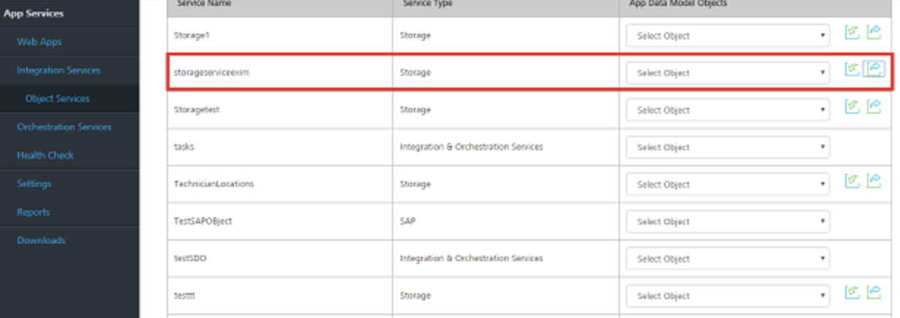

3.  Click **Export** (the green arrow) icon to export the data in storage object.
4.  Click **Browse** to select where you want to save the storage objects data file (.zip) and click **OK** to continue.
5.  The data will be exported as a zip file in the selected location.

    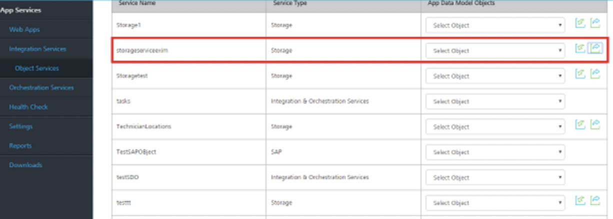

6.  Extract the zip file. You will find a CSV (Comma Separated Values) file at a service level.
7.  Edit the .csv file, and insert the new records. A user can edit and modify more than one .csv file by inserting the new records and updating the existing records.

    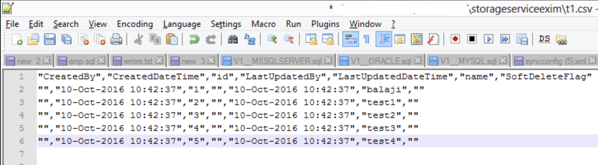

    The file name the files of .csv files should be as <objectname>.csv.

    **For example**: Employee and Department are two objects (tables). To update both the tables, modify both employee.csv and department.csv files. Archive the files into a single zip file.

8.  Zip the modified .csv file.

    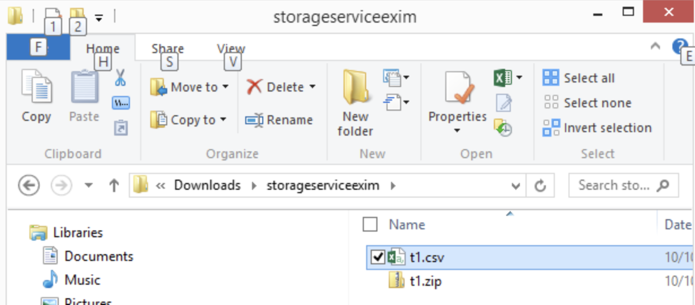

##### Import Storage Objects Data from .csv to Admin Server Console

1.  In the admin server console, choose Object Services.
2.  Click the **Import** icon to import the modified data set.
3.  In the **Import File** box, browse to your storage objects data file, and then double-click to select it.

    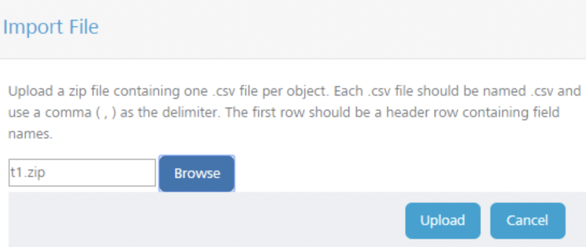

4.  Click **Upload** to upload the selected file.
5.  In the **Object Services** tab, select the storage service imported to get the imported data.
6.  In the **Request Input** tab, click **Get Response**.

    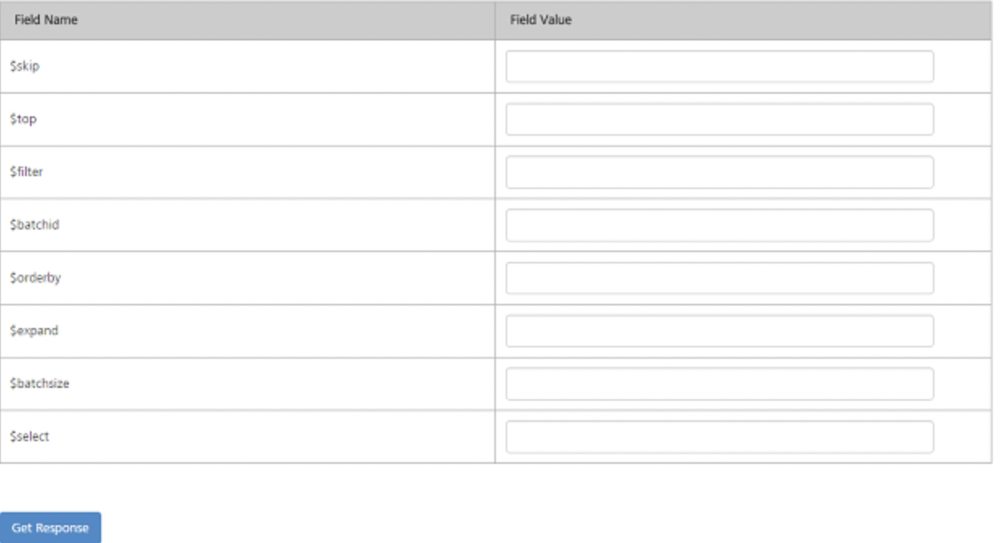

7.  The **Response Output** displays the imported data in the form of a source code.

    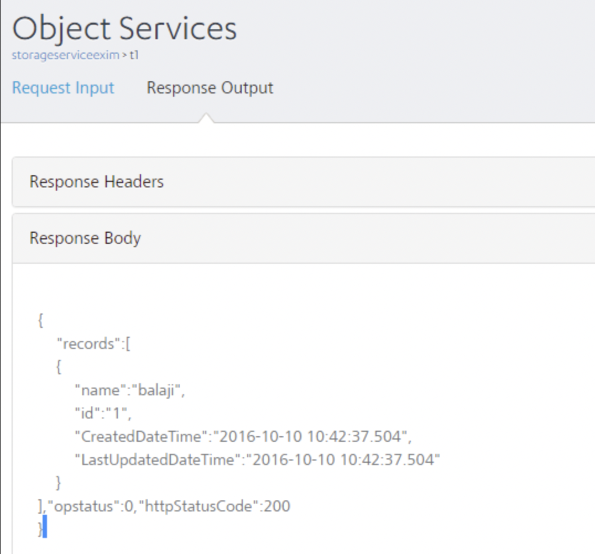