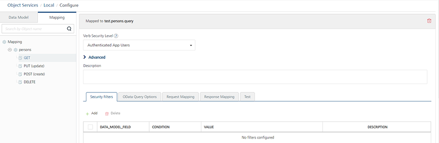

                              

User Guide: [Object Services](../Objectservices.md) > Enhanced Identity support in Object Services

Enhanced Identity Filters - Objects
-----------------------------------

Identity filters are an enhanced data-filtering mechanism available in Storage Services and Service-Driven Objects. For Service-Driven Objects, enhanced identity filters are configured on the underlying integration/orchestration services. For more details, refer to [Enhanced Identity Filters - Integration Services](../Identity_Filters_Integration.md). You can use identity filters to filter data for a mobile app based on dynamic fields returned from an identity provider.

When a user logs on to a mobile app, the logon can invoke a custom Volt MX Foundry Identity Service. The response to the back-end logon contains identity or security attributes for the logged-on user. For example, a user\_id field. The storage service can use the identity or security attributes from the logon response as input parameters for operations, such as get, create, and update.

Updating a Storage Object from a User Profile

A key advantage of identity filters is the ability to update certain parts of a storage object from the Identity Service and not the mobile app. With a storage object, the mobile app cannot update certain fields or elements of the object. For example, a field that identifies who created a record (CreatedBy) or who updated a record (LastUpdatedBy).

By using an identity filter in a storage service, the userID from the identity profile is mapped to the CreatedBy field as an input parameter. When the mobile app user creates a record, Volt MX Foundry sets the CreatedBy value from the identity provider and not the mobile app. The mobile app user cannot set the CreatedBy field because the mobile app does not include the CreatedBy field for data entry.

Constrain Data with an Identity Filter that the User Cannot Modify

Another key advantage of using identity filters to query data is that the mobile app user cannot access and modify these filters. For example, an employee that uses the mobile app can view and access only the records that he/she created, while a manager can access the records that all employees created. Volt MX Foundry maps a user attribute from the user profile to an input parameter for the storage service query. The mobile app user cannot modify the identity filter because the query was executed on the Volt MX Foundry storage service, and not on the mobile app.

### Use Case: Auto Dealership Sales Manager

Bill is the sales manager of an auto dealership that sells Steed brand cars. Bill uses a mobile app that is provided by Steed. Bill uses the mobile app to get sales reports, learn about special internal sales programs, and look up invoice prices for his dealership.

The sales manager has a user name that he uses to log on to the account. Steed maintains an internal dealerId in Bill's user profile that identifies the dealership that Bill is associated with. The dealerId is sensitive information and a sales manager is not privy to and cannot see his internal dealerId. All the back-end APIs need this dealerID as an input parameter during any subsequent integration queries.

When Bill logs on to the mobile app, the response to the logon from the back end contains Bill's internal dealerId. The Volt MX Foundry Identity Service stores this identity attribute for the session. In the storage service, the get operation uses this identity attribute as an input parameter to filter the request for data that is sent to the mobile app. For example, when Bill looks up manufacturer dealer incentives or invoice costs, the storage service adds Bill's dealerId to the query. The query returns only dealer incentives and invoice costs for Bill's dealership. At no point does Volt MX Foundry send Bill's dealerId to the mobile app. This eliminates the possibility that Bill, or anyone else that gains access to Bill's mobile device, can use the dealerId to access incentives or invoice costs for other dealerships or breach company data.

### Use Case: Banking App

Oakway National Bank (ONB) has a mobile banking app. The mobile app uses a custom SOAP Identity Service configured on Volt MX Foundry. When a customer of ONB signs in to the app, the sign-in invokes the identity service. The response to the back-end sign-in contains a user security attribute, for example, CRM\_Id.

After the user signs in successfully, every subsequent integration request to the back end must have the CRM\_Id as an input parameter to identify the authorized user who is accessing the private bank accounts. A user's CRM\_Id is sensitive and is not shared with the user. A hacker could use a CRM\_Id to illegally access a user's personal financial information. By using an identity filter with the storage service, the CRM\_Id is preserved on Volt MX Foundry itself and is not sent to the user's mobile app. This reduces the possibility of an intruder gaining access to sensitive data on the mobile device.

### How to Configure Identity Filters

You can configure identity filters on the operations (verbs) of an object in a Storage Service. For Get operations, you can configure identity filters on the Security Filters tab. For the Create, Update, and Delete operations, you can configure identity filters on the Request Input Parameters tab. To configure identity filters for a storage service, you must link the Storage Service to a Volt MX Foundry Identity Service.

To link a storage service to an Identity Service, do the following:

1.  In Volt MX Foundry, click the **Objects** service tab.

    A list of object services appears. This is the list of object services that have been created for the Volt MX Foundry app.

3.  Select a storage service.

    A storage service is an object service that you have configured to use storage on the Volt MX Foundry back end. When you create a storage service, you select Storage as the endpoint type.

5.  Click in the **Identity Service for Backend Token** field, and select the identity provider that you want to use.
6.  Click **Save**.

**Configuring a Security Filter**

To configure a security filter for a Get operation in a storage service, do the following:

1.  In Volt MX Foundry, click the **Objects** service tab.

    A list of object services appears. This is the list of object services that have been created for the Volt MX Foundry app.

3.  Select a storage service.
4.  On the **Mapping** tab of the navigation pane, click the plus button next to an object.

    The list of operations, or verbs, for the object appears.

6.  Click the **GET** verb.

    The configure screen for the get verb appears.

    

10.  Click the **Add** button.
11.  In the **Data\_Model\_Field** column, click the drop-down menu, and select a field. For example, **LastUpdatedBy**.

     Select a field from the object that you want to use to filter the data returned by the query.

13.  In the **Condition** column, click the drop-down menu, and select **eq**.

     The available conditions are eq (equals), gt (greater than), and lt (less than).

15.  In the **Value** column, click the text box and enter **profile.user.id**. When you start editing the field, dependent identity services are auto populated. Select the identity service you want.

     This maps the user ID attribute from the identity service to the Id field in the storage object.

17.  In the **Description** column, enter a description of the security filter.
     

20.  Click **Save**.
     This security filter is added to any **get** operations performed on the Student object.

The security filter constrains the results of a get operation that are returned to the mobile app. For example, if the mobile app has an option to get a list of student records that the user had recently updated, Volt MX Foundry adds this security filter to the query. The mobile app retrieves only the student records that were updated by the logged on user. The field that Volt MX Foundry used to filter the results, LastUpdatedBy, is added to the query only in Volt MX Foundry and is not sent to mobile app with the results. The mobile app user cannot access this field and use it to retrieve records that were updated by another user.

> For more information on Externalizing Identity Services, refer to [Replace the Identity Service references in a Foundry app](./../Replacing_Identity_Services.md). 

**Configure Identity Filters**

To configure identity filters for a create operation in a storage service, do the following:

1.  In the navigation pane, click the **Mapping** tab, and then click the plus button next to the an object. For example, Teacher.
2.  Click the **create** verb.

    The Request Input Parameters tab appears in the Configure screen. You define how to use the user profile data by selecting a verb and the data model field that you want to map to the user profile data.

4.  Click **Add**.
5.  In the **Data\_Model\_Field** column, click the drop-down menu, and select the **CreatedBy** attribute.
6.  Click the drop-down menu in the **Value** column, and select **identity**.

    An identity value indicates that Volt MX Foundry will retrieve the value specified from the user's security profile in the identity service that is linked to the object service.

8.  In the text box next to the **identity** value, enter **profile.user.id**.

    This specifies that Volt MX Foundry will populate the value of the input parameter from the user's security profile.

10.  Click **Add**.
11.  In the **Data\_Model\_Field** column, click the drop-down menu and select the **LastUpdatedBy** attribute.
12.  Click the drop-down menu in the **Value** column, and select **identity**.
13.  In the text box next to the **identity** value, enter **profile.user.id**.

     

16.  Click **Save**, and then in the navigation pane, click the **update** operation.
17.  Click **Add**.
18.  In the **Data\_Model\_Field** column, click the drop-down menu in the **Data\_Model\_Field** column, and select the **LastUpdatedBy** attribute.
19.  Click the drop-down menu in the **Value** column, and select **identity**.
20.  In the text box next to the **identity** value, enter **profile.user\_id.**
21.  Click **Save**.
22.  In the navigation pane, under the Teacher object, click the **update** operation.
23.  Click **Add**.
24.  In the **Data\_Model\_Field** column, click the drop-down menu, and select the **LastUpdatedBy** attribute.
25.  Click the drop-down menu in the **Value** column, and select **identity**.
26.  In the text box next to the **identity** value, enter **profile.user\_id**.
27.  Click **Save**.
    
    > **_Important:_** Object services enabled with security filters cannot be tested from Volt MX Foundry Console.
    
    > For more information on Externalizing Identity Services, refer to [Replace the Identity Service references in a Foundry app](./../Replacing_Identity_Services.md). 

#### Preprocessor and Postprocessor References

An identity session is read-only and cannot be modified in the preprocessor and postprocessor, or an integration service. Once the context is accessible, a Volt MX Foundry developer can refer to the identity session context.

#### Support Identity Provider Types

The following identity providers are not supported for Storage Services and identity filters:

*   Microsoft Active Directory
*   Open LDAP
*   Active Directory Federation Services (ADFS) over SAML
*   Azure SAML.
