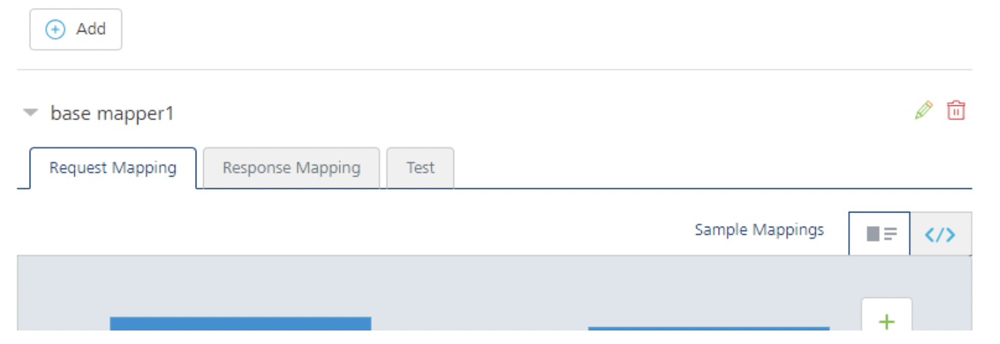
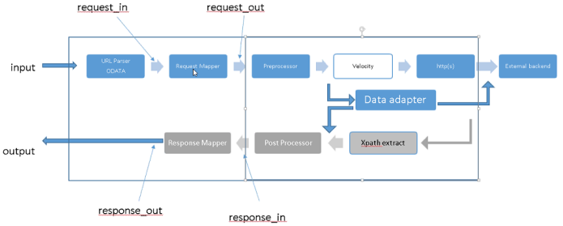

                               

User Guide: [Object Services](../Objectservices.md) > [Stage 3: Mapping Operations to Back-end Methods](Objectservices_Stage3.md) > Enhancing the Mapping by using XML Mapper for Advanced Scenarios

Enhancing the Mapping by using XML Mapper for Advanced Scenarios
----------------------------------------------------------------

The core mapper engine is integrated into the Object Services pipeline. The mapper is an engine that logically takes in JSON, by using the declarative XML that it is passed, modifies the JSON, and creates nodes in the JSON and updates existing nodes.

For the request that is coming in to the mapper, after basic URL parsing and ODATA parsing are performed, all the context is made available to the request mapper. The request mapper modifies the payload and sends it into the next stage of the pipeline, which goes to the back end, typically by using an integration connector.

After the response is picked up, the whole context is made available to the response mapper. The Response mapper makes changes to the data, and outputs the data after some formatting. The internal mapper logic is the same for both the input and output pipelines, but the context that is made available to the mapper changes.  


### Multiple Mapper Support

From V9SP2 FP2, VoltMX Foundry support multiple mappers to an Object verb. You can create more than one Visual/XML mappings/s for a verb.  During the verb creation for Objects once a verb is associated with a back-end service operation, an empty Visual/XML mapper is added by default, naming as `base mapper1`. The new **Add** button is available in the Mappings header section that allows you to create mappings. You must click this to expand it, and then click EDIT for adding mappings mapping configuration.

All the listed Visual/XML mappings/s are considered for the app, and the same will be published. 



**For Locked Apps**: If you are using Locked Object Services, <u>you cannot edit locked base Visual/XML mapper/s</u>. 

All locked Visual/XML mapper/s are selected with <b>Enabled</b> option to be included in the custom app by default. 

However, you can choose to enable/disable the locked Visual/XML mappers for extending the base app functionality with or without custom <u>Visual/XML mapper/s</u>.

For more information, refer [Locking a Foundry App](./../LockApp.md)

The following diagram shows the Object Services pipeline.



### Request Mapper

On the input, when the mapper is applied, it is equivalent to the following.

mapper("input mapper xml", $current\_input = data)

The $data is logically a blob with all the context made available to the mapper. You are passing in transformational XML to run on the current input. The mapper input can access any of the data that is passed to it.

**request\_in :** Read-only, input payload JSON from API request.

**request\_out :** Read-write, (a copy of input payload), transformed JSON that is sent to next stage.

**vars :** Empty. This is referenced using $vars and is used by mapper XML as a global variable store

*   For more details, refer [Simple Mapping example](#Mapping-SimpleMapping)

### Response Mapper

On the output, when the mapper is applied, it is equivalent to the following.

mapper("output mapper xml", $current\_input = data)

The $data is logically a blob with all the context made available to the mapper.

**response\_in :** Response from back end logically represented as JSON.

**response\_out :** Transformed JSON using the XML mapper sent in the "records" field of the API response.

**vars :** Empty. This is referenced using $vars and is used by mapper XML as a global variable store.

*   For more details, refer [Simple Mapping example](#Mapping-SimpleMapping)

Mapper Elements
---------------

The mapper includes the following built-in variables, built-in functions, and blocks.

Built-in Variables

```
 a/b/c   /* An input path of a.b.c in the given object */  
 ../b      /* inputpath = "b" on $current-input.getParent() */  
 $current-input /* Input instance of current map block */  
 $current-output /* Output instance of current map block */  
 $mapper-input /* Mapper instance’s global input */  
 $mapper-output  /* Mapper instance’s global output */  
 $vars/x /* Variables are stored in this hash.  All variables are GLOBAL */  
 $args/<arg name> /* Arguments passed to a function */
```

On a function call, by default, `$args.current-input` is set to `$current-input`, and `$args.current-output` is set to `$current-output`.

`input="myinput" inputpath="firstname"` is equivalent to `$myinput["firstname"]`

`inputpath="firstname"` is equivalent to `$current-input["firstname"]`

`Input="3" /* not starting with a $, it is constant value. To use $ as a constant, use the escape character, for example, "\$".*/`

`output="$myoutput" outputpath="lastname"` is equivalent to `$myoutput["lastname"]`

Built-in functions

The Volt MX namespace contains a number of built-in functions that you can use with the mapper. The built-in functions are:

*   equal
*   concat
*   substringBefore
*   substringAfter
*   choose-when-otherwise
*   random
*   min
*   max
*   sum

> **_Note:_** The Volt MX namespace is reserved for VoltMX\-defined functions only. User-defined functions cannot use the Volt MX namespace.

Blocks

The following table describes the blocks available:

<!-- <table>
<tr>
<th>Block</th>
<th>Description</th>
<th>Example</th>
</tr>
<tr>
<td>map</td>
<td>This is the main block in mapper.</td>
<td><pre><code><map inputpath="x/y/z" input="$current-input"
outputpath="x" output="$current-output">
</map></code></pre></td>
</tr>

<tr>
<td>set-param</td>
<td>Sets an output parameter from input.</td>
<td><pre><code> <set-param  inputpath="x/y/z" input="$current-input" outputpath="x" output="$current-output"  />Output.outputpath=input.inputpath</code></pre></td>
</tr>

<tr>
<td>set-arg</td>
<td>Variant of set-param to set the argument of a function.</td>
<td><pre><code><set-arg         
    name="x"          
    inputpath="x/y/z" input="$current-input"/></code></pre></td>
</tr>

<tr>
<td>set-variable</td>
<td>Variant of set-param to define and set a global variable.</td>
<td><pre><code><set-variable           
name="x"

       inputpath="x/y/z" input="$current-input"
 
/></code></pre><br>is a shortcut for the following:<br><pre><code> 
<set-param         inputpath="x/y/z" input="$current-input"
           outputpath="x" output="$vars"  /></code></pre></td>
</tr>

<tr>
<td>exec-function</td>
<td>Execute function.The return value of exec-function is written to the output/outputpath attributes of exec-function.</td>
<td><pre><code><map inputpath="contact" outputpath="contact"> 
<exec-function name="contact-field-map" >

/* input is set to $current-input and
                     output is set to  $current-output by default */

</exec-function>/

</map>
/* Complex */

<map inputpath="contact" outputpath="contact" output="$current-output" >
    
<exec-function name="field-map" outputpath="myresult" output="$vars">
          
<set-arg name="a" inputpath="firstname" input="$current-input" >        
<set-arg name="b" input="3" >
     
</exec-function>
 
</map>
$vars[myresult] = field-map({a: "$current-input" ["firstname"], b: "3" })</code></pre></td>
</tr>

<tr>
<td>choose-when-otherwise</td>
<td>When a "test" condition evaluates to true, then the "when" block is executed. If the "test" condition evaluates to false the "otherwise" block is executed.</td>
<td><pre><code><choose>
                <when test="$vars/NTFCondition">
...
                </when>
               <when test="$vars/CONCondition">
...
                </when>
                <otherwise>
                     ...
                 </otherwise>
</choose></code></pre></td>
</tr>

<tr>
<td>Create-lookup</td>
<td>Create-lookup loops on the inputpath array and creates a hashmap with a lookup-key parameter as key and value as “Node” object refers to corresponding customer row of the input object.</td>
<td><pre><code><create-lookup inputpath=”Customers” output=”$vars” ouputpath=”customerMap”>
		<lookup-key inputpath=”Id”/>
	</create-lookup></code></pre></td>
</tr>

<tr>
<td>Lookup</td>
<td>Retrieves the “Node” object from the hashmap and makes it available in the output.</td>
<td><pre><code><lookup input=”$vars” inputpath=”customerMap” outputpath=”customerRef” output=”$vars”>
			<lookup-key inputpath=”CustomerId”/>
		</lookup></code></pre></td>
</tr>

<tr>
<td>Create-group</td>
<td>Create-group generates an aggregate group of objects based on a key designated by the group-key block. Each object is contains multiple entries. Each entry is a key/value pair.</td>
<td><pre><code><create-group inputpath=”Time_Entry” output=”$vars” ouputpath=”customerMap”>		<group-key inputpath=”Timesheet_Id”/>
</create-group></code></pre></td>
</tr>

<tr>
<td>Group-key</td>
<td>Key used to group items for aggregation.</td>
<td><pre><code><group-key inputpath=”Timesheet_Id”/></code></pre></td>
</tr>

<tr>
<td>javascript</td>
<td>JavaScript element must occur one time only as a child element to the Function element. Then name of outputpath attribute represents a field in the app data model.</td>
<td><pre><code><function name="NameConcat">
		<javascript outputpath="FullName">
			<set-arg name="firstName" inputpath="FirstName" />
			<set-arg name="middleName" inputpath="MiddleName" />
			<set-arg name="lastName" inputpath="LastName" />
			
<script>
			You logic goes here.....
</script>
</javascript>
</function></code></pre></td>
</tr>

<tr>
<td>script</td>
<td>The Script element is a required child element in a JavaScript element. It must occur one time only. The JavaScript snippet should be written in CDATA section of this element.</td>
<td><pre><code> 
			<script>
			<![CDATA[
			  function concat(){
			   var result = firstName+’ ‘+ middleName + ’ ‘+lastName.substring(0, 1).toUpperCase() + '. '
			    return result;
  			    }
			   concat();
			 ]]>
			</script></code></pre></td>
</tr>
</table> -->


  
| Block | Description | Example |
| --- | --- | --- |
| **map** | This is the main block in mapper. | `<map inputpath="x/y/z" input="$current-input" outputpath="x" output="$current-output"></map>` |
| **set-param** | Sets an output parameter from input. |  `<set-param inputpath="x/y/z" input="$current-input" outputpath="x" output="$current-output" /> Output.outputpath=input.inputpath` |
| **set-arg** | Variant of set-param to set the argument of a function. | `<set-arg name="x" inputpath="x/y/z" input="$current-input"/>` <br> is a shortcut for the following: <br>`<set-param inputpath="x/y/z" input="$current-input" outputpath="x" output="$args"  />`|
| **set-variable** | Variant of set-param to define and set a global variable. | `<set-variable name="x" inputpath="x/y/z" input="$current-input"/>` <br> is a shortcut for the following: <br> `<set-param inputpath="x/y/z" input="$current-input" outputpath="x" output="$vars"  />`|
|   |   |   |
| **exec-function** | Execute function. The return value of exec-function is written to the output/outputpath attributes of exec-function. |  `<map inputpath="contact" outputpath="contact"> <exec-function name="contact-field-map" > /* input is set to $current-input and output is set to  $current-output by default */ </exec-function>/ </map> /* Complex */ <map inputpath="contact" outputpath="contact" output="$current-output" > <exec-function name="field-map" outputpath="myresult" output="$vars"> <set-arg name="a" inputpath="firstname" input="$current-input" > <set-arg name="b" input="3" > </exec-function> </map> $vars[myresult] = field-map({a: "$current-input" ["firstname"], b: "3" })` |
| **choose-when-otherwise** | When a "test" condition evaluates to true, then the "when" block is executed. If the "test" condition evaluates to false the "otherwise" block is executed. |  `<choose> <when test="$vars/NTFCondition"> ... </when> <when test="$vars/CONCondition"> ... </when> <otherwise> ... </otherwise> </choose> ` |
| **Create-lookup** | Create-lookup loops on the inputpath array and creates a hashmap with a lookup-key parameter as key and value as “Node” object refers to corresponding customer row of the input object. |  `<create-lookup inputpath=”Customers” output=”$vars” ouputpath=”customerMap”> <lookup-key inputpath=”Id”/> </create-lookup>` |
| **Lookup** | Retrieves the “Node” object from the hashmap and makes it available in the output. |  `<lookup input=”$vars” inputpath=”customerMap” outputpath=”customerRef” output=”$vars”> <lookup-key inputpath=”CustomerId”/> </lookup>` |
| **Create-group** | Create-group generates an aggregate group of objects based on a key designated by the group-key block. Each object is contains multiple entries. Each entry is a key/value pair. |  `<create-group inputpath=”Time_Entry” output=”$vars” ouputpath=”customerMap”> <group-key inputpath=”Timesheet_Id”/> </create-group>` |
| **Group-key** | Key used to group items for aggregation. |  `<group-key inputpath=”Timesheet_Id”/>` |
| **javascript** | JavaScript element must occur one time only as a child element to the Function element. Then name of outputpath attribute represents a field in the app data model. | `<function name="NameConcat"> <javascript outputpath="FullName"> <set-arg name="firstName" inputpath="FirstName" /> <set-arg name="middleName" inputpath="MiddleName" /> <set-arg name="lastName" inputpath="LastName" /> <script> You logic goes here..... </script> </javascript> </function>` |
| **script** | The Script element is a required child element in a JavaScript element. It must occur one time only. The JavaScript snippet should be written in **CDATA** section of this element. |  `<script> <![CDATA[ function concat(){ var result = firstName+’ ‘+ middleName + ’ ‘+lastName.substring(0, 1).toUpperCase() + '. ' return result; } concat(); ]]> </script>` |

### Example: Mapper Structure

The following example shows the structure of the mapper in declarative XML.

```
 <mapper xmlns="http://www.voltmx.com/ns/mapper">  /* root element */  
<function name="field-map-a2b"> /* Function definitions */  
<set-param />  
<map input= output= inputpath= outputpath=></map>  
</function>  
<map input= output= inputpath= outputpath=> /* Mapper blocks */  
<set-param input= inputpath= output= outputpath = />  
<set-variable input= inputpath= output= outputpath=  />  
<exec-function name="field-map-a2b">  
<set-arg />  
</exec-function>  
</map>  
<map> </map>  /* another map node */  
</mapper>
```

### Example: Simple Mapping

In this simple mapping example, the input is a list of records under A, and each record has P1 and P2 fields that we want to output to the API response by transforming P1 to Q1 and P2 to Q2.

The back end is returning columns by the name P1 and P2, where the object on the client side has fields named Q1 and Q2. For example, the backend could be returning FName and LName, and these are mapped to fields with more friendly names on the client side, Firstname and Lastname. The mapper, in each of the records it gets, picks up the value of P1, put it into a key of Q1 in the output.

The mapper is output-driven, so in the output, choose a path with the name A (outputpath="A"), and set up a parameter Q1 in output (set-param outputpath="Q1" inputpath="P1"), by taking the value from P1 from the input from a path with the name A (inputpath="A").

Input

```
 {  
"A": [  
{  
 "P1": "value1",  
 "P2": "value2"  
}  
]  
}
```

Output

```
{  
"A": [  
{  
 "Q1": "value1",  
 "Q2": "value2"  
}  
]  
}
```

Mapping

```
 <?xml version="1.0" encoding="UTF-8" standalone="yes"?>  
<mapper xmlns="http://www.voltmx.com/ns/mapper">  
//"The following map tag for response or request"//  
<map inputpath="response_in" outputpath="response_out">  
<map outputpath="A" inputpath="A">  
<set-param outputpath="Q1" inputpath="P1" />  
<set-param outputpath="Q2" inputpath="P2" />  
</map>  
</mapper>
```

Identity Support in Mapper
--------------------------

The mapper can access identity security or profile attributes if they are needed by your service. For example, your service requires an input parameter that is available from the identity profile attribute.

To use identity support, follow these guidelines:

*   The inputpath should be defined in the format “identity/_<IdentityProviderName>_/_<Security\_Or\_Profile>_/_<token name>_ "
*   In the defined structure, you must select either security or profile, depending on the specific identity token type that you want.
*   Input should be defined as “$mapper-input”, which points to the mapper input node.

### Example: Accessing the Identity Profile Attribute

The following example shows how to access the identity profile attribute using the mapper. The example is a request mapper that retrieves the value for the “PRODUCT” parameter from the “user\_id” token of the “SAPIdentity” identity provider.

```
 <?xml version="1.0" encoding="UTF-8" standalone="yes"?>  
<mapper xmlns="http://www.voltmx.com/ns/mapper">  
<map inputpath="request_in" outputpath="request_out">  
<set-param inputpath="identity/SAPIdentity/profile/user_id" input="$mapper-input"    outputpath = "PRODUCT "/>  
</map>  
</mapper>
```

### Example: Accessing the Identity Security Attribute

The following example shows how to access the identity security attribute using the mapper. In this example, an identity security attribute value is mapped to a result parameter named "SAP-Session-Key-Value".

```
 <?xml version="1.0" encoding="UTF-8" standalone="yes"?>  
<mapper xmlns="http://www.voltmx.com/ns/mapper">  
<map inputpath="request_in" outputpath="request_out">  
<set-param inputpath="identity/SAPIdentity/profile/user_id" input="$mapper-input"    outputpath = "PRODUCT "/>  
</map>  
</mapper><?xml version="1.0" encoding="UTF-8" standalone="yes"?>  
<mapper xmlns="http://www.voltmx.com/ns/mapper">  
<map inputpath="response_in" outputpath="response_out">  
<map inputpath="Sample_Object" outputpath="Sample_Object">  
<set-param inputpath="identity/SAPIdentity/security/VoltMXSAP-Session-Key" input="$mapper-input" outputpath="SAP-Session-Key-Value"/>  
</map>  
</map>  
</mapper>
```

For more details on enhanced identity data-filtering, refer [Enhanced Identity support in Object Services](ObjectservicesEnhancedIdentity.md)
