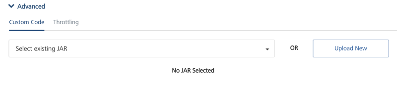

User Guide: [Object Services](../Objectservices.md) > Stage 1: Selecting an Endpoint Type

## Selecting an Endpoint Type

To create an Object Service, you can specify the endpoint details in the Object Service definition.

To create an object service, follow these steps:

1.  Create an app.
2.  Click the **Objects** tab.
3.  Click **CONFIGURE NEW**.
4.  Under the **Name**, type the name of the object, for example, **EmployeeModelSchema**.
5.  Under the **Endpoint Type** field, select the endpoint that you want to use, and enter the details for the selected endpoint type.

    For example, you can create objects services for the following three endpoint types:

    - **Integration and Orchestration Services**
    - **Storage:** Storage service helps you to develop apps by creating object data model and uploading data to the storage database which will then be available to app developers on the runtime instance.
      - When you select Storage endpoint, the **Sample Data** and **Download Template** buttons are displayed. You can store or import sample data by importing a .ZIP file.

        > **_Note:_** You can associate the sample data **at the design time of the service in Volt MX Foundry**, and you can import the sample data **at the run time in the App Services Console** as well.

        For more information on generating sample data for Storage Object services, refer to [How to Create Storage Object Services with Sample Data using Volt MX Foundry](Storage_ObjectServices.md).
    - **Business Adapters**: SAP, RAML, Relational Database, Salesforce, and MongoDB are the endpoint types for which you can create object services.

      > **_Note:_** If your database (RDBMS/MongoDB) is configured with a proxy server, you must select an **environment** and then click **Test Connection** to test the database connectivity. The environment should be `=> V8 SP3 or later`. If the entered details are correct, the system displays the message: Valid Database connection detail.

6.  [Set the **Security Level** field to secure the download of the object service metadata. Select any one of the following security levels to set the authentication type. By default, the field is set to Authenticated App User:  
    ](<javascript:void(0);>)

    - **Authenticated App User** – Restricts the download of object service metadata to users that have successfully authenticated using an Identity Service.
    - **Anonymous App User** – Allows access from a trusted client that has the required App Key and App Secret, but the client does not have to authenticate the user through an Identity Service.
    - **Public** – Allows any client to download the object service metadata without requiring any authentication.

7.  [In the **Offline enabled** section, you can configure the following options for objects services. All fields in the **Offline enabled** section are optional:

    ](javascript:void(0);)

    - Select the **Offline enabled** check box. You can limit the number of times the API can be invoked within a minute. If an API exceeds the throttling limit, the API will throw an error.
      - None
      - Client Wins
      - Server Wins
      - Custom
      - Select the **Enable Upload Cache**
        - Custom Config Resolution: Java Class

8.  From Volt MX Foundry V9 onwards, the **Delete Strategy** section is displayed. This section is displayed when you have selected the **Endpoint Type** as **Storage**. It helps you delete the selected record data from the database. You can choose **Hard Delete** or **Soft Delete**.

    

    - The **Soft Delete** option is selected by default. In this case, when a user performs the delete operation using the client app, the deleted record data is marked for the **SoftDeleteFlag** with value as `1` in the database. The soft deleted data is not available for the app user.

      > **_Important:_** Volt MX recommends you to use the **Soft Delete** option along with the **Offline enabled** mode to ensure the data is in sync with the device and the server.

      When you select the **Offline enabled** check box, the **Soft Delete** option is selected automatically.

    - Select the **Hard Delete** option to delete the selected record data permanently from the database.

      > **_Important:_** When you select the **Hard Delete** option after selecting the **Offline enabled** check box, the following waring message appears: _Warning! Hard Deleting Records in Offline mode is not Recommended._ _It will make local storage inconsistent with the backend._  
      >   
      > Click **OK** to continue enabling the **Hard Delete** option.

      > **_Note:_** You can also use the **Hard Delete** option from the App Services Console. For example, an app is created with the **Delete strategy** settings set to the default **Soft Delete** option but you want to delete some records permanently. In this case, you use the **Hard Delete** option by passing the `X-VoltMX-Soft-Delete` header parameter set to `false` with the delete request call. The delete request body must contain the primary key of the records that you want to delete.

      For more information on how to use the Hard Delete option using the App Service Console, refer to [**App Services Console > Object Services** > **Hard Delete option using the X-VoltMX-Soft-Delete header parameter for Storage Services**.](../../../../Foundry/vmf_integrationservice_admin_console_userguide/Content/Object_Services.md#hard-delete-option-for-storage-services-using-the-x-volt-mx-soft-delete-flag)

9.  [In the **Advanced > ** you can configure the following options for objects services. All options in the **Advanced** section are optional:  
      
    ](<javascript:void(0);>)

    - **Custom Code**

      Preprocessor and Postprocessor enable you to include any business logic on the data while transferring between external data source and the mobile device. Preprocessor is executed after service validation and authentication. Postprocessor is executed after the run time processing. Preprocessor and Postprocessor give you more control over request and response.

      To invoke preprocessor and postprocessor in an object service, you must specify a JAR file to associate with this service. Select from the **Select existing JAR** list, or click **IMPORT** to add a new JAR file.

    - **Throttling:** You can limit the number of times an API can be invoked within a minute. If an API exceeds the throttling limit, the API will throw an error.
      - In the **Total Rate Limit** text box, enter a required value. This will limit the total number of requests processed by this API.
      - In the **Rate Limit Per IP** text box, enter a required value. With this value, you can limit the number of requests made from an IP address. If a device exceeds the limit set, the API will return with an error message.

        To override throttling, refer to [Override API Throttling Configuration](../API_Throttling_Override.md#override-api-throttling-configuration).

        > **_Note:_** In case of On-premises, the number of nodes in a clustered environment is set by configuring the `VOLTMX_SERVER_NUMBER_OF_NODES` property in the Admin Console. This property indicates the number of nodes configured in the cluster. The default value is 1.  
        > Refer to [The Runtime Configuration tab on the Settings screen of App Services](../../../../Foundry/vmf_integrationservice_admin_console_userguide/Content/Runtime_Configuration.md).

        The total limit set in the Volt MX Foundry Console will be divided by the number of configured nodes. For example, a throttling limit of 600 requests/minute with three nodes will be calculated to be 200 requests/minute per node.  
        This is applicable for Volt MX Foundry Cloud and On-premises.

10. Click **Save & Configure**.

You can now [Configure a Data Model](Stage_2.md).
