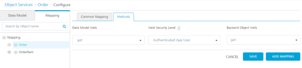
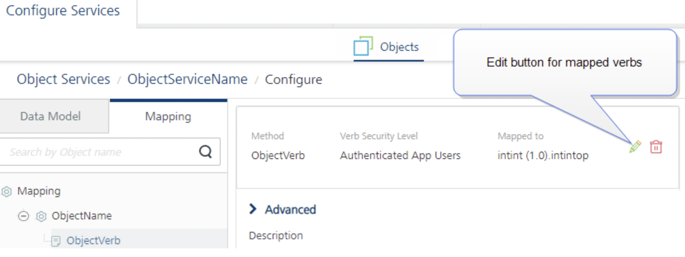
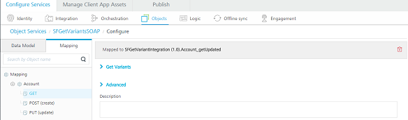

                              

User Guide: [Object Services](../Objectservices.md) > Configuring Common Mapping to the Fields on the Back End

Mapping Operations to Back-end Methods
--------------------------------------

The preferred data model is rarely in the same format or representation as the back-end data from the systems of record. The condition requires a robust mapping capability that can easily retrieve, filter, and transform the back end into the preferred representation. For example, the preferred view of the customer entity may comprise of a contact object from SAP and additional profile information from the enterprise service bus (ESB).

The following sections detail about common mapping, methods (verbs) mapping, custom verbs, and mapper elements:

*   [Mapping Verbs and Methods to the Fields on the Back End](#mapping-verbs-and-methods-to-the-fields-on-the-back-end)
    *   [Configuring **Common Mapping** to the Fields on the Back End](#configuring-common-mapping-to-the-fields-on-the-back-end)
    *   [Configuring **Methods Mapping** to Fields on the Back End](#configuring-methods-mapping-to-fields-on-the-back-end)
    *   [Adding **Custom Verbs** for SAP Object Service](#adding-custom-verbs-for-sap-object-service)
    *   [Mapping **verbs for Objects (for Service-driven Objects)**](#mapping-verbs-for-objects-for-service-driven-objects)
    *   [Testing an Object Service in Volt MX Foundry](#testing-an-object-service-in-foundry)
*   [Creating a Mapping by using Visual Mapper](ObjectservicesVisMapper.md)
*   [Enhancing the Mapping by using XML Mapper for advanced scenarios](ObjectservicesMapper.md)
*   [Mapper Elements](ObjectservicesMapper.md#mapper-elements)
*   [Identity Support in Mapper](ObjectservicesMapper.md#identity-support-in-mapper)

### Mapping Verbs and Methods to the Fields on the Back End

#### Configuring Common Mapping to the Fields on the Back End

The common mapping that you define between a data model field and a back-end object field is applied to a transform request, response, or both. Volt MX Foundry applies this mapping when it invokes any method on the back-end system.

The common mapping contains three types of mapping icons:

*   A **double-headed arrow** icon in the indicates both request and response mapping.
*   The **right arrow** icon indicates only request mapping.
*   The **left arrow** icon indicates only response mapping.

To configure the common mapping, follow these steps:

1.  In the navigation pane, click the **Mapping** tab.

    The mapping configuration screen for the Order object appears.

2.  Click in the first **Map to** field. A drop-down menu appears. Select **VTI\_Internal**. The business object in the back end.
3.  Click in the second **Map to** field. A drop-down menu appears. Click on the plus button next to **VTI\_SAMPLE\_ORDERS**, and then click on **VTI\_SAMPLE\_ORDER**.

    The Common Mapping tab shows that the Order object in your data model is mapped to the VTI\_SAMPLE\_ORDER table of the VTI\_SAMPLE\_ORDERS database in the back-end object VTI\_Internal**.**

4.  Click the **Add** button.
5.  Click in the first field under **APP DATA MODEL FIELDS**. A drop-down menu appears. Select **OrderID**.
6.  Click in the first field under **VTI\_SAMPLE\_ORDERS FIELDS**. A drop-down menu appears. Select **ORDER\_NUMBER.**
7.  Click the **Add** button.
8.  Click in the second field under APP DATA MODEL FIELDS. A drop-down menu appears. Select Amount.
9.  Click in the second field under **VTI\_SAMPLE\_ORDERS FIELDS**. A drop-down menu appears. Select **TOTAL\_VALUE**.
10.  Click the **Add** button.
11.  Click in the third field under **APP DATA MODEL FIELDS**. A drop-down menu appears. Select **Company**.
12.  Click in the third field under **VTI\_SAMPLE\_ORDERS FIELDS**. A drop-down menu appears. Select **COMPANY**.
13.  Click the **Add** button.
14.  Click in the fourth field under **APP DATA MODEL FIELDS**. A drop-down menu appears. Select **Description**.
15.  Click in the fourth field under **VTI\_SAMPLE\_ORDERS FIELDS**. A drop-down menu appears. Select **DESCRIPTION**.
16.  Click the **Add** button.
17.  Click in the fifth field under **APP DATA MODEL FIELDS**. A drop-down menu appears. Select **OrderType**.
18.  Click in the fifth field under **VTI\_SAMPLE\_ORDERS FIELDS**. A drop-down menu appears. Select **ORDER\_TYPE.**

     

19.  Under **TYPE**, click in the drop-down menu for OrderID and ORDER\_NUMBER. Select the left-arrow to indicate response mapping of the object field.

     > **_Note:_** You can sort fields by clicking the column name header in the Mapping tab.

You can also map an object in your data model to additional child objects in the backend object hierarchy. To map an object to additional child objects in the backend, click **Advanced**, and then select the child objects in the hierarchy.

#### Configuring Methods Mapping to Fields on the Back End

Methods mapping is where you can configure what the system should do for all the methods the client app will use. For example, a work order will use the Get, Post (create), Put (update), and Delete methods. When you perform Get on a work order object, the mapping specifies the target object in the SAP back end and the method that you can use against that object. You can control the mapping for both the request to SAP and the response.

To configure the methods mapping, follow these steps:

1.  In the mapping screen, click the **Methods** tab.
2.  Click the **Add** button.
3.  Click in the **Data Model Verb** field, and then select **Get** from the drop-down menu.
4.  Use the default **Verb Security Level**, Authenticated App User.

    The Verb Security Level specifies how the client must authenticate to the verb. You can restrict access to this verb to only authenticated app users that have successfully authenticated using an Identity service. An anonymous app user verb allows access from a trusted client that has the required App Key and App Secret, but the client does not need to authenticate the user through an identity service. Set the security level to Public to allow any client to access this verb without any authentication requirement.

5. Click in the **Backend Object Verb** field. Click the plus button next to VTI\_SAMPLE\_ORDER, and then select **Get**.

    

    > **_Note:_**  For Integration services, Object Services provides built-in variants of the get verb. Click the get verb in the navigation page to configure the mapping of the variants of the get verb. The built-in variants of the get verb are getAll, getbypk, getupdated, getbatch, and getdeleted. These get verbs do not have an individual mapping. They have a common request mapping and a common response mapping.

6. Click **Add Mapping**.

    The method mapping configure screen appears.

    The Security Filters, OData Query Options, Request Mapping, Response Mapping, and Test tabs are displayed.

    The **OData Query Parameters** tab lists the parameters of the method that you can use for the VTI\_SAMPLE\_ORDER object.

7.  Click the **Request Mapping** tab, and then click **Edit** button under Mapper area.
    
    The common mapping of the object is applied to the verb by default.
    
8.  To override the common mapping, click **Clear Mappings**, and specify a custom mapping in Request Mapping and Response Mapping.
    
    > **_Note:_** If you want to override a custom mapping with common mapping, click **Apply Common Mapping**.
    
9.  In OData Query Options, do the following:
    1.  Click in the **Value** field for the **$filter** parameter.
        
        > **_Note:_**  The `&` and `=` operators are not supported in values for OData string key (`$filter`).
        
    2.  Enter the expression **orderStatus ne 'Draft'**. This will filter the orders that have an order status of Draft.

10.  Click **Request Mapping**.

     If you do not apply common mapping of the object to the get verb, this is where you specify a custom mapping on the request to SAP. Common mapping by default maps one-to-one the data model method to the method of the target object in the back end.

     

11.  Click **Response Mapping**.

     If you do not apply common mapping of the object to the get verb, this is where you specify a custom mapping on the response to SAP.

12.  Click **Test**.

     The Test panel appears. You can use the Test panel to test the mapping for a method. To test the mapping, enter the query parameters, select an environment, enter the headers and header values that you want to include with the test. Then, in Request Payload, enter values for the fields for which you want to test the mapping, and then click **Send**.

     

13.  In the navigation pane, click the **Orders** object.

14.  For additional configuration of request (or) response operations, refer to the following <b>Advanced Configurations for Verbs</b> section.

15.  Click <b>Save</b>.

<h4>Advanced Configurations for Verbs</h4>

For additional configuration of request (or) response operations, provide the following details in the Advanced section.

All options in the <b>Advanced</b> section for operations are optional.

Click the Advanced section.

<table>
<tr>
<td><b>Custom Code Invocation</b>
</td>
<td>

 You can add pre and post processing logic to services to modify the request inputs. When you test, the services details of various stages in the service execution are presented to you for better debugging.  For more details, refer to <a href="../../Content/Custom_Code_for_Invoking_ObjectService_from_pre-post-java.html" target="_blank">Preprocessor and Postprocessor for Objects Service Verbs</a>.

<ul>
<li MadCap:conditions="Default.V9SP1GA"><a href="../../Content/Custom_Code_for_Invoking_ObjectService_from_pre-post-java.html">Custom Code for Invoking an Object service from Preprocessor or Postprocessor </a>
<ul>
<li><a href="../../Content/Custom_Code_for_Invoking_ObjectService_from_pre-post-java.html#Invoking">Invoking a ServicesManager</a>
</li>
<li>

<a href="../../Content/Custom_Code_for_Invoking_ObjectService_from_pre-post-java.html#Invoking2">Invoking an Object Service from ServicesManager</a>

</li>
</ul>
</li>
</ul>
</td>
</tr>
<tr class="TableStyle-Basic-Body-Body1">
<td class="TableStyle-Basic-BodyE-Column1-Body1"><b>Related Objects</b>
</td>
<td class="TableStyle-Basic-BodyD-Column1-Body1">

The Include Related Objects setting specifies which part of the data model Object's hierarchy can be handled by the verb. This information helps in optimizing the number of calls to the back end in case the verb also deals with other objects in the hierarchy. You can multi-select multiple objects in the drop-down to specify the information.

</td>
</tr>
<tr class="TableStyle-Basic-Body-Body1">
<td class="TableStyle-Basic-BodyE-Column1-Body1" style="font-weight: bold;">Properties</td>
<td class="TableStyle-Basic-BodyD-Column1-Body1">The Properties allows you to configure service call time out cache response. For information on different types of configuration properties, refer <a href="../../Content/Java_Preprocessor_Postprocessor_.html" target="_blank">Properties</a>.</td>
</tr>
<tr class="TableStyle-Basic-Body-Body1">
<td class="TableStyle-Basic-BodyE-Column1-Body1" style="font-weight: bold;">Server Events</td>
<td class="TableStyle-Basic-BodyD-Column1-Body1">Using Server Events you can configure this service to trigger or process server side events. For detailed information, refer <a href="../../Content/ServerEvents.html">Server Events</a>.</td>
</tr>
<tr class="TableStyle-Basic-Body-Body1" MadCap:conditions="Default.V9SP3">
<td class="TableStyle-Basic-BodyE-Column1-Body1" style="font-weight: bold;">Front-end API</td>
<td class="TableStyle-Basic-BodyD-Column1-Body1"> Front-end API allows you map your endpoint (or) backend URL of an operation to a front-end URL. For detailed information, refer Custom <a href="../../Content/FrontEndAPIURL_Objects.html" target="_blank">Front-end URL</a>.</td>
</tr>
<tr class="TableStyle-Basic-Body-Body1" MadCap:conditions="Default.V9SP3">
<td class="TableStyle-Basic-BodyB-Column1-Body1" style="font-weight: bold;">OpenAPI Specification</td>
<td class="TableStyle-Basic-BodyA-Column1-Body1">

This section allows you to customize the documentation of the Request and Response parameters for your API. For detailed information, refer to <a href="../../Content/OpenAPISpec_Objects.html" target="_blank">Customizing API&#160;documentation using OpenAPI Specification</a>.

<ul>
<li>
Provide the Request body to be used in the Developer Portal. This input is essential when the XML Mapper is used. In the case of Visual Mapper, the Request body is inferred from the mapping.
</li>
<li>
Provide the Response body to be used in the Developer Portal. This input is essential when the XML Mapper is used. In the case of Visual Mapper, the Response body is inferred from the mapping.</li>
</ul>
</td>
</tr>
</tbody>
</table>

#### How to Use Actions in Existing Objects Methods

You can perform the following actions on a method in existing object services:

*   **Edit**: Allows you to edit a method. After you edit a method, you have to republish all the apps that are using the service to apply the changes.
    
    > **_Note:_** To know more about publishing an app, refer to [Publish an app](../Publish.md).  
    
    > **_Note:_** If a service is part of a published app, you can rename that service only after the app is unpublished.
    
*   **Sample Code**: A dynamic code is generated based on the configuration of a method. You can use this code in your SDK.
*   **Delete**: Allows you to delete a method.
    
    > **_Note:_** If a service is a part of a published app, you can delete that service only after you unlink the service from all the published app.
    

#### Adding Custom Verbs for SAP Object Service

SAP Object Service provides you the ability to add custom verb names and map it to an operation of a back-end object. You can now create your own custom verb in addition to the existing verbs (Create, Read, Update, Delete, and Partial Update) and map to a back-end business operation.

**To create a custom verb**, follow these steps**:

1.  In the **Mapping** screen. click the **Methods** tab.
2.  Click the **Add** button.
    
    
    
3.  Click in the **Data Model Verb** field. A drop-down menu appears. Select **custom**.
4.  Provide the **Custom Verb** name.
5.  Use the default **Verb Security Level**, Authenticated App User.
    
    
    
6.  Select the **Library**, it automatically populates the list of data and business object hierarchies available.
7.  Select the **Business Object** from the drop-down list.
8.  Select the verb name from the **Verb** drop-down list and click **SAVE**.
    
    The created custom verb is successfully added to the list of existing verbs.
    
9.  Select the created custom verb from the **Mapping** section in the left pane.
    
    
    
10.  Click **Request Mapping**.
    
     The verb has the Common Mappings applied by default. You can click on **Clear Mappings** and specify a custom mapping on the request to SAP to map the backend object to application model object. The custom verb will be available to the end users like the other verbs in the application. The rest client can test the custom verb from the published application.
        
11.  Click **Response Mapping**.
    
     If you do not apply common mapping of the object, you should specify a custom mapping on the response to SAP.
        
     > **_Note:_** In Foundry V9 and later, any V8 custom response format is ignored and the internal response formatting is enabled (only Primary Key is returned).  
    To get the V8 functionality, you need to set the following -D parameter on the JVM : `VOLTMX_SERVER_CUSTOM_VERB_RESPONSE_FORMAT_ENABLED` to `false`.  
        
     For a workflow object, internal response formatting is enabled by default.  
        
     Before migrating to V9, any existing services or orchestrations that depend on a custom response format will need to be adjusted to use the standard response format.
    
12.  Click **Test**.
    
     You can use the Test panel to test the mapping for a method. To test the mapping, enter the query parameters, select an environment, enter the headers and header values that you want to include with the test. Then, in Request Payload, enter the values for the fields for which you want to test the mapping, and then click **Send**.
        
     If the test is successful, the end users can invoke the created custom verb from their application post publish.
        

     

#### Mapping verbs for Objects (for Service-driven Objects)

To map the verbs for the Defect object, follow these steps:

1.  In the navigation pane, click the Mapping tab, and then click the object. For example, **Defect**.
2.  Click the **Add** button.

    The verb mapping configuration screen for the Account object appears.

3.  Click in the **Data Model Verb** field. A drop-down menu appears. Click **Create**.
4.  Under **Verb Security Level**, use the default, Authenticated App User.

    The Verb Security Level specifies how the client must authenticate to the create verb. Authenticate App User restricts access to the create verb to users that have successfully authenticated using an Identity service. You can also set the security level to Anonymous App User and Public.

5.  Click in the **Services** field. A drop-down menu appears. Select the **Digite** integration service.
6.  Click in the Operations field. A drop-down menu appears. Click **createAccount**.
7.  Click **Save**.

8.  > **_Note:_** From V9SP3, Foundry supports remapping of verbs for service-driven Object Services. The new <b>Edit</b> button is available next to the mapped verb on the verb mapping page that allows you to manage the existing mapped verbs.   
Refer to [Remapping Verbs for Service-Driven Object Services](./../../Content/Remapping_Object_Verbs.md).

For Locked Apps: If you are using Locked Object Services, you cannot edit the locked base verb mapping/s.  However, you can choose to enable/disable the locked mappings to your apps. For more information, refer [Locking a Fabric App](./../../Content/LockApp.md).  

8.  Repeat steps 2 through 7, and map the data model verb **update** to the **updateDefect** operation.
9.  Repeat steps 2 through 7, and map the data model verb **partialupdate** to the **updateDefect** operation.
10. Repeat steps 2 through 7, and map the data model verb **get** to the **getAllDefects** operation.

    The mapping for the verbs is automatically generated. Mapping is auto-generated only when the dataset name of integration services and object name matches. The mapping is populated in the Request Mapping and Response Mapping tabs based on the input and output of the operations. You can click the **Clear Mappings** button to clear the existing mapping and then specify the custom mapping.

    

    You can view the mapping for a verb by clicking the verb on the Mapping tab in the navigation pane. Request mapping is the parameters that are mapped from the device side to the back end. Response mapping is the parameters that the backend sends to the object's fields.

11.  In the navigation pane, under the Defect object, click the **get** verb.
12.  Click **Get Variants**.

     The mapping configuration for the get verb appears. Object Services provides built-in variants of the get verb. You can click **Get Variants** button to view the variants for methods. The built-in variants of the get verb are getAll, getbypk, getupdated, getbatch, and getdeleted. These get verbs do not have individual mapping. They have a common request mapping and a common response mapping.

13.  Click in the **Service Name** field for the getbypk verb, and select **Digite**.
14.  Click in the **Operation** field for the getbypk verb, and select **getDefectDetailsById**.

     A green check mark indicates that the operation mapping has succeeded.

     

15.  Click **Save**.
    
     > **_Note:_** For more information on how to configure Get Variants for SDO, refer to [Configuring SDO Get Verb for Offline Objects](SDO_Get_VariantsObjectservices_Stage3.md).
        

**Support for SDO Services from Offline Objects**

To support SDO services from Offline Objects, you must configure the multiple variants of a get verb from the integration services.

The three types of get variants that support SDO services from Offline Objects are:

*   **getUpdated** – Retrieves the initial records updated within the last updated time stamp.
*   **getByPK** – Retrieves the records based on the ID. This variant supports the records based on a primary key ID.
*   **getBatch** – Retrieves the records of a batch when a batch pointer is provided.

To configure SDO services in Object Service, follow these steps:

1.  Create a service driven object service from the integration service.
2.  Go to Configure **Services > Objects**, select the corresponding SDO object service and click **Mapping**, and click **Get Mapping**.
    
    You can find the Get verb is mapped to a single Integration service.
    
    
    
3.  Expand Get Variants.
4.  Map each get variant getByPK, getUpdated, and getBatch with the corresponding integration service.
    
    
    
    All the Get variants share the same mapper. So, all the parameters of the get variants must be defined with the corresponding Integration service.
    
    The get variants getByPK, getUpdated and getBAtch for Offline Objects must return the following mandatory output parameters:
    
    *   **hasMoreRecords** – Indicates if there are more records to be downloaded.
    *   **batchID** – If batching is applicable, the batchID value must be displayed. If batching is not supported, the parameter does not exist in the output params.

In addition to the built-in verb options, you can also create custom verbs for an object. For example, you can create the custom verb **assign**, and map it to the **assignDefect** operation on the back end.

#### Testing an Object Service in Volt MX Foundry

After you publish the service, you can test the service from Volt MX Foundry. You can only test the published state of the service. You can test the changes you make in the service designer only if you publish the app again.

To test a published service, follow these steps:

1.  In the **Mapping** tab for a Salesforce service, click a verb (for example, get).
2.  In the **Configure** screen, click the **Test** tab.
3.  In the **Test** tab, select the environment and click **Send**.
    
    The result dialog displays the **Response** and **Log** tabs:
    
    *   **Response** tab displays the final response of the service.  
        
        
        
    *   **Log** tab displays the following details  
        
        
        
        *   **Request** displays the request data such as Service ID, App ID and so on.
            
        *   **Request Mapper Input** displays the mapper input in the request flow.
            
        *   **Request Mapper Output** displays the output of mapper in request flow.
            
        
        *   **Backend Request** displays the data sent to the backend.
            
        *   **Backend Response** displays the response received from the backend.
            
        
        *   **Response Mapper Input** displays the input to mapper in response flow.
            
        *   **Response Mapper Output** displays the output of mapper in response flow.
            
        *   **Response** displays the final output of service and the status showing success or failure of test call.

**Limitations for testing an Object Service**

*   Testing of Pre-Processor and PostProcessor is not supported.
*   Testing of Storage Objects is not supported without publishing.

*   You can now [Creating a Mapping by using Visual Mapper](ObjectservicesVisMapper.md)
