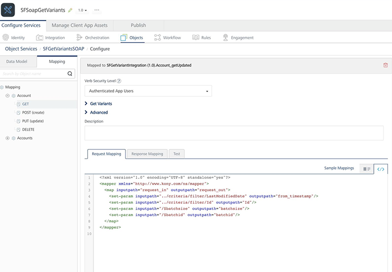
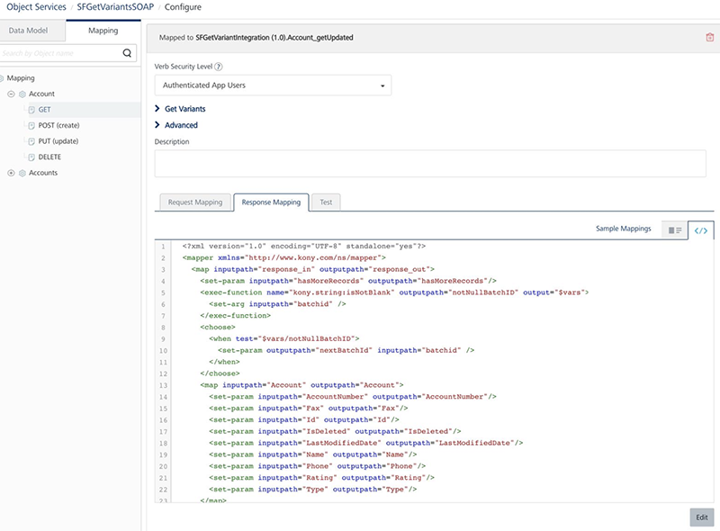

                              

User Guide: [Object Services](../Objectservices.md) > [Stage 3: Mapping Operations to Back-end Methods](Objectservices_Stage3.md) > [Mapping Verbs and Methods to the Fields on the Back End](Objectservices_Stage3.md#mapping-verbs-and-methods-to-the-fields-on-the-back-end) > Configuring SDO Get Verb for Offline Objects

Configuring SDO Get Verb for Offline Objects
============================================

You can create a service-driven object (SDO) from a set of existing Volt MX Foundry Integration/Orchestration Services. These Integration services connect to existing API endpoints or to Volt MX Foundry Orchestration Services, which combine multiple APIs into a new composite or aggregate API.

This section helps you how to configure the Get variants supported for the Get verb for SDO services.

[Types of Get variants in Offline flow](#types-of-get-variants-in-offline-flow):

*   Download Flow: indicates when back-end responses are sent to client devices.
    *   Initial Sync
    *   Delta Sync
    *   Batch

*   Upload Flow: indicates when client requests are sent to back ends.
    *   Conflict
*   [Mapping SDO which supports OData](#mapping-sdo-which-supports-odata)
*   [Mapping SDO which doesn't support OData](#mapping-sdo-which-does-not-support-odata)
    *   Creating Integration services.
    *   Object Service mapping of get variants
*   [Sample App for Get Variants Verbs for SDO](#sample-app-for-get-variants-verbs-for-sdo)

Types of Get variants in Offline flow
-------------------------------------

The following are the different types of the `Get` variants help you to achieve the core functionalities of the offline objects.

### Download Flow

In Download Flow, the back-end responses are sent to client devices.

#### Initial Sync

You must download the initial set of records from a back-end server to a device. If a back end supports batching, the initial sync of data will be downloaded in batches.

This is referred as `getall`. Generally, the GET verb mapper should be able to do this.

#### Delta Sync

You must download all the records that are changed (for example: `created`, `updated`, or `deleted`) after the previous download (`lastUpdateTimestamp`) from the back-end server.

For example, the back-end server sets the `$filter` like this `$filter = <LastModifiedDate> gt <value>` internally to achieve this. This form of get is referred in terms of offline as `getupdated` variant.

#### Batch

You need to use the `batchpointer` to download a particular set of records in that batch.

This form of get is referred in terms of offline as `getbatch`variant.

### Upload Flow

#### Conflict

While determining conflict, back-end data-source is first queried with the given primary key which has to be uploaded. So, if a record is present in a client device, and the client record different from the record in the back-end server, then it is called conflict.

This form is get is referred in terms of offline as `getbypk` variant.

A back-end server sets the `$filter` like this `$filter = <PrimayKeyColumnName> eq <value> eg $filter = Id eq 10`

In the upload flow, if a conflict policy is defined, then the get variants must be configured.

Mapping SDO which supports OData
--------------------------------

Follow these steps to map the get verbs if a back-end server supports OData:

1.  Create an object service type as **Integration/Orchestration**.
2.  Define the corresponding GET verb.
3.  As underlying integration supports OData, edit the GET verb request mapper as below to pass on the corresponding OData query options.

1.  Add the lines highlighted to the **Request Mapper** of the `GET` verb. This is to ensure that you are passing OData fields to underlying integration services to act accordingly.
```
<?xml version="1.0" encoding="UTF-8" standalone="yes"?>  
    <mapper xmlns="http://www.voltmx.com/ns/mapper">  
    <map inputpath\="request_in" outputpath\="request_out">  
    <set-param inputpath\="/$filter" outputpath\="/$filter "/>  
    <set-param inputpath\="/$batchsize" outputpath\="batchsize"/>  
    <set-param inputpath\="/$batchid" outputpath\="batchid"/>  
    </map>  
    </mapper>
```
    
    *   The `$filter` confirms to OData 2 specifications.
    *   The `$batchid` represents the batchpointer to be fetched. (optional; required only when batching is supported)
    *   The `$batchsize` represents the size of a batch to be fetched. (optional ; required only when batching is supported)
    
    No changes to **Response Mapper** is required.
    
    
    

Mapping SDO which does not support OData
----------------------------------------

Follow these stages to map the get verbs if a back-end server does not support OData.

1.  **Stage:** Creating Integration services
2.  **Stage:** Object Service Mapping of get variants

### Creating Integration services

Create one of the following integration types:

*   **A single integration service is present.**
    
    If a single integration service supports all the features required by `initialSync,deltaSync` and `getbypk`, then create that service and map that to the Get verb and provide the mapper accordingly.
    
*   **Multiple integration services are present**
    
    *   For Initial sync.
        
        A service which would download all the records. This is ideally general get service mapped to GET verb.
        
        **Input** -> No input params required.
        
        **Output** -> The following conditions are mandatory:
        
        *   The response should contain the list of all records of the selected object.
        *   The response should return the `hasMoreRecords` parameter, which indicates more records to be downloaded
        
    
    *   For Batch sync: The following is to be configured when batching is supported:
        
        The `nextBatchId`which would represent the current download yielded in to batch and this represents the next `batchPointer`.
        
        > **_Note:_** While mapping to ObjectService verbs, this can be mapped to GET verb.
        
    
    *   For Delta sync: `getUpdated service`
        
        A service which would take the `timestamp`as an input and fetches the data from that timestamp.
        
        **Input ->**
        
        *   The request should take timestamp as the parameter.
        
        If batching is supported can also take
        
        *   One more parameter which would take batchsize as pointer.
        
        **Output ->**
        
        *   The response should contain the list of all records of the selected object.
        *   The response should return the `hasMoreRecords` parameter, which indicates more records to be downloaded
        *   The `nextBatchId`, which represents the current download yielded in to batch and this represents the next batchPointer. Mandatory only when a batching is required.
        
        > **_Note:_** In `ObjectService getVerbMapping` this can be mapped to the `getupdated`verb. If the same service can download, all the records for some default value of timestamp same service can also be mapped to GET verb.
        
        To download progressive batches – getbatch Service
        
        A service which would take the batch pointer as the parameter and download that batch
        
        **Input**
        
        *   The request should take batchid as the parameter.
        
        **Output**
        
        *   The response should return the list of records of an object
        *   The response should return the `hasMoreRecords` parameter, which represents still any more records to be downloaded
        *   The `nextBatchId`, which represents the current download yielded in to batch and this represents the next batchPointer.
        
        > **_Note:_** In ObjectService getVerbMapping this can be mapped to getbatch service. In this case the batchPointer should return from the above defined getUpdated and get services
        
    
    *   **If Conflict needs to be supported by SDO – getbypk service**
        
        A service which takes the primary key of an objects as an input param and downloads that particular record.
        
        **Input**
        
        *   A param which represents the PK of an object as an input.
        
        **Output**
        
        *   The response should return all the fields of a particular record.
        
        > **_Note:_** In ObjectService getVerbMapping this can be mapped to getbypk service.
        
        > **_Important:_** The response of the `getbypk` verb should be JSON array format.
        
        These are the different flavors of get that supports initial sync, delta sync, batching and conflict functionality of offline objects.
        

### Object Service Mapping of get variants

1.  After you complete the steps in the previous section, now create an object service from the above defined integration service.
2.  Go to **GET** verb mapping to map all the above defined integration services as below:
3.  Go to **Configure services >Objects** **\>** Select the corresponding SDO object service -> click on Mapping of a particular object -> and click on Get Mapping.
    
    In the screen shot above you could see main GET verb is mapped to getupdated service only.
    
    > **_Note:_** In the GET verb mapping, you can also configure extra variant mappings such as `getByPk` and `getbatch` and so on. For more information, refer to [Known Issues](../../../../Foundry/voltmx_foundry_release_notes/Content/V9_Knownissues.md#console).
    
4.  Click on Get Variants and map the corresponding integration services to each get variants as below:
    
    
    
    Each getvariant getbypk and getupdated and getbatch should be mapped to corresponding integration service as defined above.
    
    All the variants of get share the same mapper. So, all the params required for all the above mentioned getVariants should be defined.
    
    The ones highlighted in blue needs to be added to the generated mapper.
    
    **Request Mapper**
    
    
    
    **Filter propagation**
    
    You can access the filter from the criteria node like this `../criteria/filter/<key> ..`. This will give that value of `<key>` present in filter.
    
    For example, `$filter = Id eq 10`
    
    The above `../criteria/filter/Id` will give value 10.
    
    **Response Mapper**
    
    
    
    The ones highlighted in blue needs to be added **Response Mapper**.
    
```
<?xml version="1.0" encoding="UTF-8" standalone="yes"?>  
    <mapper xmlns="http://www.voltmx.com/ns/mapper">  
    <map inputpath\="response_in" outputpath\="response_out">  
    <set-param inputpath\="hasMoreRecords" outputpath\="hasMoreRecords"/>  
    <exec-function name="voltmx.string:isNotBlank" outputpath\="notNullBatchID" output="$vars">  
    <set-arg inputpath\="batchid" />  
    </exec-function>  
    <choose>  
    <when test\="$vars/notNullBatchID">  
    <set-param outputpath\="nextBatchId" inputpath\="batchid" />  
    </when>  
    </choose>  
    <map inputpath\="Account" outputpath\="Account">  
    <set-param inputpath\="AccountNumber" outputpath\="AccountNumber"/>  
    …..  
    <default generated mapper ctnd…>  
    </map>  
    </map>  
    </mapper>
```
    
    The get variants `getall`, `getupdated`, and `getbatch` for offline should return the following mandatory output params:
    
    *   **hasMoreRecords**: This indicates whether all the records have been downloaded or not. Based on Boolean value client will decide whether to continue further downloading or not.
    *   **batchId**: If download falls to batching, this represents the `nextbatchid`value. If batching is ended, this parameter should not be present in the output params even with empty values.
        
        In the above mapper null check on `batchid`is done to make sure no `nextBatchId` param is present if it is null.
        
        Please note that above two params are case sensitive.
        

Sample App for Get Variants Verbs for SDO
-----------------------------------------

For more hands-on approach on how to implement GetVariants verbs, download and import the SFSoapGetVariants.zip the sample app to preview the details using Volt MX Foundry ?

If required, replace the Salesforce credentials with yours.

[https://voltmxsolutions.atlassian.net/wiki/pages/SFSoapGetVariants.zip](https://voltmxsolutions.atlassian.net/wiki/pages/viewpageattachments.action?pageId=313229314&preview=/313229314/312607004/SFSoapGetVariants.zip)
