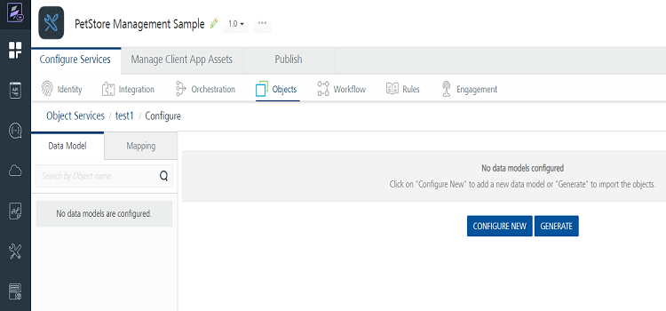
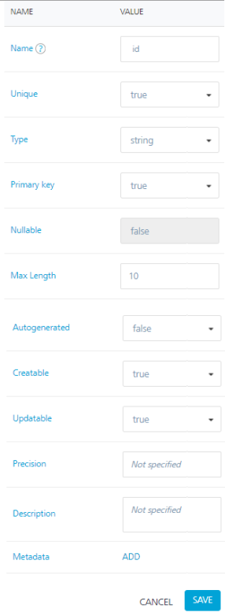

                               

User Guide: [Object Services](../Objectservices.md) > Generating Objects' Definition from Meta Data of Back-end Provider

Configuring a Data Model
------------------------

You can design and optimize a data model based on the use cases of your mobile application. You can do this independent of the back-end system. Various data model entities, such as “Customer” and “Account” are grouped into reusable sets, such as “CRM” or “Work Order”. These sets encapsulate the related and dependent data model entities.

After you select an endpoint type, you can generate a data model from back-end LOB systems that already have their data model exposed as objects. Or, you can build a data model and **map the objects to a back-end system manually**. You can also create a service-driven object from an existing Service.

The following sections detail about Generating object's definition and object relationships:

*   [Generating Objects' Definition from Meta Data of Back-end Provider](#generating-objects-39-definition-from-meta-data-of-back-end-provider)
*   [Creating Objects' Definition and Map to Back-end Objects Manually](#creating-objects-39-definition-and-map-to-back-end-objects-manually)
*   [Configuring Relationships between Objects](#configuring-relationships-between-objects)

### Generating Objects' Definition from Meta Data of Back-end Provider

You can generate a data model from a backend LOB system that has its data model exposed as objects. The example in the following section details the steps for generating a data model from a sample SAP backend.

[Steps to generate a data model from back-end LOB objects  
](javascript:void(0);)

**To generate a data model from back-end LOB objects, follow these steps:**

1.  You have [Selected an Endpoint Type for your Object Service](Objectservices_Stage1.md#selecting-an-endpoint-type). Follow these steps to continue work with Objects Definition.
    
    The data model configure screen for the object service appears.
    
    
    
2.  Click **Generate**.
3.  From the **Import Objects from Backend** screen, click the **EmpDirDetails** schema to expand the tables details.
4.  Under **Tables**, select the check boxes for the individual tables.

    

6.  Click **NEXT**.

    The **Import Objects from Backend** screen shows the imported back-end objects and the names of the imported objects for the data model. You can edit the names of the objects for the data model.

9.  Click **GENERATE**.

    

11.  In the **Data Model** tab of the navigation pane, click the plus button next to the **contact** object.

     Fields and Relationships appear under the **contact** object.

13.  Click **Fields**.

     The list of fields in the **contact** object appears in the Configure screen. You can change the name of the fields or modify the attributes. For example, you can change the primary key attribute. You cannot change the auto-generated attribute.

     

     > **_Note:_** For metadata and Data Pre and Post Processors, refer to [Automatic Field Level Encryption for Object Services](../DataEncryptionObjects.md).

17.  In the **Data Model** tab of the navigation pane, under the **contact** object, click **Relationships**.

     The list of relationships for the **contact** object appears. The **contact** object has a many-to-one relationship with the VTI\_SAMPLE\_COMPANY object and a one-to-many relationship with the VTI\_SAMPLE\_ORDER\_ITEM object. You can edit or delete the relationships, or add new relationships.

     

20.  In the navigation pane, click the **Mapping** tab.

     The Common Mapping configuration screen for the VTI\_SAMPLE\_ORDER object appears. The common mapping between a data model field and a back-end object field is applied to a transform request, response, or both, when methods are invoked on a back-end object. The double-headed arrow icon in the Type drop-down indicates that the mapping transformation is applied to both request and response. The right-arrow icon indicates only request mapping, and the left-arrow icon indicates only response mapping of the object.

22.  Click **Save**.

     You can now publish the Volt MX Foundry application as it is, or you can also configure the objects to be enabled for offline synchronization.

For more details on how to enable synchronization for the application, click [Sync scope mapped to an object service](../../../../Foundry/offline_objects_gettingstarted/Content/Offline_Objects_Getting_Started.md).

After you have generated the data model from the back-end objects that you imported, you can publish your app. You can then provide the code that Volt MX Foundry generates to a mobile application developer. The mobile application developer integrates the code with platform SDKs and adds additional logic and modifies the presentation layer. The mobile application developer builds the client binary and publishes it to the enterprise app store.

> **_Note:_** To lock fields (read-only fields) in a data model of Object Services, refer to [Configuring Read-only Fields for Object Services through MFCLI](../Lock_Unlock_Fields_ObjectServices_MFCLI.md)

At run time, Volt MX Foundry is the middleware that talks to the back end, manages the integration, and filters, transforms, and synchronizes the data it sends to the front-end clients.

### **Creating Objects' Definition and Map to Back-end Objects Manually**

You can create a new data model manually and map it to your backend system. You must provide this data model to the application developer to integrate it with the app. The end user’s device will use this data model to synchronize data with Volt MX Foundry. Mapping specifies how Volt MX Foundry will populate the data model based on the backend LOB objects. You can build the client application using your preferred data model and then map the application objects with the backend objects.

In this procedure, you will create a new data model: **EmployeeModelSchema**, add objects to the data model, and then add fields to the objects.

<b>Steps to create a Data Model and add an object and fields</b>

1.  **Steps to create an object:**
    1.  Create a new object service. See [Create an Object Service](Objectservices_Stage1.md).
    2.  Click **Save & Configure**.
        
        The Configure screen for the new object service appears. The Data Model and Mapping tabs appear. The Data Model tab is selected by default.
        
    3.  Click **CONFIGURE NEW**.
        
    4.  In the **Name** text box, enter **department**, and then click **SAVE**.
        
        In the Configure screen, the department object is created and appears in the list of objects.

        > **_Note:_** For Locked Apps: If you are using Locked Object Services, you cannot create new objects.For more information, refer [Locking a Foundry App](./../LockApp.md)
        
2.  **Steps to create fields:**

    > **_Note:_** For Locked Apps: If you are using Locked Object Services, you cannot edit the locked base object fields (The locked base fields of objects are categorized as the BASE FIELDS).However, you can add fields to the locked objects as custom fields. The new fields in the locked objects are categorized as CUSTOM FIELDS.
    
    For more information, refer [Locking a Foundry App](./../LockApp.md).

    1.  In the **Data Model** tab of the navigation pane, click the plus button next to the **department** object.
        
        Fields and Relationships appear under the **department** object.
        
    2.  Click **Fields**.
        
        The metadata details of the field is created by default and appears the same in the Field Configure screen.
        
        
        
    
    1.  Click the **Add** button.
        
        A row is created for the new field including the basic columns _NAME_, _TYPE_, _PRIMARY KEY_, and DETAILS.
        
    
    1.  Under the **NAME** column, type the required name of the field, for example **Department\_id**.
        
        
        
    
    1.  Under the **TYPE** column, select the data type of the field. The string data type is selected by default.  
        The available data types as follows:
        
        <table style="width: 100%;mc-table-style: url]('../Resources/TableStyles/Basic.css');" class="TableStyle-Basic" cellspacing="0"><colgroup><col class="TableStyle-Basic-Column-Column1" style="width: 174px;"><col class="TableStyle-Basic-Column-Column1"></colgroup><tbody><tr class="TableStyle-Basic-Body-Body1"><td class="TableStyle-Basic-BodyE-Column1-Body1"><b>Basic data types</b>:</td><td class="TableStyle-Basic-BodyD-Column1-Body1"><code class="codefirst">string</code><code class="codefirst">date</code><code class="codefirst">boolean</code><code class="codefirst">number</code></td></tr><tr class="TableStyle-Basic-Body-Body1"><td class="TableStyle-Basic-BodyB-Column1-Body1"><b>Advanced data types</b></td><td class="TableStyle-Basic-BodyA-Column1-Body1"><code class="codefirst">binary</code>: Used for uploading an image file format as evidence/proof. <code class="codefirst">enum</code>: <a href="enumDatatypes.html" target="_blank">Click here for more details on How to Configure Enum data type and examples</a>.<code class="codefirst">workflow state</code>: Used for associating a back-end workflow. While defining a <code class="codefirst">workflow state</code> data type for a field, you can create a workflow or use an existing one. A workflow can contain a set of nodes represents a specific task or an event as per your business logic. Here, the workflow data type is a part of a field in an object. Backend workflow is linked to a verb in an Object Service and whenever that verb in the object service is invoked, the related workflow is triggers automatically. So that the workflow will execute all the subsequent tasks that were defined with in it and completes the entire backend process that is related to the linked verb. Using Workflow, you can visualize and design a backend process. It justifies the low code concept and you can design the backend workflow simply by dragging and dropping different types of nodes and connecting them as per the logic you need. For more information on how to configure a workflow, refer to <a href="../../../voltmx_foundry_workflow/Content/Workflow.html" target="_blank">Workflow</a></td></tr></tbody></table>
        
    
    1.  If you want to set the field as a primary key, under the **PRIMARY KEY** column, click the toggle button to set to **TRUE**. The primary key value is **FALSE** by default.
    
    1.  If you want to view and configure the additional columns of the field, click the **View Details** button under the **DETAILS** column.
        
        > **_Important:_** The **View Details** button is active only after you save the field details.
        
        
        
        The field details page displays the additional columns including _unique, nullable, _max length_, autogenerated, creatable, updatable, precision, description_, and [metadata](../DataEncryptionObjects.md).
        
        | The following details to help you when to use some of the specific constraints to specify rules for a field: ||
        | --- | --- |
        | **Field constraints** | **Description** |
        | --- | --- |
        |  | **Unique**: The `unique` constraint ensures that all values in a column are different.Both the `unique` and `primary key` constraints provide a guarantee for uniqueness for a column or set of columns.A `primary key` constraint automatically has a `unique` constraint.However, you can have many `unique` constraints per table, but only one `primary key` constraint per table. |
        |^^| **Primary key** The `primary key` constraint uniquely identifies each record in a table.`Primary keys` must contain `unique` values, and cannot contain NULL values.A table can have only ONE `primary key`; and in the table, this primary key can consist of single or multiple columns (fields). |
        |^^| **Precision** is the number of digits in a number.  For example, the number 123 has a precision of 3.For example, the number 123.45 has a precision of 5 and a scale of 2. Scale is the number of digits to the right of the decimal point in a number. |
        |^^| **Metadata**: This metadata of the Object allows app developers to control client-side logic by using the **Data Pre and Post Processors for Models** functionality, which helps to access the metadata dynamically at runtime and has custom JS code written to transform the data based on the metadata. This allows app developers to modify business logic at the client app and control which fields get transformed and how.For example, you can write your custom logic for fields in models to transform data in client before sending to back end and vice versa such as data encryption, decryption, currency or temperature conversion, prepend or append characters such as salutations (Mr. or Dr.) or currency symbol ($ or €) and so on. For more information on metadata, [Click here for more information on Object Metadata for Controlling Client-side Logic](../DataEncryptionObjects.md). |
        
    
    1.  If you want to add more fields to the object, repeat step 2 in the procedure.
    
    1.  Click **SAVE** to save the details of the field.
    
    > **_Note:_** If you want to create more objects in the data model, select the **Data Model** root node and click **Add.** And then repeat steps 1 and 2.

    > **_Note:_** For Locked Apps: If you are using Locked Object Services, you cannot create new objects and edit the locked base object fields.
    
    For more information, refer [Locking a Foundry App](./../LockApp.md).
    
    > **_Note:_** To lock fields (read-only fields) in a data model of Object Services, refer to [Configuring Read-only Fields for Object Services through MFCLI](../Lock_Unlock_Fields_ObjectServices_MFCLI.md)
    
    > **_Note:_** You can view the service in the Data Panel feature of Volt MX Iris. By using the Data Panel, you can link back-end data services to your application UI elements seamlessly with low-code to no code. For more information on Data Panel, click [here](../../../../Iris/iris_user_guide/Content/DataPanel.md#top).
    

> **_Note:_** You can also clone a data model of an existing object service. Refer to [Actions in objects services](ObjectservicesActions.md#actions).

### Configuring Relationships between Objects

The following procedure helps you how to define relationships between the unique fields in objects in the **EmpolyeeModelSchema** data model.

<!-- [Click here for more details..  
](javascript:void(0);) -->

Click here for more details..

<b>To configure the relationships, follow these steps:</b>
<ul>
<li>In the <b>Data Model</b> tab of the navigation pane, under the <b>department</b> object, click <b>Relationships</b>.
The Relationships screen appears.</li>
<li>Click the <b>Add</b> button.The screen for configuring the relationships appears.</li>
<li>Click in the <b>Select Target Objects</b> field, and then select the <b>employee</b> object from the drop-down menu.</li>
<li>Click in the <b>Select Relationship Type</b> field, and select <b>One to Many</b> from the drop-down menu.</li>
<li>Under <b>Specify Object Attribute Relationships</b>, click in the <b>Source Object Attributes</b> field, and then select <b>Department_id</b> from the drop-down menu.</li>
<li>Click in the Target Object Attributes field, and then select Department_id from the drop-down menu.</li>
<li>Click <b>Save</b></li>
</ul>
<b>Note: </b>You can add objects to the data model, configure relationships, and enable synchronization for the application. 
<b>Note: </b>You can sort fields by clicking the column name header in the data model.

You can now configure Common Mapping and Methods to the Fields on the Back-End, refer to [Mapping Operations to Back-end Methods](Objectservices_Stage3.md#mapping-operations-to-back-end-methods).

