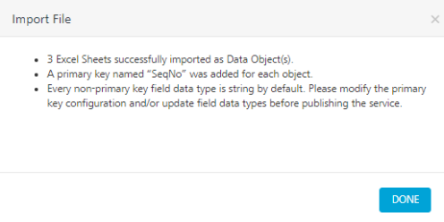
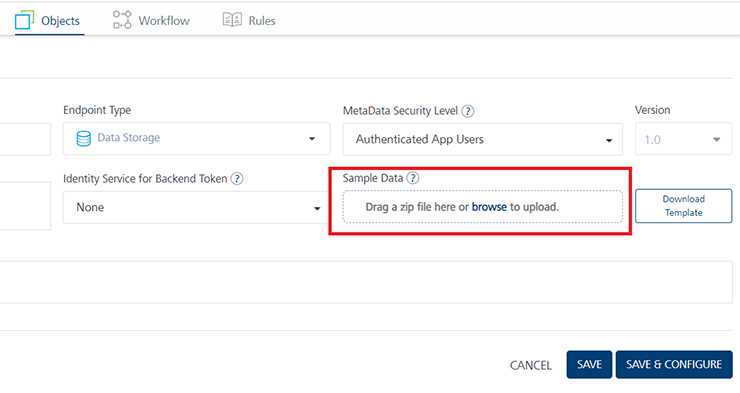

                               

User Guide: [Object Services](../Objectservices.md) > Workflow for Generating Sample Data

How to Create and Store Sample Data to Storage Object Services
--------------------------------------------------------------

The Volt MX Storage service provides you the ability to create your own database schema/ data tables on the relational database hosted on Volt MX Cloud by using the storage endpoint connector under Object services. Storage service helps you to develop apps by creating an object data model and uploading data to the storage database which will then be available to app developers on the runtime instance.

You can store or import sample data to storage object services by importing a .zip file. The sample data can be uploaded at the design time of service in Foundry console which gets imported to storage service during publish.

Alternately, sample data can also be imported at run time in the App Services console.

You can create your data model for your object service endpoint type Storage by either of the two methods:

  
| Steps | Method 1 | **Method 2** |
| --- | --- | --- |
| **Step 1 - Creating Data Model** | **By creating objects and fields manually**  a) Create objects and fields in the Data Model pane. The data model is created.| **By uploading an excel (workbook) file** a) Upload the data model in one of these file formats: XLS and XLSX.(Each Tab/worksheet names of an XLSX file are used for object names in the data model. Column names in the first row of each tab/worksheet are used for field names in an object.The data model is created.
| **Step 2 - Adding Data to the Fields in Objects, for data model.** | b) Import the data model template. A sample template `.ZIP` file contains multiple objects as separate `.CSV` files. c) Unzip the file downloaded template, add data to the fields in .CSV files, and save them. d) Zip the .CSV files. The zipped file name should be the original name that you have downloaded. e)Finally, upload the zip file to the storage service and publish the service.

 > **_Note:_** For more details on how to create a data model for an object service type storage, refer to [Generating Sample Data Template for Storage Object Services based on a Data Model](#generating-sample-data-template-for-storage-object-services-based-on-a-data-model) section. |||

> **_Important:_** If you associate sample data while creating the service in Volt MX Foundry, the sample data gets attached to the object service. While publishing the service, the sample data gets stored to the storage database and is available to the client app as well.  
  
  
If you associate sample data at the run-time server, the sample data gets stored in the storage database. The behavior is the same when data is associated/modified from the Runtime Server.

  
| **Structure of Sample Data .ZIP File for Storage Objects** ||
| --- | --- |
|  | A sample data `.ZIP` file contains multiple objects as separate `.CSV` files. A `.CSV` file must contain fields of an object as defined in the data model. Users can add data in the corresponding fields in a `.CSV` file. |

| **Benefits of Storing Sample Data to Storage Object Services in Volt MX Foundry** |
| --- |
| You can associate sample data while creating the storage service in Volt MX Foundry, The sample data gets attached to the object service. By doing this, you can save time by uploading the sample data to storage object services in the run-time server. Other users can reuse the service with sample data. While publishing the app with a storage service, the sample data gets published to the storage database. So now, Users can access their application with sample data on the first launch itself. |

### Workflow for Generating Sample Data Template **and Attaching Sample Data for Storage Object Services**

### Generating Sample Data Template **for Storage Object Services based on a Data Model**

The following section helps you to generate sample data model with sample data, which you can import to a storage object services while creating the service.

To create an object service for storage with sample data, follow these steps:

1.  **Create a Data Model.**
    
    1.  [While creating an object service](Objectservices_Stage1.md#ServiceDesingerStorage), select **Storage** from the **Endpoint Type** field.
        
        The **Sample Data** and **Download Template** buttons are displayed.
        
        > **_Note:_** The **Delete Strategy** feature in Storage services helps you to enable the **Delete** operation to delete the selected data from the database. Refer to [**Delete Strategy**](Objectservices_Stage1.md#DeleteStrategy).
        
    2.  Click **Save and Configure**. The **Data Model** configure screen for the object service appears.
    3.  **Create a data model as follows**:
        
        You can create your data model or upload it by using an excel file.
        
        
        
        *   **Configuring a new data model:**
            1.  Click **CONFIGURE NEW**. An object is created with the default name. You can change the name of the object under the **Name** text box and description.
            2.  Click **SAVE**.
            3.  In the **Data Model** tab of the navigation pane, click the plus button next to the object.
                
                Fields and Relationships nodes appear under the selected object.
                
            4.  Click **Fields**.
                
                The metadata details of the field is created by default and appears the same in the Configure screen.
                
            5.  Add fields to the object based on your requirements.  
                For more information on how to add fields, refer to steps in the [Creating Objects' Definition and Map to Back-end Objects Manually](Stage_2.md#creating-objects-39-definition-and-map-to-back-end-objects-manually) section.
            6.  Save the object. You can create more objects, if required.
                
                > **_Important:_** Primary Key is mandatory for a data model. Please specify at least one field as a primary key in the data model.
                
            7.  Click **SAVE** to save the changes to the data model. Now you have created the data model.
        *   **Importing a data model:**
            
            You can import data model in these file formats XLS and XLSX.  
            For more information on requirements to create a valid data model using an XLSX file format, refer to [Data Model Template in XLSX file.](DataModelTemplateXLSXStorage.md)
            
            1.  Click **IMPORT FROM FILE**.
            2.  In the **Import File** dialog box, upload the data model by drag-and-drop the valid XLS/XLSX file. 
                
                
                
            3.  After the file is uploaded successfully, click **NEXT**.
                
                In the next screen, the objects are created under the **DATA MODEL OBJECT NAME** based on the **EXCEL SHEET NAME** column details uploaded from the excel file. These objects are selected by default.
                
                *   You can modify an object name, if required.
                *   You can clear the check box for an object to not to be included it in the data model, if required.
                
                
                
            4.  Click **IMPORT**.
                
                The **Import File** dialog box displays the additional information such as: number of objects imported, primary key field name, and default data types for the fields.
                
                
                
            5.  Click **DONE**.
                
                > **_Important:_** Primary Key is mandatory for an object. By default, a primary key named **SeqNo** is added for each object. You can modify the primary key configuration field as per your requirements.
                
                > **_Important:_** Every non-primary key field data type is string by default. You must update field data types before publishing the service.
                
                Now you have created the objects in the data model.
                
2.  **Generate Sample Data template** based on the data model as follows:
    1.  **Downloading the Template:**
        1.  Go to the **Objects Service Definition** page.
            
            
            
        2.  Click the **Download Template** button to auto-generate the **Template** based on the data model. The sample data template will be downloaded in a .ZIP file into your local system.
            
            > **_Note:_** You can add more data to the existing .CSV files in the .ZIP
            
            Now you have created the sample data template in a .ZIP file. The sample data template .ZIP file contains .CSV files for each object.
            
    2.  **Uploading the Template with sample data:**
        1.  Add data to the fields to your sample data objects in .CSV files in the template .ZIP file.
            
        2.  Zip all the updated the .CSV files.
            
        3.  Upload the zip file by drag-and-drop to the **Sample Data**. In the **Sample Data** **> Drag a zip file here or browse to upload**, drag-and-drop the zip file. The sample data file is uploaded to the service.
            
            
            
            > **_Note:_** You can upload the sample data .ZIP file by clicking the **browse** button.
            
            > **_Note:_** After you upload the sample data file, you can download by click the **Download** button.  
              
            To delete the uploaded sample data .zip file, click the **Delete** button.  
              

            Refer [How to Manage Sample Data to Storage Object Service using Volt MX Foundry](#how-to-manage-sample-data-to-storage-object-service-using-volt-mx-foundry)
            
        4.  Click **SAVE** to save the service.
3.  **Publish the Sample Data with the App.**
    *   To publish the sample data for the first time, do the following:
        1.  In the **Service and Web Client** tab, select the Environment.
        2.  Click **Publish**. The sample data will be published along with the app.
            
            After you publish the app, the app users can access the sample data on devices. You can modify and manage the sample data for Object services in the App Services console.
            

### How to Manage Sample Data to Storage Object Service using Volt MX Foundry

While publishing the sample data for the first time, the data is auto-published. If you want to publish a new version of sample data, you must select the **Include Sample Data** in Publish Reconfiguration.

Data in the sample set act as an addition to the existing data. If there is a conflict, existing data will be overwritten with the new sample data.

1.  Upload the new Sample Data .zip file to your Object. [Refer Generating Sample Data for Storage Object Services based on a Data Model](#generating-sample-data-template-for-storage-object-services-based-on-a-data-model)
2.  Click the **Publish** tab.
3.  In the **Service and Web Client** tab, select the Environment.
4.  Click **CONFIGURE & PUBLISH**. The **Service Reconfigure** page appears.
5.  Navigate to the **Object Service Configuration** tab.
6.  Select the **Include Sample Data** check box.
    
7.  Click **SAVE & PUBLISH**.
    

### How to Delete Unused Data for Storage Object Services using the App Services Console

Storage object services occupy the space of your environment. You can unpublish unused storage services to gain the space.

When you unpublish an app with a storage object service from Volt MX Foundry Console, the data that is associated with the storage object service is not deleted. You must clear the data permanently from the database by using the App Services Console.

The following steps helps to delete orphan data for storage object services:

1.  Log in to Volt MX Foundry Console.
2.  Navigate to an app that has configured with storage object service with data.
3.  Unpublish the app.
4.  Log in to App Services Console.
5.  Navigate to the Objects Services section. All the unused schemas are stored as `Storage (Unused)`.
    
    
    
    Now, you can view the **Delete** and **Export** buttons next to the object service in App Services Console.
    
6.  Click **Delete** to delete the unused data.
    
    > **_Note:_** Ensure that you export the data before you delete it permanently.
    
    *   When you click the **Export** button, the existing data is exported in a .CSV file.
