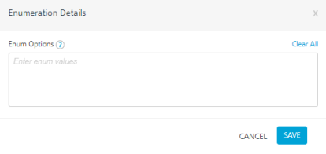
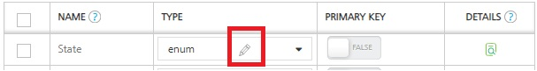

User Guide: [Object Services](../Objectservices.md) > Enumeration Data Type

<h3 id="enum">Enumeration Data Type</h3>

A field with the `Enumerated/enum` data type enables you to configure a set of values/options for that field. So the enum data type field restricts app users to enter/select only the pre-configured list of options as the input for that field.

Use cases:

*   In the **Contact** form, the **State** field needs to be a pre-configured list of 50 States of America. This enables the app users to choose only one of the available values from the list.
*   A **Priority** field can have enumeration options as _Critical_, _High_, _Medium_, and _Low_.
*   A **Gender** field can have only _Male_ and _Female_ as valid values.

**How to configure enum data type for a field:**

1.  In Volt MX Foundry Console, create an object in the Data Model of an object service, for example **Address**.
2.  Select the **Fields** node under the **Address** object and click **Add** to create a field.
3.  Under the **NAME** column, specify the field name, for example, **State**.
4.  Under the **TYPE** column, select the data type as `enum`. The string data type is selected by default.

    The **Enumeration Details** dialog box appears.

    

    1.  Under the **Enum Option** text box, enter the details and then type comma or space bar on your keyboard. These values are updated in the text box. [Refer to Enum data type samples, in the next section](#Enum).

        > ***Note:*** You can also copy and paste the comma-separated text into the text box.

        > ***Note:*** The number of enumeration options allowed is up to a maximum of 50.

    1.  Click **SAVE** to save the details and close the dialog box.  
        Use the **Edit** button shown next to the enum data type to modify the data, if required.

        

5.  Click **SAVE** to save to the field.

<b>Enum data type samples</b>

*   __You can configure the enumeration options as a comma-separated set of values, as shown:__

    <table style="margin-left: 0;margin-right: auto;width: 307px;mc-table-style: url('../Resources/TableStyles/Basic.css');" class="TableStyle-Basic" cellspacing="0"><colgroup><col style="width: 217px;" class="TableStyle-Basic-Column-Column1"><col style="width: 81px;" class="TableStyle-Basic-Column-Column1"></colgroup>

    <thead>

    <tr class="TableStyle-Basic-Head-Header1">

    <th style="font-size: 10pt;font-weight: bold;" class="TableStyle-Basic-HeadE-Column1-Header1">Example</th>

    <th style="font-size: 10pt;font-weight: bold;" class="TableStyle-Basic-HeadD-Column1-Header1">Output</th>

    </tr>

    </thead>

    <tbody>

    <tr class="TableStyle-Basic-Body-Body1">

    <td class="TableStyle-Basic-BodyB-Column1-Body1">Critical, High, Medium, Low</td>

    <td class="TableStyle-Basic-BodyA-Column1-Body1">

    Critical

    High

    Medium

    Low

    </td>

    </tr>

    </tbody>

    </table>

*   __You can configure the enumeration options in Text with special characters within quotes (single/double) and comma-separated, as shown:__

    <table style="margin-left: 0;margin-right: auto;mc-table-style: url('../Resources/TableStyles/Basic.css');width: 736px;" class="TableStyle-Basic" cellspacing="0"><colgroup><col style="width: 133px;" class="TableStyle-Basic-Column-Column1"><col style="width: 379px;" class="TableStyle-Basic-Column-Column1"><col style="width: 219px;" class="TableStyle-Basic-Column-Column1"></colgroup>

    <thead>

    <tr class="TableStyle-Basic-Head-Header1">

    <th style="font-size: 10pt;font-weight: bold;" class="TableStyle-Basic-HeadE-Column1-Header1">Option</th>

    <th style="font-size: 10pt;font-weight: bold;" class="TableStyle-Basic-HeadE-Column1-Header1">Input for the Enum field in Console - Examples</th>

    <th style="font-size: 10pt;font-weight: bold;" class="TableStyle-Basic-HeadD-Column1-Header1">Output in the form of an app</th>

    </tr>

    </thead>

    <tbody>

    <tr class="TableStyle-Basic-Body-Body1">

    <td class="TableStyle-Basic-BodyE-Column1-Body1">option 1</td>

    <td class="TableStyle-Basic-BodyE-Column1-Body1">"Critical", "High", "Medium", "Low"</td>

    <td class="TableStyle-Basic-BodyD-Column1-Body1">

    "Critical'

    "High"

    "Medium"

    "Low"

    </td>

    </tr>

    <tr class="TableStyle-Basic-Body-Body1">

    <td class="TableStyle-Basic-BodyE-Column1-Body1">option 2</td>

    <td class="TableStyle-Basic-BodyE-Column1-Body1">"Orlando FL", "Edison NJ", "Austin TX", "Cupertino CA"</td>

    <td class="TableStyle-Basic-BodyD-Column1-Body1">

    "Orlando FL"

    "Edison NJ"

    "Austin TX"

    "Cupertino CA"

    </td>

    </tr>

    <tr class="TableStyle-Basic-Body-Body1">

    <td class="TableStyle-Basic-BodyE-Column1-Body1">option 3</td>

    <td class="TableStyle-Basic-BodyE-Column1-Body1">

    "Orlando, FL", "Edison, NJ", "Austin, TX", "Cupertino, CA

    </td>

    <td class="TableStyle-Basic-BodyD-Column1-Body1">

    "Orlando, FL"

    "Edison, NJ"

    "Austin, TX"

    "Cupertino, CA"

    </td>

    </tr>

    <tr class="TableStyle-Basic-Body-Body1">

    <td class="TableStyle-Basic-BodyE-Column1-Body1">option 4</td>

    <td class="TableStyle-Basic-BodyE-Column1-Body1">

    'Orlando FL', 'Edison NJ', 'Austin TX', 'Cupertino CA'

    </td>

    <td class="TableStyle-Basic-BodyD-Column1-Body1">

    'Orlando FL'

    'Edison NJ'

    'Austin TX'

    'Cupertino CA'

    </td>

    </tr>

    <tr class="TableStyle-Basic-Body-Body1">

    <td class="TableStyle-Basic-BodyB-Column1-Body1">option 5</td>

    <td class="TableStyle-Basic-BodyB-Column1-Body1">

    'Orlando, FL', 'Edison, NJ', 'Austin, TX', 'Cupertino, CA'

    </td>

    <td class="TableStyle-Basic-BodyA-Column1-Body1">

    'Orlando, FL'

    'Edison, NJ'

    'Austin, TX'

    'Cupertino, CA'

    </td>

    </tr>

    </tbody>

    </table>

<table style="border-spacing: 0px 0px;border-collapse: collapse;width: 100%; border:none; border-bottom:1px solid white; margin-left: 0;margin-right: auto; margin-top:35px;" cellspacing="0"><colgroup><col style="width: 203px;font-weight: bold;" class="Column-Column1"> <col style="width: 556px;font-weight: bold;" class="Column-Column1"></colgroup>

<tbody>

<tr class="Body-Body1">

<td style="text-align: left;font-size: 9pt;font-weight: normal;" class="BodyB-Column1-Body1"></td>

</tr>

</tbody>

</table>
