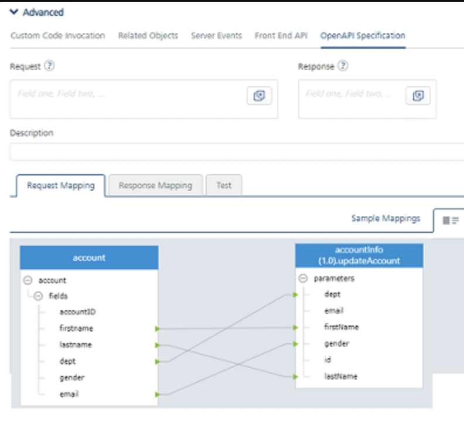
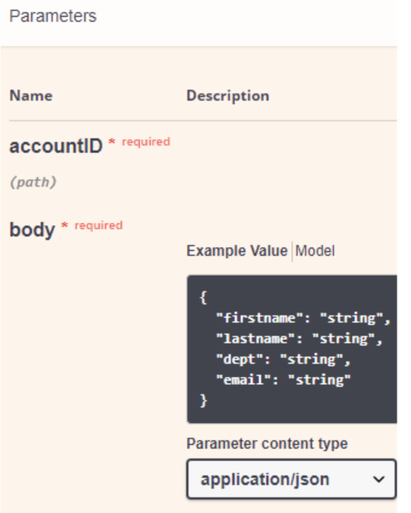
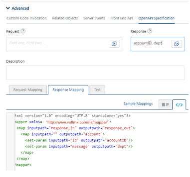
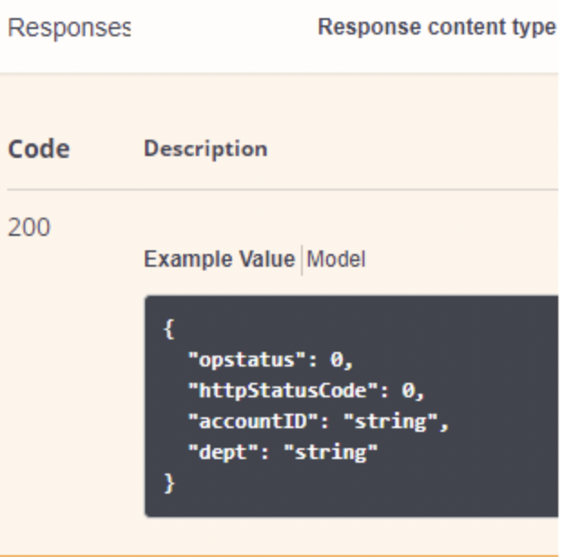

  

Customizing API documentation using OpenAPI Specification
---------------------------------------------------------

VoltMX Foundry Developer Portal lets you create a platform for exposing APIs designed using VoltMX Foundry. Developers from internal and external partner teams can access the portal to explore and test the APIs. After a service is selected, the Developer Portal retrieves details about all exposed APIs for that service.

Each API lists its corresponding parameters, example values, and response codes. One can now customize these specific set of request/response parameters to be displayed on the Developer Portal.

From VoltMX V9 SP3, the Object Verb Mapping has been enhanced with a new feature called OpenAPI Specification. **OpenAPI Specification** tab allows you to customize the documentation of the Request and Response parameters for your API. You can define object fields that are required to be shown in the Developer Portal.

### Why use the OpenAPI Specification feature

You can examine any Object Service in visual design view or XML view that has request and response mappings. All request and response mapping defined in the Visual Mapper are reflected in the Developer Portal. But when the XML Mapper is used, utilizing the OpenAPI Specification feature is essential to display correct parameters for your API. For both request and response mapping, you can define list of object fields that are required to be shown in the Developer Portal.

The following procedure describes how to configure the OpenAPI Specification section in the Foundry console.

How to Customize APIs in Object Services
----------------------------------------

1.  Navigate to the **Mapping** tab of the Object Service.
2.  Click the configured verb.
3.  Click **Advanced** section to expand it. This displays multiple tabs.
4.  Click the **OpenAPI Specification** tab.
5.  In the Request/Response blocks, configure the list of object fields as per your requirement.
    
    For example: the following sample fields are configured:
    
    *   In **Request Mapping > Visual Mapper**, `firstname`, `lastname`, `dept`, and `email` fields of the object data-model are configured. All request and response mapping defined in the Visual Mapper are reflected in the Developer Portal.
        
        | Visual Mapper Configuration | Result of the published Parameters in Developer Portal |
        | --- | --- |
        |  |  |
        
    *   In **Response > XML Mapper**: `accountID` and `dept` fields of the object data-model are configured using **OpenAPI Specification**. You can specify multiple fields names separated by a comma. Utilizing the OpenAPI Specification feature is essential here to display correct parameters for your API.
        
        | XML Mapper Configuration | Result of the published Parameters in Developer Portal |
        | --- | --- |
        |  |  |
        
    
6.  Click **SAVE** the verb mapping.
7.  Publish the app. Now, these custom details are reflected for the verb in your Developer Portal.

For more information on Developer Portal APIs, refer to [Developer Portal](VoltMXDevPortal.md)

For existing Object Services, to reflect the Visual Mapping data in the Developer Portal, you should edit and save the mapping.
