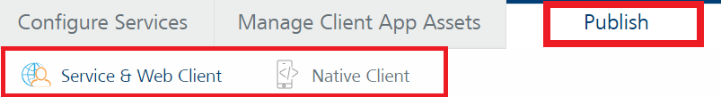

                              

User Guide: App Publish

Publish
=======

After you have configured all the required services for an app, you need to publish the app. Publishing allows your app to start using the Volt MX service in real-time. After an app is published, Volt MX Foundry generates the code that you can integrate with platform SDKs.

Incremental Publish (Delta Publish)
-----------------------------------

When you publish an app, the app is processed for the full app publish life-cycle, which publishes all the associated services assets in the app. With the current implementation, all your associated services and assets will be published even though you have made a minor change in one or two services. Publishing all the associated assets can cause a longer app deployment time as well as blocking servers' availability for other resources.

From Foundry V9SP2 GA, the App Publish life-cycle supports the **Incremental Publish** feature, which is an Incremental Publish of an app. An Incremental Publish will deploy only these services/assets that have been modified/added to the app since the last publish to this environment. This will skip re-publishing the non-modified services/assets as well as the newly linked services/assets which are already published to the same environment, and results in a shorter duration for the app deployment time.

*   You can select the **Incremental Publish** from the Configure and Publish page, so only the incremental changes will be published.
*   The **Full Publish** method is selected by default, you can switch to Incremental Publish to reduce publish duration.
    
    Incremental publish is supported for the following:
    
    *   JARs modified for pre/post processor classes
    *   Services modified for operations and configurations
    *   Web client assets modified for new assets
    *   Engagement Services artifacts modified for enterprise certificates and binaries.

You can select the Publish Modes and Exclusions under [**Publish Reconfiguration**](AppReconfig.md) page.

> **_Important:_** Snapshots created during Incremental publish cannot be used for rollback, as they contain only delta services/jars information. To enable rollback capability for snapshots captured during incremental publish, you must select the **Enable rollbacks when using Incremental publish** check box in the **[**Snapshot > Settings**](Publish_LifeCycle.md#snapshots)** page.

> **_Important:_** When you publish an app to an environment, all the identity services associated with the app are published only to the selected run-time environment. The latest published Identity Services will affect any other apps in the same environment if they use these identity services.  
  
The latest published identity services on the current environment will not affect any apps in different environments.  
  
If you are making an identity call directly (without SDK), you must provide the app key (or) secret header in the payload in below format:  
**For Basic Login - Headers**:  
X-VoltMX-App-Key: <app-key-here>  
X-VoltMX-App-Secret: <app-secret-here>  
POST <identity-login-url>?provider=<identity-service-name>  
  
**For OAuth and SAML Login**: Follow these steps to provide the app key (or) secret header  
**Step 1**: GET the Authorization URL to pass the app key as a query parameter.  
**Authorization call**: GET <authorization>?appkey=<app-key-here>  
  
**Step 2**: **Token Call - Headers**:  
X-VoltMX-App-Key: <app-key-here>  
X-VoltMX-App-Secret: <app-secret-here>  
POST <token-endpoint>  

In Volt MX Foundry Console, the **Publish** tab of an app contains the following tabs:

*   **Service & Web Client**: Helps you to publish the app services (Web client binaries) to the server. The app services you configure under the **[Configure Services](Features.md)** tab such as identity, integration, orchestration, synchronization, and engagement.
    
    If you upload web binaries (.war) for **Web** under the **Manage Client App Assets** tab, you can publish these web binaries only to the server.
    
    *   [How to Publishing Services and Web Client Binaries to the Server](Publishing_Service_Web_Client.md)
    
*   **Native Client**: Helps you to publish native client binaries for platforms such as for **iOS**, **Android**, and **Windows** to a Volt MX Management environment. However native client binaries only available in Volt MX Enterprise Store if state is selected as **Active** and not Draft. You need to upload these binaries under the [Manage Client App Assets](Manage_Client_App_Assets.md#manage-client-app-assets) tab.
    
    > **_Note:_** The .war file you upload for **Web** platform under the **Manage Client App Assets** tab is only published to the Server.
    
    *   [How to Publishing Client Binaries from Volt MX Foundry](Publishing_Client_Binaries.md)
    
    > **_Important:_**  Make sure that your Volt MX Foundry Console version used for creating apps is same as Volt MX Foundry runtime components’ (Integration, Sync, and Engagement) versions. All the components of Volt MX Foundry must be upgraded to same versions.  
      
    For example, if the Volt MX Foundry Console installed version is V8 for creating your apps, you must use the same Volt MX Foundry version for runtime components to publish your apps. If there is a version mismatch, Volt MX Foundry’s Publish functionality and other runtime server components may not work as expected.
