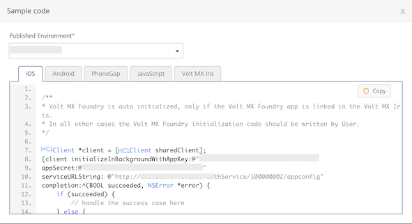
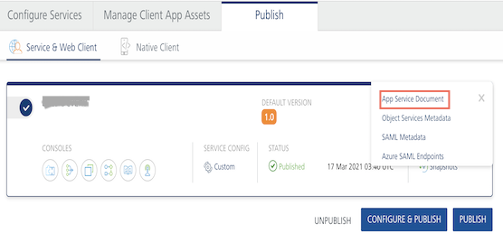

                               

User Guide: [Publish](Publish.md) > Publish Life-Cycle

Publish Life-cycle
------------------

In the Publish tab, when you click the **Publish** button, the system starts to publish life-cycle of an app. The publish life-cycle has several app publish stages. During publish app, the system validates each of the stages. Each stage indicates with a tick mark after a successful publish of that stage.

> **_Note:_**  If a service is not configured in an app during design time, the system skips that stage without errors while publishing the app.  
However, a tick mark is attached to the stage that indicates publish is successful. While accessing the app in runtime, the system skips non configured services automatically.

While publishing an app, the system processes a set of stages for the configured services in the app. The stages such as validating services, cleaning unused (Integration Orchestration, and Sync) services, propagating changes to runtime, publishing Sync services, publishing app resources, publishing identity services, publishing reporting services, and publishing messaging services.

> **_Important:_**  Ensure that you configure and validate services in the app are correct to avoid failures during publish life-cycle.

During publish life-cycle, the system fails to publish a stage due to wrong configurations in the app - such as, if a service is not configured, installed, or registered in the app, or an integration service has a broken reference of an identity service. An exclamation mark next to the failure message indicates that the stage was not successfully published.

For example, if message services have a wrong data configured in the app, the system does not publish this stage and throws the following error:

To view error details, in the Publishing dialog, click the **Show Details** link next that failed services.  
Click **OK** to close the Publishing dialog.

A publish error has the following details:

*   **Internal Error message**: indicates service details that caused to the failure of publish.
*   **Tracking ID**: indicates a unique error number for that app publish. A tracking ID helps Volt MX Support team to find the issue within the app and will give solutions to rectify the issue at the earliest.

Publish Failure Error Messages
------------------------------

The following publish failure errors indicate that you have not installed a service or registered a service as an environment.

*   If the error message says Sync Services is not provisioned in the environment, follow these steps:
    *   For on-premises, install Volt MX Foundry Sync and register to Volt MX Foundry.
    *   For cloud, consult Volt MX Support team to enable Volt MX Foundry Sync for that cloud.
        
        
        

*   If the error message says App Services is not provisioned in the environment, follow these steps:
    *   For on-premises, install Volt MX Foundry Integration and register to Volt MX Foundry.
    *   For cloud, consult Volt MX Support team to enable Volt MX App Services for that cloud.
        
        
        

*   If the error message says Engagement Services is not provisioned in the environment, follow these steps:
    *   For on-premises, install Volt MX Foundry Engagement and register to Volt MX Foundry.
    *   For cloud, consult Volt MX Support team to enable Volt MX Foundry Engagement for that cloud.
        
        
        

Code Results of a Published App
-------------------------------

The following information is available after you publish an app:

*   [Sample Code](#sample-code)
*   [App Documentation](#app-documentation)
*   [App Information (App Key, App Secret, Service URL, and App Init Short Code)](#app-information)
*   [Download > App Service Document, Object Services Metadata , and](#app-service-document-object-services-metadata-and-sync-client-code) [Sync Client Code](#App2)
*   [Consoles](#runtime-console)
*   [Snapshots](#snapshots)

### Sample Code

To view the sample code, follow these steps:

1.  Click **</>** below the name of the app.
    
    
    
    The **Sample Code** dialog appears.
    
2.  Select an environment from the **Published to environment** list.
    
3.  Select a platform to view the corresponding sample code.
    
    
    
    > **_Note:_** You need to add this code in the initialization function of the respective platform SDK.
    

### App Documentation

After you publish an app to an environment, Volt MX Foundry generates app documentation for your app. You can download app documentation from the **Environments** list in **Publish** page.

1.  To view the App documentation of a published app, click the **Download app documentation** button in the **Published Environment** box. The app documentation is downloaded in a zip folder to your local system.
2.  Unzip the app documentation folder.  
    The app documentation .zip comprises multiple artifacts such as `index.html` file, service definition in Open API Initiative ](OAI) format, services references in.md and JSON format.
    
3.  Open the `index.html` in a browser to view the app details.
    

### App Information

To view the App key and App Secret of a published app, click the **App Key** button in the **Published Environment** box.

The Primary Key/App Secret, Secondary Key/App Secret, and Service URL are used to initialize a client app to use Volt MX Foundry services.  
For more information, refer to [Separate App Key/App Secret for Native and Web Channels](SeparateAppKey-Secret.md).

### App Service Document, Object Services Metadata, and Sync Client Code

To view the App Service Document, Object Services Metadata, and Sync Client Code, follow these steps:

1.  Click **Download** button in the **Published Environment** box.
    
    
    
    Based on the configuration, the system displays links - for example:
    
    *   App Service Document
    *   Object Services Metadata
    *   Sync Client Code:
        *   Sync client code (PhoneGap)
        *   Sync client code (VoltMX Studio)
        *   Sync client code (Android)
        *   Sync client code (iOS)
2.  Click **App Service Document** to view the code.
    
    
    
    > **_Note:_** If an environment contains an alias hostname, the alias is used in the generated App Service Document. It is also used to make service calls from the client app.
    
3.  Click **Sync client Code (PhoneGap)** to download the Sync client code (PhoneGap) file.
4.  Click **Sync client Code (VoltMX Studio)** to download the Sync client code (VoltMX Studio) file.

### Runtime Console

A published app provides link to the following services consoles:

*   **Integration Service**: For more information, refer to [Appendix - App Services.html.](Appendix_-_App_Services.md)
*   **Orchestration Service**: For more information, refer to [Appendix - App Services.html.](Appendix_-_App_Services.md)
*   **Engagement  Service**: For more information, refer to [Engagement  Service](../../../Foundry/vms_console_user_guide/Content/Introduction_1.md).

### Snapshots

Whenever you publish a Volt MX Foundry app, a snapshot of the published app is created automatically in the Publish life-cycle. It captures the services and other configurations of the app at the time of publish. If the app is republished multiple times with some changes during the development, you can revert back to the previous versions using snapshots. This feature helps you to revert back to a stable state if the current publish results in an error so that the runtime is not effected.

To view the snapshots of the published app, click **Snapshots**. The **History and Rollback** screen is displayed.

By default, you can view the last two snapshots of an app in this screen and the last published snapshot will be marked as **Active**. Click **Settings** to change the number of snapshots you can view.

For more information on Import Deployment Package, refer to [Promoting a Deployment Package](AppPromotion.md).

You can do the following in the **Settings** screen:

*   From the **Save** list, select the required number of snapshots you want to save for your Volt MX Foundry app. You can view maximum 10 snapshots for an app and environment combination.
*   Snapshots created during [Incremental publish](Publish.md#incremental-publish-delta-publish) cannot be used for rollback, as they contain only delta services/jars information. To enable rollback capability for snapshots captured during incremental publish, you must select the **Enable rollbacks when using Incremental publish** check box.
*   Select the **Save App Package in Snapshot** check box if you want to save an export of the Foundry app as part of the snapshot to serve as a backup of the app at the time of publish. An app package contains all the services of a Volt MX Foundry app. You can import this package to the same or a different Volt MX Foundry Console.  
    If you have reconfigured an app before publish, then you can also download the details of the cumulative reconfigured parameters in a separate file by selecting this check box.  
    
*   Click **Save**. The settings will be saved accordingly.  
    

You can perform the following activities from the contextual menu available for each snapshot in the **History and Rollback** screen:

*   **Republish**: When you click **Republish**, the app will be restored as per the configurations in the selected snapshot.
*   **Download**: It downloads the Volt MX Foundry App package of the selected snapshot. You can import this package to the same or a different Volt MX Foundry Console.
*   **Promote**: It exports/downloads deployment package of a snapshot from the current environment, a zip format. The Deployment Package zip is downloaded to your local drive on your system. For more information on how to promote a Deployment App Package, refer to [App Promotion](AppPromotion.md).
*   **Download Reconfiguration**: You can download the JSON file that contains the cumulative reconfiguration data, if you have reconfigured and published an app using **Configure and Publish**. The data of all the reconfigured services are stored in the snapshot.
*   **Delete**: It removes the selected snapshot from the list.
