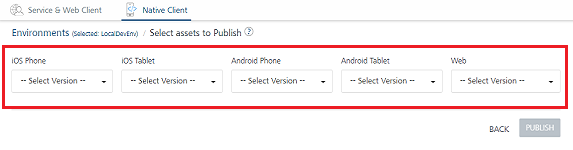
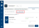
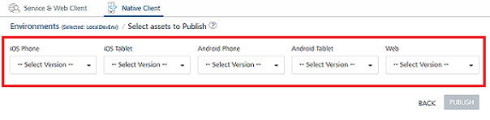
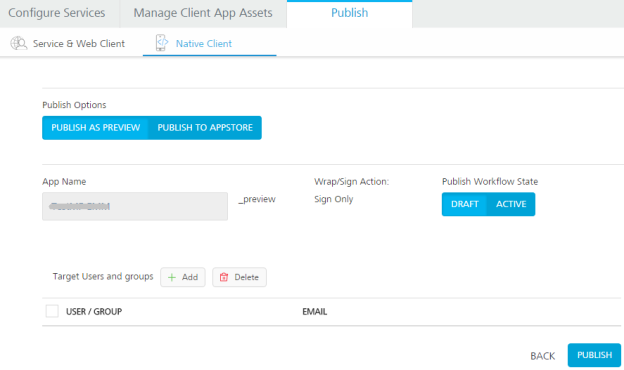
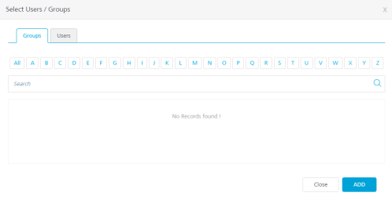
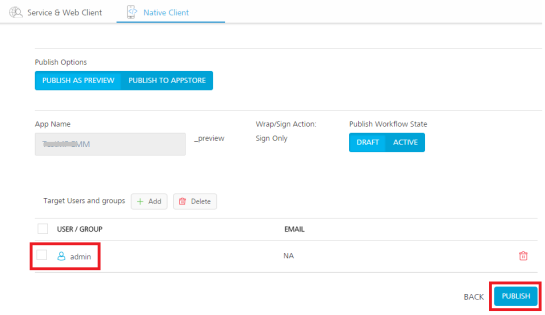

                               

User Guide: [Manage Client App Assets](Manage_Client_App_Assets.md) > [Publishing Client Binaries](Publishing_Client_Binaries.md) > Publishing Native Client Binaries

Publishing Native Client Binaries from Volt MX Foundry to Volt MX Management
---------------------------------------------------------------------------

This section details how you to publish native client binaries to Volt MX Enterprise Store using Volt MX Foundry Console. To publish native client binaries, you must create an app in Volt MX Foundry Console, upload the required native client binaries through the **[Manage Client App Assets](Manage_Client_App_Assets.md)** tab, and then publish these binaries to Volt MX Management through **Publish** tab **\> Native Client** tab.

> **_Important:_** The native client binaries uploaded for iOS, Android, and Windows platforms are only published to Volt MX Management. However native client binaries only available in Volt MX Enterprise Store if the publish workflow state is selected as **Active** and not Draft.  
  
In this document, Volt MX Management is referred to Volt MX Management Stage.  

Limitations:

*   After any version of a client binary is published, if you update the description of the client binary and re-publish the binary, the system does not update the description in Volt MX Management Console.
*   When you select the `-- Select Version --` from the drop-down list for platforms, and click **Publish**, the system removes all versions of that client binaries if present in Volt MX Management runtime.
    
    
    
*   Publish operation is cumulative. For example, if iOS Phone binaries are previously published, and now you want to publish iOS Tablet binaries, should not select the `` `--` Select Version `--` `` from the iOS Phone drop-down list.
*   If you delete any version of client binary after it is published, you can remove the version in Volt MX Management Console by one of the following two ways:
    *   Delete older published versions of client binaries via Volt MX Management Console.
    *   Select the `-- Select Version --` from platforms drop-down list and publish the app. This will remove all the versions of clients in the Volt MX Management runtime.  
        Publish the versions against from lowest version.
*   If a downgraded version is published to Volt MX Management, the same version does not get downgraded in Volt MX Management as Volt MX Foundry currently does not support downgrade of application.
*   If any publish fails for native client binaries, the environment status changes to `Not Published`. Volt MX Foundry does not track the publish failures for native client binaries as of now.
    

To publish native client binaries to Volt MX Management, follow these steps:

1.  In Volt MX Foundry Console, go the app for which you [uploaded native client binaries](Upload_Client_Binaries.md).
2.  Click the **Publish** tab. By default, the **Service & Web Client Publish** tab is selected.
3.  Click the **Native Client** tab. The **Native Client** tab lists clouds or environments configured for the Volt MX Foundry account.  
    The list also displays one of the following app publish statuses and availability status for that environment.
    
    | APP PUBLISH STATUS ||
    | --- | --- |
    | Published: An app is published to a cloud or environment. You can unpublish the app, if required. ||
    | Not Published: An app is not published to a cloud or environment. You can publish the app, if required. An app is canceled while publishing or unpublishing. You can publish or unpublish the app, if required. [Refer to Limitations:](#Limitations-NativeClientBinary) ||
    | ENVIRONMENT STATUS ||
    | **Busy**: Server is busy publishing another app.App publish request will not be submitted for publishing.For example, When you try to publish an app in a Busy environment, the error message is displayed “`Server is busy processing another request. Please try after some time`” ||
    | **Available**: Server is ready for publishing the app.You can publish/unpublish an app to this environment successfully.For example:When an environment status is Available, if you try to publish an app, the app is submitted for publishing and processed via the publish life-cycle successfully.When an environment status is Available, and if multiple apps (app1 and app2) are sent for publishing simultaneously from different users of the same Foundry account, then the app which is submitted for publish first (say app1) will be processed for publishing, and for app2 the error message will be the shown “`Server is busy processing another request. Please try after some time`” ||
    | **Unknown**: Unable to fetch the server status.App publish request will not be submitted for publishingFor example: When an environment status is Unknown, if you try to publish an app, the app is submitted for publishing, but the publishing might not be successful. ||
    
4.  Based on the available environment status, click the appropriate Volt MX Management environment for publishing.
    
    
    
    > **_Note:_**  The **NEXT** button dims when you have not selected any environment. When an environment is selected, only then the **NEXT** button is available.
    
5.  Click **NEXT** to select assets to publish.  
    The uploaded binary versions are loaded in the drop-down list for each of the platforms.
6.  Select the binary version from the platforms drop-down lists.
    
    
    
7.  After you select binary versions for platforms, click **PUBLISH**.
    
    The **Publish Options** window appears. Volt MX Foundry Admin can choose **PUBLISH AS PREVIEW** or **PUBLISH TO APPSTORE**.
    
    
    
    You can publish the app binaries as preview to Volt MX Management directly.
    
    > **_Important:_** The published app is available in Volt MX Management Console. Also the app is available in Volt MX Enterprise Store only if workflow state is selected as **ACTIVE**.
    
    You can select Volt MX Management users or groups and target the native binaries to be published. When a Volt MX Management Admin updates these binaries and targets the uploaded versions of the app binaries, these binaries are available only to the selected users or groups. These users or groups will be notified about native app. Volt MX Foundry admin can target all Volt MX Management users or groups (Local users/groups, Microsoft Active Directory, and SAP) except cloud users. Volt MX Foundry admins can continuously push test versions of native apps to selected users or groups.
    
8.  Choose one of the **publish options** as follows:
    1.  To publish an app as preview, click **PUBLISH AS PREVIEW**. The system displays the current app with a suffix of `<Appname>_preview`. Preview apps are always **sign only** and can be installed on the same device alongside the production copy of the same app. These apps will be displayed as `<Appname>_preview` on user devices or spring board.
    2.  To publish an app as a production copy, follow these steps:
        1.  Click **PUBLISH TO APP STORE**.
        2.  Select one of the following options under **Under Wrap/Sign Action**:
            *   **SIGN ONLY**: an app is set to sign only before publishing.
                
            *   **WRAP & SIGN**: an app is wrapped and signed before publishing.
                
9.  Select the publish state in **Publish Workflow State:**
    
    *   **DRAFT**: If DRAFT is selected, the app is published to Volt MX Management Console.
    *   **ACTIVE**:If ACTIVE is selected, the app is published to Volt MX Management Console and Volt MX Enterprise Store as well.
    
    > **_Important:_** If **Publish Workflow State** is selected as **ACTIVE**, you must target users or groups before publishing. Else the publish fails.  
      
    If **Publish Workflow State** is selected as **DRAFT**, Volt MX recommends that you target users or groups. It is an optional.
    
10.  To targeting users or groups, follows these steps:
    1.  Under **Target Users and groups**, click the **Add** button to display the **Select Users / Groups** window. The **Select Users / Groups** window displays names of users and groups from Volt MX Management.
        
        
        
    2.  Under **Select Users / Groups**, follow these steps:
        1.  Add Groups and Users:
        
        *   **Groups**: Click **Groups** and select the check boxes for the groups, as required. You can click the filter buttons (All or A, B, C) or type the name of the group for filter groups from Volt MX Management Environment.
        *   **Users**: Click **Users** and select the check boxes for the users, as required. You can click the filter buttons (All or A, B, C) or type the name of the group for filter users from Volt MX Management Environment.
        
        > **_Note:_** Ensure that you do not close the publish progress dialog while the app publish is in progress.
        
        4.  Click **ADD** to add the selected users and groups under the **Target Users and groups**. The system closes the **Select Users / Groups** window.
            
            
            
            You can delete users or groups from the **Target Users and groups** list. To delete any added users or groups, select the required check boxes and click the **Delete** button.
            
11.  Click the **PUBLISH** button to start the publishing.
    
    The process of publishing the app and binaries begins. To view the various stages involved in publishing an app, click **\+ Details**. To cancel the publishing, click **CANCEL**.  
    
12.  After the status changes to **Published** in the Publishing dialog, click **OK** to confirm the publishing.

For more details, refer to [Uploading Client Binaries to Volt MX Foundry Console](Upload_Client_Binaries.md#Uploadin).
