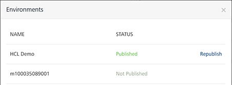

                              

User Guide: [APIs in API Management](API_Management.md) > Publishing Individual Services

Publishing Individual Services
------------------------------

Volt MX  Foundry supports editing and republishing service APIs for integration and objects services for published apps. With the **Publish Service** functionality in Volt MX Foundry, you (VoltMX Foundry Users/APIs Admins) can modify a service API of an integration/objects service for **published apps**, and then publish the service again. When you republish a modified service, Volt MX Foundry publishes only the modified service API to the apps run-time environment. Then published apps with latest services are available to users when they log in to apps/launch apps on their devices. You can use the Publish Service functionality from the API Management page.

### Benefits of Publishing Individual Services

*   Publishes service APIs quickly to published apps on run-time environment.
*   Saves your time by publishing only modified service APIs of services, without requiring you to republish the entire app.

### Limitations of Publishing Individual Services

The following service types are not supported for publish individual services:

*   **Orchestration and Service-Driven Object** services are not supported for publish services because of dependencies.
*   **Storage services are not supported**.  
    
*   **Identity handling**: The service will be published with the relevant identity linkage, but the onus of publishing the identity service itself is on App. And will not be handled through service publish.

To publish an individual service to published apps on run-time environment, follow these steps:

1.  In the **API Management** page, open the Integration Services or Objects Services listing page.
2.  In the services pane, click the cogwheel button next to the service that you modified and want to publish, and then select **Publish Service**.
    
    The **Environments** dialog appears and displays the published environments names, and the service publish status.
    
    *   If the service is not part of a published app, the status shows **Not Published**.
    *   If the service is part of a published app or apps, the status shows **Published**. And, the **Republish** button is available.
    *   > **_Note:_** You can publish a service again only if it is published.  
        While publishing a service, the **Republish** button is available only if the service is part of a published app or apps to environments.
        
3.  In the **Environments** dialog, click **Republish**.
    
    After the services is published to the environment, the system displays the status.
    
    The following statuses are possible:
    
    *   **Published**. The service is successfully published to the environment.
    *   **Failed**: The publish is failed due to a network/internal error. You can click **Show details** to view the error details. You can retry publish the service by clicking **Retry**.
    *   If an integration service has reference of an identity service, and when you republish the integration service, Volt MX Foundry displays the message for your confirmation. Click **OK** to authenticate and proceed.
