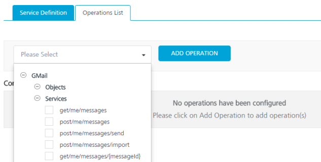

                                

User Guide: [Integration](Services.md#integration) \> [Configure the Integration Service](ConfigureIntegrationService.md) > RAML Adapter

RAML Adapter
------------

To integrate a RAML service in Volt MX Foundry, a RAML file or Zip (with all dependent files) must be created, which defines all the API definitions and schemas with properties in the project. When a Volt MX Foundry user creates a service from Volt MX Foundry Console, the system retrieves metadata from a RAML file and displays all APIs of a RAML file.

Volt MX  Foundry parses a RAML file and exposes all the endpoints through the integration service.

### Configure RAML Endpoint Adapter

To configure RAML service in the **[Integration Service Definition](ConfigureIntegrationService.md#IntSD)** tab, follow these steps:

1.  In the **Name** field, provide a unique name for your service.
2.  From the **Service Type** list, select **RAML**.
3.  Provide the following details to create the RAML service:  

      | Field | Property |
| --- | --- |
| Connection Parameters | Click **Upload** and select a RAML file from your local machine. The system adds your main RAML file to the console. The system displays the added RAML file's name under the **Connection Parameters** section. |
| Authentication | Select an identity provider from the list to link your service. |
| Web Service Authentication | **Select one of the following modes:**   **None**: Select the option if you do not want to provide any authentication for the service.  **Basic**: Provide User ID and Password if the external Web service requires form or basic authentication.  **NTLM**: Your service follows the NT LAN Manager authentication process. You are required to provide the User ID, Password, NTLM Host and NTLM Domain. |

**For additional configuration of your service definition, provide the following details in the Advanced section:**

  | Fields | Description |
| --- | --- |
| Custom Code | Custom Code enables you to specify dependent JAR. To specify dependent JAR, select the JAR containing preprocessor or postprocessor libraries from the drop-down list, or click **Upload New** to browse the JAR file from your local system. This step allows you to further filter the data sent to the back end.> **_Important:_** Make sure that you upload a custom JAR file that is built on the same JDK version used for installing Volt MX Foundry Integration.For example, if the JDK version on the machine where Volt MX Foundry Integration is installed is 1.6, you must use the same JDK version to build your custom jar files. If the JDK version is different, an unsupported class version error will appear when a service is used from a device. |
| Throttling | API throttling enables you to limit the number of request calls within a minute. If an API exceeds the throttling limit, it will not return the service response.   **To specify throttling in Volt MX Foundry Console, follow these steps:**  In the **Total Rate Limit** text box, enter a required value. With this value, you can limit the number of requests configured in your Volt MX Foundry console in terms of Total Rate Limit.  In the **Rate Limit Per IP** text box, enter a required value. With this value, you can limit the number of IP address requests configured in your Volt MX Foundry console in terms of Per IP Rate Limit.  **To override throttling in App Services Console, refer to** [Override API Throttling Configuration](API_Throttling_Override.md#override-api-throttling-configuration). > **_Note:_** Enable API throttling in a clustered environment by configuring the VOLTMX\_SERVER\_NUMBER\_OF\_NODES property in the **server\_configuration** table available in Admin database. This property indicates the number of nodes configured in the cluster. The default value is 1. |

  > **_Note:_** All options in the Advanced section are optional.
  
6.  In the **Description** field, provide a suitable description for the service.
7.  To enable the proxy, select the **Use proxy from settings** check box. By default, the check box is cleared. The Use proxy from settings check box dims when no proxy is configured under the **[Settings > Proxy](Settings.md#proxy)**.
    
8.  Click **Save** to save your service definition.

### Create Operations for RAML

The **Operations List** tab appears only after the service definition is saved.

> **_Note:_** Click **Operations List** tab > **Configure Operation**. The **Configured Operations** list appears.

**To create an operation, follow these steps:**

1.  Click **SAVE & ADD OPERATION** in your service definition page to save your service definition and display the **NewOperation** tab for adding operations.  
                        OR  
    Click **Add Operation** to add a new operation or from the tree in the left pane, click **Add > Add New Operation**.
    
    
    
2.  Under **Operations List** tab, **Please Select** drop-down lists all the supported operations based on the uploaded RAML file..
    1.  Expand an operation.
    2.  Under **Objects and Services**, select the required check boxes.
3.  Click **ADD OPERATION**. The system adds your operation to the Operations List page.
4.  To configure an operation, click on the required service under **Operations List** and provide the following details:  
    
      | Field | Description |
| --- | --- |
| Name | It is prepopulated with the operation name. You can change the name if required. |
| Operation Security Level | It specifies how a client must authenticate to invoke this operation.  **Select one of the following security operations in the **Operation Security Level field.**  **Authenticated App User** – It restricts the access to clients who have successfully authenticated using an Identity Service associated with the app.   **Anonymous App User** – It allows the access from trusted clients that have the required App Key and App Secret. Authentication through an Identity Service is not required.   **Public** – It allows any client to invoke this operation without any authentication. This setting does not provide any security to invoke this operation and you should avoid this authentication type if possible.   **Private** - It blocks the access to this operation from any external client. It allows invocation either from an Orchestration/Object Service, or from the custom code in the same run-time environment. |

7. **For additional configurations of request (or) response operations, provide the following details in the Advanced section:**
  
      | Field | Description |
    | --- | --- |
    | Custom Code Invocation - Preprocessor and Postprocessor (for Java and JavaScript) | You can add pre and post processing logic to services to modify the request inputs. When you test, the services details of various stages in the service execution are presented to you for better debugging. All options in the Advanced section are optional. For more details, refer to [Preprocessor and Postprocessor](Java_Preprocessor_Postprocessor_.md). |
    | Properties | [Additional configuration properties (timeout, cachable, unescape embedded xml in response, response encoding, number of connection retries](Java_Preprocessor_Postprocessor_.md#timeout_cachable) allows you to configure service call time out cache response |
    | Front End API | It allows you map your endpoint/back-end URL of an operation to a [front-end URL](FrontEndAPI.md). |
    | Server Events | Using Server Events you can configure this service to trigger or process server side events. For detailed information, refer [Server Events](ServerEvents.md). |
    
    > **_Note:_** All options in the Advanced section are optional.
    

### Configure Request Operation for RAML

1.  In the **Request Input** tab, provide the following details:
    
    > **_Note:_** Input and Output must be defined in the RAML file only.

      | Field | Description |
    | --- | --- |
    | Name | It Contains a Unique Identifier. Change the name if required. |
    | Test Value | Enter a value. A test value is used for testing the service. |
    | Default Value | Enter the value, if required. The default value will be used if the test value is empty. |
    | Scope | Select Request or Session. It is set to **Request** by default.**Request** indicates that the value must be retrieved from the HTTP request received from the mobile device.**Session** indicates that the value must be retrieved from the HTTP session stored on Volt MX Foundry. |
    | Data Type |   **String** - A combination of alpha-numeric and special characters. Supports all formats including UTF-8 and UTF-16 with no maximum size limit.  **Date** - Date formatIf data type is string, then the options in the Format Type are Currency, Number and Date.If the data type is number, then the options in the Format Type are Currency and Date. If the data type is boolean, then the options in the Format Type and Format Value text box are disabled.   **_Note:_** Currently the date data type is not supported.**Boolean** - A value that can be true or false.**Number** - An integer or a floating number. |
    | Record ID | Enter an ID. |
    | Description | Provide a suitable description. |
    
2.  To validate the operation details, click **Save and Test**. For more details, refer to [Test a Service Operation](Test_a_Service_Operation.md).
    

### Configure Response Operation for RAML

1.  Click the **Response Output** tab to view the output test values, such as name, scope, data type.
    
    > **_Note:_** If you define parameters inside a record as the session, the session scope will not get reflected for the parameters.
    
2.  To validate the operation details, click **Save and Test**. For more details, refer to [Test a Service Operation](Test_a_Service_Operation.md).
    
3.  Click **SAVE OPERATION**.
    
    > **_Note:_** You can view the service in the Data Panel feature of Volt MX Iris. By using the Data Panel, you can link back-end data services to your application UI elements seamlessly with low-code to no code. For more information on Data Panel, click [here](../../../Iris/iris_user_guide/Content/DataPanel.md#top).
