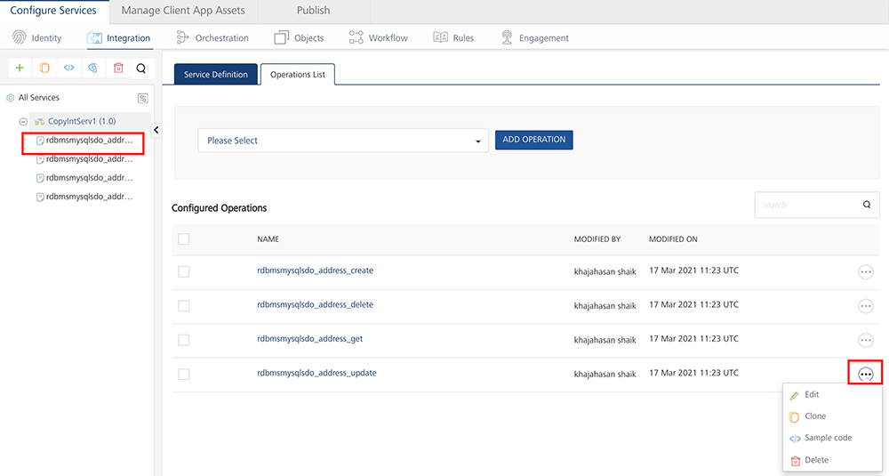
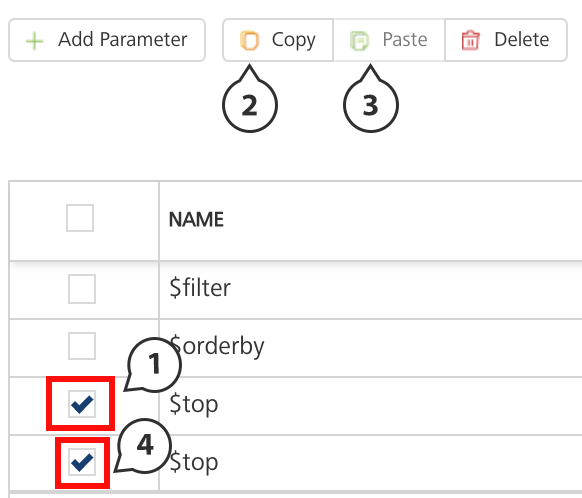
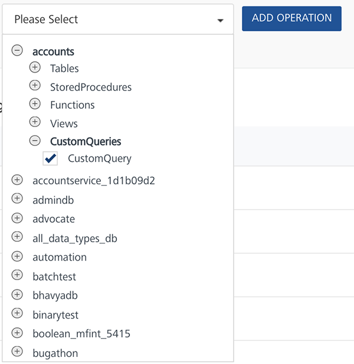

                               

Relational Database Adapter
---------------------------

With Volt MX Foundry database adapter, you can connect to your own database as an endpoint. After you configure the database adapter in Volt MX Foundry Console, you can perform create, read, update, and delete (CRUD and Binary CRUD) operations on data in the tables and invoke stored procedures, functions, and views.

For example, banks maintain a store of users and their details. With Volt MX Foundry database adapter, banks can connect to their own databases and manage customers data.

### Advantages of Volt MX Foundry Database adapter

**Following are the advantages of using Volt MX Foundry Database Adapter:**

*   Admins can connect to the given database.
*   Admins can manage the databases using CRUD operations.
*   When an admin is creating CRUD operations, the admin can access the configured schema.
*   Data types: All major data types are supported.
*   Binary Support is available in Database Adapter with Range header.
    
*   Volt MX supports eight ODATA parameters for the read operation such as `$filter, $orderby, $top, $skip` , `$select,$expand`, `$batchsize`, and `$batchid`.
    
    > **_Note:_** From V8 SP4 FP2 onwards, Volt MX supports $batchsize and $batchid for MySQL database.
    
    > **_Note:_** You must provide the required batch size to the **$batchsize** parameter.
    
    > **_Note:_** If you set **$batchsize** in the first batch call, the response of the batch generates details for the **nextBatchId** and **hasMoreRecords**. If the **hasMoreRecords** is set to **true** in the response, for the second batch call onwards, you must specify the **$batchid** with the value of **nextBatchId**. It indicates that there are more records to be downloaded in the next batch.
    
*   Volt MX supports ODATA parameter `$filter` for the Delete operation.
    
*   Volt MX supports ODATA Methods: substringof and indexof. For more information, refer to [Support for ODATA Methods (substringof and indexof)](Support_for_OData_Methods.md).
*   You can execute custom SQL queries if you want to operate on multiple tables through single operation like Joins.
    

### Create a Database Adapter

Creating a database adapter involves the following steps:

*   [How to Configure a Service Definition for a Database Service](#configure-database-end-point-adapter)
    
*   [How to Create CRUD Operations for a Database Service](#create-crud-operations-for-database-adapter)
*   [How to Configure CRUD Operations for a Database Service](#configure-crud-operations-for-a-database-adapter)

#### Configure Database End-point Adapter

**To configure the Database Adapter in the [Integration service definition](ConfigureIntegrationService.md) tab, follow these steps:**

1.  In the **Name** field, provide a unique name for your service.
2.  From the **Service Type** list, select _Database_.
    
    If you select **Database**, the **Database Type, Database Connection URL**,and other details are displayed.
    
    > **_Note:_** XML is selected, by default.
    
3.  Provide the following details in the Connection Parameters section to create a Database Adapter.  
    
    
    | Field Name | Description |
    | --- | --- |
    | Database | Type the database driver class details manually in the box or select the database type from the database list. If you select the database type from the database list, the driver class details of the selected database will be filled automatically in the field.   The database driver class for each database type is as follows:  MySQL: com.mysql.jdbc.Driver  PostgreSQL: org.postgresql.Driver  SQL Server: com.microsoft.sqlserver.jdbc.SQLServerDriver  Oracle: oracle.jdbc.OracleDriver |
    | Database Connection URL | Type the connection URL in the format given in the help text. The help text in the box changes based on the selected database driver class. You can also copy and paste the connection URL format by clicking the help icon at Database Connection URL, and make the required changes to format. The format of the connection URL is   `jdbc:<type of Database>://<ip_address>:<port>`  The connection URL of the supported database types are as follows:Oracle:   `jdbc:oracle:thin:@10.10.1.192:8081:sid`  MySQL: `jdbc:mysql://10.10.1.192:8081`  SQL Server:`jdbc:sqlserver://10.10.1.190:8081`PostgreSQL: `jdbc:postgresql://10.10.1.192:8081` |
    | User ID | Type the user ID for the connection URL. |
    | Password | Type the password for the user ID which you have entered. |
    | Advanced Settings | Specify the advanced settings like Soft Delete Flag and Autogenerated fields.   {'softdeleteflag':'<columnName>', 'softdeleteactivevalue':<active-value>, 'softdeleteinactivevalue':<inactive-value>, 'AutogeneratedFields': {'TableName': ['Field1Name','field2Name'...] } {"issoftdeletedefault ": "false","lastupdatetimestamp": "<columnname>"}  **_Note:_** To softdelete a column, you must configure the `SoftDeleteFlag` in two places in Foundry Console. This is mandatory. For the example, your backend field is `isDeleted` and the object is field is `SDFlag`, as follows: - Configure the `SoftDeleteFlag` in the RDBMS Object Service > Data Model > account object > Change tracking > Object Soft Delete Logic (optional) section.  - Configure `SoftDeleteFlag` in the RDBMS Object Service > Service Definition page > Connection Parameters > Advanced settings section.  For more information on Softdelete flag, refer to [Softdelete for Storage Object Service type](./ObjectsServices/Objectservices_Stage1.md).   **_Note:_** When the **lastupdatetimestamp** is set, the RDBMS adapter identifies this column as the ChangeTracking Column to track delta/updated records. All the objects in the given Object Service must have the same ChangeTracking column name.To soft delete a record - 'softdeleteflag':'&lt;columnName&gt;.   **_Note:_** To soft delete a column mention the softdelete column name. Ensure all the tables have the same softdelete column name. For the offline object service with multiple objects, if the soft delete column is not common for all the objects, instead of using delete API, use the `<object>;.update` API and set the softdelete field to true in the device database. For more information, refer to [Offline Objects API Developer's Guide > `<object>.update` API](./../../offline_objectsapi_reference_guide/Content/Object_Update.md).  Specify the active/inactive values for softdelete column by setting -. `{'softdeleteactivevalue':<active-value>, 'softdeleteinactivevalue':<inactive-value> }`  To specify the autogenerated fields - `''AutogeneratedFields': {'TableName': ['Field1Name','field2Name'...] }}`  To turn off the default behavior of soft delete set - `{"issoftdeletedefault ": "false"}.` |
    | Max Pool Size | Specify maximum number of connections in the connection pool. |
    | Connection Timeout (ms) | Type the connection timeout in milliseconds. |
    
4.  Click **Test Connections** if you want to check the database connection. If the entered details are correct, the system displays the following message: Valid Database connection details.
5.  If your database is configured with a proxy server, you must select an **environment**and then click **Test Connection** to test the database connectivity. The environment should be `=> V8.3`.  
    For example, you have the Volt MX Foundry Console installed on one machine, and the Runtime and Database servers installed on another machine. When you create an integration service of type Relational Database, the Console must be established with a VPN connection to the RDBMS server. So that, when you test the Database connection, the test case will be successful. You can do this by selecting the correct environment for your Runtime Server which will ensure a VPN connection between the Console and the Runtime Server and test the database.  
    If the entered details are correct, the system displays the following message: Valid Database connection details.
  
6. **For additional configuration of your service definition, provide the following details in the Advanced section.** 
    
      | Field | Description |
    | --- | --- |
    | Custom Code | To specify a JAR associated to the service, select one from the **Select Existing JAR** drop-down menu or click **Upload New** to add a new JAR file. Make sure that you upload a custom JAR file that is built on the same JDK version used for installing Volt MX Foundry Integration. |
    | API Throttling | If you want to use **API throttling** in Volt MX Foundry Console, to limit the number of request calls within a minute. do the following:
    In the **Total Rate Limit** text box, enter a required value. This will limit the total number of requests processed by this API.In the **Rate Limit Per IP** field, enter a required value. With this value, you can limit the number of IP address requests configured in your Volt MX Foundry console in terms of Per IP Rate Limit. To override throttling from Volt MX Foundry App Services Console, refer to [Override API Throttling Configuration](API_Throttling_Override.md#override-api-throttling-configuration). |
    
    > **_Note:_** All options in the Advanced section are optional.
    
7.  Enter the **Description** for the service.
8.  Click **SAVE** to save your service definition.

#### Create CRUD Operations for Database Adapter

The **Operations List** tab appears only after the service definition is saved.

> **_Note:_** Click **Operations List** tab > **Configure Operation**. The **Configured Operations** list appears.

*   **To create an operation, follow these steps:**

1.  Click **SAVE & ADD OPERATION** in your service definition page to save your service definition and display the **NewOperation** tab for adding operations.  
                        OR  
    Click **Add Operation** to add a new operation or from the tree in the left pane, click **Add > Add New Operation**.

Click to View image

    
> **_Note:_** To use an existing integration service, refer to [How to Use an Existing Integration Service](Manage_Existing_Integration_Services_1.md#how-to-use-an-existing-integration-service).

    

1.  Provide the following details to configure an operation.
    
      | Field | Description |
    | --- | --- |
    | Schema | Select the schema loaded based on your database configuration. |
    | Object Type | **Table** - Select available tables from the **Object**list, and select CRUD operations for the tables.  **View** - Select available views from the **Object** list and, select CRUD operations for the tables.  **Stored Procedures** - Select available stored procedures from the **Object** list.  **_Note:_** While adding operations to a database integration service, Volt MX Foundry allows you to select CRUD operations only for table and view object types. |
    | Object | Select the checkboxes for the selected object type. You can select one or more objects. |
    | Operations | From the operations list, select the required check boxes for CRUD operations for tables. For views, only GET is supported. You can select one or more CRUD operations. |
    
2.  Click **Add Operation**. The new operations are created under **Configured Operations** section.
    
    Operation names are auto-generated in the format. The default name format of a database operation is `<schema_name>_<table_name>_<operations>`. You can change the operation name if required.  
    For example, `RdbmsDetails_CustomerDetails_create`.
    
    
    
    When an admin creates CRUD operations for a database adapter, the admin is under a particular schema. To customize fields, refer to [How to Configure CRUD Operations for Database Service](#configure-crud-operations-for-a-database-adapter).
    

#### Configure CRUD Operations for a Database Adapter

After you create an Database service, configure CRUD operations as following:

*   [Create a Database Record with Create Operation](#create-a-database-record-with-create-operation)
*   [Query a Database and Display Information with Read Operation](#how-to-query-a-database-and-display-information-with-the-read-operation)
*   [Update a Database Record with Update Operation](#how-to-update-a-database-record-with-update-operation)
*   [Delete a Database Record with Delete Operation](#how-to-delete-a-database-record-with-delete-operation)
*   [Create SQL Custom Query](#create-sql-custom-query)

#### Create a Database Record with Create Operation

Under **Configured Operations** list, hover your cursor over the create operation and click **Settings (the three dots) >> Edit**.

> **_Note:_**  To edit an operation, you can also click the operation from the service tree pane.

The system displays the selected operation in the edit mode. You can perform following actions in this window:

1.  You can add an entry by clicking **Add Parameter**, if entries for the input and the output tabs do not exist.
2.   To make duplicate entries, select the check box for the entry, click **Copy**, and then click **Paste**.
    
    
    
3.  To delete an entry, select the check box for an entry, and click **Delete**.
4.  Enter the following fields to create a database record.  
    
    | Fields | Description |
    | --- | --- |
    | Name | The **Name** field is pre-populated with fields names of the selected database. You can edit this field. |
    | Operation Security Level | It specifies how a client must authenticate to invoke this operation.  **Authenticated App User** – It restricts the access to clients who have successfully authenticated using an Identity Service associated with the app.  **Anonymous App User** – It allows the access from trusted clients that have the required App Key and App Secret. Authentication through an Identity Service is not required.  **Public** – It allows any client to invoke this operation without any authentication. This setting does not provide any security to invoke this operation and you should avoid this authentication type if possible.  **Private** - It blocks the access to this operation from any external client. It allows invocation either from an Orchestration/Object Service, or from the custom code in the same run-time environment.  **_Note:_** The field is set to Authenticated App User, by default. |
    | Action | The field is pre-populated with operation names of the selected database. You cannot edit this field. |
    

5.  

 For additional configuration of request (or) response operations, provide the following details in the Advanced section.
    
    <table style="width: 100%;margin-left: 0;margin-right: auto;mc-table-style: url]('../Resources/TableStyles/Basic.css');" class="TableStyle-Basic" cellspacing="0"><colgroup><col class="TableStyle-Basic-Column-Column1" style="width: 174px;"> <col class="TableStyle-Basic-Column-Column1"></colgroup><tbody><tr class="TableStyle-Basic-Body-Body1"><td class="TableStyle-Basic-BodyE-Column1-Body1">Custom Code Invocation</td><td class="TableStyle-Basic-BodyD-Column1-Body1">You can add pre and post processing logic to services to modify the request inputs. When you test, the services details of various stages in the service execution are presented to you for better debugging. All options in the Advanced section are optional. For more details, refer to <a href="Java_Preprocessor_Postprocessor_.html" target="_blank">Preprocessor and Postprocessor</a>.</td></tr><tr class="TableStyle-Basic-Body-Body1"><td class="TableStyle-Basic-BodyE-Column1-Body1">Additional Configuration Properties</td><td class="TableStyle-Basic-BodyD-Column1-Body1">Additional Configuration Properties allows you to configure service call time out cache response. For information on different types of configuration properties, refer <a href="Java_Preprocessor_Postprocessor_.html#timeout_cachable" target="_blank">Properties</a>.</td></tr><tr class="TableStyle-Basic-Body-Body1"><td class="TableStyle-Basic-BodyB-Column1-Body1">Front-end API</td><td class="TableStyle-Basic-BodyA-Column1-Body1">Front-end API allows you map your endpoint ](or) backend URL of an operation to a front-end URL. For detailed information, refer Custom <a href="FrontEndAPI.html" target="_blank">Front-end URL</a>.</td></tr><tr class="TableStyle-Basic-Body-Body1"><td class="TableStyle-Basic-BodyB-Column1-Body1">Server Events</td><td class="TableStyle-Basic-BodyA-Column1-Body1">Using Server Events you can configure this service to trigger or process server side events. For detailed information, refer <a href="ServerEvents.html">Server Events</a>.</td></tr></tbody></table>
    

    
> **_Note:_** All options in the **Advanced** section for operations are optional.
    

#### Configure Request Operation for Database Adapter

Integration services accept only `form-url-encoded` inputs for all input parameters provided in service input parameters (request input).

1.  To configure the parameters, do the following:
    
    | Field | Description |
    | --- | --- |
    | TEST VALUE | Enter a value. A test value is used for testing the service. |
    | DEFAULT VALUE | Enter the value, if required. The default value will be used if the test value is empty. |
    | SCOPE | Select request or session. This field is set to **Request**, by default. |
    | DATA TYPE | The default datatype for the selected column is loaded under **DATATYPE** field. |
    | Encode | Select the checkbox to enable an input parameter to be encoded. For example, the name New York Times would be encoded as _New_York_Times_  when the encoding is set to True. The encoding must also adhere the HTML URL encoding standards. |
    | Description | Enter the description for request input. |
    
2.  To validate the details, click **Fetch Response**. For more information, refer [Test a Service Operation](Test_a_Service_Operation.md). The result of the operation appears.
3.  Click **SAVE OPERATION** to save the changes in the create operation.
    
    > **_Note:_** You can view the service in the Data Panel feature of Volt MX Iris. By using the Data Panel, you can link back-end data services to your application UI elements seamlessly with low-code to no code. For more information on Data Panel, click [here](../../../Iris/iris_user_guide/Content/DataPanel.md#top).
    

#### How to Query a Database and Display Information with the Read Operation

1.  Under **Configured Operations**, hover your cursor over the **Read** operation, click **Settings**\>> **Edit**.
    
    The system displays the selected operation in the edit mode. The Read operation has the **Request Input** and **Response Output** tabs.
    
    > **_Note:_**  You can add an entry by clicking the **Add Parameter** button if entries for the input and the output tabs do not exist.  
      
    In the read operation, the **Name** drop-down list contains a **Select** option that acts as a label for the list. **Select** itself is not a command.  
      
      
      
    \-  To make duplicate entries, select the check box for the entry, click **Copy**, and then click **Paste**.  
      
      
    \-  To delete an entry, select the check box for an entry, and then click the **Delete** button.
    
2.  In the **Request Input**, configure the following ODATA commands to filter the data:
    
    
    
    1.  The **NAME** field in the **Request Input** is prepopulated with ODATA commands.
    2.  In the **TEST VALUE** filed, enter the query parameter for the selected ODATA command.
        
       For example (sample employee table), shown below:
        
      | Command Name | Test value for the command | Result |
        | --- | --- | --- |
        | $filter | emp\_Id ge 30 | Filters and displays data in the table based on age of employes who are older than 30. |
        | $orderby | emp\_Age | Arranges data in the table based on employees' age. |
        | $top | 5 | Displays top five records in the table. |
        | $skip | 5 | Displays all records in the table except top five records. |
        
       For example (sample configuration for ODATA commands), shown below:
        
       
        
    3.  In the **DEFAULT VALUE**, enter the value if required.
    4.  In the **DESCRIPTION**, provide the description.
3.  To validate the details, click **Fetch Response**. For more information, refer [Test a Service Operation](Test_a_Service_Operation.md). The result of the operation appears.
4.  Click **SAVE OPERATION** to save the changes in the read operation.
5.  In the **Response Output** tab, configure the fields of the table for displaying the data.
    
    
    

1.  To configure the Response Output operation, provide the following details. 
    
    <table>
    <tr>
    <th>Field</th>
    <th>Description</th>
    </tr>
    <tr>
    <td>Name</td>
    <td>
The <strong>Name</strong> field in the Response Output tab is pre-populated with database columns
</td>
    </tr>
    <tr>
    <td>Scope</td>
    <td>
Select request or session. This field is set to <strong>Request</strong>, by default.
 
    
<blockquote><em>Note:</em> If you define parameters inside a record as the session, the session scope will not get reflected for the parameters.</blockquote>

    </td>
    </tr>
    <tr>
    <td>DATA TYPE</td>
    <td>
The default datatype for the selected column is loaded under <strong>DATATYPE</strong> field.

    
<blockquote><em>Note:</em> The foundry response will return it as string when the data type is number.</blockquote>

    </td>
    </tr>
    <tr>
    <td>Description</td>
    <td>
Enter the description for response output.
</td>
    </tr>
    </table>

    
2.  To validate the details, click **Test**. For more information, refer [Test a Service Operation](Test_a_Service_Operation.md). The result of the operation appears.  

3.  Click **SAVE OPERATION** to save the changes in the read operation.
    
    > **_Note:_** You can view the service in the Data Panel feature of Volt MX Iris. By using the Data Panel, you can link back-end data services to your application UI elements seamlessly with low-code to no code. For more information on Data Panel, click [here](../../../Iris/iris_user_guide/Content/DataPanel.md#top).
    

#### How to Update a Database Record with Update Operation

1.  Under **Configured Operations**, hover your cursor over the **Update** operation, click the **Settings** button, and then click **Edit**.
    
    The system displays the selected operation in the edit mode. The update operation has the Request Input tab.
    

1.  The **NAME** field contains primary key of the table. You cannot modify these details.
    
    The Name column is prepopulated with fields names in the database.
    
    > **_Note:_**  You can add an entry by clicking the **Add Parameter** button if entries for the input and the output tabs do not exist.  
      
    \-  To make duplicate entries, select the check box for the entry, click **Copy**, and then click **Paste**.  
      
      
    \-  To delete an entry, select the check box for an entry, and then click the **Delete** button.
    
2.  Update the values in the fields, such as **TEST VALUE**, **DEFAULT VALUE**, and **SCOPE**, if required.
    
    To validate the details, click **Fetch Response**. The result of the operation appears.
    
3.  Click **SAVE OPERATION** to save the changes in the update operation.
    

#### How to Delete a Database Record with Delete Operation

1.  Under **Configured Operations**, hover your cursor over the **Delete** operation, click the **Settings** button, and then click **Edit**.
    
    The system displays the selected operation in the edit mode. The delete operation has the Request Input tab.
    
    1.  Under **Configured Operations**, hover your cursor over the **Delete** operation, click the **Settings** button, and then click **Edit**.
        
        The system displays the selected operation in the edit mode. The delete operation has the Request Input tab.
        
    2.  The **NAME** field contains the primary key of the table. You cannot modify these details. The **Request Input** tab contains only the primary key of the table.
        
    3.  In the **TEST VALUE** field, enter the valid primary key value.
    4.  Click **Fetch Response** to validate the details. If the test value matches the primary key in the database, the system deletes the record from the database.
        
    5.  Click **SAVE OPERATION** to save the changes in the delete operation.
        

#### Create SQL Custom Query

If you want to write your own SQL query in the operation, do the following:

*   From the schema list, expand the required schema > CustomQueries.  
    
*   Click Add Operation. A new operation named &lt;schema&gt;_CustomQuery is created by default and will be added to the operations list.

Perform the following steps to write a custom query:

> **_Note:_** Currently only MySql, SQL Server, Oracle and PostgreSQL are supported.

*   From the operations list, click <schema>\_CustomQuery. <schema>\_CustomQuery is a default name given to the custom query operation, and it is advised to rename the operation name immediately after you create it. Expand the operation.
*   Provide the details in the Operation tab as mentioned earlier.
*   To write the custom query, expand the **Custom Query** section. This section contains the read only list of tables and field names in the left pane, and a SQL statement box in the right pane.  
    
*   In the right pane, write the required SQL query.

*   To include any input parameters in statement, mark them with @. For example, @inputparam1. Here is the sample code for it.
    <figure class="highlight"><pre><code class="language-voltmx" data-lang="voltmx">{
    Select * from VOLTMXUNITTESTDATABASE.products where LASTUPDATETIME > @timestamp and SOFTDELETEFLAG = @boolean limit 100;
    }</code></pre></figure>

    
    > **_Important:_** Make sure that you always provide a limit in the query to prevent server overload.
    

*   Create the corresponding input parameter in the Request Input section.
*   If you want to define any output parameters, mention the same in the Response Output section.  
    
    > **_Note:_** If there are no output parameters mentioned, then you will get the query result set as is from the adapter.
    

*   Click Save and Fetch Response to view the response from the database based on the SQL statement written.

> **_Important:_** If any error occurs in the database due to the SQL query, Volt MX Foundry will return the same error message which it receives from the database. If the error message contains any sensitive information, it is the responsibility of the developer to handle the sensitive information and display a generic error message.  

**Limitations**

*   You can write only one query in an operation.
*   For now, this feature supports only Select query. Support for Create, Update, and Delete will be available in later releases.
*   Record and Collection data types are not supported for a custom query.
*   Blob is not supported, so it is the application developer's responsibility to specify the columns (excluding blob/binary) in Select statement or to define the output response to exclude blob.

### Database Adapter Limitations

**Following are the limitations to use the Volt MX Foundry Database Adapter:**

*   Currently Volt MX Foundry database adapter supports MySQL, Oracle, MS SQL, and PostgreSQL databases.
*   Table Valued MSSQL server functions are not supported from Volt MX Database adapter
    
*   Execution of SQL commands using database adapter is not supported - for example, insert, select, and alter.
*   Using the database adapter:
    *   An admin can only alter the data in tables - Data Manipulation Language (DML).  
        
    *   An admin cannot alter the structure of the table - Data Definition Language (DDL).  
        For example, an admin cannot add a column in the table.
*   Any CRUD operation can be performed on only one record at a time based on Primary Key.
    
*   For related tables, you can perform hierarchical Create/update/read.
    
    *   `$top` in case of Oracle DB follows the ordering imposed by the backend, unless a `$orderby` is specified.
        
    *   `$expand` on self-referenced table is not supported.
        
    *   Volt MX supports `eq`, `ne`, `lt`, `le`, `gt`, `ge`, and  `or` operators with the `$filter` ODATA parameter.
        
        *   The `$expand` fails, if any related table has binary (bolb (or) bit) columns where MySQL itself fails to convert the binary data into a valid JSON.
        *   If the child payload is higher than 1024 bytes, MySQL truncates the excess data with its default properties on `group_concat()`. To resolve the issue, you must configure a higher value than the max payload size for `group_concat_max_len` property.
        *   With the `$expand` ODATA parameter, the database adapter supports multi-level query for related tables. This is applicable for objects services as well.
            
            > **_Important:_** For Volt MX Foundry V8 SP2 or below versions, the following are the limitations with `$expand`:  
              
            \- For SQL Server, Oracle, and PostgreSQL databases, `$expand`  is limited to one level.  
              
            \- For using the `$expand` ODATA parameter, MySQL version must be 5.7.7+.  
              
            \- For SQL Server, the `$expand` with a column of type `timestamp` is not supported.  
              
            \- For PostgreSQL, the `$expand` with a column of type `Boolean` is not supported.
            
        
        > **_Note:_**  Open Data Protocol (OData) is an open protocol to allow the creation and consumption of queryable and interoperable RESTful APIs in a simple and standard way. For more details, refer to [http://www.odata.org/](http://www.odata.org/)
        
    *   The following are the limitations of batching:
        
        *   For Batching to work, specify the **ChangeTracking** Column because batching is done with respect to the ChangeTracking Column to track delta/updated records.

            >  ***Note:*** *ChangeTracking* column: At present, this column supports only string type. Another type, like date, can be used, but it would require a postprocessor to convert to string format.

        *   $batchsize and $batchid are supported only for MySQL database.
        *   You cannot download the binary columns.
        *   The $expand along with batching, the JSONExpand is only supported.
        *   Download throws an error if there are empty record in the backend.
        *   If you want specific columns to be selected using $select, you must have the ChangeTracking Column in $select.
        *   You must not give **$top/$skip** pair along with the **$batchsize/$batchid** pair.
        *   For the batching to work, in the RDBMS SDO flow, add the following in the **Response Mapping**:  
              
            * `<set-param inputpath="nextBatchId" outputpath="nextBatchId"/> ` 
                  
            *   `<set-param inputpath="hasMoreRecords" outputpath="hasMoreRecords"/>`  
                  
         
            
        
        > **_Note:_** If you specify **$orderby**, $orderby with ChangeTracking Column is executed first followed by your $orderby value.
        
        > **_Note:_** The number of records downloaded can be more than the batch size. This is because the records are downloaded with a **timestamp** equal to the last record's timestamp of the current batch.
