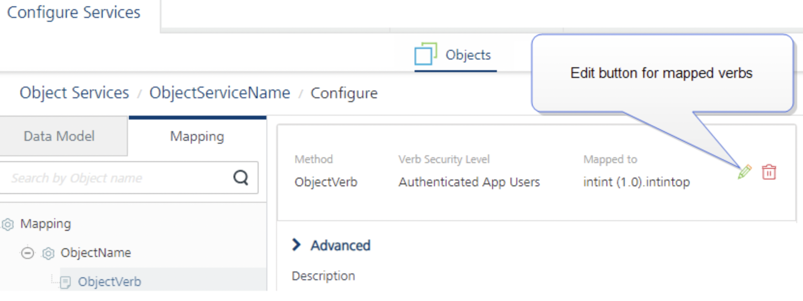
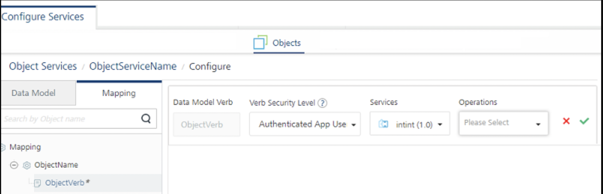
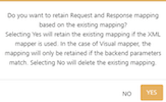
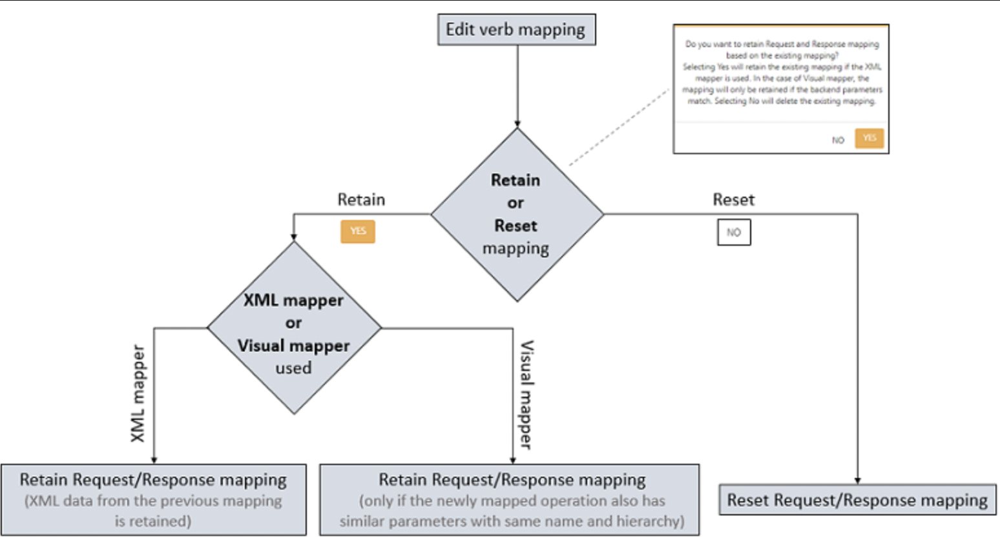

# Remapping Verbs for Service-Driven Object Services

Object Services enables model-driven application design and development by following a microservices architectural approach to create reusable components. You can use Object Services to create data models from line-of-business (LOB) objects and define service-driven objects (Integration Services) from existing APIs in your enterprise.

During the verb creation for Objects once a verb is associated witth a back-end service operation, in order to modify a verb mapping configuration, you must delete the existing verb and then recreate a verb associated to a new service and operation.

From V9SP3, Foundry supports **remapping of verbs for service-driven Object Services**. The new **Edit** button is available next to the mapped verb on the verb mapping page that allows you to manage the existing mapped verbs.

## Use Case

The VoltMX Foundry app for a National Bank uses a service-driven Object Service. As part of a business requirement, you are required to modify an existing Verb mapping for an Object from the current Integration Service operation to a new Integration service operation. You may also want to reuse the previous Request/Response mapping and the configurations designed using the Toolbox pane.

By using the edit mapping functionality, you can achieve the above scenario.

## How to Remap Verbs in Object Services

1. Navigate to the **Mapping** tab of the Object Service.

2. Click the configured verb. The **Edit** button is available next to the verb mapping details.

    

3. Click the **Edit** button. The following fields are available for remapping the verbs: 
    * **Verb Security Level**: Modify how the client must authenticate the verb.
    * **Services**: Modify the service from the list.
    * **Operations**: Modify the operation from the list.
        
    

      

4. After editing the mapping details, click the **Tick** icon to continue.
    *   A dialog is displayed for action if you want to retain or reset the Request/Response mapping.  

5. Click **YES** to retain the Request/Response mapping or click **NO** to reset.

    

    The following table and flowchart details the Request/Response mapping results after remapping of a verb:

    <table style="margin-left: 0;margin-right: auto;mc-table-style: url('Resources/TableStyles/Basic.css');width: 532px;" class="TableStyle-Basic" cellspacing="0"><colgroup><col class="TableStyle-Basic-Column-Column1" style="width: 532px;"></colgroup>

    <tbody>

    <tr class="TableStyle-Basic-Body-Body1">

    <td style="background-color: #add8e6;" class="TableStyle-Basic-BodyD-Column1-Body1">

    Click **YES**:

    </td>

    </tr>

    <tr class="TableStyle-Basic-Body-Body1">

    <td class="TableStyle-Basic-BodyD-Column1-Body1">

    * **In case of Visual Mapper configuration:**
        * The verb is remapped for both the request and response mappings.
        * The Request/Response mappings between Object Fields and Service Operation Parameters are preserved if the newly mapped operation also has similar parameters with the same name and hierarchy.
        * The configurations designed using the Toolbox pane are also preserved (Toolbox pane lists built-in functions on the left side of the view)

    </td>

    </tr>

    <tr class="TableStyle-Basic-Body-Body1">

    <td class="TableStyle-Basic-BodyD-Column1-Body1">

    * **In case of Code/XML Mapper configuration:**
        * The verb is remapped for both the request and the response mappings.
        * The Code/XML view retains the Request/Response data from the previous mapping.

    </td>

    </tr>

    <tr class="TableStyle-Basic-Body-Body1">

    <th style="background-color: #add8e6;" class="TableStyle-Basic-BodyD-Column1-Body1">

    Click **NO**:

    </th>

    </tr>

    <tr class="TableStyle-Basic-Body-Body1">

    <td class="TableStyle-Basic-BodyD-Column1-Body1">

    * **In case of Visual Mapper configuration and Code/XML Mapper configuration:**
        * The verb is remapped for both the request and response mappings.
        * All Request/Response mappings between Object Fields and Service Operation Parameters are deleted and a fresh view is shown on Visual Mapper and Code/XML view.

    </td>

    </tr>

    <tr class="TableStyle-Basic-Body-Body1">

    <td class="TableStyle-Basic-BodyA-Column1-Body1" style="text-align: center;"></td>

    </tr>

    </tbody>

    </table>

For more information on Objects Services Verb Mapping, refer to [Mapping Operations to Back-end Methods](./ObjectsServices/Objectservices_Stage3.md)