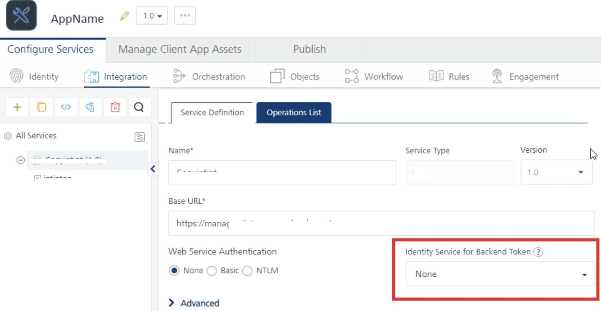
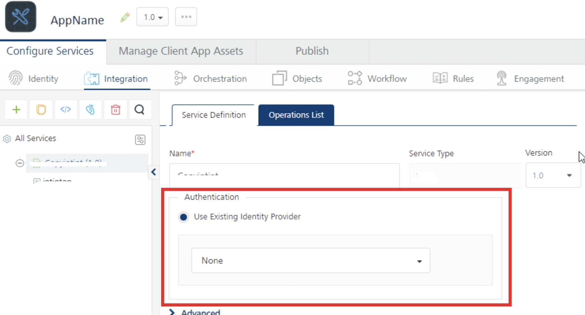
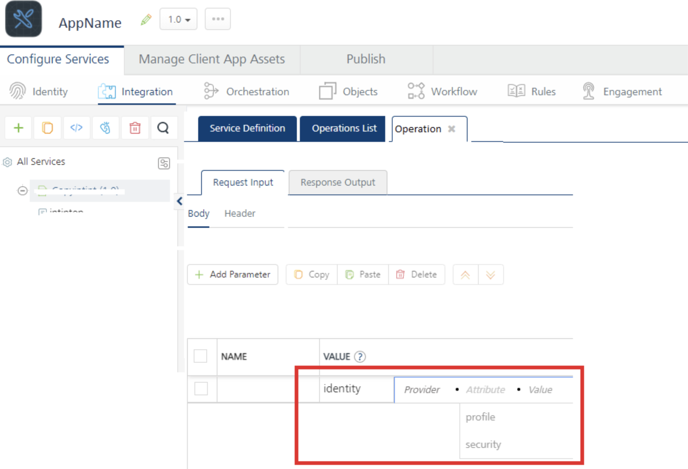
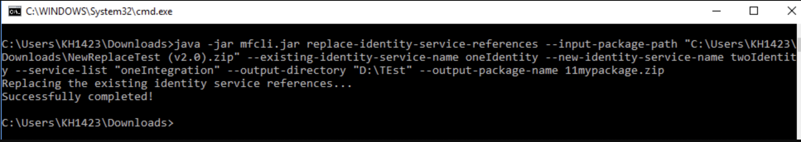

   

Ability to replace Identity Service references in a Foundry application
======================================================================

Overview
--------

Identity Services help to secure your Foundry apps by adding an authentication layer.

For example:

* APIs may require you to pass the token returned by its authentication backend in the API calls. To achieve this, you can configure integration service operations to call the various back-end APIs, and you will need to configure the Identity Service for Backend Token in the integration service configuration page.
* Identity Services can be configured to filter response data based on Identity Service profile attributes and security attributes. Identity filters are an enhanced data filtering mechanism that you can use to filter data based on dynamic fields returned from an identity provider.
    

Foundry apps can be implemented using several services which are authenticated by Identity Services. The configuration of each Identity Service varies based on the implementation and the business requirements. There can exist scenarios where the referred Identity Service needs to be replaced to a newer Identity. In such cases, you can access the app in Foundry Console to make relevant changes.

From V9 SP3, MFCLI is enhanced with the `replace-identity-service-references` command. This command can replace existing Identity Service references in the Foundry app with another Identity Service. This command replaces the Identity Service references for Backend Token and Enhanced Identity filters.

For more information on Identity Services, refer to [Foundry Identity Services](Identity.md#Enhanced).  
For more information on Identity Filters, refer to [Enhanced Identity Filters](Identity_Filters_Integration.md).


## Identity References in Foundry Services

The following section <span>details on</span> the references to Identity Services configurations for back-end services and operations in a Foundry app.

* Identity Service for Backend Token

  

* Authentication for the Existing Identity Provider

  

* Enhanced Identity Filters

  


Prerequisites
-------------

* `Foundry Command Line Utility v9.3.0.0 `

**MFCLI Command for Replacing Identity Service References**

The `replace-identity-service-references` command uses the App zip as input and replaces the existing Identity Service references with the new Identity Service. When you run this command, a new version with replaced Identity Service references in the App.zip is created in your local system.

```
java -jar mfcli.jar replace-identity-service-references --input-package-path <file path> --existing-identity-service-name <existing identity service name> --new-identity-service-name <new identity service name> --service-list <service names> --output-directory <directory path> --output-package-name <mypackage.zip> --override-existing  

```

* `--existing-identity-service-name` - Existing identity service name
    
* `--input-package-path` - Path of the app package file. For e.g. C:\\\\tmp\\\\Sample.zip.
    
* `--new-identity-service-name` - New identity service name
    
* `--output-directory` - Path of the directory to dump the output app package. For e.g. C:\\\\tmp\\\\.
    
* `--output-package-name` - This will be used to name the final zip file.
    
* `--override-existing` - If provided, output file with the specified filename will be over-written if it already exists. Else, it will show error, if the file exists. Default: false
    
* `--service-list` - Comma separated integration service names in which the identity references should be modified
    

The following sample output shows that the Identity Services reference replacement is successful.


