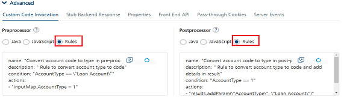

                               

User Guide: [Integration](Services.md#integration) \> [Advanced Configurations](Advanced_Configurations.md) > Why Use Rules

Rules as Pre and Post Processors
--------------------------------

Volt MX  Foundry provides the ability to write custom code as [pre and post processors](Java_Preprocessor_Postprocessor_.md) to modify request and response parameters to service calls. Historically custom code can be implemented either in Java or JavaScript. To simplify implementing custom logic in pre and post processors, a new **Rules** option is introduced from Volt MX Foundry V8 SP4. You can use the **Rules** option to define your custom logic as a set of rules. This option makes defining pre and post processor custom logic closer to human language and is built using [MVEL](http://mvel.documentnode.com/ "MVEL is an expression language based on Java-syntax, with some marked differences specific to MVEL.  Unlike Java however, MVEL is dynamically typed (with optional typing), meaning type qualification is not required in the source. ").

> **_Note:_** The Rules functionality is supported only for the pre and post processor of integration services.

*   **Why Use Rules**:
    *   Quick and easy to write custom logic.
    *   Easy to understand and change as per your business logic.
    *   No maintenance overhead. For example, No need to maintain separate jars or library and export them to various environments while publishing the updated app.
*   **What is the Structure of rules**: Rules have a structure in the form of statements, as shown in the following table:
    
    | Sample Rules Structure |
    | --- |
    | name: "<Name of the rule>" description: "<Description of the rule>" priority: <Priority of the rule> condition: "<Condition to evaluate>" actions: - "<Set of actions to execute>" |
    | Description of Rules Structure |
    | **Name:** A unique name of the rule. This is a mandatory field. **Description:** A description for the rule. **Priority**: An integer value that represents the order to execute the rule. The bigger the value, the higher the priority. **Condition**: An expression that is evaluated by the Rules engine. When the condition evaluates to True, the engine executes a set of actions. This is a mandatory field. For example, `response != null` can be used to check whether the back-end response is empty.**Action**: A set of statements that are executed when the condition evaluates to True. This is a mandatory field. For example, `statusCode = 200` sets status code to 200. |
    
*   _How to Write rules:_
    1.  When you are configuring an operation, in the **Advanced > Custom Code Invocation** for pre-processor or post-processor, click the **Rules** option.
        
        
        

### Built-in Objects

The following objects help you to write rules in Volt MX Foundry.

  
| Objects | Description |
| --- | --- |
| "configurationParameters" | Used to access the Server and Client App parameters that are set by the developer in the App Services console. This is equivalent to using [ConfigurableParameters](../../../../../java_docs_apis/MiddlewareAPI/com/hcl/middleware/api/ConfigurableParametersHelper.md) in Java. |
| "continueExecution" | Used in the Pre-processor to terminate back-end calls. Set the value to false if you want to terminate the back-end call. By default, the value is set to true. |
| "customMetrics" | This is used to access custom metrics. For more details to create custom reports and Metrics, refer [Custom Reporting – Metrics, Reports, and Dashboard Guide](../../../../../Foundry/custom_metrics_and_reports/Content/Custom_Metrics_and_Reports_Guide.md) |
| “deviceHeadersMap” | Used to set headers that are passed to the client and is equivalent to using [setDeviceHeaders](../../../../../java_docs_apis/MiddlewareAPI/com/hcl/middleware/controller/DataControllerResponse.md) in Java. |
| "headerMap" | Used to access the header map of a request. A client can directly access the header map or the individual key-value pairs of the header map. |
| “identityHandler" | Used to access the identity attributes when a service is protected by an identity service. |
| "inputMap" | Used to access the input map of a request. A client can directly access the input map or the individual key-value pairs of the input map. |
| "logger" | Used to add a log statement with the appropriate level. |
| "response" | Used to modify the response body and is equivalent to using [setResponse](../../../../../java_docs_apis/MiddlewareAPI/com/hcl/middleware/controller/DataControllerResponse.md) in Java. |
| "results" | Used to modify the results. A Result is an abstraction of a back-end response. The Result is a collection of Params, Data-sets, and Records. For more details, refer [Result](../../../../../java_docs_apis/MiddlewareAPI/com/hcl/middleware/dataobject/Result.md). |
| "resultCache" | Used to access the cache in pre-processor and post-processor. This is equivalent to using [ResultCache](../../../../../java_docs_apis/MiddlewareAPI/com/hcl/middleware/ehcache/ResultCache.md) in Java. |
| "servicesManager" | Used to invoke an integration service with the specified service id, operation id and version. |
| "session" | Used to modify the session that is associated with the request. For more details, refer [Session](../../../../../java_docs_apis/MiddlewareAPI/com/hcl/middleware/session/Session.md) A client can access values from the session and the individual attributes of the session. |
| “statusCode” | Used to set the status code of the response and is equivalent to using setStatusCode in Java. |
| "ua" | Used to access the User Agent Header of the request. |

### Built-in Functions

The following functions help you to write rules in Volt MX Foundry.

  
| Functions | Description |
| --- | --- |
| "Check.isWithin" | Checks if an element is in a specified range. It will return true if the element present in the specified range, otherwise false. Signature: `isWithin(double fromInclusive, double toInclusive, double elementToFind)` ExampleCheck.isWithin(100, 300, 250) = true Check.isWithin(100, 300, 350) = false |
| "Check.isEmpty" | Checks if a CharSequence is empty ("") or null. Signature: `isEmpty(final CharSequence cs)` ExampleCheck.isEmpty(null) = trueCheck.isEmpty("") = true Check.isEmpty(" ") = false Check.isEmpty("xyz") = false Check.isEmpty(" abc ") = false |
| "Check.isNotEmpty" | Checks if a CharSequence is not empty ("") and not null. Signature: `isNotEmpty(final CharSequence cs)` ExampleCheck.isNotEmpty(null) = falseCheck.isNotEmpty("") = false Check.isNotEmpty(" ") = true Check.isNotEmpty("xyz") = true Check.isNotEmpty(" abc ") = true |
| "Check.isBlank" | Checks if a CharSequence is empty (""), null or white-space only. Signature: `isBlank(final CharSequence cs)` ExampleCheck.isBlank(null) = true Check.isBlank("") = true Check.isBlank(" ") = true Check.isBlank("xyz") = false Check.isBlank(" abc ") = false |
| "Check.isNotBlank" | Checks if a CharSequence is not empty (""), not null and not white-space only. Signature: `isNotBlank(final CharSequence cs)` ExampleCheck.isNotBlank(null) = false Check.isNotBlank("") = false Check.isNotBlank(" ") = false Check.isNotBlank("xyz") = true Check.isNotBlank(" abc ") = true |
| "Check.isEqualTo" | Compares two CharSequences, returning true if they represent equal sequences of characters. Signature: `isEqualTo(final CharSequence cs1, final CharSequence cs2)` ExampleCheck.isEqualTo(null, null) = true Check.isEqualTo(null, "abc") = false Check.isEqualTo("abc", null) = false Check.isEqualTo("abc", "abc") = true Check.isEqualTo("abc", "ABC") = false |
| "Check.isEqualToIgnoringCase" | Compares two CharSequences, returning true if they represent equal sequences of characters, ignoring case. Signature: `isEqualToIgnoringCase(final CharSequence str1, final CharSequence str2)` ExampleCheck.isEqualToIgnoringCase(null, null) = true Check.isEqualToIgnoringCase(null, "abc") = false Check.isEqualToIgnoringCase("abc", null) = false Check.isEqualToIgnoringCase("abc", "abc") = true Check.isEqualToIgnoringCase("abc", "ABC") = true |

### Sample Rules

Modify request input

<table class="TableStyle-Basic" cellspacing="0" style="mc-table-style: url('Resources/TableStyles/Basic.css');width: 820px;"><colgroup><col class="TableStyle-Basic-Column-Column1" style="width: 113px;"> <col class="TableStyle-Basic-Column-Column1"></colgroup><tbody><tr class="TableStyle-Basic-Body-Body1"><td class="TableStyle-Basic-BodyE-Column1-Body1" style="font-weight: bold;text-align: center;">Use Case</td><td class="TableStyle-Basic-BodyD-Column1-Body1">Changing request input before sending it to the back end. For example, you can map the account type received from the request to an account code.</td></tr><tr class="TableStyle-Basic-Body-Body1"><td class="TableStyle-Basic-BodyB-Column1-Body1" style="font-weight: bold;text-align: center;">Rule</td><td class="TableStyle-Basic-BodyA-Column1-Body1"><input type="button" id="button" class="btn" style="float: right;" value="Copy" onclick="var codeSnippet = this.parentNode.textContent; copyFunction(codeSnippet, this);">name: "Convert account type to account code in pre-processor" description: "Rule to convert account type to account code" condition: "AccountType == \"Loan Account\"" actions: - "inputMap.AccountCode = 1" - "inputMap.Message = \"This is a loan account\"" The given sample rules above checks the account type, if the account type is Loan Account, then the associated account code is set to 1. The <code class="codefirst">inputMap</code> object is used to access the parameters in the request that comes from the device.</td></tr></tbody></table>

Modify result

<table class="TableStyle-Basic" cellspacing="0" style="mc-table-style: url('Resources/TableStyles/Basic.css');width: 820px;"><colgroup><col class="TableStyle-Basic-Column-Column1" style="width: 112px;"> <col class="TableStyle-Basic-Column-Column1"></colgroup><tbody><tr class="TableStyle-Basic-Body-Body1"><td class="TableStyle-Basic-BodyE-Column1-Body1" style="font-weight: bold;text-align: center;">Use Case</td><td class="TableStyle-Basic-BodyD-Column1-Body1">Modifying the result of an operation. For example, you can add the account type in the result depending upon the account code.</td></tr><tr class="TableStyle-Basic-Body-Body1"><td class="TableStyle-Basic-BodyB-Column1-Body1" style="font-weight: bold;text-align: center;">Rule</td><td class="TableStyle-Basic-BodyA-Column1-Body1"><input type="button" id="button" class="btn" style="float: right;" value="Copy" onclick="var codeSnippet = this.parentNode.textContent; copyFunction(codeSnippet, this);">name: "Add parameter in result"description: "Add a parameter in result for a specific account type" condition: "AccountCode == 1" actions: - "results.addParam(\"AccountType\", \"Loan Account\")" The given sample rule checks the account code, if the account code is equal to 1, then the account type parameter is set as Loan Account. The <code class="codefirst">results</code> object is used to modify the result of an operation.</td></tr></tbody></table>

Modify response, status code and headers sent to a device

<table class="TableStyle-Basic" cellspacing="0" style="mc-table-style: url('Resources/TableStyles/Basic.css');width: 820px;"><colgroup><col class="TableStyle-Basic-Column-Column1" style="width: 111px;"> <col class="TableStyle-Basic-Column-Column1"></colgroup><tbody><tr class="TableStyle-Basic-Body-Body1"><td class="TableStyle-Basic-BodyE-Column1-Body1" style="font-weight: bold;text-align: center;">Use Case</td><td class="TableStyle-Basic-BodyD-Column1-Body1">Changing the response body, status code, and headers that are sent to the device. For example, you can categorize the customer based on the quarterly average balance and send specific headers to the device to render appropriate UX of client application.</td></tr><tr class="TableStyle-Basic-Body-Body1"><td class="TableStyle-Basic-BodyB-Column1-Body1" style="font-weight: bold;text-align: center;">Rule</td><td class="TableStyle-Basic-BodyA-Column1-Body1"><input type="button" id="button" class="btn" style="float: right;" value="Copy" onclick="var codeSnippet = this.parentNode.textContent; copyFunction(codeSnippet, this);">name: "Modify response in rules."description: "Set response message, status code and headers sent to device." condition: "quarterlyAvgBalance &gt;= 100000" actions: - "response = \"{\\\"category\\\": \\\"Preferred customer\\\"}\"" - "statusCode = 200" - "deviceHeadersMap.put(\"X-VoltMX-Preferred-Customer\", \"true\")" The given sample rule checks the quarterlyAvgBalance parameter. If the parameter is greater than or equal to 100000, then the response body, status code and headers sent to the device are changed. The <code class="codefirst">response</code> object is used to modify the response body. The <code class="codefirst">statusCode</code> object is used to set the status code. The <code class="codefirst">deviceHeadersMap</code> object is used to modify headers that are sent to the device.</td></tr></tbody></table>

Abort call to a back end

<table class="TableStyle-Basic" cellspacing="0" style="mc-table-style: url('Resources/TableStyles/Basic.css');width: 820px;"><colgroup><col class="TableStyle-Basic-Column-Column1" style="width: 111px;"> <col class="TableStyle-Basic-Column-Column1" style="width: 705px;"></colgroup><tbody><tr class="TableStyle-Basic-Body-Body1"><td class="TableStyle-Basic-BodyE-Column1-Body1" style="font-weight: bold;">Use case</td><td class="TableStyle-Basic-BodyD-Column1-Body1">Aborting the call to back end in pre-processor. For example, you can allow requests only from mobile devices.</td></tr><tr class="TableStyle-Basic-Body-Body1"><td class="TableStyle-Basic-BodyB-Column1-Body1" style="font-weight: bold;">Rule</td><td class="TableStyle-Basic-BodyA-Column1-Body1"><input type="button" id="button" class="btn" style="float: right;" value="Copy" onclick="var codeSnippet = this.parentNode.textContent; copyFunction(codeSnippet, this);">name: "Abort call to back end"description: "Check if user agent is not mobile then abort the call to back end"priority: 1condition: "ua != \"mobile\""actions: - "continueExecution = false;" - "results.addErrMsgParam(\"Platform not supported\");" - "results.addHttpStatusCodeParam(404);" - "results.addOpstatusParam(-1);" The given sample rule checks the user agent, if the user agent <code class="codefirst">is not equal to mobile</code>, then the request is canceled by setting the <code class="codefirst">continueExecution</code> action to false. The <code class="codefirst">continueExecution</code> object is used to control the further execution of the request. By default, it is set to <code class="codefirst">true</code>. If it is set to <code class="codefirst">false</code>, then request is not sent to the back end.</td></tr></tbody></table>

Access cache

<table class="TableStyle-Basic" cellspacing="0" style="mc-table-style: url('Resources/TableStyles/Basic.css');width: 820px;"><colgroup><col class="TableStyle-Basic-Column-Column1" style="width: 109px;"> <col class="TableStyle-Basic-Column-Column1"></colgroup><tbody><tr class="TableStyle-Basic-Body-Body1"><td class="TableStyle-Basic-BodyE-Column1-Body1" style="font-weight: bold;">Use case</td><td class="TableStyle-Basic-BodyD-Column1-Body1">Accessing data from the cache. For example, you can populate a country code in the cache if it is not present.</td></tr><tr class="TableStyle-Basic-Body-Body1"><td class="TableStyle-Basic-BodyB-Column1-Body1" style="font-weight: bold;">Rule</td><td class="TableStyle-Basic-BodyA-Column1-Body1"><input type="button" id="button" class="btn" style="float: right;" value="Copy" onclick="var codeSnippet = this.parentNode.textContent; copyFunction(codeSnippet, this);">name: "Access cache in rules"description: "Checks if country code for India is present in cache, if not it will store in the cache"priority: 1condition: "resultCache.retrieveFromCache(\"india\") == null"actions: - "resultCache.insertIntoCache(\"india \", \"+91\")" The given sample rule checks the stored value in the cache. If the cache is empty, then the country code is added to the cache. The <code class="codefirst">resultCache</code> object is used to access the cache.</td></tr></tbody></table>

Invoke integration service

<table class="TableStyle-Basic" cellspacing="0" style="mc-table-style: url('Resources/TableStyles/Basic.css');width: 820px;"><colgroup><col class="TableStyle-Basic-Column-Column1" style="width: 107px;"> <col class="TableStyle-Basic-Column-Column1"></colgroup><tbody><tr class="TableStyle-Basic-Body-Body1"><td class="TableStyle-Basic-BodyE-Column1-Body1" style="font-weight: bold;">Use case</td><td class="TableStyle-Basic-BodyD-Column1-Body1">Invoking an Integration service in pre-processor and post-processor. For example, you can invoke an SMS or email service based on a request parameter.</td></tr><tr class="TableStyle-Basic-Body-Body1"><td class="TableStyle-Basic-BodyB-Column1-Body1" style="font-weight: bold;">Rule</td><td class="TableStyle-Basic-BodyA-Column1-Body1"><input type="button" id="button" class="btn" style="float: right;" value="Copy" onclick="var codeSnippet = this.parentNode.textContent; copyFunction(codeSnippet, this);">--- name: "Invoke send email integration service" description: "Execute integration service to send email if sendEmail is true in input map." priority: 1 condition: "inputMap.get(\"sendEmail\") == \"true\"" actions: - servicesManager.invokeIntegration("RulesIntegrationService", "SendEmail") --- name: "Invoke send SMS integration service" description: "Execute integration service to send SMS if sendSms is true in input map" priority: 1 condition: "inputMap.get(\"sendSms\") == \"true\"" actions: - servicesManager.invokeIntegration("RulesIntegrationService", "SendSms") In the sample, based on the parameters sent from the device, we are invoking services either to send an SMS or email or both. The <code class="codefirst">servicesManager</code> object is used to invoke an integration service from rules pre/post processor.</td></tr></tbody></table>

Access Identity data

<table class="TableStyle-Basic" cellspacing="0" style="mc-table-style: url('Resources/TableStyles/Basic.css');width: 820px;"><colgroup><col class="TableStyle-Basic-Column-Column1" style="width: 107px;"> <col class="TableStyle-Basic-Column-Column1"></colgroup><tbody><tr class="TableStyle-Basic-Body-Body1"><td class="TableStyle-Basic-BodyE-Column1-Body1" style="font-weight: bold;">Use case</td><td class="TableStyle-Basic-BodyD-Column1-Body1">Accessing the Identity data. For example, you can access the Identity data such as the app id and the user profile for the request.</td></tr><tr class="TableStyle-Basic-Body-Body1"><td class="TableStyle-Basic-BodyB-Column1-Body1" style="font-weight: bold;">Rule</td><td class="TableStyle-Basic-BodyA-Column1-Body1"><input type="button" id="button" class="btn" style="float: right;" value="Copy" onclick="var codeSnippet = this.parentNode.textContent; copyFunction(codeSnippet, this);">name: "Access Identity Info"description: "Accesses identity info like first name, last name, email id, and app id in rules" priority: 1 condition: "setIdentityDetails == true" actions: - "results.addParam(\"FirstName\", identityHandler.getUserProfile().getFirstName())"&nbsp;&nbsp;&nbsp;&nbsp;- "results.addParam(\"LastName\", identityHandler.getUserProfile().getLastName())" &nbsp;&nbsp;&nbsp;&nbsp;- "results.addParam(\"Email\", identityHandler.getUserProfile().getEmailId())" &nbsp;&nbsp;&nbsp;&nbsp;- "results.addParam(\"AppId\", identityHandler.getAppId())" The given sample rule accesses the identity information such as first name, last name, email id, and app id and sends it to the device. The <code class="codefirst">identityHandler</code> object is used to access identity information.</td></tr></tbody></table>

Access session

<table class="TableStyle-Basic" cellspacing="0" style="mc-table-style: url('Resources/TableStyles/Basic.css');width: 820px;"><colgroup><col class="TableStyle-Basic-Column-Column1" style="width: 105px;"> <col class="TableStyle-Basic-Column-Column1"></colgroup><tbody><tr class="TableStyle-Basic-Body-Body1"><td class="TableStyle-Basic-BodyE-Column1-Body1" style="font-weight: bold;">Use case</td><td class="TableStyle-Basic-BodyD-Column1-Body1">Accessing data from the session. For example, you can fetch the authorization token from the session and set it in the header of the back-end call.</td></tr><tr class="TableStyle-Basic-Body-Body1"><td class="TableStyle-Basic-BodyB-Column1-Body1" style="font-weight: bold;">Rule</td><td class="TableStyle-Basic-BodyA-Column1-Body1"><input type="button" id="button" class="btn" style="float: right;" value="Copy" onclick="var codeSnippet = this.parentNode.textContent; copyFunction(codeSnippet, this);">name: "Access session data"description: "Check if authorization token is present in session then set the same in header"priority: 1condition: "session.containsKey("\authToken\")"actions: - "headerMap.authToken = authToken" The given sample rule checks for an authorization token. If the authorization token is present in the session, then it is added to the header. The <code class="codefirst">session</code> object is used to access the session data.</td></tr></tbody></table>

Access Configurable Parameters defined in App Services

<table class="TableStyle-Basic" cellspacing="0" style="mc-table-style: url('Resources/TableStyles/Basic.css');width: 820px;"><colgroup><col class="TableStyle-Basic-Column-Column1" style="width: 105px;"> <col class="TableStyle-Basic-Column-Column1"></colgroup><tbody><tr class="TableStyle-Basic-Body-Body1"><td class="TableStyle-Basic-BodyE-Column1-Body1" style="font-weight: bold;">Use case</td><td class="TableStyle-Basic-BodyD-Column1-Body1">Accessing the Configurable Parameters defined in App Services.</td></tr><tr class="TableStyle-Basic-Body-Body1"><td class="TableStyle-Basic-BodyB-Column1-Body1" style="font-weight: bold;">Rule</td><td class="TableStyle-Basic-BodyA-Column1-Body1"><input type="button" id="button" class="btn" style="float: right;" value="Copy" onclick="var codeSnippet = this.parentNode.textContent; copyFunction(codeSnippet, this);">name: "Access configuration properties"description: "Check if encryption enabled in client properties then set encryption key in input map."priority: 1condition: "configurationParameters.getClientAppProperty(\"encrypt\") == \"true\""actions: - "inputMap.encryptionKey = configurationParameters.getServerProperty(\"encryptionKey\")" The given sample rule checks the encrypt property. If the encrypt property is enabled in the client properties, then the code fetches the encryption key from server properties and adds the key to the request. The <code class="codefirst">configurationParameters</code> object is used to access the properties that are defined in App Services.</td></tr></tbody></table>

Access custom metrics

<table class="TableStyle-Basic" cellspacing="0" style="mc-table-style: url('Resources/TableStyles/Basic.css');width: 820px;"><colgroup><col class="TableStyle-Basic-Column-Column1" style="width: 105px;"> <col class="TableStyle-Basic-Column-Column1"></colgroup><tbody><tr class="TableStyle-Basic-Body-Body1"><td class="TableStyle-Basic-BodyE-Column1-Body1" style="font-weight: bold;">Use case</td><td class="TableStyle-Basic-BodyD-Column1-Body1">Accessing custom metrics in pre-processor and post-processor.</td></tr><tr class="TableStyle-Basic-Body-Body1"><td class="TableStyle-Basic-BodyB-Column1-Body1" style="font-weight: bold;">Rule</td><td class="TableStyle-Basic-BodyA-Column1-Body1"><input type="button" id="button" class="btn" style="float: right;" value="Copy" onclick="var codeSnippet = this.parentNode.textContent; copyFunction(codeSnippet, this);">name: "Access configuration properties"description: "Check if encryption enabled in client properties then set encryption key in input map."priority: 1condition: "configurationParameters.getClientAppProperty(\"encrypt\") == \"true\""actions: - "inputMap.encryptionKey = configurationParameters.getServerProperty(\"encryptionKey\")" The given sample rule checks the encrypt property. If the encrypt property is enabled in the client properties, then the code fetches the encryption key from server properties and adds the key to the request. The <code class="codefirst">configurationParameters</code> object is used to access the properties that are defined in App Services.</td></tr></tbody></table>

Multiple rules in same pre/post processors

<table class="TableStyle-Basic" cellspacing="0" style="mc-table-style: url('Resources/TableStyles/Basic.css');width: 820px;"><colgroup><col class="TableStyle-Basic-Column-Column1" style="width: 100px;"> <col class="TableStyle-Basic-Column-Column1"></colgroup><tbody><tr class="TableStyle-Basic-Body-Body1"><td class="TableStyle-Basic-BodyE-Column1-Body1" style="font-weight: bold;">Use case</td><td class="TableStyle-Basic-BodyD-Column1-Body1">Writing multiple rules in the same pre-processor and post-processor. You can write multiple rules in the same pre/post processor by using <code class="codefirst">--- (three hyphens)</code> as the separator. <b><i>Note: </i></b>Please do not give separator after last rule.</td></tr><tr class="TableStyle-Basic-Body-Body1"><td class="TableStyle-Basic-BodyB-Column1-Body1" style="font-weight: bold;">Rule</td><td class="TableStyle-Basic-BodyA-Column1-Body1"><input type="button" id="button" class="btn" style="float: right;" value="Copy" onclick="var codeSnippet = this.parentNode.textContent; copyFunction(codeSnippet, this);">--- name: "Convert account code to type for loan account" description: "Rule for loan account to convert account type to code and add message in result" condition: "AccountCode == 1" actions: - "results.addParam(\"AccountType\", \"Loan Account\")" - "results.addParam(\"Message\", \"This is a Loan Account\")" --- name: "Convert account code to type for saving account" description: "Rule for saving account to convert account type to code and add message in result" condition: "AccountCode == 2" actions: - "results.addParam(\"AccountType\", \"Saving Account\")" - "results.addParam(\"Message\", \"This is a Saving Account\")" --- name: "Convert account code to type for current account" description: "Rule for current account to convert account type to code and add message in result" condition: "AccountCode == 3" actions: - "results.addParam(\"AccountType\", \"Current Account\")" - "results.addParam(\"Message\", \"This is a Current Account\")" The given sample rule invokes multiple rules.</td></tr></tbody></table>

Iterate over a set of values

<table class="TableStyle-Basic" cellspacing="0" style="mc-table-style: url('Resources/TableStyles/Basic.css');width: 820px;"><colgroup><col class="TableStyle-Basic-Column-Column1" style="width: 105px;"> <col class="TableStyle-Basic-Column-Column1"></colgroup><tbody><tr class="TableStyle-Basic-Body-Body1"><td class="TableStyle-Basic-BodyE-Column1-Body1" style="font-weight: bold;">Use case</td><td class="TableStyle-Basic-BodyD-Column1-Body1">Iterating over a set of values.</td></tr><tr class="TableStyle-Basic-Body-Body1"><td class="TableStyle-Basic-BodyB-Column1-Body1" style="font-weight: bold;">Rules</td><td class="TableStyle-Basic-BodyA-Column1-Body1"><input type="button" id="button" class="btn" style="float: right;" value="Copy" onclick="var codeSnippet = this.parentNode.textContent; copyFunction(codeSnippet, this);">name: "Iterate over records using for loop in rules."description: "Add 80% of price as discounted price of book." condition: "\"giveDiscount\" == true" actions: - "for (Record record : results.getDatasetById(\"books\").getAllRecords()) { Record bookRecord = record.getRecordById(\"book\"); double price = Double.parseDouble(bookRecord.getParamValueByName(\"price\")); bookRecord.addParam(\"discountedPrice\", price * 0.8); }" The given sample rule iterates a books dataset and adds discounted prices for each book in the dataset.</td></tr></tbody></table>

