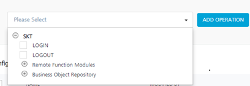

                                

User Guide: [Integration](Services.md#integration) \> [Configure the Integration Service](ConfigureIntegrationService.md) > SAP JCO Adapter

SAP JCo Adapter
---------------

Volt MX Foundry allows you to connect and access the BAPI functions inside an ABAP SAP backend via SAP JCo Adapter that was built using sapjco java client. Using SAP JCo adapter, you can explore the BAPI functions inside Business Object Repositories (BOR) and Remote Function Call (RFC) and add them as Volt MX Foundry operations in the console. When a BAPI function is added as an operation, its corresponding import params and export params are auto-generated as request input params and response output params.

You must load the required **Business Application Programming Interface** (BAPI) functions to define a SAP service. The BAPI files contain the SAP methods and functions. These methods have the logic defined for a service. A BAPI is a function module as it can be invoked from remote programs such as standalone Java programs, web interfaces, and so on.

**Login and Log Out** - At design time Volt MX Foundry generates the LOGIN and LOGOUT services along with BOR's and RFM's in the root explore, by default. Usually every BAPI function execution requires username and password to be sent in the request. If you want to skip passing the user name and password, you can use the LOGIN and LOGOUT operations.

**Login** - The Login operation contains two input params, username and password, used to skip passing the user name and password for subsequent BAPI function calls. When you make a LOGIN call, the credentials you provide are stored into the middleware session.

**Log out** - The log out operation is used to remove the stored user name and password from the middleware session.

### Single Sign On (SSO) Login

SAP offers several mechanisms for authenticating users. If there are multiple systems in your system network, using a single sign-on (SSO) environment helps to reduce the number of passwords you must remember. SSO eases user interaction with the available systems, components, and applications . After authentication , users can use the portal to access different systems without repeatedly entering their user information for authentication.

To use SSO login, set the **Login Type** to SSO Login and provide the values for Portal Host and Portal Port (which are mandatory for SSO login) in connection properties. When you add a BAPI function from an SSO enabled backend as an operation (along with BAPI import params list from backend), two additional input params such as username, password, and a header named SSO-TOKEN are generated by Volt MX Foundry. Change the scope for username, password, and SSO-TOKEN from request to session.

> **_Note:_** In SSO Login type, user must call LOGIN before invoking a BAPI function.

### Non-SSO Login

To use NON-SSO login, the Login Type must be set to NON-SSO in connection properties. BAPI function of a NON-SSO enabled SAP backend is added as an operation (along with BAPI import param list from backend), two additional input params username and password are generated by Volt MX Foundry. For every call, the BAPI function is invoked directly by passing the username and password. You can also invoke by changing the scope of username and password input parameters from request to session and using the LOGIN and LOGOUT operations.

[This video tutorial walks you through steps to connect an application to your enterprise SAP system using SAP JCo connector.](https://youtu.be/Cev5d5H6XOY)

### Configure SAP JCo End-point Adapter

<!-- **To configure your SAP JCO Service in the [Integration Service Definition](Configure the Service.md#IntegrationSDpage) tab, follow these steps:** -->
To configure your SAP JCO Service in the **[Integration Service Definition](ConfigureIntegrationService.md)** tab, follow these steps:

1.   In the **Service Name** field, enter a unique name for your service.
2.   From the **Service Type** list, select **SAP JCO**.  
    By default, XML is selected. If you select **SAP JCO**, the **Connection Parameters** section appears.
3.  Provide the following details to create a SAP JCO Service:  
   
    
    | Fields | Description |
    | --- | --- |
    | Connection Parameters | [Connection Parameters field description](#connection-parameters-field-description) |
    | Authentication | Use existing Identity Provider. Select SAP JCO Identity provider from the list. **Note:** For more information on Externalizing Identity Services, refer to [Replace the Identity Service references in a Foundry app](Replacing_Identity_Services.md).|
    
    #### Connection Parameters field description
    
    

Fill in the details for the following Connection parameter fields.

        
    * **Server Name** -Enter a unique server name to assign for an SAP connection.
    *   **SAP application server host** - Enter the application server IP address.
    *   **SAP system number** - Enter the SAP system number.
    *   **SAP client**\- The SAP Client ID. The default is based on the SAP server configuration.Logon Language - SAP Backend logon language.
    *   **Login Type** - Volt MX Foundry captures log in details for SAP ABAP Server. You can select SSO or non-SSO login. For SSO Login, you must provide portal hostname and port. Volt MX Foundry generates properties files with SSO details. 
        *   In **Login Type**, select an option from the list.
            **Non-SSO Login**\- To use normal sign on feature, select **Non-SSO Login** and provide user name and password to connect to the server.
            **SSO Login** - To use single sign-on feature, select **SSO Login**.
    *   **Logon user** - Enter the user name for the server log on.
    *   **Logon password** - Enter the password for the server log on.
    For **SSO-LOGIN**, you must provide the following details:
        **Portal Host** - Enter the SAP portal server IP address.
        **Portal Port** - Enter the SAP portal server port address
    *   **SAP Router String** - Enter the address of the SAP router that is used to connect to a provider system.
    *   **Advanced Properties** - Specify a JSON variable with SAP Client Properties and corresponding values. For example, to set the pool capacity value, specify the JSON as { 'jco.destination.pool\_capacity': <pool capacity> }. 
    
    [SAP client properties](#sap-client-properties) 

    *   **Test Connection**: Select the **Environment** from the list and click **Test Connection** to validate the user data.
        
    

    

    #### SAP client properties

    

Following are few SAP client properties.

        
    | SAP Property | Description |
    | --- | --- |
    | jco.client.client | SAP client |
    | jco.client.user | Logon user |
    | jco.client.alias\_user | Alias user name |
    | jco.client.passwd | Logon password |
    | jco.client.lang | Logon language |
    | jco.client.sysnr | SAP system number |
    | jco.client.ashost | SAP application server |
    | jco.client.mshost | SAP message server |
    | jco.client.gwhost | Gateway host |
    | jco.client.gwserv | Gateway service |
    | jco.client.r3name | R/3 name |
    | jco.client.group | Group of SAP application servers |
    | jco.client.tpname | Program ID of external server program |
    | jco.client.tphost | Host of external server program |
    | jco.client.type | Type of remote host 2 = R/2, 3 = R/3, E = External |
    | jco.client.trace | Enable/disable RFC trace (0 or 1) |
    | jco.client.codepage | Initial codepage in SAP notation |
    | jco.client.abap\_debug | Enable ABAP debugging 0 or 1 |
    | jco.client.use\_sapgui | Use remote SAP graphical user interface (0/1/2) |
    | jco.client.getsso2 | Get/Don’t get a SSO ticket after logon (1 or 0) |
    | jco.client.mysapsso2 | Use the specified SAP Cookie Version 2 as logon ticket |
    | jco.client.x509cert | Use the specified X509 certificate as logon ticket |
    | jco.client.lcheck | Enable/Disable logon check at open time, 1 (enable) or 0 (disable) |
    | jco.client.grt\_data | Additional data for GUI |
    | jco.client.use\_guihost | Host to which to redirect the remote GUI |
    | jco.client.use\_guiserv | Service to which to redirect of the remote GUI |
    | jco.client.use\_guiprogid | Program ID of the server which starts the remote GUI |
    | jco.client.snc\_mode | Secure network connection (SNC) mode, 0  or 1  |
    | jco.client.snc\_partnername | SNC partner, e.g. p:CN=R3, O=XYZ-INC, C=EN |
    | jco.client.snc\_qop | SNC level of security, 1 to 9 |
    | jco.client.snc\_myname | SNC name. Overrides default SNC partner |
    | jco.client.snc\_lib | Path to library which provides SNC service |
    | jco.client.dest | R/2 destination |
    | jco.client.saplogon\_id | String defined for SAPLOGON on 32-bit Windows |
    | jco.client.extiddata | Data for external authentication (PAS) |
    | jco.client.extidtype | Type of external authentication (PAS) |
    | jco.client.idle\_timeout | Idle timeout (in seconds) for the connection after which it will be closed by R/3. Only positive values are allowed. |
    | jco.client.dsr | Enable/Disable dsr support (0 or 1) |
    | jco.client.deny\_initial\_password | deny usage of initial passwords (0 default or 1) |
    | jco.destination.peak\_limit | Maximum number of active connections that can be created for a destination simultaneously |
    | jco.destination.pool\_capacity | Maximum number of idle connections kept open by the destination. A value of 0 has the effect that there is no connection pooling. |
    | jco.destination.expiration\_time | Time in ms after that the connections hold by the internal pool can be closed |
    | jco.destination.expiration\_check\_period | Interval in ms with which the timeout checker thread checks the connections in the pool for expiration |
    | jco.destination.max\_get\_client\_time | Max time in ms to wait for a connection, if the max allowed number of connections is allocated by the application |
    | jco.destination.repository\_destination | Specifies which destination should be used as repository, i.e. use this destination’s repository |
    | jco.destination.repository.user | Optional: If repository destination is not set, and this property is set, it will be used as user for repository calls. This allows using a different user for repository lookups |
    | jco.destination.repository.passwd | The password for a repository user. Mandatory, if a repository user should be used. |
    | jco.destination.repository.snc\_mode | Optional: If SNC is used for this destination, it is possible to turn it off for repository connections, if this property is set to 0. Defaults to the value of jco.client.snc\_mode |
    | jco.destination.one\_roundtrip\_repository | 1 force usage of RFC\_METADTA\_GET in SAP Server, 0 deactivate it. If not set the destination will initially be a remote call to check if RFC\_METADATA\_GET is available. |
    
    

     

For additional configuration of your service definition, provide the following details in the Advanced section.
 
      
    | Field | Description |
    | --- | --- |
    | Custom Code | Custom Code enables you to specify dependent JAR. To specify a dependent JAR, select the JAR containing preprocessor or postprocessor libraries from the list, or click **Upload New** to select the JAR file from your local system. This step allows you to further filter the data sent to the backend.> **_Important:_** Make sure that you upload a custom JAR file that is built on the same JDK version used for installing Volt MX Foundry Integration. For example, if the JDK version on the machine where Volt MX Foundry Integration is installed is 1.6, you must use the same JDK version to build your custom jar files. If the JDK version is different, an unsupported class version error will appears when a service is invoked from a device. |
    | API Throttling | If you want to use **API throttling** in Volt MX Foundry Console to limit the number of request calls within a minute, do the following: *  In the **Total Rate Limit** text box, enter a value. This will limit the total number of requests processed by this API. *  In the **Rate Limit Per IP** field, enter a value. With this value, you can limit the number of IP address requests configured in your Volt MX Foundry console in terms of Per IP Rate Limit. *  To override throttling from Volt MX Foundry App Services Console, refer to [Override API Throttling Configuration](API_Throttling_Override.md#override-api-throttling-configuration). > **_Note:_** In case of On-premises, the number of nodes in a cluster environment is set by configuring the VOLTMX\_SERVER\_NUMBER\_OF\_NODES property in Admin Console. This property indicates the number of nodes configured in the cluster. The default value is 1. Refer to [The Runtime Configuration tab on the Settings screen of App Services](../../../Foundry/vmf_integrationservice_admin_console_userguide/Content/Runtime_Configuration.md). The total throttling limit set in Volt MX Foundry Console is divided by the number of configured nodes. For example, a throttling limit of 600 requests/minute with three nodes will be calculated to be 200 requests/minute per node. This is applicable for Cloud and On-premises. |
    
    

    > **_Note:_** Additional configurations in the advanced section are optional.

3.   In the **Description** field, provide a suitable description for the service.
4.   Click **Save** to save your service definition.

### Create Operations for SAP JCO

The **Operations List** tab appears only after the service definition is saved.

> **_Note:_** Click **Operations List** tab > **Configure Operation**. The **Configured Operations** list appears. The **New Operation** window.

**To create an operation, follow these steps:**

1.  Click **SAVE & ADD OPERATION** in your service definition page to save your service definition and display the **NewOperation** tab for adding operations.  
                        OR  
    Click **Add Operation** to add a new operation or from the tree in the left pane, click **Add > Add New Operation**.

1.  Under the **Operations List** tab, click the list to display all the supported operations based on the uploaded SAP JCO file.
    
2.  Expand an operation and select the required check boxes.
3.  Click **ADD OPERATION**. The system adds your operation to the **Operations List** tab.
    
4.  To configure an operation, click on a service under **Operations List** and provide the following details:
    
    | Field | Description |
    | --- | --- |
    | Name | It is pre-populated with the operation name. You can change the name if required. |
    | Operation Security Level | It specifies how a client must authenticate to invoke this operation. |

    

Select one of the following security operations in the Operation Security Level field.
 

    *  **Authenticated App User** – It restricts the access to clients who have successfully authenticated using an Identity Service associated with the app
    *  **Anonymous App User** – It allows the access from trusted clients that have the required App Key and App Secret. Authentication through an Identity Service is not required. 
    *  **Public** – It allows any client to invoke this operation without any authentication. This setting does not provide any security to invoke this operation and you should avoid this authentication type if possible. 
    *  **Private** - It blocks the access to this operation from any external client. It allows invocation either from an Orchestration/Object Service, or from the custom code in the same run-time environment.
    
    

    
5.  

For additional configurations of request (or) response operations, provide the following details in the Advanced section:
 
  
    | Field | Description |
    | --- | --- |
    | Custom Code Invocation - Preprocessor and Postprocessor (for Java and JavaScript) | You can add pre and post processing logic to modify the request inputs of service. When you test, the service details of various stages in the service execution are displayed for better debugging. For more details, refer to [Preprocessor and Postprocessor](Java_Preprocessor_Postprocessor_.md). |
    | Properties | You can configure the [additional properties (timeout, cachable, unescape embedded xml in response, response encoding, number of connection retries)](Java_Preprocessor_Postprocessor_.md#timeout_cachable) for service call time out cache response. |
    | Front End API | You can map your endpoint/back-end URL of an operation to a [front-end URL](FrontEndAPI.md). |
    | Server Events | Using Server Events you can configure this service to trigger or process server side events. For detailed information, refer [Server Events](ServerEvents.md). |

    

    > **_Note:_** Additional configurations in the advanced section are optional.
    

### Configure Request Operation for SAP JCO

All the request input parameters must be `form-url-encoded` .

You can perform the following actions in Request Input tab:

1.  Click **Add Parameter** to add an entry (if the entries for input and the output tabs do not exist).
    
2.  To make duplicate entries, select the check box for an entry and click **Copy** and then click **Paste**.
    
3.  To delete an entry, select the check box for the entry and click **Delete** .
    
4.  Under the **Body** tab, perform the following actions:
    
    1.  Select the **Enable pass-through input body** check box to forward the body of the client's request to the back end. For more details on API Proxy service, refer to [How to Enable Pass-through Proxy for Operations](API_Proxy_Adapter.md#how-to-enable-pass-through-proxy-for-operations).
        
        
        
    2.  To configure the request input parameters, perform the following actions:
        
        | Field | Description |
        | --- | --- |
        | Name | It contains a unique identifier. Change the name if required. |
        | Value | Volt MX Foundry provides four options while configuring an operation. Dependent identity services are auto populated when you edit this field, These options primarily determine the source of the header value. > **_Note:_** The field is set to Request, by default. **Note:** For more information on Externalizing Identity Services, refer to [Replace the Identity Service references in a Foundry app](Replacing_Identity_Services.md).|
        | Test Value | A test value is used for testing the service. Enter a value. |
        | Default Value | The default value is used if the test value is empty. Enter a value, if required. |
        | DATA TYPE | --- |
        | COLLECTION ID | Collection is a group of data, also referred as data set. Enter a collection ID. |
        | RECORD ID | Enter an ID. |
        | DESCRIPTION | Provide a suitable description. |

        

Select an option from the following options.

        
        *  If you select **Request**, the Integration Server picks the value pairs from the client's request during run time and forwards the same to the back-end.
        *  If you select **Session**, the value of the header is picked from the session context. You cannot edit the Default value and test value.
        *  **Constant** is used to configure the value that is picked and sent to back end by the Integration Server during the run-time.
        *  If **Identity** is selected, you can filter the request parameters based on the response from the identity provider. For more details on configuring the identity filters, refer [Enhanced Identity Filters - Integration Services](Identity_Filters_Integration.md).

        > **_Note:_** The field is set to **Request**, by default.
        
        > **_Note:_** For more information on Externalizing Identity Services, refer to [ Replace the Identity Service references in a Foundry app](Replacing_Identity_Services.md).

        

        

Select one of the following data types.

        
        *  **String** - A combination of alpha-numeric and special characters. Supports all formats including UTF-8 and UTF-16 with no maximum size limit.
        *  **Date** - Date format
            * 1. If data type is string, the options in the format type are Currency, Number, and Date.
            * 2. If the data type is number, the options in the format type are Currency and Date. 
            * 3. If the data type is boolean, the options in the format type and format value text box are disabled

            > **_Note:_** Currently the data type date is not supported.

        *  **Boolean** - A value that can be true or false.
        *  **Number** - An integer or a floating number.
        
        

        
5.  Click **Header** tab to provide the custom headers.
    
    
    
    You must provide the custom HTTP headers based on the operation. For example, POST or GET.
    
    1.  To configure parameters in the client's header, perform the following actions:
        
        | Field | Description |
        | --- | --- |
        | Name | Provide custom HTTP headers required by the external source. |
        | Value | Volt MX Foundry provides four options while configuring an operation. Dependent identity services are auto populated when you edit this field, These options primarily determine the source of the header value. > **_Note:_** The field is set to **Request**, by default. |
        | TEST VALUE | A test value is used for testing the service. Enter a value. |
        | DEFAULT VALUE | The default value will be used if the test value is empty. Change the syntax, if required. |
        | SCOPE | Select request or session. The field is set to **Request**, by default. |
        | Description | Enter the **Description** for the request input. |

        

Select an option from the following options.

        
        *  If you select **Request**, the Integration Server picks the value pairs from the client's request during run time and forwards the same to the back-end.
        *  If you select **Session**, the value of the header is picked from the session context. You cannot edit the Default value and test value.
        *  **Constant** is used to configure the value that is picked and sent to back end by the Integration Server during the run-time.
        *  If **Identity** is selected, you can filter the request parameters based on the response from the identity provider. For more details on configuring the identity filters, refer [Enhanced Identity Filters - Integration Services](Identity_Filters_Integration.md).
        
        

        
6.  To validate the details, select the environment from the list and click **Save and Fetch Response**. Refer [Test a Service Operation](Test_a_Service_Operation.md) for the steps to test a service. The result of the operation appears.
    

### Configure Response Operation for SAP JCO

Click the **Response Output** tab to configure the fields of the table for displaying the data.

In the **Response Output** tab, configure the fields of the table for displaying the data:

1.  The **Name** field in the Response Output tab is pre-populated with the properties of output schema.
    
    Enter the values for required fields such as name, path, scope, data type, collection ID, record ID, format, and format value.
    
    > **_Note:_** If you define parameters inside a record as a session, the session scope will not get reflected for the parameters.
    
2.  To validate the details, click **Test**. Refer [Test a Service Operation](Test_a_Service_Operation.md) for the steps to test a service. The result of the operation appears.

3.  Click **SAVE OPERATION**.
    
    > **_Note:_** You can view the service in the Data Panel feature of Volt MX Iris. By using the Data Panel, you can link back-end data services to your application UI elements seamlessly with low-code to no code. For more information on Data Panel, click [here](../../../Iris/iris_user_guide/Content/DataPanel.md#top).

> **_Note:_** To use SAP JCO adapter in On-Premises environment, the following artefacts must be placed in the application server -  
\- sapjco3.jar  
\- sapjco.dll (if Volt MX Foundry instance is on Windows) or libso.so (if Volt MX Foundry instance is on Linux machine).  
\- SapJCoDestinationProvider.jar  
sapjco3.jar and sapjco.dll/libso.so artefacts must be downloaded from SAP site.

