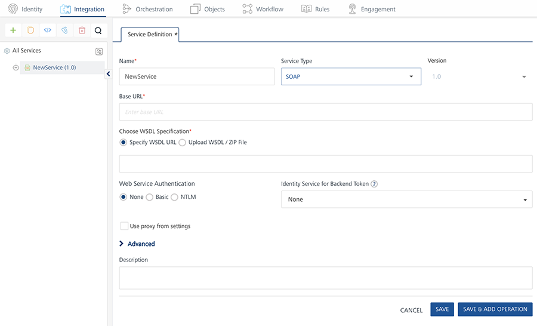
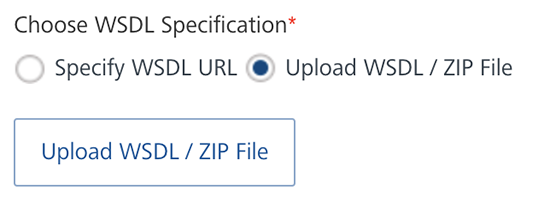
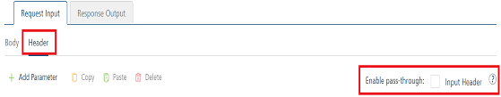
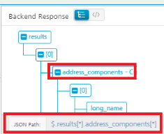
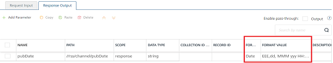

                                

User Guide: [Integration](Services.md#integration) \> [Configure the Integration Service](ConfigureIntegrationService.md) > SOAP Adapter

SOAP
----

To create the service definitions for an external data source providing SOAP interface, use the SOAP Service. You need to have a WSDL URL or file to create the service definition. For example, we will use a WSDL URL of a weather application that has a `GetCityWeatherByZip` service and will provide appropriate configurations for the Service Definition.

### Configure SOAP End-point Adapter

To configure a SOAP service in [Integration service definition](ConfigureIntegrationService.md) tab, follow these steps:

1.  In the **Name** field, provide a unique name for your service.
2.  From the **Service Type** list, select _SOAP_.
    
    
    
    > **_Note:_** XML is selected, by default.
    
3.  Provide the following details to create a SOAP service.
    
| Fields | Description |
| --- | --- |
| Version | Specify the version number for the service. |
| Base URL | Type the URL. |
| Identity Service for Backend Token | Select the Identity service associated with your app if this service needs backend token like access\_token from that Identity service to access the backend server. |
     
<details close markdown="block"><summary> Select the option to specify the WSDL (Web Service Definition Language) URL or upload the WSDL / ZIP file.</summary>e.
    
Click **Specify WSDL URL** and type the WSDL URL.

> **_Important:_** In case, if you are unable to read metadata from an integration service (for example, SOAP) that is protected by an SSL certificate, enable the integration service by following one of the ways:- Download the WSDL file from the https WSDL URL and upload the WSDL file on Volt MX Foundry console. - Importing the SSL into your cacerts in your Volt MX Foundry install location. For more details, refer to [FAQs.](Appendix_-_FAQs.md#SOAPWSDL)Click **Upload WSDL** **/ ZIP** **File** and follow these steps to upload your WSDL / ZIP file. The ZIP file that refers to local XSD files.Click **Up**load WSDL**** ****/** **ZIP**** ****File**** button. Navigate to the WSDL or ZIP file from your local system and click **Open**.

> The selected WSDL or ZIP file gets uploaded.

</details>

<details close markdown="block"><summary>Select one of the following modes:</summary>
    
**None**: Select this option if you do not want to provide any authentication for the service.
**Basic**: Provide User ID and Password if the external Web service requires a form or basic authentication.
**NTLM**: Your service follows the NT LAN Manager authentication process. You are required to provide the User ID, Password, NTLM Host, and NTLM Domain.

</details>

1. <details close markdown="block"><summary>For additional configuration of your service definition, provide the following details in the **Advanced** section.</summary> 
      
| Field | Description |
| --- | --- |
| Custom code | To specify a JAR associated to the service, select one from the **Select Existing JAR** drop-down menu or click **Upload New** to add a new JAR file. Make sure that you upload a custom JAR file that is built on the same JDK version used for installing Volt MX Foundry Integration. You can download the uploaded jars to your local system. |
| API Throttling | If you want to use **API throttling** in Volt MX Foundry Console, to limit the number of request calls within a minute. do the following:
In the **Total Rate Limit** text box, enter a required value. This will limit the total number of requests processed by this API.In the **Rate Limit Per IP** field, enter a required value. With this value, you can limit the number of IP address requests configured in your Volt MX Foundry console in terms of Per IP Rate Limit.
To override throttling from Volt MX Foundry App Services Console, refer to [Override API Throttling Configuration](API_Throttling_Override.md#override-api-throttling-configuration). |
| URL Provider Class | Enter the qualified name of the URL Provider Class. For more information, refer [URL Provider Support for XML, JSON, SOAP, and API Proxy](URL_Provider_Support_for_XML__JSON__SOAP_and_API_Proxy.md). |

</details>

> **_Note:_** All options in the Advanced section are optional.
    
5. Enter the **Description** for the service.
6. Click **SAVE** to save your service definition.

### Create Operations for SOAP

The **Operation List** tab appears when you click **Add Operation** in the **Service Definition** page.

> **_Note:_** Click **Operations List** tab > **Configure Operation**. The **Configured Operations** list appears.

**To create an operation, follow these steps:**

1.  Click **SAVE & ADD OPERATION** in your service definition page to save your service definition and display the **NewOperation** tab for adding operations.  
                        OR  
    Click **Add Operation** to add a new operation or from the tree in the left pane, click **Add > Add New Operation**.
    

<details close markdown="block"><summary>Click to View image</summary>
    
    
    
    > **_Note:_** To use an existing integration service, refer to [How to Use an Existing Integration Service](Manage_Existing_Integration_Services_1.md#how-to-use-an-existing-integration-service).
</details>
    
2.  In **Operations List** tab, click **Operation Name** list box and select one or more **Operations**.
3.  Click **Add Operation**. The selected operations appears under **Configured Operations** list.
    
    > **_Important:_** While configuring an integration service with basic auth mode, ensure that some reserved IDs are not used as input/header IDs. Key words such as userid, pwd and password are reserved by middleware when a user selects basic auth mode.
    
4.  Click the operation name under **Configured Operations**. The operation details page appears.
5.  Type the following fields to create an operation
    
| Field | Description |
| --- | --- |
| Name | The operation name appears in the Name field. You can modify the name, if required. |
| Operation Security Level | It specifies how a client must authenticate to invoke this operation. |
| Target URL | The **Target URL** field is pre-populated with the URL. You can add the suffix, if required.http://baseurl.com/suffixFor Example, to the base URL, you can add suffix such as `/latest`  or `/sports` to get latest news or sports news:``http://feeds.foxnews.com/foxnews`/latest` `
```http://feeds.foxnews.com/foxnews`/sports` `` |

<details close markdown="block"><summary>Select one of the following security operations in the **Operation Security Level** field.</summary>
    
    **Authenticated App User** – It restricts the access to clients who have successfully authenticated using an Identity Service associated with the app.**Anonymous App User** – It allows the access from trusted clients that have the required App Key and App Secret. Authentication through an Identity Service is not required.**Public** – It allows any client to invoke this operation without any authentication. This setting does not provide any security to invoke this operation and you should avoid this authentication type if possible.**Private** - It blocks the access to this operation from any external client. It allows invocation either from an Orchestration/Object Service, or from the custom code in the same run-time environment.
    
</details>
    > **_Note:_** The field is set to Authenticated App User, by default. |
    | Target URL | The **Target URL** field is pre-populated with the URL. You can add the suffix, if required.http://baseurl.com/suffixFor Example, to the base URL, you can add suffix such as `/latest`  or `/sports` to get latest news or sports news:``http://feeds.foxnews.com/foxnews`/latest` `
```http://feeds.foxnews.com/foxnews`/sports` `` |
    
6.  [For additional configuration of request (or) response operations, provide the following details in theAdvanced section.](javascript:void(0);)
    
    <table style="width: 100%;margin-left: 0;margin-right: auto;mc-table-style: url]('../Resources/TableStyles/Basic.css');" class="TableStyle-Basic" cellspacing="0"><colgroup><col class="TableStyle-Basic-Column-Column1" style="width: 174px;"> <col class="TableStyle-Basic-Column-Column1"></colgroup><tbody><tr class="TableStyle-Basic-Body-Body1"><td class="TableStyle-Basic-BodyE-Column1-Body1">Custom Code Invocation</td><td class="TableStyle-Basic-BodyD-Column1-Body1">You can add pre and post processing logic to services to modify the request inputs. When you test, the services details of various stages in the service execution are presented to you for better debugging. All options in the Advanced section are optional. For more details, refer to <a href="Java_Preprocessor_Postprocessor_.html" target="_blank">Preprocessor and Postprocessor</a>.</td></tr><tr class="TableStyle-Basic-Body-Body1"><td class="TableStyle-Basic-BodyE-Column1-Body1">Additional Configuration Properties</td><td class="TableStyle-Basic-BodyD-Column1-Body1">Additional Configuration Properties allows you to configure service call time out cache response. For information on different types of configuration properties, refer <a href="Java_Preprocessor_Postprocessor_.html#timeout_cachable" target="_blank">Properties</a>.</td></tr><tr class="TableStyle-Basic-Body-Body1"><td class="TableStyle-Basic-BodyE-Column1-Body1">Pass-through Cookies</td><td class="TableStyle-Basic-BodyD-Column1-Body1"><b>Pass-through Cookies</b> allows you send cookies present in the incoming client request to the backend target request. For detailed information, refer <a href="Java_Preprocessor_Postprocessor_.html#EnterpriseCookies" target="_blank">Pass-through Cookies</a>.</td></tr><tr class="TableStyle-Basic-Body-Body1"><td class="TableStyle-Basic-BodyE-Column1-Body1">Front-end API</td><td class="TableStyle-Basic-BodyD-Column1-Body1">Front-end API allows you map your endpoint ](or) backend URL of an operation to a front-end URL. For detailed information, refer Custom <a href="FrontEndAPI.html" target="_blank">Front-end URL</a>.</td></tr><tr class="TableStyle-Basic-Body-Body1"><td class="TableStyle-Basic-BodyB-Column1-Body1">Stub Backend Response</td><td class="TableStyle-Basic-BodyA-Column1-Body1"><b>Stub Backend Response</b> allows you enable a stub back-end service. To enable Stub Backend Response, refer <a href="Stub.html#How" target="_blank">How to Enable Stub Back-end Response</a>.For more details on Stub back-end response, refer to <a href="Stub.html" target="_blank">How to Develop Apps based on a Stubbed Service</a>.</td></tr><tr class="TableStyle-Basic-Body-Body1"><td class="TableStyle-Basic-BodyB-Column1-Body1">Server Events</td><td class="TableStyle-Basic-BodyA-Column1-Body1">Using Server Events you can configure this service to trigger or process server side events. For detailed information, refer <a href="ServerEvents.html">Server Events</a>.</td></tr></tbody></table>
    
    > **_Note:_** All options in the **Advanced** section for operations are optional.
    
7.  Enter the **Description** for the operation.

### Configure Request Operation for SOAP

Integration services accept only `form-url-encoded` inputs for all input parameters provided in service input parameters (request input).

You can perform the following actions in **Request Input** tab:

1.  Click **Add Parameter**  to add an entry (if the entries for input and the output tabs does not exist).
2.  To make duplicate entries, select the check box for the entry, click **Copy** and **Paste**.
3.  To delete an entry, select the check box for an entry and click **Delete** .
4.  Under the **Body** tab, perform the following actions:
    1.  To forward the body of the client's request to backend as it is, select the **Enable pass-through input body** check box. For more details on API Proxy service, refer to [](#APIProxyCheckBox)[How to Enable Pass-through Proxy for Operations](API_Proxy_Adapter.md#how-to-enable-pass-through-proxy-for-operations).
        
        
        
    2.  To configure parameters in the clients body, do the following:
        
        | Field | Description |
        | --- | --- |
        | Name | Enter the name for the request input parameter. |
        | Value | Three different options are available in Volt MX Foundry under **VALUE** during configuration of any operation. When you start editing this field, dependent identity services are auto populated. These options primarily determine the source of the value of the header**.**
        Select request or session or Identity        
        **Request**: If this option is selected, the Integration Server picks the value pairs from the client's request during run time and forwards the same to the back-end.User has the option to configure the default value. This default value is taken if the request does not have the header.**Session**: If this option is selected, the value of header is picked from session context based on the user configuration.**Identity**: If this option is selected, you can filter the request parameters based on the response from the identity provider. For more details to configure identity filters, refer to [Enhanced Identity Filters - Integration Services](Identity_Filters_Integration.md).
        
        > **_Note:_** The field is set to **Request**, by default. |
        | TEST VALUE | Enter a value. A test value is used for testing the service. |
        | DEFAULT VALUE | Enter the value, if required. The default value will be used if the test value is empty. |
        | Scope | Select request or session. This field is set to **Request**, by default. |
        | Encode | Select the checkbox to enable an input parameter to be encoded. For example, the name New York Times would be encoded as _New_York_Times_  when the encoding is set to True. The encoding must also adhere the HTML URL encoding standards. |
        | Description | Enter the description for the request. |
        
5.  Click the **Header** tab to provide the following customer headers, perform the following actions:
    
    
    
    You must provide the custom HTTP headers based on the operation. For example, post or get.
    
    1.  To forward headers of the client's request to backend as it is, select the **Enable pass-through input header** check box. For more details on API Proxy service, refer to [How to Enable Pass-through Proxy for Operations](#APIProxyCheckBox).
    2.  To configure parameters in the client's header, do the following:
        
        | Field | Description |
        | --- | --- |
        | Name | Provide custom HTTP headers required by the external source. |
        | Value | Three different options are available in Volt MX Foundry under **VALUE** during configuration of any operation. When you start editing this field, dependent identity services are auto populated. These options primarily determine the source of the value of the header**.**
        Select request or session or Identity.
        
        **Request**: If this option is selected, the Integration Server picks the value pairs from the client's request during run time and forwards the same to the back-end.User has the option to configure the default value. This default value is taken if the request does not have the header.**Session**: If this option is selected, the value of header is picked from session context based on the user configuration.**Identity**: If this option is selected, you can filter the request parameters based on the response from the identity provider. For more details to configure identity filters, refer to [Enhanced Identity Filters - Integration Services](Identity_Filters_Integration.md).
        
        > **_Note:_** The field is set to **Request**, by default.> **_Note:_** If the header value is scoped as a **Request** (or) **Session** and the same header is accessed under the **Expression** header value, then the expression must be represented as $request.header (or) $session.header.**Example**: If a header 1 value is a request and header 2 value is an expression, then the value of the expression must be $Request.header1. |
        | TEST VALUE | Enter a value. A test value is used for testing the service. |
        | DEFAULT VALUE | Change the syntax, if required. The default value will be used if the test value is empty. |
        | Description | Enter the description for the header. |
        
6.  You can add pre and post processing logic to services to modify the request inputs. When you test, the services details of various stages are displayed in the service execution for better debugging. You can refer to [Test a Service Operation](Test_a_Service_Operation.md) for the steps to test a service.

### Configure Response Operation for SOAP

Click the **Response Output** tab to configure the fields of the table for displaying the data.


> **_Note:_** If you define parameters inside a record as the session, the session scope will not get reflected for the parameters.

1.  To forward the response from the backend to the client as it is, select the **Enable pass-through output body** check box. For more details on API Proxy service, refer to [How to Enable Pass-through Proxy for Operations](API_Proxy_Adapter.md#how-to-enable-pass-through-proxy-for-operations).
2.  You can create a desired output based on the back-end response by using XPath. So that the extracted output can be sent to the client app. You can create an XPath **manually**.
    
    The following steps details XPath generation manually:
    
    1.  Click **Add Parameter** to add new row.
    2.  Click the **Tree** button in the **Backend Response** tab.
        
        This displays the backend response in a tree structure format.
        
    3.  Click the node for which you want to create XPath.
        
        The XPath for that node is displayed at the bottom of the Tree structure.
        
        
        
    4.  Enter that XPath in the row that you have created.
        
        For more details, refer [XPath in Volt MX Foundry](XPath.md).
        
3.  To configure parameters in the response, enter the values for required fields such as name, path, scope, data type, collection ID, record ID, format and format value.
    
      
    | ID | Path |
    | --- | --- |
    | State | //GetCityWeatherByZIPResponse/GetCityWeatherByZIPResult /State |
    | City | //GetCityWeatherByZIPResponse/GetCityWeatherByZIPResult /City |
    | Temperature | //GetCityWeatherByZIPResponse/GetCityWeatherByZIPResult / |
    | Humidity | //GetCityWeatherByZIPResponse/GetCityWeatherByZIPResult /RelativeHumidity |
    | Wind | //GetCityWeatherByZIPResponse/GetCityWeatherByZIPResult /Wind |
    

> **_Important:_** If the back-end for a SOAP service provides the date in a specific format and you want send the date in a different format to a device, you can configure the data format and FormatValue ( syntax : `inputDateFormat~outputDateFormat`) in the response tab.  
  
For example, if a back-end sends the date as `Thu, 07 Sep 2017 07:03:00 GMT` and you want convert it to `2017-09-07T07:03:00.000+0000`, then set the format value as `EEE, dd MMM yyyy HH:mm:ss z~yyyy-MM-dd'T'HH:mm:ss.SSSZ`.  
  
  
  
For more details on the syntax of the date formats, refer [https://docs.oracle.com/javase/7/docs/api/java/text/SimpleDateFormat.html](https://docs.oracle.com/javase/7/docs/api/java/text/SimpleDateFormat.md)

> **_Note:_** When you enable Pass-through proxy flags, you will notice that you cannot configure request input, headers, and response out parameters for this operation.

1.  To validate the operation details, click **Save and Test**. For more details, refer to [Test a Service Operation](Test_a_Service_Operation.md).
2.  Click **SAVE OPERATION** to save the changes. To use an existing integration service, refer to [How to Use an Existing Integration Service](Manage_Existing_Integration_Services_1.md#how-to-use-an-existing-integration-service).

> **_Note:_** You can view the service in the Data Panel feature of Volt MX Iris. By using the Data Panel, you can link back-end data services to your application UI elements seamlessly with low-code to no code. For more information on Data Panel, click [here](../../../Iris/iris_user_guide/Content/DataPanel.md#top).
