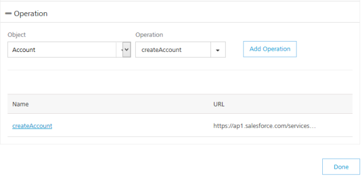
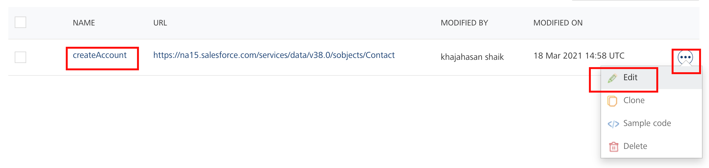
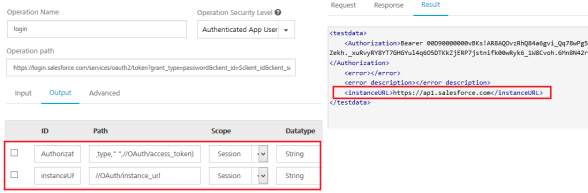
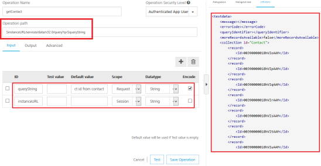

                               

User Guide: [Integration](Services.md#integration) \> [Configure the Integration Service](ConfigureIntegrationService.md) > Salesforce Adapter

Salesforce Adapter
------------------

### Configure Salesforce Endpoint Adapter

To configure Salesforce service in the **[Integration Service Definition](ConfigureIntegrationService.md#IntSD)** tab, follow these steps:

1.  In the **Name** field, provide a unique name for your service.
2.  From the **Service Type** list, select **Salesforce**.
3.  Provide the following details to create the Salesforce service:  
    

  
| Field | Description |
| --- | --- |
| Authentication | **Use Existing Identity Provider** - to select an identity provider. This drop-down lists all identity providers only if you have already created identity providers for SAP in the Identity page. Fill in the details for the following fields:
From the **Select Identity Provider** list, select your Salesforce identity.The details for the selected identity are displayed in the **Endpoint URL** text box. You cannot modify these details.Under the **User ID** and **Password**, provide valid log-in credentials that you created while registering with Salesforce services.

**Specify Login Endpoint**\- to configure a new endpoint. Fill in the details for the following fields:

In the **Endpoint URL**, enter the URL - for example, `https://login.salesforce.com/services/oauth2/token`_._In the **Client ID** text box, enter a valid client id.In the **Client Secret** text box, enter a valid client secret.In the **User ID** text box, enter a valid user ID.In the **Password** text box, enter a valid password.

 |

5.  [For additional configuration of your service definition, provide the following details in the **Advanced** section:](javascript:void(0);)
    
      
    | Field | Description |
    | --- | --- |
    | Custom Code | Custom Code enables you to specify dependent JAR. To specify dependent JAR, select the JAR containing preprocessor or postprocessor libraries from the drop-down list, or click **Upload New** to browse the JAR file from your local system. This step allows you to further filter the data sent to the back end. > **_Important:_** Make sure that you upload a custom JAR file that is built on the same JDK version used for installing Volt MX Foundry Integration.For example, if the JDK version on the machine where Volt MX Foundry Integration is installed is 1.6, you must use the same JDK version to build your custom jar files. If the JDK version is different, an unsupported class version error will appear when a service is used from a device. |
    | Throttling | API throttling enables you to limit the number of request calls within a minute. If an API exceeds the throttling limit, it will not return the service response. **To specify throttling in Volt MX Foundry Console, follow these steps:**
    In the **Total Rate Limit** text box, enter a required value. With this value, you can limit the number of requests configured in your Volt MX Foundry console in terms of Total Rate Limit. In the **Rate Limit Per IP** text box, enter a required value. With this value, you can limit the number of IP address requests configured in your Volt MX Foundry console in terms of Per IP Rate Limit.
    
    **To override throttling in App Services Console, refer to** [Override API Throttling Configuration](API_Throttling_Override.md#override-api-throttling-configuration). > **_Note:_** In case of On-premises, the number of nodes in a clustered environment is set by configuring the `VOLTMX_SERVER_NUMBER_OF_NODES` property in the Admin Console. This property indicates the number of nodes configured in the cluster. The default value is 1.Refer to [The Runtime Configuration tab on the Settings screen of App Services](../../../Foundry/vmf_integrationservice_admin_console_userguide/Content/Runtime_Configuration.md).The total limit set in the Volt MX Foundry Console will be divided by the number of configured nodes. For example, a throttling limit of 600 requests/minute with three nodes will be calculated to be 200 requests/minute per node.This is applicable for Cloud and On-premises. |
    
    > **_Note:_** All the fields in the Advanced section are optional.
    
6.  In the **Description** field, provide a suitable description for the service.
    
7.  To enable the proxy, select the **Use proxy from settings** check box. By default, the check box is cleared. The Use proxy from settings check box dims when no proxy is configured under the **[Settings > Proxy](Settings.md#proxy)**.
    
8.  Click **Save** to save your service definition.

### Create Operations for Salesforce

The **Operations List** tab appears only after the service definition is saved.

> **_Note:_** Click **Operations List** tab > **Configure Operation**. The **Configured Operations** list appears.

**To create an operation, follow these steps:**

1.  Click **SAVE & ADD OPERATION** in your service definition page to save your service definition and display the **NewOperation** tab for adding operations.  
                        OR  
    Click **Add Operation** to add a new operation or from the tree in the left pane, click **Add > Add New Operation**.
    
2.  Select an object from the **Object** list that is auto-populated with all the existing Salesforce objects.
    
    > **_Note:_** If you provide incorrect Salesforce endpoint details, the **Object** list will contain only _\_Login_ object.
    
3.  Based on the object added in the previous step, the **Operation Name** is listed with operations. Select the check boxes for required operations.
4.  Based on the object selected, a list of operations is displayed in the dropdown. Select the required operations and click **Add Operation**.
5.  The selected operations are added to the Operations List section and the new Salesforce service is added to the Integration page.  
    
6.  To edit an operation, either click on the required operation name or click **Edit** from the **Settings** in the **Operations List** screen. The operation details page is displayed.  
    
7.  To configure an operation, provide the following details:  
    
      
    | Field | Description |
    | --- | --- |
    | Name | Enter a unique name for your operation. |
    | Operation Security Level | It specifies how a client must authenticate to invoke this operation.
    [Select one of the following security operations in the **Operation Security Level** field.](javascript:void(0);) 
    
    **Authenticated App User** – It restricts the access to clients who have successfully authenticated using an Identity Service associated with the app. **Anonymous App User** – It allows the access from trusted clients that have the required App Key and App Secret. Authentication through an Identity Service is not required. **Public** – It allows any client to invoke this operation without any authentication. This setting does not provide any security to invoke this operation and you should avoid this authentication type if possible. **Private** - It blocks the access to this operation from any external client. It allows invocation either from an Orchestration/Object Service, or from the custom code in the same run-time environment.
    
    
    
    
    
     |
    | Operation Path | Modify the path if required. > **_Note:_** If you provide incorrect Salesforce endpoint details, the **Object** list will contain only _\_Login_ object. |
    
8.  [For additional configurations of request (or) response operations, provide the following details in the **Advanced** section:](javascript:void(0);)
    
      
    | Field | Description |
    | --- | --- |
    | Custom Code Invocation | You can add pre and post processing logic to services to modify the request inputs. When you test, the services details of various stages in the service execution are presented to you for better debugging. All options in the Advanced section are optional. For more details, refer to [Preprocessor and Postprocessor](Java_Preprocessor_Postprocessor_.md). |
    | Properties | [Additional configuration properties (timeout, cachable, unescape embedded xml in response, response encoding, number of connection retries](Java_Preprocessor_Postprocessor_.md#timeout_cachable) allows you to configure service call time out cache response |
    | Front-end API | It allows you map your endpoint (or) backend URL of an operation to a [front-end URL](FrontEndAPI.md). |
    | Server Events | Using Server Events you can configure this service to trigger or process server side events. For detailed information, refer [Server Events](ServerEvents.md). |
    
    > **_Note:_** All options in the Advanced section are optional.
    

### Configure Request Operation for Salesforce

Integration services accept only `form-url-encoded` inputs for all the input parameters provided in the service input parameters (request input).

You can perform the following actions in Request Input tab:

1.  Click **Add Parameter** to add an entry (if the entries for input and the output tabs does not exist).
2.  To make duplicate entries, select the check box for the entry, click **Copy** and **Paste**.
3.  To delete an entry, select the check box for an entry and click **Delete** .
4.  To configure the **Request Input** tab, provide the following details:  
    

  
| Field | Description |
| --- | --- |
| Name | It Contains a Unique Identifier. Change the name if required. |
| Test Value | Enter a value. A test value is used for testing the service. |
| Default Value | Enter the value, if required. The default value will be used if the test value is empty. |
| Scope | Select Request or Session. It is set to **Request** by default. **Request** indicates that the value must be retrieved from the HTTP request received from the mobile device. **Session** indicates that the value must be retrieved from the HTTP session stored on Volt MX Foundry. |
| Datatype | 
[Select one of the following data types.](javascript:void(0);)

**String** - A combination of alpha-numeric and special characters. Supports all formats including UTF-8 and UTF-16 with no maximum size limit. **Date** - Date formatIf data type is string, then the options in the Format Type are Currency, Number and Date.If the data type is number, then the options in the Format Type are Currency and Date. If the data type is boolean, then the options in the Format Type and Format Value text box are disabled.    **Boolean** - A value that can be true or false. **Number** - An integer or a floating number. **Collection** - A group of data, also referred as data set.


 |
| Encode | Select the check box to enable encoding of an input parameter. For example, the name New York Times would be encoded as _New_York_Times_ when the encoding is set to True. The encoding must also adhere to the HTML URL encoding standards. |

6.  To validate the operation details, click **Save and Test**. For more details, refer to [Test a Service Operation](Test_a_Service_Operation.md).
    

### Configure Response Operation for Salesforce

1.  Click the ****Output**** tab, and enter the values for required fields such as ID, scope, data type, collection ID, record ID, format and format value.
    
    > **_Note:_** If you define parameters inside a record as the session, the session scope will not get reflected for the parameters.
    

1.  To validate the operation details, click **Save and Test**. For more details, refer to [Test a Service Operation](Test_a_Service_Operation.md).
    
2.  Click **Save Operation** to save the operation. The system displays the **Operation** section for your service.
3.  Click **Done** to navigate to the **Integration** page.
    
    > **_Note:_** To use an existing integration service, refer to [How to Use an Existing Integration Service](Manage_Existing_Integration_Services_1.md#how-to-use-an-existing-integration-service).
    
    > **_Note:_** You can view the service in the Data Panel feature of Volt MX Iris. By using the Data Panel, you can link back-end data services to your application UI elements seamlessly with low-code to no code. For more information on Data Panel, click [here](../../../Iris/iris_user_guide/Content/DataPanel.md#top).
    

### How to Use Log-in Endpoint with Different Credentials for Design Time and Runtime

If the service is using a log-in endpoint, ensure that you specify the same set of credentials (Client ID, Client Secret, User ID, Password) for design time and run-time.

If the log-in endpoint credentials are different for design time and run-time, the system throws an error while accessing a service from an app.

```

```

Error 401: Request Unsuccessful Server responded with 401.

If you want to the use log-in endpoint with different credentials for design time and run-time, then parametrize instance URL in the operation path, and send that URL from an app.

For example:

To parametrize an instance URL, follow these steps:

1.  In the **login** operation, click **Output** tab, and make the following changes:
    
    
    
    | ID | Path | Scope |
    | --- | --- | --- |
    | Authorization | concat(//OAuth/token\_type," ",//OAuth/access\_token | session |
    | instanceURL | //OAuth/instance\_url | session |
    
2.  Click **Test** to view the results.
3.  Click **Save Operation** to save the changes.
4.  In the **getContact** operation, make the following changes:
    1.  In the **Operation Path** text box, change the URL, for example, from ` https://ap1.salesforce.com/`  to    `$<instanceURL>/`.
        
        
        
    2.  In the **Input** tab, configure the following fields as shown:
        
        | ID | Path | Scope | Encode |
        | --- | --- | --- | --- |
        | queryString | Select ID from contact | session |   |
        | instanceURL | //OAuth/instance\_url | session | No |
        
5.  Click **Test** to fetch the contacts from Salesforce.
6.  Click **Save Operation**.
